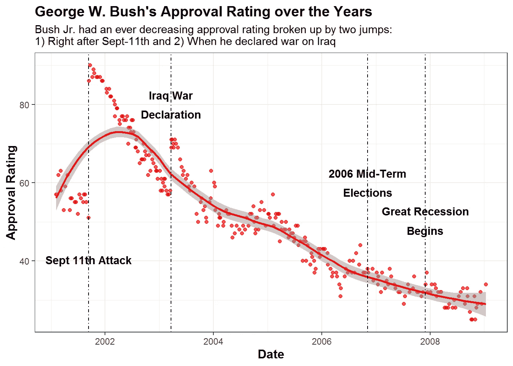

# 使用 ggplot2 用 R 中的图形讲故事

> 原文：<https://medium.com/analytics-vidhya/storytelling-with-your-graphs-in-r-using-ggplot2-f9133c5cc457?source=collection_archive---------5----------------------->

## 用文字、竖线和相关标题，用 R 讲一个总统支持率的故事！

几周前，我收听了约翰·伯恩-默多克的一个 RStudio 讲座，内容是关于报道和可视化疫情。作为英国《金融时报》的一名数据记者，他在过去一年中极具影响力，创作了关于 COVID 传播及其对世界影响的著名图表和图形。**这都是因为他的图形讲述了一个故事**。

作为一名顾问，我知道讲故事的重要性，但在编程中做到这一点很困难，因为故事经常被数据掩盖。尽管如此，你还是应该试着用你的图形、图表和情节来讲述一个故事，而不是仅仅在一页纸上布置一些数字和线条。那么你是如何做到这一点的呢？从他的演讲和我的经历中，我有三个主要收获:

*   使用文本——这是你的秘密武器，不仅可以用在标题上
*   **考虑情绪和政治背景**——了解你的听众可能会如何看待你的图表
*   **聪明地使用动画** —动画 gif、图表和视频是有帮助的，但应该用来强调你故事中的要点(注意，我正计划专门就此写第二篇博文！)

在本教程中，我想探索 R 中的`ggplot2`包，使用像`annotate`和`geom_vline`这样的函数来讲述总统支持率的政治故事。我之前在[媒体](https://dylansjanderson.medium.com/donald-trump-a-stable-president-17306a89d2b5)和[我的网站](https://www.policyinnumbers.com/blog/2021/01/26/donald-trump-a-stable-president/)上写过关于这一点的更深入的政治分析。

我们将在这里建立 **5 个图表**，一个是过去 75 年来每位总统的总统支持率的综合图表，四个是个人总统任期的图表，并附有解释总统任期内主要事件的文字。

## 步骤 1:包和数据加载

让我们在 RStudio 中加载所需的包和数据。我已经在我的 [GitHub 储存库](https://github.com/danderson222/storytelling-with-graphs-in-r)上包含了所有数据，或者你可以自己从[总统项目](https://www.presidency.ucsb.edu/statistics/data/presidential-job-approval)和[五三八](https://projects.fivethirtyeight.com/trump-approval-ratings/)下载川普总统的支持率。*注意，为了方便使用，我确实手动清理了一些 excel 表格，所以从我的 Github 下载可能更容易。*

```
**if**(!**require**("readxl")) install.packages("readxl") *# Required to read in the data*
**if**(!**require**("tidyverse")) install.packages("tidyverse") *# Our rock in data analysis (includes ggplot2)*
**if**(!**require**("janitor")) install.packages("janitor") *# Cleans up data like no other package*
**if**(!**require**("ggsci")) install.packages("ggsci") *# Provides awesome color palettes**# Used a function found on stackoverflow to combine all the different sheets of an excel file into a list* 
read_excel_allsheets <- **function**(filename, tibble = TRUE) {
  sheets <- readxl::excel_sheets(filename)
  x <- lapply(sheets, **function**(X) readxl::read_excel(filename, sheet = X))
  **if**(!tibble) x <- lapply(x, as.data.frame)
  names(x) <- sheets
  x
}*# Combine the different sheets into one list of 13 dataframes*
data.list <- read_excel_allsheets("data/PrevPresidentApproval.xlsx")*# Download the separate Trump approval dataset*
trump.approval <- read.csv("data/TrumpApproval.csv")
```

## 步骤 2:数据操作

加载包和数据后，下一步是数据操作。为此，我们希望标注所有数据集，重命名列，并在确保所有列都相同(因为它们来自两个不同的来源)后合并两个数据帧(一个是前总统的数据帧，一个是特朗普总统的数据帧)。

```
*# Create a list with all the president's names*
pres.names <- list("Obama", "BushJr", "Clinton", "BushSr", "Reagan", "Carter", "Ford", "Nixon", "Johnson", "Kennedy", "Eisenhower", "Truman", "Roosevelt")
*# Apply the list to each dataframe in the original excel list*
*# This makes up for the sheet names, which originally had the president names*
data.list <- Map(cbind, data.list, President = pres.names) *# the Map function applies cbind to each dataframe of the list**# The Janitor package helps us clean the names, from which we select all the columns except for the polling start date (taking the end date instead). Then we rename the columns with the rename() function*
df <- janitor::clean_names(bind_rows(data.list)) %>%
  select(-start_date) %>%
  rename(date = end_date, approval = approving, disapproval = disapproving, unsure = unsure_no_data) 
df$date <- as.Date.POSIXct(df$date) *# We need to change the value from POSIXct to Date**# Now let's clean the trump dataset to match the others and combine it into a new dataframe*
*# I always create new dataframes in case I want to re-access the earlier data without loading it all in again*
trump.approval <- read.csv("data/TrumpApproval.csv")
trump.approval <- trump.approval %>% 
  filter(subgroup=="Adults") %>% *# I chose to take the all adults category as it is more representative of the country*
  select(modeldate, approve_estimate, disapprove_estimate) %>%
  mutate(unsure =(100 - (approve_estimate + disapprove_estimate))) %>% *# Create an unsure column*
  rename(date = modeldate, approval = approve_estimate, disapproval = disapprove_estimate) %>% *# rename the other columns*
  mutate(president="Trump")
trump.approval$date <- as.Date.character(trump.approval$date,"%m/%d/%Y") *# Change the date column from character to date format*
df2 <- rbind(df, trump.approval) *# Combine the data into a new dataframe df2*
```

## 步骤 3:附加数据要求

在制图之前，我们需要添加更多的细节，以确保我们讲的是正确的故事。这个细节是每位总统开始任期的日期。这使我们能够**在每个任期开始时用垂直线创建一个总统支持率的连续图表**。不过要注意细节，因为并不是所有的总统都在规定的 1 月 20 日开始工作。

```
*# To properly graph these presidents together we need to create a separate vector with the term dates for each president*
*# To do this we group by the president, arrange the data by the date of the polling and use the slice function to cut off the first polling entry, which is likely in their first year of presidency. Then select the two columns we need (president & date)*
term.dates <- df2 %>%
  group_by(president) %>%
  arrange(date) %>%
  slice(1) %>% 
  select(president, date)*# Every president starts on January 20th, so grab the year of their first poll and change the term.date start to January 20th*
term.dates$term.start <- paste0(substring(term.dates$date,1,4), "-01-20")*# But...note the three exceptions to this rule:*
*# Gerald Ford took over the August 9th, Truman on April 12th, and Johnson on November 22nd after Kennedy was assassinated*
term.dates[6,3] <- "1974-08-09"
term.dates[7,3] <- "1963-11-22"
term.dates[13,3] <- "1945-04-12"
term.dates <- term.dates[,-2] *# Get rid of the date column*
df2 <- merge(df2, term.dates, by = "president") *# Merge the term.start into the main dataframe using the merge function*
df2$term.start <- as.Date.character(df2$term.start) *# Turn the term.start into the date class*
df2$days_in_office <- df2$date - df2$term.start *# Calculate the number of days in office, which will be relevant for later work!*
```

## 第四步:绘制合并后的总统故事

我要做的第一个图是每位总统支持率的综合图。为了便于阅读和解释，我使用`term.start`列在每个术语的开头添加了垂直线。我还使用了`annotate()`函数来**在图的顶部包含每个总统名字的标签**。在我看来，这比这个特定图形的杂乱图例要好得多。最后，副标题和标题是*讲述图表*的故事所必需的，所以不要忘记在那些元素上花些心思！

```
*# For colors I use the simpsons palette from the ggsci package as you need a lot of colours for 14 different presidents!*
my_colors <- pal_simpsons("springfield")(16)
theme_set(theme_bw()) *# Set the overall graphing theme; bw is my favourite as it makes it easy to compare and has a blank background*
combined.plot <- df2 %>% 
  ggplot(aes(x = date, y = approval, color = as.factor(president))) +
  scale_color_simpsons() +
  geom_point(alpha=0.7) +
  geom_smooth(span = 1, alpha = 0.5) + *# Adds a smoothed line to the graph, much more visually appealing than a standard line*
  geom_vline(data = df2, aes(xintercept = term.start), linetype= 4, color = "black", size=0.5) + *# match the xintercept with the term.start dates found in the dataframe you are using (df2)*
  scale_x_date(limits = as.Date(c("1941-01-20","2021-01-20"))) +
  annotate(geom="text", x=as.Date.character(c("2004-6-01", "1990-6-01", "1979-6-01", "1996-6-01", "1958-6-01", "1975-6-01", "1966-6-01", "1962-6-01", "1970-6-01", "2012-6-01", "1984-6-01", "1942-6-01", "1948-6-01", "2019-6-01")), y=c(100), *# The x and y depict where you want the annotations to be*
           label=c('bold("Bush Jr.")', 'bold("Bush Sr.")', 'bold("Carter")', 'bold("Clinton")', 'bold("Eisenhower")', 'bold("Ford")', 'bold("Johnson")', 'bold("Kennedy")', 'bold("Nixon")', 'bold("Obama")', 'bold("Reagan")', 'bold("Roosevelt")', 'bold("Truman")', 'bold("Trump")'), angle = 45, *# Angling the labels for effect*
           color=my_colors[1:14], parse = TRUE) + *# Using the my_colors vector we can match the lines and text annotations with the same color*
*# Add in the labels and titles! use the \n to have the subtitle spill over into the next line*
  labs(x = "Date", 
       y = "Approval Rating",
       title = "Approval Rating By President over the Years",
       subtitle = "Presidential approval ratings have gone from a volatile rollercoaster like in Truman, Nixon \nor the tenures of both Bush's to a more stable, party-centric evaluation \nepitomized by Trump's term",
       color = "President") +
  theme(plot.title = element_text(face="bold", size =14), 
        axis.title.x = element_text(face="bold", size = 12),
        axis.title.y = element_text(face="bold", size = 12),
        legend.position = "none")
combined.plot
```


图 1——显示过去 75 年中每位总统支持率的综合图表

**从这张图表中可以学到三个关键的教训:**

*   如何使用`annotate()`来**取代传奇**，将总统的名字放在他们的统计数据的正上方
*   在文本和图表中的线条/点之间匹配颜色，让你的读者保持合拍
*   使用副标题讲述一个故事，尤其是如果标题是对图表的无聊描述

## 第五步:绘制个人总统支持率图表

如果你看了[我的上一篇帖子](https://dylansjanderson.medium.com/donald-trump-a-stable-president-17306a89d2b5)，你可能会注意到个别总统的支持率图，其中包括对他们总统任期内重大事件的描述。这又回到了讲故事的前两点:1) **使用文本**，2) **了解你的听众**。这些图表解释了为什么支持率上升和下降，没有任何额外的标题，解释或任何东西，所有你需要的是视觉！

下面我会给你展示一些过去总统的图表，但是你也可以和其他人一起制作你自己的图表。

因此，让我们从尼克松的图开始，图中有几个关键时刻:

```
nixon.plot <- df2 %>% 
  filter(president == "Nixon") %>% 
  ggplot(aes(x = date, y = approval, color = "green")) +
  geom_point(alpha=0.7, color = "green") +
  geom_smooth(span = 0.5, alpha = 0.5, color = "green") +  
  geom_vline(xintercept = as.numeric(as.Date(c("1969-6-8", "1972-11-7", "1972-6-17", "1974-08-08", "1973-4-30"))), linetype= 4, color = "black", size=0.5) +
  labs(x = "Date", 
       y = "Approval Rating",
       title = "Richard Nixon's Approval Rating over the Years",
       subtitle = "Nixon was a relatively popular president as he withdrew troops from Vietnam and was even able \nto get re-elected. As soon as he took responsibility for the Watergate though, there \ncontinued to be a steep decline in approval ratings") +
  annotate(geom="text", x=as.Date.character(c("1969-08-8", "1972-11-7", "1972-1-17", "1974-03-08", "1973-4-30")), y=c(40, 47, 40, 40, 65), 
           label=c('atop(bold("Announces Plan to"), bold("Leave Vietnam"))', 'bold("Wins Re-Election")', 'atop(bold("DNC Headquarters Is"), bold("Broken Into"))', 'atop(bold("Nixon Officially"), bold("Resigns"))', 'atop(bold("Nixon Takes Responsibility"), bold("For Watergate"))'), color="black", parse = TRUE) +
  theme(plot.title = element_text(face="bold", size =14), 
        axis.title.x = element_text(face="bold", size = 12),
        axis.title.y = element_text(face="bold", size = 12),
        legend.position = "none")
nixon.plot
```


图 2——在水门事件最终曝光之前，尼克松的支持率一直相当稳定

小布什的**收视率怎么样？多亏了 911，这次真的像坐过山车一样！**

```
bushjr.plot <- df2 %>% 
  filter(president == "BushJr") %>% 
  ggplot(aes(x = date, y = approval, color = "red")) +
  geom_point(alpha=0.7, color = "red") +
  geom_smooth(span = 0.5, alpha = 0.5, color = "red") +  
  geom_vline(xintercept = as.numeric(as.Date(c("2001-9-11", "2003-3-20", "2006-11-07", "2007-12-01"))), linetype= 4, color = "black", size=0.5) +
  labs(x = "Date", 
       y = "Approval Rating",
       title = "George W. Bush's Approval Rating over the Years",
       subtitle = "Bush Jr. had an ever decreasing approval rating broken up by two jumps: \n1) Right after Sept-11th and 2) When he declared war on Iraq",
       color = "President") +
  annotate(geom="text", x=as.Date.character(c("2001-9-11", "2003-3-20", "2006-11-07", "2007-12-01")), y=c(40, 80, 60, 50), 
           label=c('bold("Sept 11th Attack")', 'atop(bold("Iraq War"), bold("Declaration"))', 'atop(bold("2006 Mid-Term"), bold("Elections"))', 'atop(bold("Great Recession"), bold("Begins"))'), color="black", parse = TRUE) +
  theme(plot.title = element_text(face="bold", size =14), 
        axis.title.x = element_text(face="bold", size = 12),
        axis.title.y = element_text(face="bold", size = 12),
        legend.position = "none")
bushjr.plot
```



图 3——布什任期的标志是 911 袭击和伊拉克战争，这两次事件都使他的支持率飙升

让我们来看看如何描绘最近的两位总统，奥巴马和特朗普。正如你所看到的，这些比所有其他的都更加稳定，波动性更小，主要事件不会太多地改变支持率，尤其是特朗普。

```
obama.plot <- df2 %>% 
  filter(president == "Obama") %>% 
  ggplot(aes(x = date, y = approval, color = "blue")) +
  geom_point(alpha=0.7, color = "blue") +
  geom_smooth(span = 0.5, alpha = 0.5, color = "blue") +  
  geom_vline(xintercept = as.numeric(as.Date(c("2010-3-20", "2011-5-2", "2012-11-07", "2015-03-2"))), linetype= 4, color = "black", size=0.5) +
  labs(x = "Date", 
       y = "Approval Rating",
       title = "Barack Obama's Approval Rating over the Years",
       subtitle = "Obama's popularity peaked both times he was elected, showing his strong ability to campaign. \nHe also got a spike when Bin Laden was killed in 2011") +
  annotate(geom="text", x=as.Date.character(c("2010-3-20", "2011-5-2", "2012-11-07", "2015-03-2")), y=c(70, 60, 65, 55), 
label=c('bold("Passes ObamaCare")', 'atop(bold("Osama Bin Laden"), bold("Assasinated"))','bold("Wins Re-Election")', 'atop(bold("Clintons Email"), bold("Scandal"))'),
           color="black", parse = TRUE) +
  theme(plot.title = element_text(face="bold", size =14), 
        axis.title.x = element_text(face="bold", size = 12),
        axis.title.y = element_text(face="bold", size = 12),
        legend.position = "none")
obama.plot
```


图 4——奥巴马在他的两次竞选中获得了最高的支持率，有趣的是，在他总统任期即将结束时，支持率有所上升

```
# Now time for Trumptrump.plot <- df2 %>% 
  filter(president == "Trump") %>% 
  ggplot(aes(x = date, y = approval, color = "orange")) +
  geom_point(alpha=0.7, color = "orange") +
  geom_smooth(method = 'loess', span = 0.5, alpha = 0.5, color = "orange") +  
  geom_vline(xintercept = as.numeric(as.Date(c("2017-12-22", "2018-11-6", "2019-12-18", "2020-03-25", "2021-01-6"))), linetype= 4, color = "black", size=0.5) +
    ylim(32, 50) +
  labs(x = "Date", 
       y = "Approval Rating",
       title = "Donald Trump's Approval Rating over the Years",
       subtitle = "Trump's highest approval came at the beginning of the pandemic, and the lowest as he \nincited the 2021 capital riots. With a 12 point gap between the two, his approval rating \nwas fairly stable no matter what happened") +
  annotate(geom="text", x=as.Date.character(c("2017-12-22", "2018-11-6", "2019-12-18", "2020-03-25", "2020-11-20")), y=c(48, 45, 37, 47, 45), 
           label=c('atop(bold("Trump Tax Cuts"), bold("Signed Into Law"))', 'atop(bold("Democrats Win Back"), bold("The House"))', 'atop(bold("First Impeachment"), bold("Begins"))', 'atop(bold("COVID Pandemic"), bold("Arrives"))', 'atop(bold("Storming Of"), bold("The Capital"))'),
           color="black", parse = TRUE) +
  theme(plot.title = element_text(face="bold", size =14), 
        axis.title.x = element_text(face="bold", size = 12),
        axis.title.y = element_text(face="bold", size = 12),
        legend.position = "none")
trump.plot
```


图 5 —特朗普的支持率是所有总统中最稳定的。该图仅显示了 30–50%范围内的认可，表明缺乏波动性

这四个情节的美妙之处在于**你可以真正理解为什么支持率会出现下降和上升**，将数据与故事联系起来！这对数据科学家和分析师来说非常非常重要，尤其是在商界，你的老板希望看到一张图表来解释 10 页的分析。

感谢你的阅读，希望你学到了一些关于讲故事和在情节中使用文本的知识。虽然你可以简单地使用 PowerPoint 或其他工具将这种类型的文本添加到桌面上，但当你可以自动化它并在 `**R**` **中找出如何在你的编码图形中完成它时，**就成为了一个强大的工具。****

如果你喜欢这个，在我的下一篇文章中，我计划分享如何使用`gganimate`和`magick`软件包制作这些图表，创建每个总统担任总统的前 4 年及其相应支持率的酷循环 gif。跟随我的媒介了解更多！

**参考资料:**
【1】五三八、[川普支持率](https://projects.fivethirtyeight.com/trump-approval-ratings/adults/)、(2021)
【2】美国总统项目[总统工作批准](https://www.presidency.ucsb.edu/statistics/data/presidential-job-approval)、(2021)

*我是 Monitor Deloitte 的模拟战略顾问，我使用统计数据和分析为数字双胞胎模型提供信息，这些模型重新发明了公司进行战略决策的方式。在我的空闲时间，我痴迷于政治和政策，一直在数字* *的* [*政策上写博客。你可以在那里或者在我的*](http://www.policyinnumbers.com)[*LinkedIn*](https://www.linkedin.com/in/dylansjanderson/)*和*[*Twitter*](https://twitter.com/dylansjanderson)*账号找到我(随意连接或者给我一个关注)。*