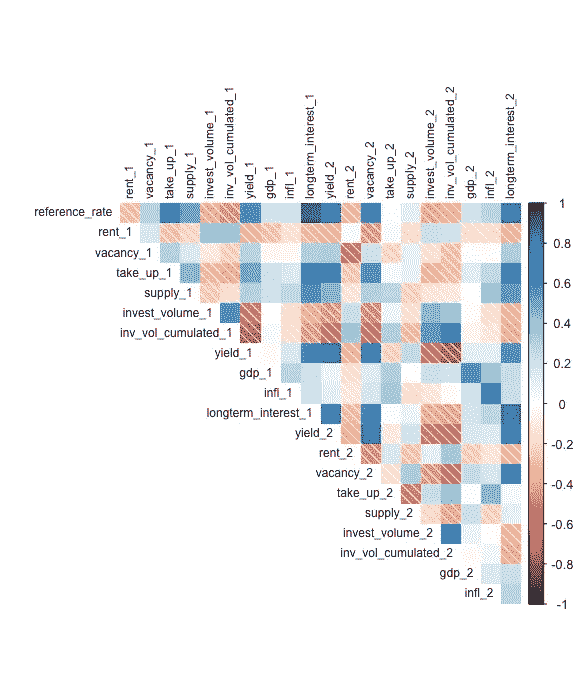
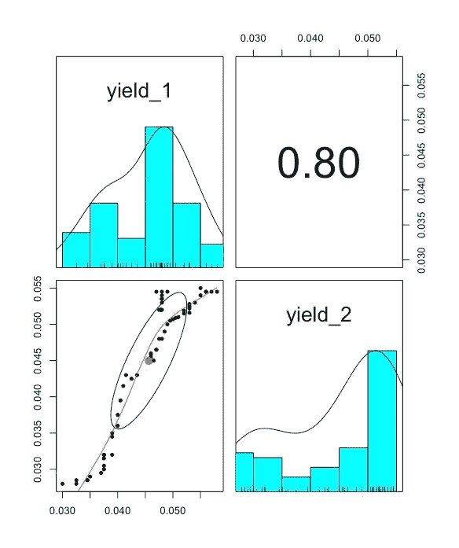
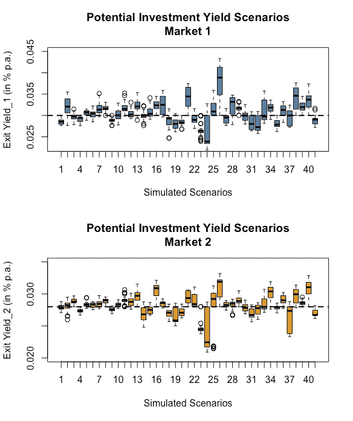
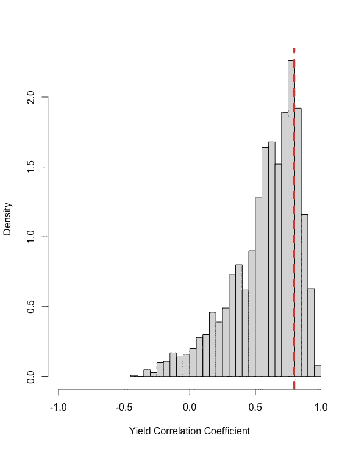

# 房地产战略风险管理/模拟快照

> 原文：<https://medium.com/analytics-vidhya/strategic-risk-management-in-real-estate-a-snapshot-into-simulations-d2ddb0bbe724?source=collection_archive---------19----------------------->

# 风险管理支持

战略风险管理背后的理念是**支持决策者根据风险企业的战略目标，在当前市场形势的支持下，基于占主导地位的市场动态、自身投资组合的情况以及未来对各自目标市场的预期，采取市场定位。**

因此，对这些预期的评估是由数据驱动的，并根据哪些未来情景更有可能成为现实进行量化。

实际的便利是实施的灵活性(它可以用作 SaaS、API、Edge 解决方案，甚至可以作为基于 Excel 的风险管理程序的一部分来实施)，支持 24/7。

为了提供真正的高级分析和量化方法并维持这种支持，一整套**高级预测分析风险管理工具**将与进行组合。

在本文中，我们来看看其中的一个工具，即中长期模拟。

为此，我们不运行整个模拟来获得风险/性能指标结果。

我们更想看到**通过在模拟的早期阶段关注一个主题，灵活和适应性强的模拟方法**有多少(特别是与传统商业分析环境中的敏感性分析相比)。

简而言之，我们来看看区域市场风险集群中投资收益率之间的**相关性。**

# 数据集

模拟的起点:

*   **确定相关资产类别的市场参数**，
*   **揭示各自的市场模式**和
*   相关市场的识别和实施，以揭示潜在集群风险行为的**影响。**

所有这些都根植于**关联网格**所代表的市场特征的相互依赖性中。

以下是由两个市场组成的区域市场集群的经验关联网格的简化示例:

作者图片

基于这个关联网络，我们拿出一个例子，即这两个市场的投资收益率之间的相关性。这两种收益率的历史发展揭示了一种相当强的关联，也就是说，到目前为止，它们表现出非常相似的模式。相关系数等于 0.8。

作者图片

那么，我们来看看这个具体的项目是如何在整体模拟中考虑进去的。

# 投资收益相关性

相关网格嵌入到整体模拟中，否则将由单个市场特征的边际概率分布以及所有市场输入的联合概率作为跨度伞来提供。

如前所述，两种收益率的历史发展显示了相当强的经验相关性，等于 0.8。

鉴于这一事实(以及所有其他因素)，两个市场在 5 年内的预期收益率发展预计如下(下图显示了一些模拟情景；黑色虚线代表当前市场水平):

作者图片

但是这些模拟场景中的相关性表现如何呢？毕竟，我们的经验基线是 0.8。

从下图中可以看出，**收益率相关性并没有静态地停留在 0.8 基准的**上。**与 0.8 英寸切割(见红色虚线)相比，它允许更宽的范围**(见图中灰色区域)。

作者图片

这似乎是合乎逻辑的，因为 0.8 的**经验相关系数**是基于**可能在未来**改变的历史收益率发展。此外，0.8 只是对我们实际上不知道的真实市场动态的一瞥。

**因此，实施更广泛的可能相关因素确实反映了比坚持给定基准更现实的方法。**

然而，**最大概率**停留在**与未来走势中要实现的投资收益率**之间有很强的正相关性。例如，从 0.5 到 0.9 的强相关性有 67%左右的概率。另一方面，相关系数超过 0.9 甚至负相关的几率仅为 4%。

# 适应性强且灵活

请记住，**有多少潜在的未来场景被包含在**整个模拟的快照中。

所有这些潜在的情况都被概率“加权”了。换句话说，在任何一步，你都知道这种情况发生的可能性有多大。

此外，考虑到我们刚刚讨论了拼图中的一小块。相比之下，有更多的项目(如您在第一个图表/关联网格中所见)遵循相同的原则。

在这样的风险模拟中，**市场发展的所有潜在情景都根据其实现的可能性进行评估和量化**。这些结果**与项目/组合数据相结合，以导出数据驱动的风险/绩效指标**，并向决策者提供“大图”**。**

**这种在后台进行的计算**是一种非常复杂的统计建模方法，但其目标是提供一个简单的结果** —在一个 24/7 可用的应用程序中只需“按一下按钮”。**

**特别是，当您将这种方法提供的可能性与更传统的风险管理信息系统中敏感性分析的局限性进行比较时，很明显，有一种**新一代战略风险模型可供使用，它改变了我们在过去几十年中的“风险思维模式”。****

****传统的敏感性分析仅仅受限于创建不同场景和一次性组合不同输入特征的自然界限**。这些传统的分析没有将不同的情景与其量化联系起来，即回答一系列情景可能发生的严重程度。**

**不同的情景简单地以相同的方式加权，给决策者没有真正的方向，因此**没有提供必要的洞察力来采取明智的市场/风险立场**。**

**这个小例子很好地说明了**高级预测分析方法提供了多么广阔的可能性和洞察力**，同时**为战略风险管理**铺平了道路，这是我们迄今为止概念的一次彻底转变。**

****现在，我们有了一种**灵活、实用、快速的方式**来为决策者提供具有高级分析背景的战略工具，使用**数据驱动的模型来检测风险和机遇，而不是数小时的手动工作，结果范围有限。******