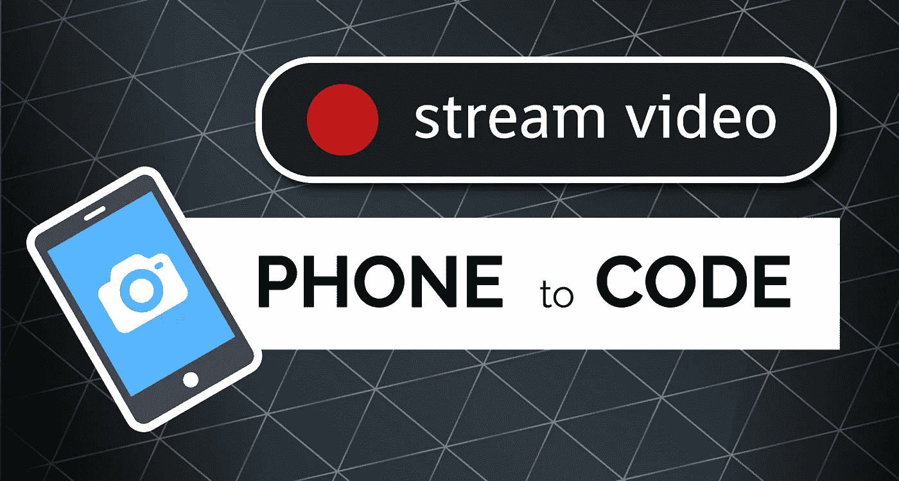

# 使用 Open CV 将移动摄像机馈送流传输到 Python

> 原文：<https://medium.com/analytics-vidhya/stream-mobile-camera-feed-to-python-with-open-cv-d0ec35b2b213?source=collection_archive---------5----------------------->

从手机到代码缩略图图形流视频

Open CV 以其强大的显示和操作预先录制的视频的能力而闻名，但我们如何利用它从我们的手机上对**现场摄像**做同样的事情呢？
在这篇短文中，我将向你展示如何借助 Ip 网络摄像头和 Python 来实现这一点！

# 目录