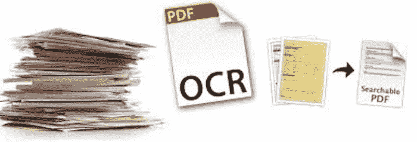
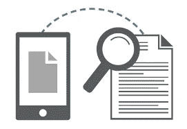
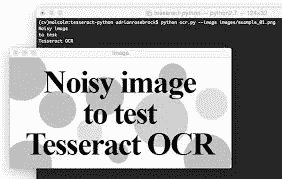
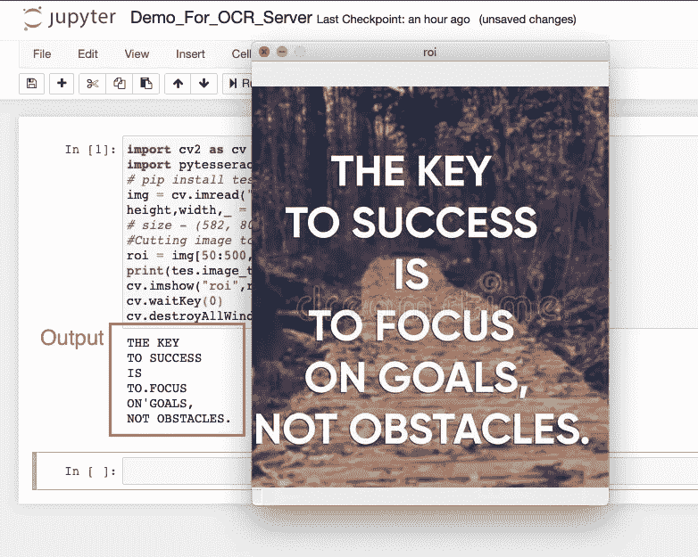

# 使用 Python 和 OCR 将您的图像简化为文本

> 原文：<https://medium.com/analytics-vidhya/streamline-your-images-into-text-with-python-and-ocr-6c32c0f79d1e?source=collection_archive---------0----------------------->

**OCR 代表对象字符识别！！！！**

OCR 是将打字、手写或印刷文本的图像电子或机械转换成机器编码的文本，无论是从扫描的文档、文档的照片、场景照片(例如风景照片中标志和广告牌上的文本)，还是从叠加在图像上的字幕文本(例如电视广播)。OCR 已经成为一种常见的 Python 工具。随着诸如 *Tesseract* 和 *Ocrad* 等库的出现，越来越多的开发人员正在构建以新颖有趣的方式使用 OCR 的库和机器人。

一个简单的例子是一个基本的 OCR 工具，用于从图像中提取文本，这样您就不必在以后重新键入文本。

让我们从步骤开始…

**步骤 1** :根据操作系统的可用性，使用[*Tess doc*](https://tesseract-ocr.github.io/tessdoc/Installation.html)*安装宇宙魔方。*

***第二步**:检查并确认 ***宇宙魔方*** 包的安装路径。*

*对于 windows，默认安装路径将是:`C:\Users\USER\AppData\Local\Tesseract-OCR`。*

*对于 mac OS，安装路径将是:`/usr/local/Cellartesseract/4.1.1`。*

***步骤 3** :使用 *pip* 安装*pytesserate**

*`pip install pytesseract`*

***第四步**:在脚本中设置镶嵌路径(仅适用于 Windows)*

*在调用`image_to_string`之前，在脚本中设置立方体路径:*

*`pytesseract.pytesseract.tesseract_cmd = r'C:\Users\USER\AppData\Local\Tesseract-OCR\tesseract.exe'`*

**

*您已经准备好了需求的基本设置，现在您可以开始编码了……*

*我已经使用了 Anaconda Navigator Jupyter 笔记本和 mac OS 的以下代码。它可能因操作系统规格而异。*

*导入所需的包…*

> *将 cv2 作为 cv 导入
> 将立方体作为 tes 导入*

*使用 openCV(这里是 cv2 包)，读取你想转换成文本的图像…*

> *img = cv.imread("demo.jpeg ")*

*如果图像与代码脚本在同一个文件夹中，那么只需提供名称，否则就要提供完整的路径。*

*获取图像的大小，然后就可以将图像剪切成要转换的精确文本。这是完全可选的。*

> *高度，宽度，_ = img.shape
> roi = img[50:500，200:600]*

*利用*宇宙魔方*包中的 *image_to_string* ()函数将图像字符打印成字符串。*

> *print(tes.image_to_string(roi))*

*最后，我们只显示结果帧，并设置一种方法来退出这个无限循环并关闭视频提要。*

> *cv.imshow("roi "，ROI)
> cv . wait key(0)
> cv . destroyallwindows()*

## *代码输出:*

**

*我希望你喜欢这个博客！！！*

*请随时发表您的意见和反馈…*

****喜欢就别忘了击掌:)****

*谢谢大家！！！*