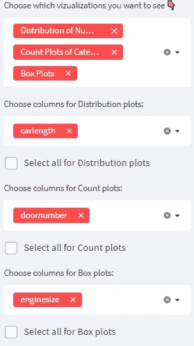

# 用于探索性数据分析的 Streamlit 应用

> 原文：<https://medium.com/analytics-vidhya/streamlit-app-for-exploratory-data-analysis-293a6c3f841?source=collection_archive---------0----------------------->

## 数据科学项目中的自动化 EDA

在每个数据科学问题或项目中，探索性数据分析是工作流中不可替代的一部分。EDA 是您获得关于数据集的见解的步骤。因此，没有足够的数据集信息，就无法做出正确的模型选择。

在处理了足够多的数据集后，我感觉自己在探索性数据分析中一遍又一遍地编写相同的代码。这就是为什么，我想尽可能自动化这个过程。在[我之前的媒体博客](https://abiyevanar.medium.com/complete-exploratory-data-analysis-guide-with-python-plotly-259174e58885)中确定了 EDA 的关键元素后，我使用 [streamlit](https://streamlit.io/) 构建了一个包含所有提到的特性的应用。

在这篇博客中，我将写关于 streamlit 应用程序[的属性。](https://share.streamlit.io/anarabiyev/eda_streamlit_app/app.py)

希望你会喜欢它，并在你的项目中使用该应用程序。

# 应用

1.  导入数据集

应用程序从导入数据集开始。因为两种最广泛使用的文件格式是 csv 和 excel 文件，所以提供了它们。根据反馈，将增加新的文件格式。如果您只想尝试应用程序，可以使用示例数据集。

2.概观

加载数据集后，您将看到它显示为表格，并获得有关形状的信息。您可以向下滚动、向右滑动来查看数据集的任何行或列。

数据集上传后的另一个变化是边栏中可视化工具的多选下拉菜单。从该菜单中，您可以选择要使用的图表。

## 现在，让我们看看可视化选项！

3.信息

Info 显示包含列名、非空值计数和数据类型的表。这是[熊猫信息功能的回归。](https://pandas.pydata.org/docs/reference/api/pandas.DataFrame.info.html)

4.空值信息

众所周知，空值问题是数据科学问题的主要任务之一。在表中，您将获得空值的数量和百分比。例如，21 个空值对于 100 行数据集可能很重要，但对于 100000 行数据集来说没什么大不了的。这就是为什么我们还需要知道空值的百分比。

5.描述性分析

描述性分析返回关于数据集的数字列的所有有用的统计信息。通过查看值的范围，您可以决定数据集是否需要缩放值。

6.异常信息

谈到数值列，另一个非常重要的(尤其是对于数学模型)概念是离群值。该表返回每列的异常值数量。它是用四分位极差法计算的。

7.目标列分析

为了获得模型的最佳性能，目标列的分布应该规范化。在分类问题上，就是不平衡。每一类的样本数至少应该相互接近。在回归问题中，分布应该是正态的。不对称分布会降低性能。

在应用程序中，默认情况下选择最后一列，因为它通常位于数据集的末尾。否则，您可以从下拉菜单中选择目标列。

8.分布图、计数图、箱线图

对于数字列，应用程序提供了两种图形—分布图和箱线图。从分布图中，您可以检查正态性，并从盒图中检查异常值和列的上限和下限。

对于分类列，给出了计数图。从这些图中可以看出不平衡的问题。

对于每种图，多选下拉菜单都可用。默认情况下，第一列是 select。还提供了选择所有按钮。

# 临终遗言

这只是该应用程序的第一个版本，如果它对你未来的工作有所帮助，我会非常高兴。此外，我将非常感谢任何反馈。

应用程序的 GitHub Repo:[https://github.com/anarabiyev/EDA_Streamlit_App](https://github.com/anarabiyev/EDA_Streamlit_App)

应用:

[https://share . streamlit . io/anarabyev/EDA _ streamlit _ app/app . py](https://share.streamlit.io/anarabiyev/eda_streamlit_app/app.py)

# 谢谢你。

对于交流:

【https://www.linkedin.com/in/anar-abiyev-224a45196/ 