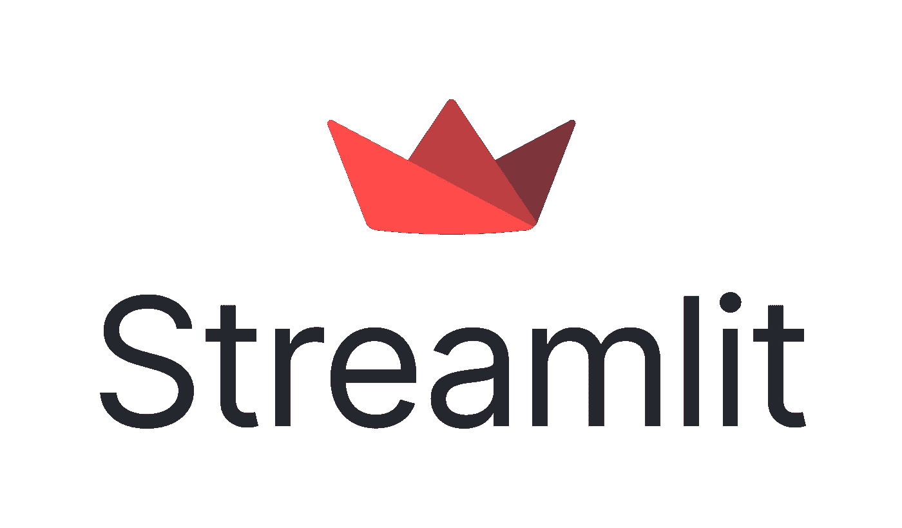

# 简化—只需几分钟即可部署您的应用

> 原文：<https://medium.com/analytics-vidhya/streamlit-deploy-your-app-in-just-a-few-minutes-3f8316ff2ea6?source=collection_archive---------13----------------------->

图片来自[https://streamlit.io/brand](https://streamlit.io/brand)

[Streamlit](https://streamlit.io/) 是一个开源的 Python 库，可以轻松创建和共享漂亮的、定制的机器学习和数据科学 web 应用。只需几分钟，您就可以构建和部署功能强大的数据应用，让我们开始吧！

# 结果

1.  什么是 Streamlit，为什么这么出名？
2.  如何设置 Streamlit 环境？
3.  如何使用 Streamlit 部署应用程序？
4.  Streamlit 的优缺点。

# 关于细流

[Streamlit](https://www.streamlit.io/) 成立于 2018 年，是 Python dashboarding 领域相对较新的公司。经过一年的开发工作，Streamlit 仪表板框架的测试版于 2019 年秋季发布**。该公司创建 Streamlit 的目标是创建一个开源框架来“ ***将 Python 脚本转化为交互式应用*** ”。Streamlit 的口号是*“构建和共享数据应用的最快方式”，*在很大程度上，很难对这种说法**提出异议**。**

该公司由来自 Google、Google X 和 Twitter 的高级工程师创建，如[Adrien Treuille](/@adrien.g.treuille)—Google X 项目负责人，以及[Thiago Teixeria](https://thiagot.com/)—Google Hangouts Chat 的创始人，他们直接了解与各自组织的同事分享他们的数据见解和预测模型的困难。正是这种与同行分享他们通过编程所学到的东西的愿望，导致了 Streamlit 的创建— **启用机器学习和数据可视化工具，这些工具是*“可重复、可共享、可修改，并可在整个组织中使用*** *”。*

2020 年 6 月，Streamlit 宣布一笔**2100 万美元的 A 轮投资进入该公司，由 GGV 资本和 Gradient Ventures 领投。尽管 Streamlit 作为一家公司和一个框架还处于萌芽状态，但通过这一轮投资，它很可能会成为数据科学界的一个知名框架。**

## **编程语言支持**

**Streamlit 建立在 Python 之上，目前**只支持 Python 编程语言**。截至本文撰写之时(2020 年 2 月)，我还没有看到任何关于将框架扩展到 Python 之外以包含更多编程语言的计划。**

## **支持 Python 图形库**

**Streamlit **支持所有主要的 Python 绘图库**，并计划在未来增加对更多库的支持。它目前支持 Matplotlib 的 pyplot 库、Seaborn、Altair、Vega-Lite、Plotly、Bokeh、PyDeck(支持 3D 和地图绘图选项)和 GraphViz。**

**Streamlit 还提供了自己的**原生图形库**，包括折线图、面积图、条形图和地图。这些图表目前是他们提供的全部，因此他们的原生图形库**还没有被考虑**。随着框架的发展，他们计划扩展他们的绘图选项。**

**目前，尽管 Streamlit 有足够的图形库支持，但是在 Streamlit 绘图中可以包含的交互性水平是有限的。**

## **多页面应用程序支持**

**截至 2021 年 2 月，Streamlit **并未明确支持多页面应用。**多页面应用程序支持在该框架的路线图中，但目前，许多**解决方案可以在** [**Streamlit 支持论坛**](https://discuss.streamlit.io/) 上找到，该论坛提供了与多页面应用程序类似的实现，尽管没有改变 URL。**

## **开源与专有**

**Streamlit 是一个完全**开源的 dashboarding 框架，目前有一个测试版**的企业版——名为*[*Streamlit for Teams*](https://www.streamlit.io/for-teams)*。**‘for Teams’*平台将在开源版本上包括认证、日志和改进的可扩展性。***

# ***环境设置***

1.  ***确保安装了 Python 3.6-3.8。***
2.  ***在命令提示符下运行`pip install streamlit`。***
3.  ***运行`streamlit hello`，在浏览器中打开`[http://localhost:8501](http://localhost:8501)`。如果您能够通过 Streamlit 看到欢迎页面，则意味着您已在设备上成功安装了 Streamlit。***

# ***使用 Streamlit 部署的应用***

***你可以在 Streamlit 官网上的这里找到 Streamlit 示例[。](https://streamlit.io/gallery?type=apps)***

******

***Streamlit 支持的应用示例***

# ***参考***

*   ***[https://medium . datadriveninvestor . com/streamlit-everything-you-need-to-know-665 EB 90 fcf 4a](https://medium.datadriveninvestor.com/streamlit-everything-you-need-to-know-665eb90fcf4a)***
*   ***https://streamlit.io/gallery?type=apps***

# ***关于作者:***

***本文由马来西亚 [Arkmind](https://arkmind.com.my) 技术负责人韩胜撰写。他对软件设计/架构相关的东西、计算机视觉以及边缘设备充满热情。他开发了几个基于人工智能的网络/移动应用程序来帮助客户解决现实世界的问题。请随意通过他的 [Github 简介](https://github.com/hansheng0512)了解他。***