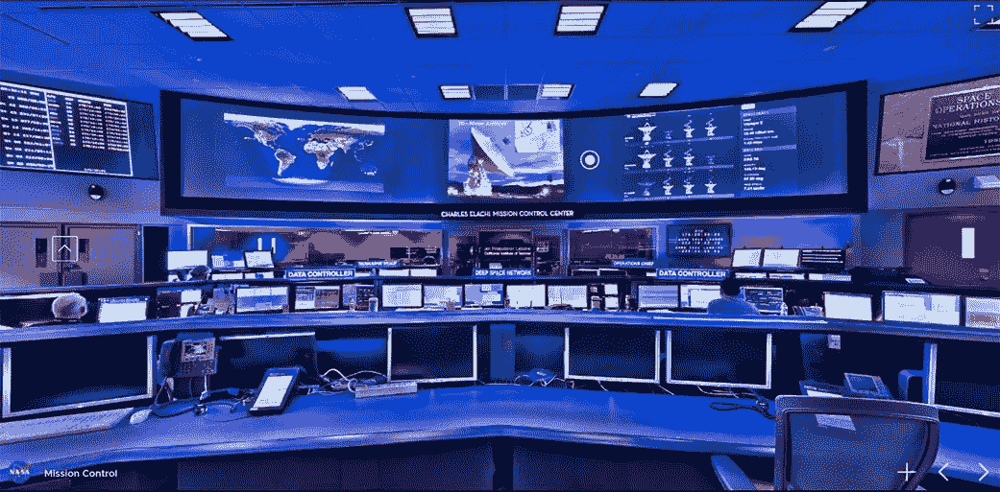
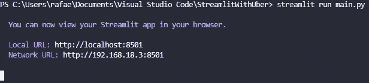
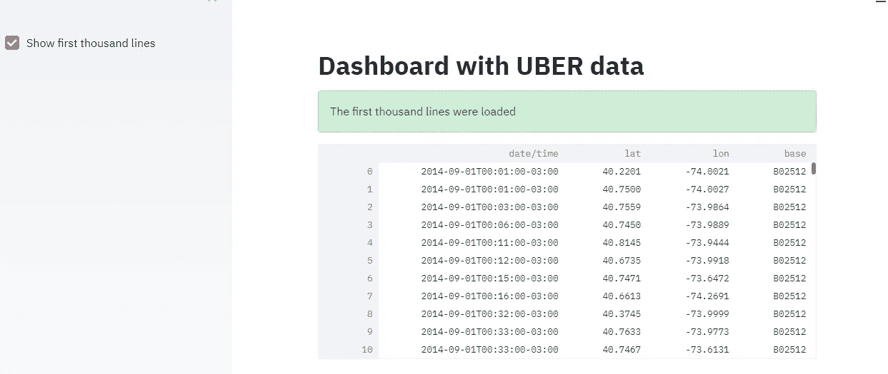
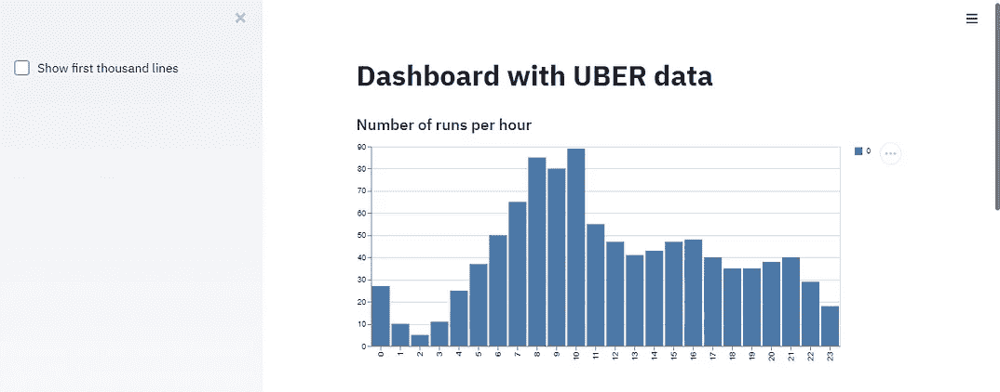
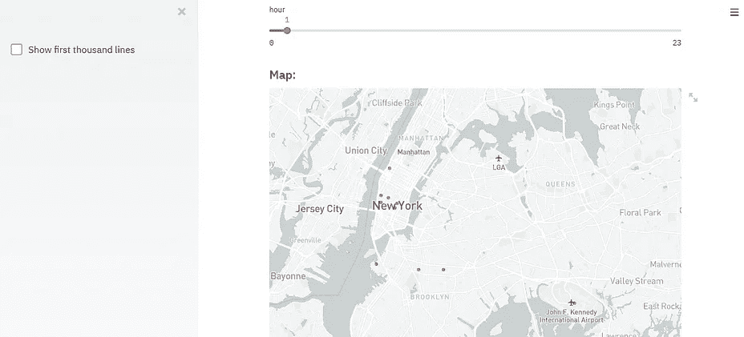
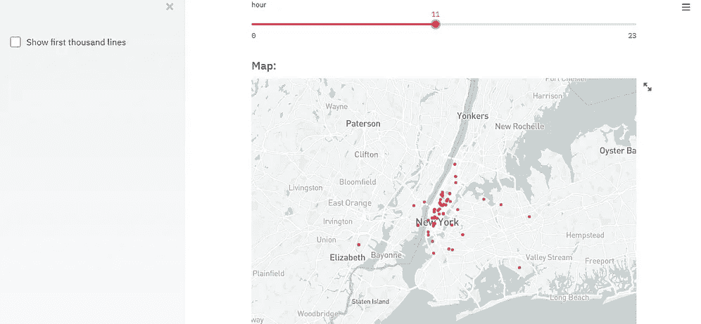
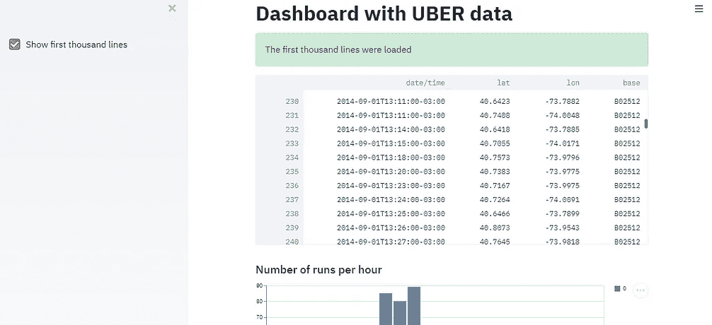

# 实践中的简化|了解如何创建交互式仪表盘

> 原文：<https://medium.com/analytics-vidhya/streamlit-in-practice-learn-how-to-create-interactive-dashboards-69dc22adaf7b?source=collection_archive---------9----------------------->

美国宇航局任务控制中心。[nasa.gov](https://www.nasa.gov/feature/jpl/explore-nasa-s-jet-propulsion-laboratory-with-the-new-virtual-tour)

## 什么是仪表板？

数据科学家的优点之一当然是知道在每天产生的大量数据中寻找什么，但也许比这更重要的是知道如何将这些信息传递给其他人，例如，在当前的会议上，以优雅简洁的方式将从数据中提取的信息传递给你的老板。

大多数情况下，设置仪表板的目的是向人们展示呼号或见解，目的是根据这些呼号做出决策。

为了做到这一点，许多人使用添加了图形的幻灯片，但是您是否考虑过使用 python 来制作您的演示文稿呢？使用代码行创建交互式的非常优雅的演示文稿？这就是我今天在这篇文章中要教授的内容。

使用仪表板显示上述指标的优势在于，根据您的应用程序，您可以实时监控这些数据，也就是说，这是一个可以每秒更新的应用程序，而不是静态的简单幻灯片。例如，本文开头的图像来自 NASA 控制室。对他们来说，必须实时显示数据，才能知道航天器在另一个星球上发射或着陆的真实情况。

## 如何创建仪表板？

第一步是数据科学家每天都要做的，**对数据的探索性分析**，我个人喜欢在 *google colab* 上做，但也可以在 Jupyter 笔记本或任何其他工具上做。

在这个例子中，我们将使用优步提供的数据，可以在这里[找到](https://s3-us-west-2.amazonaws.com/streamlit-demo-data/uber-raw-data-sep14.csv.gz)。这里我将使用纽约市的数据，然而这里——你可以找到其他城市的数据。

优步标志。[uber.com](https://www.uber.com/br/pt-br/)

由于本文的重点不在数据探索上，所以不解释这一步，不过，我使用的笔记本将在 *Github* 资源库中提供。

## 细流

流线型标志。 [streamlit.io](https://streamlit.io/)

为了创建我们的仪表板，我们将使用 Streamlit 库，这是我所知道的 python 中最好的库，它允许您执行这种类型的任务。

安装它非常简单，您可以使用以下命令:

`pip install streamlit`

下一步是在您最喜欢的 IDE 中创建一个文件，在我的例子中，我将使用 VS 代码，并导入 streamlit，如下所示:

`import streamlit as st`

在这个项目中，我们将使用另外两个库，NumPy 和 Pandas

让我们开始写代码吧

像往常一样，最初，我们将导入所有库

streamlit 需要我们的代码位于函数内部，为此，我们将添加以下代码。

我们仪表板上的所有代码都必须在主函数内部。

现在让我们了解一下 Streamlit 库的主要功能:

我们知道的第一个是`st.title()`。这是一个非常简单和不言自明的功能，它的目标是添加一个标题到您的仪表板。还有其他方法来写标题，例如使用 markdown 标记语言。为此，我们使用以下函数:

`st.markdown()`

括号里有引号，我们可以用 markdown 来写。

如果你想在你的仪表盘上呈现一个数学公式，你可以用 LaTeX 用命令`st.latex()`写出来。

我们将在应用程序中使用的另一个函数是`st.subheader()`，它基本上是第二级标题。

正如你所看到的，streamlit 库有无数的函数用于编写文本、标题和公式，不幸的是，我不能对它们都进行评论，这将是一篇很大的文章，但我会留下到[文档](https://docs.streamlit.io/en/stable/api.html)的链接，以防你想看到向你的仪表板添加文本的其他方法。

另一个对我们非常重要并且我们将在项目中使用的函数是:`@st.cache`。为了理解这个函数的目的，假设我们必须使用一个数据集，该数据集不会被添加新数据，并且该数据集很重，每次打开应用程序时都要加载，这是浪费时间，所以我们只加载一次，然后用这个函数保存它，这样每次进入应用程序时，都不需要重新加载数据。

这是这个神奇的库的一些基本功能，现在让我们看看它们是如何应用到我们的项目中的:

我们将精心制作一个函数来加载数据集，并对数据进行一些调整

在这一步中，我们创建了一个函数来加载我们的数据，将列名放在小写字母中，以方便代码，我们还将日期字段更改为 *datetime* 格式。

这个函数的参数是加载一定数量的列，让我们调用这个函数并传递数字 1000

要查看到目前为止您的应用程序，您必须在终端中使用以下命令 streamlit run[您的应用程序的名称]。

我的应用程序名称是 main.py，请注意它的外观:

之后，您的浏览器将在该本地主机上打开，您将看到如下页面:

您可能想知道，我没有从我的数据集加载 1000 行？这些线在哪里？它在缓存中，但是，在任何时候我们都不会要求显示这些数据，我们会这样做。

让我们来理解刚刚编写的代码，最初，我们创建了一个对象，即侧边栏(应用程序的一侧)中的一个复选框，当我们单击此复选框时，它具有一个真值，使用 st.success()函数，我们将显示一条确认操作的消息，最后，使用 st.write()函数，我们将显示数据集的行，让我们看看我们的应用程序是如何工作的。

当您打开应用程序时，您会看到这个屏幕，当您单击复选框时，您的屏幕会是这样的:

现在，我们将在应用程序中添加一个直方图，以检查峰值运行的时间。

不要被代码吓到，我们将逐行理解这些代码。最初，我们用 subheader 函数创建一个副标题，然后我们创建一个直方图，计算一天中每小时的运行次数。
最后，我们使用 st.bar_chart()函数来绘制条形图。

下一步是使用纬度和经度坐标绘制一个带有跑步路线的地图，这非常简单，只需使用 st.map()函数，但是，我们需要一个带有函数 st.slide()的交互式图形。我们创建了一个从 1 到 24(一天中的小时)的幻灯片，最后一个参数是该幻灯片的步长，在本例中为 1 比 1。

为了将此幻灯片与 map 函数集成，创建了一个新的变量 f_data，它将接收通过幻灯片选择的一天中的小时值。

最后，让我们将这个变量 f_data 作为 map 函数的一个参数来传递。

**让我们看看结果吧！**

这里有一些图片显示了我们得到的结果。这是一个简单的项目，但它可以让你走得更远。
我希望这篇文章在某种程度上对你有所帮助，欢迎留下建议/提示/批评的评论。
**好好学习！！**

如果你想开始学习数据科学，但是不知道从哪里开始，可以考虑看一下[我写的这篇文章](/analytics-vidhya/5-best-books-on-data-science-and-machine-learning-bb0f9591cbc5)。

以下是完整的代码:

如果你想访问 Github，这里是[链接](https://github.com/rafaelgrecco/Streamlit-library-Projects)。