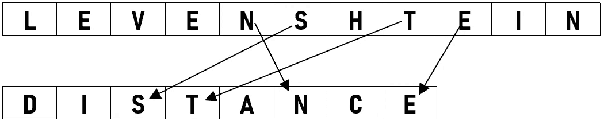
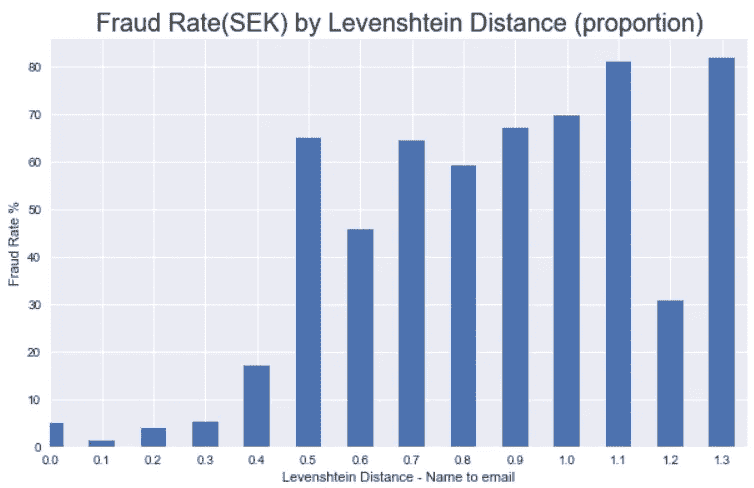

# 使用 Levenshtein 距离防止欺诈的字符串相似性

> 原文：<https://medium.com/analytics-vidhya/string-similarity-for-fraud-prevention-using-levenshtein-distance-3a05fd417e8e?source=collection_archive---------14----------------------->



图片来源:作者

# 背景:欺诈是一个价值 240 亿美元的行业

根据 [DataProt](https://dataprot.net/statistics/credit-card-fraud-statistics/#:~:text=130%2C928%20credit%20card%20fraud%20reports,%2424.26%20billion.) 的数据，2018 年，信用卡欺诈给全球经济造成了 243 亿美元的损失——是的，10 亿美元。几乎每个人都曾是信用卡欺诈的受害者，或者认识这样的人。

## 但是谁买单呢？

许多人认为银行利用某种“欺诈保险”来补偿持卡人，然而在 99%的情况下，费用都落在完成订单的商家身上。这就是商家欺诈防范的用武之地，也是大部分工作完成的地方。

我担任电子商务欺诈防范负责人已经 5 年了，随着时间的推移，我发现自己越来越需要定制解决方案来解决传统工具无法提供的问题，而来自非技术背景在这方面是一个巨大的挑战；

于是，我开始学习 Python，结果已经不可思议了！

这里有一个例子。

## 问题是

我前面提到的一个问题是，订单上的电子邮件地址与所提供的名称有多“相似”。我一直直觉地怀疑，一个不匹配的名字和电子邮件(如约翰·史密斯，艾比·米勒@ <domain>)是一个小小的危险信号(尤其是对一个新客户来说)，但我从来没有办法证明它，更不用说检测它了。</domain>

# 输入 Levenshtein 距离

更确切地说，是 [python-Levenshtein](https://github.com/miohtama/python-Levenshtein) 包。

简而言之，Levenshtein 距离是一种计算将一个字符串转换为另一个字符串所需的单个字符变化(增加、减少和替换)次数的方法。在最基本的层次上，它返回将字符串 A 转换为字符串 b 所需转换次数的整数。

## 装置

```
pip install python-Levenshtein
```

# 密码

我创建了一个小函数，将电子邮件地址和姓名作为输入，删除电子邮件域，使用一些正则表达式去掉数字和标点符号，然后计算 Levenshtein 距离与电子邮件地址长度的比例*(控制字符串长度的变化)*。本质上，返回的值将被用作机器学习模型和分析中的一个特征。

```
import re
import Levenshteindef compare_email_name(email, name):

    lower_name = str.lower(name)
    lower_email = str.lower(str.split(email,'@')[0])
    nopunc_email = re.sub('[!@#$%^&*()-=+.,]', ' ', lower_email)
    nonum_email = re.sub(r'[0-9]+', '', nopunc_email).strip() distance = round(Levenshtein.distance(lower_name,nonum_email) /        len(email),1)
    return distance
```

# 结果！

*一个快速的 dislaimer:虽然是为了模拟真实的事务数据集而构建的，但是数据集是合成的。*

我发现的其实比我预想的要有冲击力的多！下面是欺诈率(在本数据集的情况下，以 SEK 为单位)，按上述函数返回的值分组。



我从上面的图中得到的是，任何需要更改超过原始电子邮件地址长度 40%的名称到电子邮件的转换都更有可能(比如，*更有可能*)是欺诈性的。

# **总之:**

我在这方面还有很多工作要做，比如完善产出指标的正确计算，在真实数据上进行测试，并将这一变量转化为生产模型，但我认为这是一个很好的起点。试试看，让我知道你的想法！

附:这是我的第一篇帖子——如果你已经看到这里，非常感谢你的阅读！