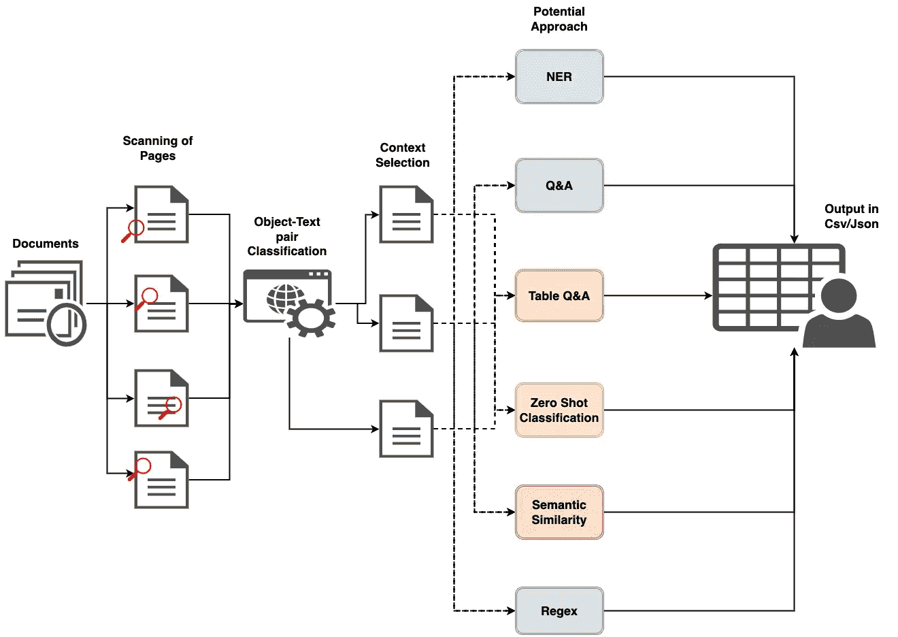
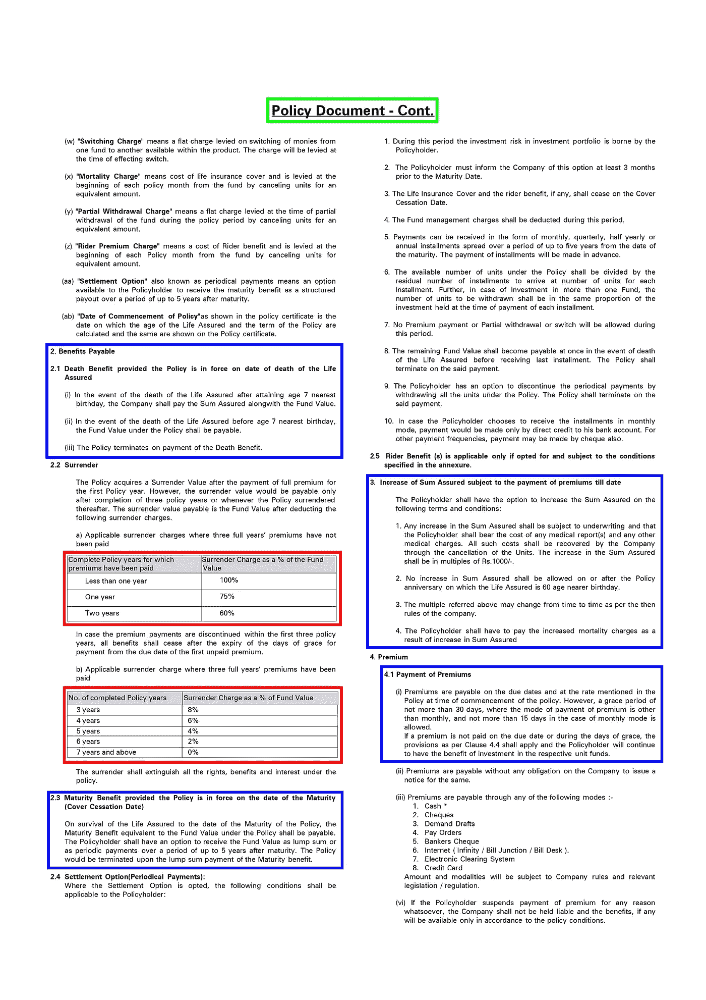
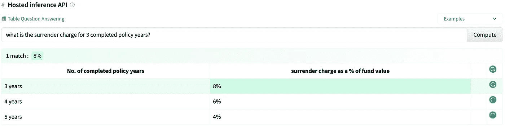
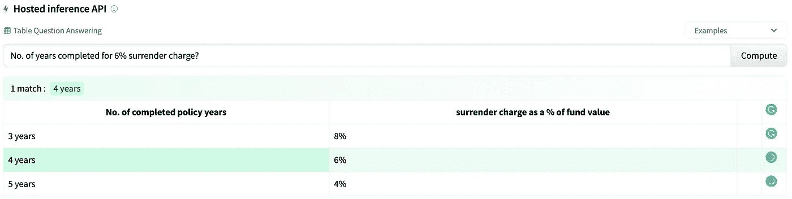

# 从非结构化文档中提取信息的结构化方法

> 原文：<https://medium.com/analytics-vidhya/structured-approach-to-extract-information-from-unstructured-documents-7013d1e83b04?source=collection_archive---------0----------------------->



整体解决方案工作流程

在结构化数据集(如表格数据、发票等)领域，我们已经探索并征服了许多领域，在这些领域，我们有预定义的步骤可以遵循，以获得令人满意的结果，而在从非结构化文档(如保险文档、合同、医疗报告等)中提取信息时，却没有这样的指南。

在本文中，我将介绍一些从非结构化文档中获得预期结果的一般步骤，并提供一些示例代码。我也将提供一些参考资料给那些想探索这个主题的人。

总之，该方法可以分为 4 个主要步骤。首先，文档页面将被分割成单独的图像。第二，每个图像将通过一个黑盒视觉模型发送，该模型将从文档中识别不同的对象，如表格、标题、段落、数字/图表、徽标、签名、QR 码等。第三，一旦检测到这些对象，它们将根据用例进行过滤。例如，人们可能想要从文档的特定部分提取信息，或者只想识别特定类型的徽标。最后，一旦确定了相关的部分，它将通过另一个黑盒模型(文本相关的算法)根据用例和业务需求提取信息，最后，结果可以保存为 CSV、JSON 或其他所需的格式。

**内容:**

*   商业机会
*   方法学
    —将文档分成页面
    —对象检测
    —对象分类
    —基于文本的信息提取方法
*   结论

## 商业机会

> 如果您清楚业务需求，并且只想检查方法，请跳过这一部分

在深入方法部分之前，让我们理解为什么需要这些方法，以及它们会给业务带来什么影响。

> 保险

如果我们考虑保险领域，有多个保险提供商为不同的保费提供不同级别的保险。现在假设，有一家拥有数千名员工的公司为其每一位员工提供医疗保险。这些公司通常会找一个经纪人，帮助他们为员工决定最佳方案。经纪人手动分析来自不同运营商的每个计划，并根据个人需求提出最佳建议。现在，如果这些手动过程可以被自动化的人工智能过程减少或完全取代，人工智能可以从文档中提取关键信息，并根据提取的信息预测特定的计划，情况会怎样？通过加快整个推荐过程来降低运营成本和增加收入，这难道不是一件有趣的事情吗？

> 契约

如果我们考虑法律领域，自动化从合同中提取信息(如“法案”、“法规”、“条款”、“管辖权”、“生效和到期日期”等)的过程变得非常重要，这有助于管理人员更多地关注合同的内容，而不是花时间关注合同生命周期中涉及的技术细节

> 医疗报告

如果我们考虑医疗领域，现在，携带各种不同的过去疾病的大量文档是困难的，并且在这个技术世界中是不可取的。这些医疗报告可以数字化存储，并且可以方便地传输和与医生共享，以供他们咨询。现在，仅仅扫描这些文件并不是最好的选择。相反，可以从报告中提取关键细节并存储在数据库中，该数据库只能由所有者和与之共享的医疗从业者访问。此外，人工智能可以进一步使用这些结构化数据，为患者的潜在疾病推荐医生，这可以帮助医生加快诊断过程，并帮助患者过上更健康、更长寿的生活

## 方法学

现在，既然我们清楚了这种方法可以带来的商业机会，让我们一个一个地理解每一个步骤。

**将文档拆分成页面**

处理这些文档的第一步是分割每一页并将其转换为图像。下面的示例代码可以用来将一个 pdf 文件转换成一个图像列表

```
from pdf2image import convert_from_path, convert_from_bytes
from pdf2image.exceptions import (
    PDFInfoNotInstalledError,
    PDFPageCountError,
    PDFSyntaxError
)images = convert_from_path('/home/belval/example.pdf')
```

更多详情请参考下面的 GitHub repo:

[](https://github.com/Belval/pdf2image) [## GitHub - Belval/pdf2image:一个 python 模块，它包装了 pdftoppm 实用程序，将 pdf 转换为 PIL…

### 一个 python (3.6+)模块，它包装了 pdftoppm 和 pdftocairo 以将 PDF 转换为 PIL 图像对象 pip install pdf2image…

github.com](https://github.com/Belval/pdf2image) 

**物体探测**

在这一步骤中，将训练对象检测模型来从文档的每一页中检测各种对象。文档中常见的潜在对象列表有:

*   桌子
*   标题
*   段落
*   数字/图表
*   标志；徽标
*   签名
*   二维码

用于训练对象检测模型的算法的选择取决于可用于训练的标记数据。如果所有类别的数据都很容易获得，人们可以使用经典算法，如 MaskR-CNN、YOLO 等。

[](https://arxiv.org/abs/1703.06870) [## 屏蔽 R-CNN

### 我们提出了一个概念上简单、灵活、通用的对象实例分割框架。我们的方法…

arxiv.org](https://arxiv.org/abs/1703.06870) [](https://arxiv.org/abs/2004.10934) [## YOLOv4:物体检测的最佳速度和精确度

### 据说有大量的特征可以提高卷积神经网络(CNN)的准确性。实用…

arxiv.org](https://arxiv.org/abs/2004.10934) 

如果大部分类别的标记数据是容易获得的，并且剩余类别的少数标记样本是容易获得的，那么可以采用少量快速学习/增量学习方法。请参考以下文件以供参考:

[](https://arxiv.org/abs/2003.08798) [## 通过元学习的增量目标检测

### 在真实环境中，对象检测器会不断遇到新类的对象实例。当…

arxiv.org](https://arxiv.org/abs/2003.08798) 

变换不变的少镜头物体检测:[https://open access . the CVF . com/content/cvpr 2021/papers/Li _ Transformation _ Invariant _ 少数镜头 _ Object _ Detection _ CVPR _ 2021 _ paper . pdf](https://openaccess.thecvf.com/content/CVPR2021/papers/Li_Transformation_Invariant_Few-Shot_Object_Detection_CVPR_2021_paper.pdf)

如果标记的数据对于一些类是可用的，而对于剩余的类没有标记的数据，则可以探索零触发学习方法。请参考以下文件了解更多详情:

[](https://arxiv.org/abs/2104.06601) [## 零镜头实例分割

### 深度学习利用丰富的标注数据，显著提高了实例切分的精度。然而，在…

arxiv.org](https://arxiv.org/abs/2104.06601) [](https://arxiv.org/abs/2104.13921) [## 经由视觉和语言知识蒸馏的开放词汇对象检测

### 我们的目标是推进开放词汇对象检测，它检测由任意文本输入描述的对象。的…

arxiv.org](https://arxiv.org/abs/2104.13921) 

公开可用于文档对象检测的几个数据集是:

*   https://github.com/ibm-aur-nlp/PubLayNet
*   http://cvit.iiit.ac.in/usodi/iiitar13k.php IIIT-AR-13K:

一旦训练了所需的对象检测模型，输出将如下所示:



1.表格的红框，2。蓝色框代表部分，3。标题的绿色方框

**物体分类**

一旦对象检测模型给出了文档页面中被识别对象的 x，y 坐标，被裁剪的对象就被发送到图像文本对分类模型，该模型可以将对象分类到一个定义的标签中。例如，如果将“保险费支付”部分连同标签[“死亡抚恤金”、“承保收入”、“保险费支付”]一起发送给 CLIP 模型，则该模型将输出返回为每个类别的概率[0.215，0.236，0.549]，而如果“应付福利”部分以相同的标签通过，则该模型将输出返回为[1，4.7e-06，7.2e-05]。参考下面的代码获得类似的输出:

```
import torch
import clip
from PIL import Image

device = "cuda" if torch.cuda.is_available() else "cpu"
model, preprocess = clip.load("ViT-B/32", device=device)

image = preprocess(Image.open("premium_sect.png")).unsqueeze(0).to(device)
text = clip.tokenize(["death benefit", "covered earning", "premium payment"]).to(device)

with torch.no_grad():
    image_features = model.encode_image(image)
    text_features = model.encode_text(text)

    logits_per_image, logits_per_text = model(image, text)
    probs = logits_per_image.softmax(dim=-1).cpu().numpy()

print("Label probs:", probs)
```

有关详细信息，请参考以下链接:

[](https://arxiv.org/abs/2103.00020) [## 从自然语言监督中学习可转移的视觉模型

### 最先进的计算机视觉系统被训练来预测一组固定的预定对象类别。这个…

arxiv.org](https://arxiv.org/abs/2103.00020) [](https://github.com/openai/CLIP) [## GitHub - openai/CLIP:对比语言图像预处理

### CLIP(对比语言-图像预训练)是在各种(图像、文本)对上训练的神经网络。它可以…

github.com](https://github.com/openai/CLIP) 

**基于文本的信息提取方法**

现在，按照上面的步骤从文档中提取了相关的上下文，可以通过各种基于 text/NLP 的方法传递文本以获得想要的结果。例如，如果需要提取“保险费免除—宽限期”，则将检索“保险费支付”部分作为相关上下文。然后，该上下文可以通过 NER 获得上下文中存在的日期，然后所有潜在的日期可以通过零触发文本分类方法来选择最佳的可能结果。另一种可能的方法是通过一个问答模型传递上下文，其中包含诸如“支付保险费的宽限期是多长时间？”并得到输出。

> NER 代码示例:

```
from flair.data import Sentence
from flair.models import SequenceTagger

*# load tagger*
tagger = SequenceTagger.load("flair/ner-english-ontonotes-large")

*# make example sentence*
sentence = Sentence("Payment of Premiums(i) Premiums are payable on the due dates and at the rate mentioned in the Policy at time of commencement of the policy. However, a grace period of not more than 30 days, where the mode of payment of premium is other than monthly, and not more than 15 days in the case of monthly mode is allowed. If a premium is not paid on the due date or during the days of grace, the provisions as per Clause 4.4 shall apply and the Policyholder will continue to have the benefit of investment in the respective unit funds.")

*# predict NER tags*
tagger.predict(sentence)

*# print sentence*
print(sentence)

*# print predicted NER spans*
print('The following NER tags are found:')
*# iterate over entities and print*
for entity in sentence.get_spans('ner'):
    print(entity)
```

> 样本输出—日期实体:“不超过 30 天”、“每月”、“不超过 15 天”、“每月”

> 零镜头文本分类的示例代码:

```
from transformers import pipelineclassifier = pipeline("zero-shot-classification", model="facebook/bart-large-mnli")sequence_to_classify = "Payment of Premiums (i) Premiums are payable on the due dates and at the rate mentioned in the Policy at time of commencement of the policy. However, a grace period of not more than 30 days, where the mode of payment of premium is other than monthly, and not more than 15 days in the case of monthly mode is allowed. If a premium is not paid on the due date or during the days of grace, the provisions as per Clause 4.4 shall apply and the Policyholder will continue to have the benefit of investment in the respective unit funds."candidate_labels = ['grace period of not more than 30 days', 'grace period of monthly', 'grace period of not more than 15 days']classifier(sequence_to_classify, candidate_labels)
```

> 样本输出-概率类:不超过 30 天的宽限期:0.43，不超过 15 天的宽限期:0.511，每月宽限期:0.059

> 问答示例代码:

```
**from** haystack.document_stores **import** FAISSDocumentStore
document_store **=** FAISSDocumentStore(faiss_index_factory_str**=**"Flat")
document_store**.**write_documents(docs)**from** haystack.nodes **import** DensePassageRetriever
retriever **=** DensePassageRetriever(
    document_store**=**document_store,
    query_embedding_model**=**"facebook/dpr-question_encoder-single-nq-base",
    passage_embedding_model**=**"facebook/dpr-ctx_encoder-single-nq-base",
    max_seq_len_query**=**64,
    max_seq_len_passage**=**256,
    batch_size**=**16,
    use_gpu**=True**,
    embed_title**=True**,
    use_fast_tokenizers**=True**,
)
**from** haystack.nodes **import** FARMReader, TransformersReader
reader **=** FARMReader(model_name_or_path**=**"deepset/roberta-base-squad2", use_gpu**=True**)**from** haystack.pipelines **import** ExtractiveQAPipeline
pipe **=** ExtractiveQAPipeline(reader, retriever)prediction **=** pipe**.**run(
    query**=**"Who created the Dothraki vocabulary?", params**=**{"Retriever": {"top_k": 1}, "Reader": {"top_k": 1}})
```

> 样本输出-不超过 30 天，概率为 0.522

为了从表格中提取信息，可以利用表格问答方法来获得所需的输出。请参考下图的示例输出和链接，以了解更多详细信息:



[https://huggingface.co/google/tapas-base-finetuned-wtq](https://huggingface.co/google/tapas-base-finetuned-wtq?query=No.+of+years+completed+for+6%25+surrender+charge%3F&table=%7B%22No.+of+completed+policy+years%22%3A%5B%223+years%22%2C%224+years%22%2C%225+years%22%5D%2C%22surrender+charge+as+a+%25+of+fund+value%22%3A%5B%228%25%22%2C%226%25%22%2C%224%25%22%5D%2C%22%22%3A%5B%22%22%2C%22%22%2C%22%22%5D%7D)



https://huggingface.co/google/tapas-base-finetuned-wtq

有关使用 TAPAS 模型的代码，请参考以下链接:

[](https://huggingface.co/docs/transformers/model_doc/tapas) [## 塔帕斯

### TAPAS 模型是由 Jonathan Herzig 在 TAPAS:通过预训练的弱监督表解析中提出的

huggingface.co](https://huggingface.co/docs/transformers/model_doc/tapas) 

## 结论

本文的重点是提供一个从非结构化文档中提取信息的标准模板，而不是关注特定的行业级解决方案。上述这些步骤也可以部署在云上，用于端到端的自动化流程。要开始使用 MLOps 技术，请参考以下文章:

[](/analytics-vidhya/mlops-building-end-to-end-pipeline-using-sagemaker-sdk-aws-codecommit-a4d15d7efdc3) [## MLOps —使用 Sagemaker SDK 和 AWS CodeCommit 构建端到端管道

### 在后 covid 时代，公司通过使用以下工具不断向业务流程自动化迈进…

medium.com](/analytics-vidhya/mlops-building-end-to-end-pipeline-using-sagemaker-sdk-aws-codecommit-a4d15d7efdc3) 

敬请关注，了解我们在日常工作中使用的不同方法。在 Linkedin 上关注我来互动和分享想法:[https://www.linkedin.com/in/mdsharique0107/](https://www.linkedin.com/in/mdsharique0107/)