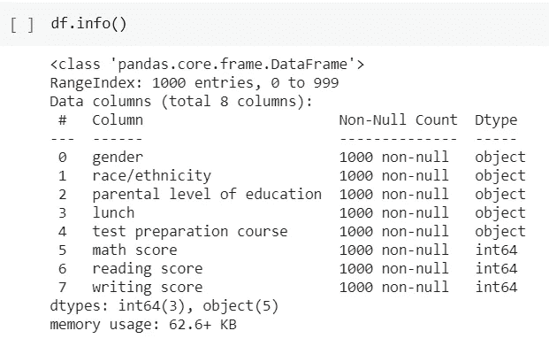

# 学生表现分析

> 原文：<https://medium.com/analytics-vidhya/students-performance-analysis-46eba510039c?source=collection_archive---------4----------------------->

确定各种因素的影响，如父母的教育水平、备考课程等对学生成绩的影响。


由[安托万·道特里](https://unsplash.com/@antoine1003?utm_source=medium&utm_medium=referral)在 [Unsplash](https://unsplash.com?utm_source=medium&utm_medium=referral) 上拍摄的照片

有用的链接:

*   [GitHub](https://github.com/sanketchavan5595/Students-performance-analysis)
*   [威风凛凛](https://jovian.ai/sanketchavan5595/student-performances)
*   [Colab](https://colab.research.google.com/drive/1rlAlWrCk6uPVRYi5QNcmF0jApSbO2F3O)
*   [数据集](https://github.com/sanketchavan5595/Students-performance-analysis/blob/main/StudentsPerformance.csv)

***重要代码包含在需要的地方***

# 数据集的描述:

*   数据集有 1000 行和 8 列



*   有 5 个分类列和 3 个数字列
*   数据集没有空值或重复值

**分类列有:**

*   性别:男性或女性
*   种族/民族:5 组，从 A 组到 E 组
*   父母的教育水平:从高中到硕士
*   午餐:免费/减价或标准。

**数值列有:**

*   数学成绩:满分 100 分
*   阅读分数:满分 100 分
*   写作得分:满分 100 分

该数据集包含来自美国的大约 1000 名学生的数据。该分析旨在了解父母教育水平、备考课程状况等重要因素的影响。学生在考试中的表现。

***知数值列***

增加了一个名为“平均分数”的新栏，包含所有三个科目的平均分数。

```
df[‘average score’] = (df[‘math score’] + df[‘writing score’] + df[‘reading score’]) / 3
```

**分数按以下方式分配:**

使用的功能:`sns.histplot()`


分数之间的关系几乎是线性的:

使用的功能:`sns.lineplot()`


***知范畴列***

*   女生的平均分比男生高。
*   A 组学生的平均成绩最低，E 组学生的平均成绩最高。
*   **A 组学生平均分最低，E 组学生平均分最高**
*   **午餐类别用于识别社会经济地位不利的学生。处于社会经济劣势的学生(免费/减少午餐)分数较低。**
*   **完成备考课程的学生比没有完成的学生分数更高**

与上述事实相对应的图表是:


# 洞察力

*   在父母教育水平相同的学生中，女生的平均阅读和写作成绩高于男生。男生平均数学成绩更高的地方

```
df1 = df.groupby([‘gender’,’parental level of education’])[[‘reading score’, ‘math score’, ‘writing score’]].mean()
```

*   **完成备考课程且父母教育水平为学士学位的学生平均数学成绩更高**
*   **完成备考课程且父母教育水平为硕士学位的学生平均阅读成绩较高**

```
df1 = df.groupby(['parental level of education','test preparation course'])[['reading score', 'math score', 'writing score']].mean()
```

*   **完成备考课程且父母教育水平为硕士学位的学生，平均写作成绩较高**
*   只有三名学生(1 男 2 女)每科都得了满分。他们都属于 E 组种族/民族

`df[df[‘average score’] == 100]`

*   **这三名学生中，只有一名(男性)完成了备考课程**

然后，我们将重点转移到分析高分学生(平均分等于或高于 90 分)

`average_score_df = df[df[‘average score’] >= 90][df.columns]`

这里有一些有趣的发现

*   52 名学生的平均分在 90 分以上。
*   73%是女生
*   78%的学生属于 C、E 和 D 组
*   **大约 77%的学生拥有“大专文凭、学士学位或某所大学”作为父母的教育水平**
*   67.30%(35 名学生)完成了备考课程
*   只有 4 名社会经济处境不利的学生取得了超过 90 分的平均分

我们还决定分析父母的教育水平如何影响学生的表现。对此，我们考虑了两种极端情况:具有高中教育水平的父母和具有硕士学位的父母。我们为此创建了两个独立的数据框。

```
high_school_df = df[df['parental level of education'] == 'high school'][df.columns]masters_degree_df = df[df['parental level of education'] == "master's degree"][df.columns]
```

此外，我们还定义了一些函数来帮助我们进行这个小分析:

```
# Score columnsscore_cols = ['math score', 'reading score', 'writing score']# categorical columnscat_cols = ['gender', 'race/ethnicity','lunch','test preparation course']# Let's define some functions to know the data better# these will be used for both high_school_df and masters_degree_df # function to get the basic statisticsdef stat(df):for col in score_cols:print(col.upper())print('Mean: ' + str(df[col].mean()))print('Median: ' + str(df[col].median()))print('Maximum score: '+ str(df[col].max()))print('Minimum score: '+ str(df[col].min()))print('--------------------')# function to get the value countsdef value_counts(df):for col in cat_cols:print(col.upper())print(df[col].value_counts())print('-------------------')
```

将这些函数用于两个数据框(高中 _df 和硕士 _ 学位 _df)后，我们得到了以下结果:

*   两个类别中所有科目的最高分几乎相同。
*   然而，在父母教育水平为高中的学生中，最低分数非常低
*   **父母的教育水平为硕士学位的学生的平均分和中位数得分较高**
*   **就父母受教育的高中水平而言，35.71%的人处于社会经济劣势。而对于父母教育的硕士学位水平，40.67%的人处于社会经济劣势**
*   **对于高中水平的家长教育，只有 28.57%的学生完成了备考课程，但在硕士学位水平的家长教育的情况下，33.89%的学生完成了备考课程**

# 结论:

这一分析告诉我们，父母的教育水平、社会经济劣势、备考课程等因素都会影响学生在考试中的表现。但是也有很多例外。有父母文化程度低的学生得了满分。此外，一些学生没有完成备考课程就拿了满分。这些学生可能有自己的备考策略。社会经济劣势也有许多例外。这些学生不允许经济障碍影响他们的努力。因此，许多因素影响着学生的表现。有些有很大的影响，而有些没有。此外，还需要考虑数据集中没有提到的其他因素。学校设施、教学质量和方法、同伴压力、学习时间、饮食、睡眠模式等因素。这些因素也会影响学生的表现。

如果您有任何建议，请随时联系

*   LinkedIn:[Sanket Chavan | LinkedIn](https://www.linkedin.com/in/sanket-chavan5595/)

> ***谢谢，祝您愉快***