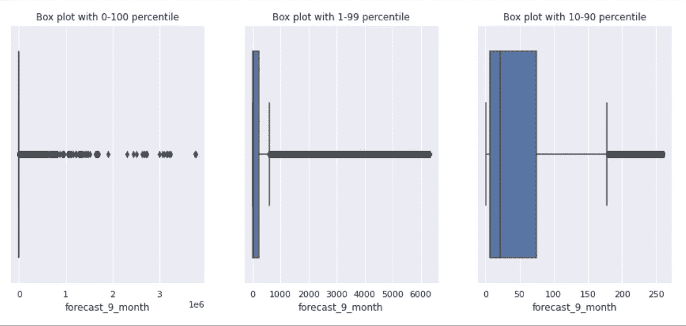
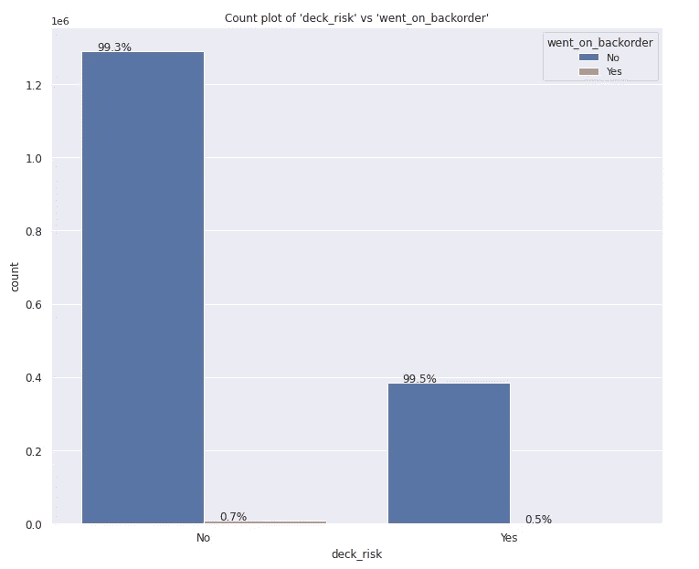

# 缺货预测的多种特征变换研究

> 原文：<https://medium.com/analytics-vidhya/study-of-various-feature-transforms-for-backorder-prediction-3bf4c0faf36b?source=collection_archive---------9----------------------->

在这篇博客中，我们将研究各种特征转换如何影响各种机器学习模型的预测。


米克·豪普特在 [Unsplash](https://unsplash.com?utm_source=medium&utm_medium=referral) 上的照片

**目录:**

*   介绍
*   商业问题
*   现有解决方案
*   机器学习问题公式
*   探索性数据分析
*   特征工程
*   基线随机模型
*   机器学习模型
*   结论
*   参考

# 介绍

货物和服务的流动管理，包括将原材料转化为成品的过程，被称为供应链管理。它基本上涉及精简和优化商品和服务的供应。这有助于最大限度地提高客户价值，进而提供超越竞争对手的竞争优势。

库存管理中供应链管理的一个方面。库存管理涉及原材料和成品的采购、储存和销售。这基本上意味着，通过库存管理，我们可以确保在正确的时间、正确的地点、以正确的成本和价格获得正确的库存水平。这也包括了解你有什么样的产品库存，在哪里，以及它是如何进出的。

库存管理在以商品为基础的企业中尤为重要。因为它能最大限度地提高运营效率，并延长任何企业的寿命。因此，拥有一个不仅能跟踪库存水平、订单和销售，还能帮助预测预测需求的系统是件好事。这有助于减少缺货情况，也有助于避免库存过多的问题。一个好的库存管理系统的特点是，它确保任何时候都有足够的库存，使企业始终顺利运行，但同时它会避免库存过多，因为这样会浪费企业的资源。根据这种观点，今天有各种各样的公司在他们的库存管理系统中使用人工智能技术。他们提供了令人印象深刻的结果，因此可以有把握地得出结论，人工智能肯定可以帮助我们预测需求。

延期交货预测是库存管理系统的重要组成部分。它有助于识别即将缺货或完全缺货的产品，并提示组织订购这些产品。但是什么是延期交货呢？当客户订购了一种缺货的产品，并且客户决定等到产品有货时再发货时，那么该特定产品就会被延期交货。

延期交货的原因

延期交货对商业组织可能是有益的，因为它保护了
客户群，确保了反应灵敏的供应链，以及稳健的风险管理。如果未及时处理延期交货，它们将对相关公司的收入、股票市场价格、
客户信任度产生巨大的
影响，并可能最终失去客户或销售订单。

另一方面，满足延期交货的迅速行动给供应链的不同阶段带来巨大的
压力，这可能会耗尽
供应链流程，或者可能会产生额外的劳动力和/或生产
成本，以及相关的运输费用。

此外，客户需求的不确定性导致
难以预测需求，这使得传统供应链
管理系统在许多方面效率较低，例如
需求预测不准确或延期交货产品分类错误。

如今，一些公司通过应用
机器学习预测过程来预测产品的延期交货，以克服延期交货的相关有形
和无形成本。因此，提前解决缺货问题
在业务流程中变得至关重要，而解决
该问题的方法可以是更精确的缺货预测。在这项工作中，我将使用机器学习技术
尝试预测某个产品是否会延期交货。

# 业务问题:

*   **问题陈述:**根据提供的历史数据，预先确定产品是否会缺货。
*   **来源:**[https://www.kaggle.com](https://www.kaggle.com/)/(这是一个在 Kaggle 举办的比赛，但目前页面不可用)。
*   **数据来源:**[https://github . com/Rodrigo santis 1/backorder _ prediction/blob/master/dataset . rar](https://github.com/rodrigosantis1/backorder_prediction/blob/master/dataset.rar)(可以下载比赛提供的数据集)
*   现实世界/业务约束:这些是我们在处理问题1 时必须考虑的约束。无低延迟要求
    2。可解释性很重要。

# **现有解决方案:**

*   **使用
    机器学习**预测库存管理中的材料延期交货

[https://www . researchgate . net/publication/319553365 _ Predicting _ Mat](https://www.researchgate.net/publication/319553365_Predicting_Mat)
erial _ Backorders _ in _ Inventory _ Management _ using _ Machine _ learn in
g)

在本文中，作者提出了一种基于
采样方法组合和学习分类器集成的监督学习模型。使用的
数据集是 Kaggle 的
竞赛“您能预测产品延期交货吗？”中的一个现实世界不平衡数据集这是具有 1:137 不平衡比率的高度
不平衡数据集。这个数据是历史
8 周的数据。一键编码、归一化和缺失值
插补作为预处理步骤。作者使用了各种学习分类器，
他们选择分类器的标准是:

a.允许内部修改以处理不平衡数据集的分类器
。
b .并且它们应该提供 0 和
1 之间的连续值输出，以便它们可以被解释为概率值。

因此，他们使用逻辑回归和分类树。作者还使用了随机欠采样和 SMOTE 等采样技术。
作者还使用了集成技术，如随机森林、梯度树提升和
标记。作者进行了交叉验证
,包括 5 重交叉验证。作者选择的指标是 AUC 和
精确召回曲线。他们表现最好的模型是 Boosting(估计数
为 10，最大深度= 9，最小样本叶= 5)，AUC 得分
为 0.9482，以及 Blagging(估计数= 10)，AUC 得分
为 0.9478。

*   **使用
    分布式随机森林和梯度推进机器学习
    技术**预测供应链中可能的缺货情况

[https://www . research gate . net/publication/343890731 _ Prediction _ of _ probabel](https://www.researchgate.net/publication/343890731_Prediction_of_probabl)e _ back order _ scenarios _ in _ the _ supply _ chain _ using _ Distributed _ Random _ Forest _ and _ Gradient _ Boosting _ Machine _ learning _ techniques

作者提出了一种基于区间的聚类方法来降低输入空间的
维数，并降低输入空间中区间聚类之间的相关因子
，以提高
模型的性能。此外，他们还提出了一个基于可调范围的模型，通过整合正负数据类型来实现灵活的
库存控制。
作者使用了与上面相同的数据集。但是他们选择了
功能，根据他们的说法，这些功能可以随时用于任何业务
它们是库存、提前期、销售、预测销售功能，并继续
延交订单作为目标变量。作者选择随机森林(RF)作为他们的
基线模型，因为 RF 可以处理包括多个
维度的大型数据集。它可以执行分类和回归。RF 广泛用于现实世界中的无监督聚类。当大部分数据丢失或数据维度未知时，它作为黑盒
工作。本研究选择 GBM 作为
延期交货预测解决方案的第二个模型。GBM 应用梯度下降技术来
最小化错误率。作者选择的指标是 AUC、logloss
和平均每类误差。据观察，使用范围数据的
模型的总体性能高于使用实际数据的情况。

*   **使用递归神经网络的产品延期交货预测模型**

[https://irejournals.com/paper-details/1702592](https://irejournals.com/paper-details/1702592)

本文作者提出了一个延期交货预测系统。他们使用的数据集
和之前的一样。他们执行预处理
步骤，如缺失值插补、分类到数字特征
转换和标准化。数据被分成训练和测试数据集。然后，训练数据集被发送到数据平衡模块，以
确保平等的类别分布，并避免学习模型
决策中的偏差。作者实现了三种采样技术，即
合成少数过采样技术(SMOTE)、随机欠采样(RUS)和自适应合成(ADASYN)。作者选择深度
学习模型 RNN 是因为它能够自动有效地处理
特征，而无需手动特征工程。作者选择了
精度、召回率和 F1 值作为度量标准。他们表现最好的模型
是 RNN(批量= 1000，时期= 30，层数= 20)，其中
ADASYN 的精度为 0.901，召回率为 0.879，F1 得分为 0.889。

*   **利用大数据分析的利润函数最大化库存延期交货预测系统** 

[](https://ieeexplore.ieee.org/abstract/document/9046037) [## 基于大数据分析的利润函数最大化库存延期交货预测系统

### 库存延期交货预测被广泛认为是库存模型的重要组成部分。但是，延期交货…

ieeexplore.ieee.org](https://ieeexplore.ieee.org/abstract/document/9046037) 

作者提出了一个带有欠采样
过程的机器学习模型，该模型将使延期交货决策的期望利润最大化。
他们的模型可以预测数据集中的多数类和少数类。
作者提出的利润函数是预测性
和规定性分析的结合。作者使用的数据集也和上面三个一样
。作者还建议，为了提高
模型的准确性，应该使用聚类算法来选择训练数据，以
实现类别平衡。作者还使用 CBUS 方法克服了
不平衡数据分类问题中的
在预测性能和复杂度之间权衡的问题。首先使用 k 均值算法
对少数类中的实例进行聚类。对于每个聚类，该方法从多数类中选择相同数量的实例来平衡训练数据集。作者为这项研究选择的分类器是 C4.5
决策树、K 最近邻、逻辑回归、随机森林、支持向量机和多层神经网络。作者还
建议在模型训练期间用基于利润的
目标函数取代传统的绩效指标。本研究的最佳模型是
利润最大的随机森林 CBUS，AUC 值为 0.9157。

*   **延期交货预测。使用机器学习预测延期交货**

[](/analytics-vidhya/backorder-prediction-d4f1c5362f18) [## 延期交货预测

### 使用机器学习预测延期交货

medium.com](/analytics-vidhya/backorder-prediction-d4f1c5362f18) 

作者提出了一个预测模型来预测
产品是否会延期交货。作者在与上述论文相同的数据集
上工作。作者执行了详细的 EDA，随后是
预处理步骤，如一键编码和缺失值插补。
作者以两种不同的方式处理特征中的正偏度
第一种是鲁棒缩放，第二种是对数变换加
归一化。AUC 分数、精确召回曲线下面积和宏观 F1
分数被作者用作度量。作者使用了各种分类器
平衡 Bagging 分类器、带平衡子样本的 RF、XGBoost、Easy
集成、smetomek+Logistic 回归、Adaboost 和 Custom
集成。该分析在两个不同的训练数据集
上进行，一个具有鲁棒缩放，另一个具有对数变换和
归一化。两个数据集的最佳性能模型是
平衡 Bagging 分类器，其 AUC 得分为 0.966，
的宏观 F1 得分为 0.54341，精确召回曲线下面积为 0.346，用于稳健缩放
，AUC 得分为 0.97，宏观 F1 得分为 0.543，
精确召回曲线下面积为 0.366，用于对数转换和标准化。

# 机器学习问题公式:

*   **数据:
    -** 来源:[https://github . com/rodrigosantis 1/backorder _ prediction/blob/master/dataset . rar](https://github.com/rodrigosantis1/backorder_prediction/blob/master/dataset.rar)
    -数据集包含两个 csv 文件，分别用于训练和测试目的。
*   在数据集中有 23 列(特征)数据:
    * sku(库存单位) :产品 id —对于每一行都是唯一的，因此可以忽略
    * national_inv:产品的当前库存水平。
    * lead_time:产品的运输时间。
    *在途数量:在途产品的数量。
    * forecast_3_month，forecast_6_month，forecast_9_month:分别预测未来 3、6、9 个月的产品销量。
    * sales_1_month，sales_3_month，sales_6_month，sales_9_month:分别为产品最近 1、3、6、9 个月的实际销售额。
    * min_bank:推荐股票的最小数量。
    *潜在问题:产品/零件中发现的任何问题。
    * pieces_past_due:产品逾期部分的金额(如有)。
    * perf_6_month_avg，perf_12_month_avg:分别是过去 6 个月和 12 个月的产品性能。
    * local_bo_qty:库存逾期金额。
    * deck_risk，oe_constraint，ppap_risk，stop_auto_buy，rev_stop:为产品设置不同的标志(是或否)。
    * got _ on _ back order:目标变量，产品是否延期交货。
*   **机器学习问题的类型:二进制分类问题**因为目标变量有两类——“是”和“否”，它们对应于产品是否缺货。
*   **性能指标:** 由于这是一个不均衡分类问题，正类点很少，我们必须相应地选择性能指标。在这种情况下，假阴性比假阳性更令人担忧。因此，对我们来说，召回比精确更重要。这是因为预测产品将延期交货比实际延期交货更容易，因为这很容易处理。但是，如果未能预测产品将延期交货，当它实际上延期交货时，它将对公司的销售和声誉产生非常负面的影响，并给整个供应链带来额外的压力。
    **1。** **精确-召回曲线下面积:**这里我们计算精确-召回曲线下的面积。我们用这个分数代替 roc_auc_score。因为这将允许业务人员在精确度和召回率之间做出权衡。Precision-Curve 也主要关注少数民族阶层。
    **2。** **F2-Score :** F2 score 用于不平衡数据分类的情况，我们希望更多地关注少数类，或者换句话说，我们希望更多地强调召回。
    **3。召回分数:**召回是模型正确识别数据集中正类的能力。它被给定为(TP/(TP+FN))。

# 探索性数据分析:

## 单变量分析:

**数字特征:**

1.  national_inv ':

*   PDF : *** 特征‘national _ inv’的 PDF 是高度右偏的，这可以从图中看出。
    *这可能是由于异常值，需要进一步调查。


' national_inv '的 PDF

*   Boxplot :
    *与其值的范围相比,' national_inv '的 IQR 较小。
    *好像有离群值。
    *从讨论区得知，该特性中存在负值，这是有效值，表示商店的订购量超过了可用量。
    *箱形图看起来像这样是由于右偏和分布尾部存在大量值。


“national_inv”的箱线图

2.“提前期”:

*   PDF :
    *特征“lead_time”的 PDF 高度右偏，但也有许多峰值


“交付周期”的 PDF

*   箱线图:
    *“提前期”的 IQR 与其值的范围相比是中等的。
    *好像有离群值。根据我们之前的分析，我们知道有很多缺失值。
    *箱形图看起来像这样是由于右偏和分布尾部存在大量值。


“提前期”箱线图

3.在途数量' :

*   PDF :
    *特征‘in _ transit _ qty’的 PDF 是高度右偏的，这可以从图中看出。
    *这可能是由于异常值造成的，需要进一步调查。


“在途数量”的 PDF

*   箱线图:
    *‘in _ transit _ qty’的 IQR 与其值的范围相比非常小。
    *好像有离群值。
    *箱形图看起来像这样是由于右偏和分布尾部存在大量值。


“在途数量”箱线图

4.“预测 _ 3 _ 月”:

*   PDF :
    *特征“forecast_3_month”的 PDF 是高度右偏的，这可以从图中看出。
    *这可能是由于异常值，需要进一步调查。


“预测 _ 3 _ 月”的 PDF

*   箱线图:
    *与其值的范围相比，“预测 _ 3 _ 月”的 IQR 较小。
    *好像有离群值。
    *箱形图看起来像这样是由于右偏和分布尾部存在大量值。


“预测 _ 3 _ 月”的箱线图

5.“预测 _ 6 _ 月”:

*   PDF :
    *特征“forecast_6_month”的 PDF 是高度右偏的，这可以从图中看出。
    *这可能是由于异常值造成的，需要进一步调查。


“预测 _ 6 _ 月”的 PDF

*   箱线图:
    *与其值的范围相比，“预测 _ 6 _ 月”的 IQR 非常小。
    *好像有离群值。
    *箱形图看起来像这样是由于右偏和分布尾部存在大量值。


“预测 _ 6 _ 月”的箱线图

6.“预测 _ 9 _ 月”:

*   PDF :
    *特征“forecast_9_month”的 PDF 是高度右偏的，这可以从图中看出。
    *这可能是由于异常值造成的，需要进一步调查。


“预测 _ 9 _ 月”的 PDF

*   箱线图:
    *与其值的范围相比，“预测 _ 9 _ 月”的 IQR 非常小。
    *好像有离群值。
    *箱形图看起来像这样是由于右偏和分布尾部存在大量值。


“预测 _ 9 _ 月”的箱线图

7.销售 _ 1 _ 月' :

*   PDF :
    *功能“sales_1_month”的 PDF 是高度右偏的，这可以从图中看出。
    *这可能是由于异常值造成的，需要进一步调查。


“销售 _ 1 _ 月”的 PDF

*   Boxplot :
    *与其值的范围相比，“sales_1_month”的 IQR 非常小。
    *似乎有离群值。
    *箱形图看起来像这样是由于右偏和分布尾部存在大量值。


“销售 _ 1 _ 月”的箱线图

8.销售 _ 3 _ 月' :

*   PDF :
    *特征“sales_3_month”的 PDF 是高度右偏的，这可以从图中看出。
    *这可能是由于异常值造成的，需要进一步调查。


“销售 _ 3 _ 月”的 PDF

*   Boxplot :
    *与其值的范围相比，“销售 _ 3 _ 月”的 IQR 非常小。
    *好像有离群值。
    *箱形图看起来像这样是由于右偏和分布尾部存在大量值。


“销售额 _ 3 _ 月”的箱线图

9.销售 _ 6 _ 月' :

*   PDF :
    *特征“sales_6_month”的 PDF 是高度右偏的，这可以从图中看出。
    *这可能是由于异常值，需要进一步调查


“销售 _ 6 _ 月”的 PDF

*   箱线图:
    *与其值的范围相比，“销售 _ 6 _ 月”的 IQR 非常小。
    *好像有离群值。
    *箱形图看起来像这样是由于右偏和分布尾部存在大量值。


“销售 _ 6 _ 月”的箱线图

10.销售 _ 9 _ 月' :

*   PDF :
    *功能“sales_9_month”的 PDF 是高度右偏的，这可以从图中看出。
    *这可能是由于异常值造成的，需要进一步调查。


“销售 _ 9 _ 月”的 PDF

*   Boxplot :
    *与其值的范围相比，“sales_9_month”的 IQR 较小。
    *好像有离群值。
    *箱形图看起来像这样是由于右偏和分布尾部存在大量值。



“销售额 _ 9 _ 月”的箱线图

11.“最小银行”:

*   PDF :
    *特征‘min _ bank’的 PDF 是高度右偏的，这可以从图中看出。
    *这可能是由于异常值，需要进一步调查


“min_bank”的 PDF

*   箱线图:
    *‘min _ bank’的 IQR 与其值的范围相比非常小。
    *好像有离群值。
    *箱形图看起来像这样是由于右偏和分布尾部存在大量值。


“最小银行”的箱线图

12.“过期件数”:

*   PDF :
    *特征‘pieces _ past _ due’的 PDF 是高度右偏的，这可以从图中看出。
    *这可能是由于异常值，需要进一步调查


“过期件数”的 PDF

*   箱线图:
    *与其值的范围相比,‘pieces _ past _ due’的 IQR 非常小。
    *好像有离群值。
    *箱形图看起来像这样是由于右偏和分布尾部存在大量值。


“过期件数”的箱线图

13.性能 6 月平均值' :

*   PDF :
    *特征‘perf _ 6 _ month _ avg’的 PDF 是高度向左倾斜的，这可以从图中看出。
    *这可能是由于异常值，需要进一步调查。
    *由于向左倾斜，箱形图看起来像这样。


“绩效 6 月平均值”的 PDF

*   箱线图:
    *与其值的范围相比,‘性能 _ 6 _ 月份 _ 平均值’的 IQR 较大。
    *好像有离群值。


“绩效 6 月平均值”的箱线图

14.“绩效 12 月平均值”:

*   PDF :
    *特征‘perf _ 12 _ month _ avg’的 PDF 高度向左倾斜，这可以从图中看出。
    *这可能是由于异常值造成的，需要进一步调查。


“绩效 12 月平均值”的 PDF

*   箱线图:
    *与其值的范围相比,‘性能 _ 12 _ 月 _ 平均值’的 IQR 较大。
    *好像有离群值。
    *由于向左倾斜，箱形图看起来像这样。


“绩效 12 月平均值”的箱线图

15.local_bo_qty ':

*   PDF :
    *特征‘local _ bo _ qty’的 PDF 是高度右偏的，这可以从图中看出。
    *这可能是由于异常值，需要进一步调查。


' local_bo_qty '的 PDF

*   箱线图:
    *与其值的范围相比，“local_bo_qty”的 IQR 较小。
    *好像有离群值。
    *箱形图看起来像这样是由于右偏和分布尾部存在大量值。


“local_bo_qty”的箱线图

16.数字特征之间的相关性:

*   预测列之间有很强的相关性。
*   销售列之间也有很大的相关性。
*   Forecast 和 sales 列也有很强的相关性。这些相关性似乎是合乎逻辑的，因为预测取决于销售和以前的预测
*   性能栏之间也有很大的相关性。
*   “pieces_past_due”还显示了与预测、销售和“min_bank”列的一些相关性。
*   “min_bank”列显示了与预测、销售和“in_transit_qty”列的大量相关性。
*   “in_transit_qty”也与预测和销售列相关联。
*   “national_inv”与“min_bank”列存在一定的相关性。


数字特征之间的相关性

**分类特征:**

1.  潜在问题' :

*   计数图:
    * 99.95%的数据点将“潜在问题”标记为“否”。
    * 0.05%的数据点将“潜在问题”标记为“是”。
    *对于‘potential _ issue’两个值的积分分布存在不平衡。


“潜在问题”的计数图

2.' deck_risk ':

*   计数图:
    * 77.04%的数据点将“deck_risk”标记为“No”。
    * 22.96%的数据点将“deck_risk”标记为“Yes”。
    *两个‘deck _ risk’值的积分分布不均衡。


“甲板风险”计数图

3.oe_constraint ':

*   计数图:
    * 99.99%的数据点将“oe_constraint”标记为“No”。
    * 0.01%的数据点将“oe_constraint”标记为“Yes”。
    *两个‘OE _ constraint’值的积分分布不均衡。


“oe_constraint”的计数图

4.ppap_risk ':

*   计数图:
    * 87.92%的数据点将“ppap_risk”标记为“否”。
    * 12.08%的数据点将“ppap_risk”标记为“是”。
    *两个‘PPAP _ risk’值的分值分布不均衡


“ppap_risk”的计数图

5.stop_auto_buy ':

*   计数图:
    * 96.38%的数据点将“停止 _ 自动 _ 购买”标记为“是”。
    * 3.62%的数据点将“停止 _ 自动 _ 购买”标记为“否”。
    * stop _ auto _ buy 两个值的积分分布不平衡。


“停止自动购买”的计数图

6.rev_stop ':

*   计数图:
    * 99.96%的数据点将“rev_stop”标记为“No”。
    * 0.04%的数据点将“rev_stop”标记为“Yes”。
    *两个‘rev _ stop’值的积分分布不均衡。


“rev_stop”的计数图

7.分类特征之间的相关性:卡方检验

*   “潜在问题”和“运行环境约束”之间可能存在某种关联。
*   “rev_stop”和“oe_constraint”之间可能存在某种关联。
*   “rev_stop”和“potential_issue”之间可能存在某种关联。
*   虽然得分很高，但相对而言上述特征得分最低。


分类特征之间的相关性

## 双变量分析:

**数字特征:**

1.  “国家库存”与“延期交货”:

*   箱线图:
    * IQR 对“是”类来说显得较小，对“否”类来说显得较大。
    *对于这两个类，IQR 是重叠的。中值不一样。该功能有助于对产品是否延期交货进行分类。
    *少数民族阶层“否”似乎存在离群值问题。


“国家库存”和“延期交货”的箱线图

2.“提前期”与“延期交货”:

*   对于这两个级别来说，IQR 都显得很小。对于这两个类，IQR 是重叠的。因此，这个特性似乎对分类没有帮助。
    *少数类“否”似乎存在离群值问题。
    *此功能也有缺失值


“提前期”与“延期交货”的箱线图

3.in_transit_qty '与' went _ on _ backorder ':

*   对于这两个等级来说，IQR 看起来都很小。对于这两个类，IQR 是重叠的。中值不一样。该特征有助于对产品是否延期交货进行分类。
    *少数类“否”似乎存在异常值问题。


“在途数量”和“缺货数量”的箱线图

4.“预测 _ 3 _ 月”与“延期交货”:

*   箱线图:
    *对于这两个等级，IQR 似乎都是中等。对于这两个类，IQR 是重叠的。中间值似乎也几乎相同。因此，这个特性似乎对分类没有帮助。
    *少数类“否”似乎存在异常值问题。


“预测 _ 3 _ 月”和“延期交货”的箱线图

5.预测 _ 6 _ 月与“延期交货”:

*   对于这两个级别，IQR 似乎都是中等。对于这两个类，IQR 是重叠的。中间值似乎也几乎相同。因此，这个特性似乎对分类没有帮助。
    *少数类“否”似乎存在异常值问题。


“预测 _ 6 _ 月”和“延期交货”的箱线图

6.“预测 _ 9 _ 月”与“延期交货”:

*   对于这两个类，IQR 似乎都很大。对于这两个类，IQR 是重叠的。中间值似乎也几乎相同。因此，这个特性似乎对分类没有帮助。少数类“否”似乎存在异常值问题。


“预测 _ 9 _ 月”和“延期交货”的箱线图

7.“销售 _ 1 _ 月”与“延期交货”:

*   对于这两个级别来说，IQR 似乎都很小。
    *对于这两个类，IQR 是重叠的。中值也重叠。因此，这个特性似乎对确定产品是否延期交货没有帮助。
    *少数民族阶层“否”似乎存在离群值问题。


“销售 _ 1 _ 月”和“延期交货”的箱线图

8.“销售 _ 3 _ 月”与“延期交货”:

*   对于这两个职业来说，IQR 看起来都很小。
    *对于这两个阶层来说，IQR 是重叠的。中间值似乎不同。因此，该特征有助于分类。
    *少数类“否”似乎存在异常值问题


“销售 _ 3 _ 月”和“延期交货”的箱线图

9.“销售 _ 6 _ 月”与“延期交货”:

*   对于这两个职业来说，IQR 看起来都很小。对于这两个类，IQR 是重叠的。中间值似乎不同。因此，该特征有助于分类。
    *少数类“否”似乎存在异常值问题。


“销售 _ 6 _ 月”和“延期交货”的箱线图

10.“销售 _ 9 _ 月”与“延期交货”:

*   对于这两个级别，IQR 似乎都是中等。对于这两个类，IQR 是重叠的。中间值似乎不同。因此，该特征有助于分类。
    *少数类“否”似乎存在异常值问题。


“销售 _ 9 _ 月”和“延期交货”的箱线图

11.“最小库存”与“缺货订单”:

*   对于这两个级别来说，IQR 似乎都很小。对于这两个类，IQR 是重叠的。中间值虽然不同，但看起来很接近。因此，这个特性对区分类别没有帮助。
    *少数类“否”似乎存在异常值问题。


“最小库存”和“缺货订单”的箱线图

12.“过期件数”与“延期交货数”:

*   对于这两个等级来说，IQR 都显得很小。对于这两个类，IQR 是完全重叠的。因此，该特征对分类没有帮助。
    *少数类“否”似乎存在异常值问题。


“过期件数”和“延期交货”的箱线图

13.“perf_6_month_avg”与“went_on_backorder”:

*   对于这两个级别来说，IQR 都显得很小。对于这两个类，IQR 是重叠的。但是，每个等级的中间值是不同的，而且“是”等级的下百分位数比“否”等级的下百分位数低得多。因此可能对区分有些帮助。少数类“否”似乎存在异常值问题。
    *此功能也有缺失值


“绩效 6 月平均”和“延期交货”的箱线图

14.“perf_12_month_avg”与“went_on_backorder”:

*   对于这两个级别来说，IQR 都显得很小。
*   对于这两个类，IQR 是重叠的。但是，每个等级的中间值是不同的，而且“是”等级的下百分位数比“否”等级的下百分位数低得多。因此可能对区分有些帮助。
*   少数类“否”似乎存在离群值问题。


“绩效 12 月平均”和“延期交货”的箱线图

15.“local_bo_qty”与“went _ on _ backorder”:

*   对于这两个级别来说，IQR 似乎都很小。
    *对于这两个阶层，IQR 似乎都差不多。因此不能区分它。
    *少数民族阶层“否”似乎存在离群值问题。
    *该特性也有缺失值。


“local_bo_qty”和“went _ on _ backorder”的箱线图

16.数值特征与目标变量的相关性:点双列相关

*   “local_bo_qty”和“pieces_past_due”是唯一与目标变量正相关的特征。
*   其余所有特征都与目标变量负相关。
*   大多数相关性似乎并不显著。


数字特征与目标变量的相关性

**范畴特征:**

1.  “潜在问题”与“延期交货”:

*   Countplot :
    *当“潜在问题”为“否”时，0.7%的产品延期交货。
    *当“潜在问题”为“是”时，5.6%的产品延期交货。
    *当“潜在问题”为“是”时，产品延期交货的可能性增加了 8 倍。


“潜在问题”和“延期交货”的计数图

2.“deck_risk”与“went _ on _ backorder”:

*   Countplot :
    *当‘deck _ risk’为‘No’时，0.7%的产品延期交货。
    *当“deck_risk”为“Yes”时，0.5%的产品延期交货。
    *由于在这种情况下，产品延期交货时的点数分布几乎相似，因此该功能似乎对确定产品是否延期交货没有帮助。



“甲板风险”和“延期交货”的计数图

3.“oe_constraint”与“went_on_backorder”:

*   Countplot :
    *当“oe_constraint”为“No”时，0.7%的产品延期交货。
    *当“oe_constraint”为“Yes”时，3.3%的产品延期交货。
    *因此，这意味着“oe_constraint”值为“是”,产品延期交货的可能性增加了约 5%。因此，这个特性很重要。


“oe_constraint”和“went_on_backorder”的计数图

4.ppap _ risk ' vs ' went _ on _ backorder ':

*   Countplot :
    *当‘PPAP _ risk’为‘否’时，0.6%的产品延期交货。
    *当“ppap_risk”为“是”时，0.9%的产品延期交货。
    *该功能似乎也没有什么帮助，因为它无法区分产品是否延期交货。


“ppap_risk”和“延期交货”的计数图

5.“停止 _ 自动 _ 购买”与“继续 _ 补充订单”:

*   Countplot :
    *当' stop_auto_buy '为' Yes '时，约 0.7%的产品延期交货。
    *当“停止 _ 自动 _ 购买”为“否”时，约 0.8%的产品延期交货。这个特征对分类没有太大帮助，因为它有几乎相等的点数分布。


“停止 _ 自动 _ 购买”和“延期交货”的计数图

6.“rev-stop”与“went_on_backorder”:

*   计数图:
    *当“rev_stop”为“Yes”时，没有产品延期交货。
    *当“rev_stop”为“No”时，约 0.7%的产品延期交货。
    *该功能有助于分类，因为产品仅在设置为“否”时会延期交货。


“rev_stop”和“went _ on _ backorder”的计数图

7.分类特征和目标变量之间的相关性:卡方检验

*   这些特征似乎与目标变量没有太大的相关性。


分类特征和目标变量之间的相关性

## 使用主成分分析的特征重要性:


主成分图

*   我们的 PCA 分析中的前三个特征是:“国家 _ 库存”、“预测 _ 9 _ 月”和“销售 _ 9 _ 月”


PCA 特征重要性

# 特征工程:

## 标签编码:

数据集中总共有 8 个分类变量，其中“sku”被删除，因为它用于索引列的目的，在其他 7 个分类变量中，有一个是目标变量—“went _ to _ back order”。所有这些分类变量都是标签编码的。也就是说，对象标签被转换成数字。在这种情况下，每个分类变量中有两个标签——是/否，因此它们被转换为 1/0。这是因为 ML 模型需要数字来处理。

```
# Change categorical features from string to numerical
cat_cols = ['potential_issue', 'deck_risk', 'oe_constraint', 'ppap_risk', 'stop_auto_buy', 'rev_stop', 'went_on_backorder']for col_name in cat_cols:
  train[col_name] = train[col_name].map({'No':0.0, 'Yes':1.0})
```

## 缺失值插补:

通常每个数据集都有一些缺失值，这个数据集也是如此。缺失值是指由于未放置或数据损坏而在列中不存在的值。对于大多数 ML 模型，缺失值是不希望的，因此有必要替换缺失值，以便模型可以正常工作。最常见的技术是均值、中值或众数插补，这意味着用相应列的均值、中值或众数替换缺失值。在本文中，`IterativeImputer`用于 sklearn。

在迭代插补中，我们尝试将每个特征建模为其他特征的函数。这可能是一个回归问题，需要预测缺失值。此外，每个特征都是按顺序估算的，这样我们就可以利用以前的估算值。这个过程被称为迭代，因为这个过程被重复多次，每次迭代都会改进估算值。

```
X_train_iter = X_train.copy()
X_test_iter = X_test.copy()
imp1 = IterativeImputer(max_iter=10, random_state=10)
imp1.fit(X_train_iter)
X_train_iter[:] = imp1.transform(X_train_iter)
X_test_iter[:] = imp1.transform(X_test_iter)
```

## 功能转换:

需要进行要素转换，因为通常情况下，我们拥有的数据集具有不同的列，而这些不同的列可能具有不同的最小值和最大值、不同的范围和不同的单位。例如，重量以千克为单位，而高度以米或英尺为单位。类似地，年龄范围从 0 到 100，而月支出范围从 10000 到 50000 甚至更多。这些差异促使模型更加重视具有较大范围或最小值或最大值的特征，但也可能该特征对我们的任务并不重要。因此，我们试图在训练之前使每一列同等重要，以便模型更容易正确地确定正确的特征重要性。因此，我们执行特征变换和特征缩放。

这项工作采用了五种不同类型的特征转换器，以研究各种特征转换技术如何影响模型性能。选择这些特征变换是因为给定的数据高度倾斜。下面讨论与这些技术相关的细节和代码。

1.  **鲁棒伸缩:**

许多特征变换，如标准缩放器或最小最大缩放器对异常值敏感，因为平均值、最小值或最大值对异常值敏感。因此，变换后我们并不总是得到正态分布。为了解决这个问题，使用了健壮的缩放。`RobustScaler`对异常值不敏感，因为它从数据中移除中值，并通过使用四分位数间距(IQR)来缩放数据，四分位数间距是变量的第一个四分位数和第三个四分位数之间的差值。

```
*IQR = Q3 — Q1*
```

因此，稳健扩展的公式为:

```
x_scaled = (x — Q1)/(Q3 — Q1)
```

代码:

```
X_train_iter_robust = X_train_iter.copy()
X_test_iter_robust = X_test_iter.copy()
scaler = RobustScaler()
scaler.fit(X_train_iter_robust)
X_train_iter_robust[:] = scaler.transform(X_train_iter_robust)
X_test_iter_robust[:] = scaler.transform(X_test_iter_robust)
```

**2。对数变换+标准缩放:**

我们使用对数变换将偏态分布转换为正态分布。这种变换并不总是完美的，因此它也可能产生不太偏斜的分布。总的来说，这种转换有助于减少数据的偏斜。我们将 log 应用于 a 列的值，然后使用结果值代替以前的值。对数变换有助于减少通常为异常值的大值的影响。同时，它有助于提高过低的值。但是对数变换确实有它的问题，当数据具有负值或 0 和 1 之间的值时，它不能被使用，因为对于这些值，对数没有被定义。作为这种情况的解决方案，我们通常在日志中加 1。

应用对数变换后，我也做了标准缩放。`StandardScaler`缩放数值，使平均值为 0，标准偏差为 1(或方差)。我们之前应用了对数变换，因为标准缩放器假设变量是正态分布的，因此对数变换会将它们转换为正态分布，使变量适合应用标准缩放。

标准缩放公式:

```
x_scaled = x — mean/std_dev
```

代码:

```
skewed = ['national_inv','lead_time', 'in_transit_qty' , 'forecast_3_month', 'forecast_6_month', 'forecast_9_month', 'sales_1_month', 'sales_3_month', 'sales_6_month', 'sales_9_month' , 'min_bank', 'pieces_past_due', 'perf_6_month_avg', 'perf_12_month_avg', 'local_bo_qty']log_columns = []
for i in skewed:
log_columns.append(X_train.columns.get_loc(i))def log_transform(a):
  sign = np.sign(a[log_columns])
  a[log_columns] =  np.log(1.0+abs(a[log_columns]))*sign
  return aX_train_iter_log = X_train_iter.copy()
X_test_iter_log = X_test_iter.copy()
X_train_iter_log[:] = np.apply_along_axis(log_transform,1,X_train_iter_log)
X_test_iter_log[:] = np.apply_along_axis(log_transform,1,X_test_iter_log)scaler = StandardScaler()
scaler.fit(X_train_iter_log)
X_train_iter_log[:] = scaler.transform(X_train_iter_log)
X_test_iter_log[:] = scaler.transform(X_test_iter_log)
```

**3。电源转换:**

Power Transformer 还试图将变量转换成正态分布。当数据中存在异方差时，通常使用它们。`PowerTransformer`有一个参数`lamnbda`,它决定对数据集应用哪个变换。有两种方法可以确定`lambda`的值:
1。 [Box-Cox 变换](https://www.google.com/url?sa=t&rct=j&q=&esrc=s&source=web&cd=&cad=rja&uact=8&ved=2ahUKEwiV8dKcx9TqAhUb7XMBHRCEAoAQFjAHegQIERAG&url=https%3A%2F%2Fwww.statisticshowto.com%2Fbox-cox-transformation%2F&usg=AOvVaw0iFLbXcrz55ImaZx7cNA-2)(仅对正值有效)
2。[Yeo-Johnson 变换](https://www.stat.umn.edu/arc/yjpower.pdf)(适用于正值和负值)

代码:

```
X_train_iter_power = X_train_iter.copy()
X_test_iter_power = X_test_iter.copy()
scaler = PowerTransformer()
scaler.fit(X_train_iter_power)
X_train_iter_power[:] = scaler.transform(X_train_iter_power)
X_test_iter_power[:] = scaler.transform(X_test_iter_power)
```

**4。Maxabs 缩放:**

`MaxAbsScaler`通过取每列的最大绝对值来缩放数据，并将每列除以其对应的最大绝对值。这会缩放[-1，1]范围内的数据。当数据包含负值和正值时，可以使用这种比例。

代码:

```
X_train_iter_maxabs = X_train_iter.copy()
X_test_iter_maxabs = X_test_iter.copy()
scaler = MaxAbsScaler()
scaler.fit(X_train_iter_maxabs)
X_train_iter_maxabs[:] = scaler.transform(X_train_iter_maxabs)
X_test_iter_maxabs[:] = scaler.transform(X_test_iter_maxabs)
```

**5。分位数转换:**

分位数转换器还将变量的分布转换为正态分布，并对其进行缩放。这种转换在处理异常值方面很有效。这种转换通常在数据是非线性的时候使用，因为它改变了变量的分布，这可能破坏变量之间的线性关系。

代码:

```
X_train_iter_quantile = X_train_iter.copy()
X_test_iter_quantile = X_test_iter.copy()
scaler = QuantileTransformer(output_distribution='normal')
scaler.fit(X_train_iter_quantile)
X_train_iter_quantile[:] = scaler.transform(X_train_iter_quantile)
X_test_iter_quantile[:] = scaler.transform(X_test_iter_quantile)
```

# EDA 和特征工程概述:

*   该数据集是一个高度不平衡的数据集，99.99%的多数(负)类点其余为少数(正)类。
*   我们试图解决的问题是一个二元分类问题，我们必须预测一个产品是否会延期交货。
*   在数据集中，有 15 个数字特征，它们都是高度倾斜的。
*   三个功能缺少值-“leat _ time”、“perf_6_month_avg”和“perf_12_month_avg”。
*   “perf_6_month_avg”和“perf_12_month_avg”是仅有的两个严重向左倾斜的功能，其余所有功能都向右倾斜。
*   所有的数字特征都具有小的 IQR，并且一些具有负值，这也是有效的条目。
*   销售、预测和绩效的特征有很多相关性。
*   有 8 个分类特征，其中“前往补充订单”是目标变量，“sku”是索引。
*   大多数分类特征在它们的类中也是高度不平衡的。
*   “潜在问题”、“运行环境约束”和“修订停止”是分类特征，这似乎有助于分类。
*   作为特征工程的一部分，首先将分类特征转换为数字特征。
*   然后以 80:20 的比例将数据集分为训练数据集和测试数据集。
*   此后，迭代插补器用于缺失值插补。
*   还执行 PCA 来确定特征重要性。
*   对数据集应用了 5 种不同类型的特征变换:
    *鲁棒缩放
    *幂律变换
    *对数变换和标准缩放
    * MaxAbs 缩放
    *分位数变换

# 基线随机模型:

sklearn 的 dummy classifier(strategy = ' startified ')用作基线模型。这个模型的各种指标是:
1。F2-得分= 0.9866
2。召回分数= 0.0066
3。ROC AUC 得分= 0.5005
4。平均精确召回分数= 0.0067

这些分数将被视为基线分数，后续模型必须超过基线分数才能被接受。

# 机器学习模型:

## 阶级不平衡:

用于这项工作的数据集严重不平衡，因为它有 99.33%的点是负值，其余的是正值。这使得有必要处理这种阶级不平衡，否则它会使模型非常偏颇。


数据集中的类别不平衡

为了处理这个作品中的阶级不平衡，我使用了`RandomUnderSampler`。这是一种欠采样技术，它从多数类中随机选择样本，并将其从训练数据集中删除。

代码:

```
from imblearn.under_sampling import RandomUnderSamplerrus = RandomUnderSampler(random_state=42)
```

## 型号:

在这项工作中，我和 6 个模特一起工作。使用的模型有:逻辑回归、决策树、随机森林、Xgboost、数据随机抽样的自定义集成和根据目标变量数据平衡抽样的自定义集成。如上所述，每个模型由 5 个转换数据集实现。因此，总共有 30 个模型被训练和评估。实现它们的代码可以在这里找到**。**

在这里，我提供了评估模型的各种性能指标的表格。

1.  平均精确召回分数:


平均精确度分数

2.ROC-AUC 得分:


ROC-AUC 分数

3.回忆分数:


回忆分数

4.F2-分数:


F2 分数

# 结论:

*   用对数变换进行逻辑回归表现最好，平均精度得分= 0.1303，ROC AUC 得分= 0.9387，回忆得分= 0.8889，adn F2 得分= 0.8743。
*   使用 MaxAbsScaling 的决策树表现最差，而使用其他四种 it 的决策树表现相似。
*   随机森林使用幂律变换表现最佳，平均精度得分= 0.2265，ROC AUC 得分= 0.9705，回忆得分= 0.9442，adn F2 得分= 0.9051。
*   所执行的 Xgboost 与 Robust Scaling 和 MaxAbsScaling 相当。
*   使用对数变换时，随机采样的自定义集成性能最佳。
*   使用对数变换时，平衡采样的自定义集成性能最佳。
*   如果我们单独考虑 F2 分数，定制集合模型似乎表现最好，但是如果我们也考虑回忆分数，这是不正确的。
*   通过查看回忆分数，可以清楚地看到定制集合模型表现最差，似乎不适合预测。
*   定制集成模型具有高 F2 分数和平均精确召回分数的原因可能是因为它们更多地预测多数类。

总的来说，性能最好的模型是带有幂律变换器的随机森林分类器。

# **未来工作:**

这项工作将扩展到探索各种其他采样方法，如欠采样技术——condensednearestneighborhood、EditedNearestNeighbours、TomekLinks 等，过采样技术——SMOTE、ADASYN、SMOTENC 等。以及组合技术— SMOTEENN、SMOTETomek 等。

# 链接:

*   Github 链接:【https://github.com/sahu-mak/Backorder_Prediction_CaseStudy】T3
*   Linkedin 链接:
    [https://www.linkedin.com/in/sahumayank/](https://www.linkedin.com/in/sahumayank/)
*   streamlit app 视频链接:
    [https://youtu.be/k_1oDXjSRJc](https://youtu.be/k_1oDXjSRJc)

# 参考资料:

*   [https://www.investopedia.com/terms/s/scm.asp](https://www.investopedia.com/terms/s/scm.asp)
*   [https://www.tradegecko.com/inventory-management](https://www.tradegecko.com/inventory-management)
*   [https://machine learning mastery . com/tour-of-evaluation-metrics-for-unbalanced-class ification/](https://machinelearningmastery.com/tour-of-evaluation-metrics-for-imbalanced-classification/)
*   [https://www . analyticsvidhya . com/blog/2020/07/types-of-feature-transformation-and-scaling/](https://www.analyticsvidhya.com/blog/2020/07/types-of-feature-transformation-and-scaling/)
*   [https://machine learning mastery . com/data-sampling-methods-for-unbalanced-class ification/](https://machinelearningmastery.com/data-sampling-methods-for-imbalanced-classification/)
*   【https://www.appliedaicourse.com】