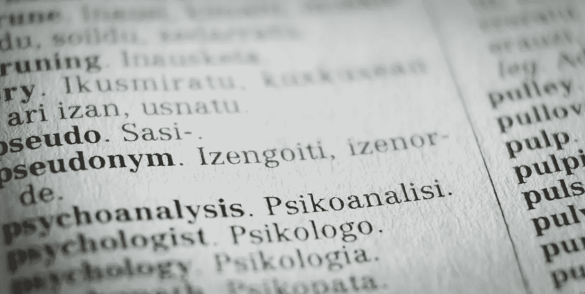

# 带有 Streamlit 和 EasyNMT 的字幕翻译 Web 应用程序

> 原文：<https://medium.com/analytics-vidhya/subtitle-translator-web-application-with-streamlit-and-easynmt-9c568d162453?source=collection_archive---------13----------------------->

## 使用 Streamlit 库在不到一个小时的时间内构建字幕翻译 Web 应用程序的分步指南

图片由[来源](https://unsplash.com/photos/5Z8mR4vqJD4)

> **概述**
> 
> —导言
> 
> —输入格式
> 
> —简化 it 概述