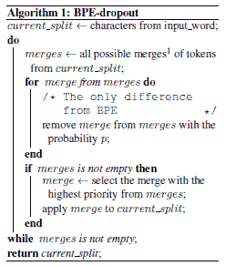

# 神经机器翻译的子词技术

> 原文：<https://medium.com/analytics-vidhya/subword-techniques-for-neural-machine-translation-f55e4506a728?source=collection_archive---------10----------------------->

神经机器翻译(NMT)是当前最先进的机器翻译技术，可以产生流畅的翻译。然而，NMT 模型受超词汇(OOV)和生僻字问题的影响，降低了翻译质量。OOV 词是没有在语料库中出现的词，稀有词是在语料库中出现很少的词。当翻译这样的未知单词时，这些单词被替换为 UNK 标记。因此，翻译变得更糟，因为这些无意义的标记通过破坏句子结构增加了歧义。

字符分割是机器翻译中使用的一种技术，用于避免单词级翻译的缺点。字符分割的主要优点是它可以模拟任何字符组合，从而能够更好地模拟罕见的形态变体。然而，由于缺少重要信息，改进可能不太显著，因为字符级别更细粒度。

为了缓解这些问题，Sennrich 等人(2016)引入了通过提供更有意义的表示将单词分割成子单词单元序列的概念。作为子词分割的例子，考虑单词“looked”。这个词可以拆分为“看”和“ed”。换句话说，用两个向量来表示“看了”。因此，即使这个单词是一个未知单词，该模型仍然可以通过将它视为一系列子单词单元来准确地翻译该单词。

随着自然语言处理的发展，各种子词切分算法被提出。本文全面描述了以下子字技术。

1.  字节对编码(BPE)
2.  单语法语言模型
3.  子字采样
4.  BPE 辍学者

# 字节对编码(BPE)

Sennrich 等人(2016)提出了这种基于字节对编码压缩算法的分词技术。这是使 NMT 模式能够翻译生僻字的有效途径。它将单词拆分成字符序列，并迭代地将最常见的字符对组合成一个。

下面是 BPE 算法获得子字的步骤。

*第一步:* *初始化词汇*

*第二步:对于词汇表中的每个单词，附加单词结束标记< /w >*

*第三步:将单词拆分成字符*

*步骤 4:在每次迭代中获取最频繁出现的字符对，并将它们合并为一个标记&将这个新标记添加到词汇表中*

*步骤 5:重复步骤 4，直到完成期望数量的合并操作或者达到期望的词汇大小*

学习 BPE 操作(森里奇等人，2016 年)

# 单语法语言模型

Kudo (2018)提出了基于单字语言模型的子词分割算法，该算法输出多个子词分割及其概率。该模型假设每个子词独立出现。子词序列 x=(x1，…，xM)的概率是通过乘以子词出现概率 p(xi)获得的。

这里，V 是预先确定的词汇。句子 X 的最可能的分段 x*由下式给出，

S(X)是使用句子 X 获得的一组分割候选。x*是使用[维特比算法](https://en.wikipedia.org/wiki/Viterbi_algorithm)获得的。

子词出现概率 p(xi)是使用[期望最大化(EM)算法](https://en.wikipedia.org/wiki/Expectation%E2%80%93maximization_algorithm)通过最大化下面的似然性 l 来估计的

以下步骤描述了获得具有期望大小的词汇 V 的过程。

*第一步:初始化一个相当大的种子词汇表。*

第二步:定义想要的词汇量。

*步骤 3:通过固定词汇表，使用 EM 算法优化子词出现概率。*

*步骤 4:计算每个子字的损失。子词的丢失描述了当该子词从词汇表中移除时，上述似然性 L 的减少。*

*步骤 5:按损失排序子词，保留前 n%的子词。保持子词只有一个字符，以避免超出词汇表的问题。*

*第六步:重复第三步到第五步，直到达到第二步定义的所需词汇量。*

准备种子词汇表最常见的方法是使用语料库中最常见的子字符串和字符。这种基于单字语言模型的子词分割由字符、子词和词组成。

# 子字采样

在这种技术中，基于单语法语言模型用多个子词分段来训练模型，并且在训练期间对这些子词进行概率采样。最佳分割是一种可用于近似采样的方法。首先，获得 l-最佳分割，并且在执行 l-最佳搜索之后，采样一个分割。

子字正则化有两个超参数，即采样候选的大小(l)和平滑常数(α)。理论上，设置 l→∞意味着考虑所有可能的分段。但是这是不可行的，因为字符的数量会随着句子的长度成指数增长。因此，前向滤波和后向采样算法被用于采样。此外，如果α小，分布更均匀，如果α大，它倾向于维特比分割。

# BPE 辍学者

BPE-dropout 是一种有效的基于 BPE 的子词正则化方法，它能够对特定的词进行多次分割。这使得 BPE 词汇表和合并表保持不变，同时改变了分段过程。这里，在每个合并步骤中，以概率 p 随机移除一些合并，从而为同一单词给出多个分段。以下算法描述了该过程。

BPE 辍学算法(Provilkov 等人，2020 年)

如果概率为零，则子词分段等于原始 BPE。如果概率为 1，则子词分割等于字符分割。如果概率从 0 到 1 变化，它给出具有不同粒度的多个分割。由于该方法将模型暴露给各种子词分割，因此它提供了更好地理解词和子词的能力。BPE-辍学是一个简单的程序，因为训练可以在没有训练除了 BPE 和推理使用标准的 BPE 之外的任何分段的情况下完成。

本文探讨了各种子词技术，以改善神经机器翻译。基于转换器架构的 NMT 模型的示例实现可以在[这里](https://github.com/aaivu/aaivu-machine-trans-eng-sin/tree/master/src/Subword-segmentation)找到，它使用[例句库](https://github.com/google/sentencepiece)应用基于 BPE 和 unigram 语言模型的子字采样。

## 参考

[1] R. Sennrich，B. Haddow，A. Birch，[带子词单元的生僻字的神经机器翻译](https://www.aclweb.org/anthology/P16-1162.pdf) (2016)，计算语言学协会第 54 届年会

[2] T. Kudo，[子词正则化:用多个候选子词改进神经网络翻译模型](https://www.aclweb.org/anthology/P18-1007.pdf) (2018)，计算语言学协会第 56 届年会

[3] I. Provilkov，D. Emelianenko 和 E. Voita，[BPE-辍学:简单有效的子词正则化](https://www.aclweb.org/anthology/2020.acl-main.170.pdf) (2020)，计算语言学协会第 58 届年会

[4] T. Kudo 和 J. Richardson， [SentencePiece:用于神经文本处理的简单且语言独立的子词分词器和去分词器](https://www.aclweb.org/anthology/D18-2012.pdf) (2018)，自然语言处理中的经验方法会议(系统演示)