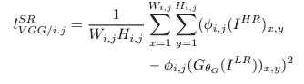
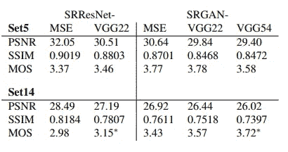

# 利用 SRResnet、SRGAN 实现超高分辨率

> 原文：<https://medium.com/analytics-vidhya/super-resolution-with-srresnet-srgan-2859b87c9c7f?source=collection_archive---------7----------------------->

原文：<https://arxiv.org/abs/1609.04802>

# 论文摘要

*   本文提出了一个名为 SRResNet 的网络架构，它在 PSNR 基准测试中表现出优于其他先前方法的性能[2]。
*   建议使用感知 VGG 损失函数来恢复精细纹理细节，而不是之前用于寻找平均纹理的 MSE 损失。
*   集成 GAN(生成对抗网络)对抗损失，以生成更精细的纹理细节和更好的感知质量，通过平均意见得分进行评估。

利用本文提出的方法获得超分辨率图像。

# SR 的感知损失

虽然使用像素方式的 MSE 误差作为度量来测量模型的性能并因此导致最大化 PSNR 分数可能是令人信服的，但是这种损失定义对于生成感知上高质量的图像具有一些明显的缺陷。这是因为基于 MSE 的解决方案在输出所有可能解决方案的平均值时被优化，这可能不在 HR 图像流形上，并且有时可能模糊和不真实。下图显示了这种现象，蓝色块是基于 MSE 的最优解。

为了解决这个问题，作者首先提出了一种基于 GAN 的方法来捕获自然图像流形，并提出了一种综合上下文损失和敌对损失的混合损失。为了进一步提高性能，作者还提出了一种改进的上下文损失，通过查看预训练的 VGG-19 网络的中间激活来比较图像的更多高级特征。这个损失描述如下，φi，j 表示 VGG19 网络内第 I 个 maxpooling 层之前第 j 个卷积之后(激活之后)的特征映射。

VGG 损失

如下所示，SRResnet 恢复图像的非常模糊的补丁，而包含敌对损失和 VGG 上下文损失的损失实现了照片级的图像超分辨率。VGG22 和 VGG54 的区别在于用于计算损耗的 VGG 网络的层数(22->4 层，54->19 层)。

在实验中评估每种损失的 PSNR、SSIM、MOS 评分。PSNR 和 SSIM 评分对于 SRResNet-MSE 模型来说是最好的，而使用更多的感知损失函数导致显著更高的 MOS 评分。尽管如此，常规 SRResNet-MSE 模型在 PSNR/SSIM 和 MOS 评分上也优于所有先前的方法，显示了所提出的模型架构的有效性。

与以前方法的比较

# 模型架构

本文提出了一个生成器网络和一个鉴别器网络，分别用于超分辨率图像，以及从高分辨率地面实况图像中鉴别超分辨率图像。生成器网络由 5 个在较低尺度上操纵图像的残差块组成，以及 ESPCN[3]提出的一种无需手动填充中间像素值即可重建超分辨率图像的方法。下面的图片和链接详细介绍了这种方法。生成器的每个残差块具有两组常规(Conv-BN-ReLU)块，对于所有块，其具有恒定的通道数 64 和核大小 3，以及之后的跳过连接。

鉴别器是输入图像的常规 CNN，并且旨在分类它是真实图像还是虚假图像。想了解更多关于 GANs 的信息，请尝试 Tensorflow DCGAN 教程。

[https://torch . vision/2020/01/14/Efficient _ Sub _ Pixel _ convolatile _ Neural _ network . html](https://torch.vision/2020/01/14/Efficient_Sub_Pixel_Convolutional_Neural_Network.html)

本文的实现将很快发布。

# 参考

[1] Ledig，Christian 等，“使用生成式对抗网络的照片级单幅图像超分辨率”*IEEE 计算机视觉和模式识别会议论文集*。2017.

[2]董，晁，等.利用深度卷积网络实现图像超分辨率."IEEE 模式分析与机器智能汇刊 38.2(2015):295–307。

[3]石，，等.“利用高效亚像素卷积神经网络实现单幅图像和视频的实时超分辨率”*IEEE 计算机视觉和模式识别会议论文集*。2016.