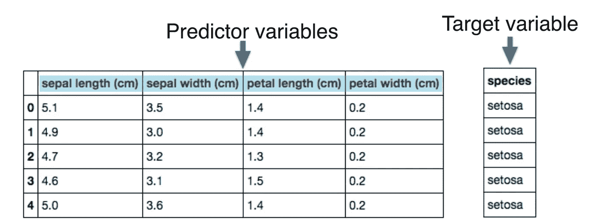

# 监督学习

> 原文：<https://medium.com/analytics-vidhya/supervised-learning-d8562826b798?source=collection_archive---------23----------------------->

## 监督学习和数据术语的简要概念。

在我之前的帖子中，我已经介绍了机器学习的基本概念，在这篇帖子中，我们将在开始学习编码方面之前深入研究监督学习

> 如果你错过了，可以看看之前的帖子

 [## 什么是机器学习？

### 机器学习赋予计算机无需编程就能从数据中学习做出决策的能力…

evanchua.medium.com](https://evanchua.medium.com/what-is-machine-learning-42d8c71d6f2f) 

示例数据集是 iris flower 数据集，如下所示，我将使用它来举例说明更多关于不同术语的信息。

将用于我们监督学习的数据集

# 1)什么是预测变量？

预测变量是用于预测结果的数据点。根据该实例，预测变量将是萼片长度、萼片宽度、花瓣长度和花瓣宽度。

# 预测变量的不同命名约定

其他人可能会调用预测变量、特征或目标变量，但请记住它们是相同的

# 2)什么是目标变量？

目标变量是您试图预测的变量，在这种情况下，我们试图根据萼片长度、萼片宽度、花瓣长度和花瓣宽度来预测哪种花。所以目标变量是物种。

# **目标变量的不同命名约定**

其他人可能称之为目标变量、因变量或响应变量，但请记住它们是相同的

# 监督学习的目的是什么？

监督学习的目的是训练一个能够预测目标变量的模型，在这种情况下，在给定萼片和花瓣的长度和宽度的情况下，预测花的种类。

# 学习任务的类型

根据目标变量的种类，这是一个不同类型的学习任务，例如，如果目标变量由**分类变量**组成，如 setosa、virginica 和 versicolour 物种，这将是一个分类任务，如果目标变量由**连续变量**组成，如房屋价格，这是一个回归任务。

# 监督学习的目标

监督学习的目标是自动化耗时或昂贵的手动任务，如医生的诊断。因为监督学习需要标记数据。有很多方法可以获取这些标记数据，可以从历史数据中获取，历史数据中已经有你感兴趣的标记数据，或者通过实验来获取。最终目标是从已知正确输出的数据中学习，这样我们就可以对未知输出的数据做出准确的预测。

# 如何在 python 上开始监督学习？

我强烈推荐 scikit-learn，或 sklearn，这是 Python 中最流行和用户友好的机器学习库之一。还有其他像 TensorFlow 和 keras 这样的库，一旦你掌握了基本知识，它们是非常值得一试的。