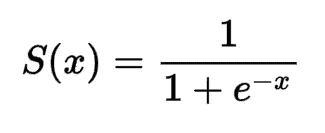
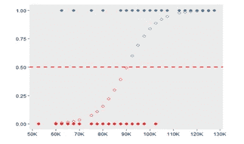
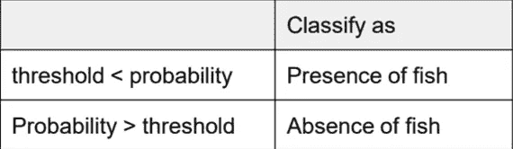
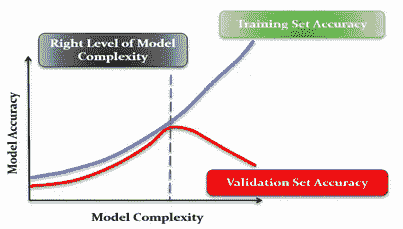

# 监督学习:从基础到专家的逻辑回归

> 原文：<https://medium.com/analytics-vidhya/supervised-learning-logistic-regression-from-basics-to-expert-9f710a755857?source=collection_archive---------8----------------------->

# 什么是监督学习？

当我们的数据被标记时，监督学习机器学习算法就完成了。我们有两种监督机器学习算法

1.  **回归。**
2.  **分类。**

# **1。回归**

本博客中有解释: [**点此**](https://sruthils22.medium.com/linear-regression-in-machine-learning-783bb5e58944)

线性回归的超参数调整: [**点击此处**](https://sruthils22.medium.com/hyperparameter-tuning-in-linear-regression-e0e0f1f968a1)

# **2。分类**

**我们什么时候用分类监督学习？**

分类是根据独立特征预测目标列中的**分类变量**或因变量的方法。分类问题的输出将是二进制类或多类。它属于监督技术。它是一种统计工具，用于找出结果变量、因变量和一个或多个变量(通常称为自变量)之间的关系。

## 我们在分类下有许多算法

1.  **逻辑回归。**

**2。决策树。**

**3。随机森林。**

**4。KNN**

**5。纳维·拜尔斯。**

**6。Ada 助推**

**7。XG 升压**

**8。梯度增强**

这些是分类问题下最常见和最流行的机器学习算法

下面讨论分类问题下最简单也是最流行的算法。

# **1。逻辑回归**

这是因为它建立在线性回归的基础上。逻辑回归是另一种流行的人工智能算法，能够提供二进制结果。这意味着该模型既可以预测结果，又可以指定两类价值中的一类。该函数也基于改变算法的权重，但是它不同，因为非线性逻辑函数用于转换结果。该函数可以表示为一条 **S 形线(或)S 形曲线**，用于区分真值和假值。

成功的要求与线性回归相同——移除相同值的输入样本并减少噪声(低值数据)的数量。这是一个相当简单的函数，可以相对快速地掌握，非常适合执行二元分类。**逻辑回归的目标是利用对数损失最小化误差。**

逻辑回归方程是从直线方程推导出来的。

## Y=C+B1*X1+ B2*X2+…… + Bn*Xn

范围从-inf 到+inf。但是在逻辑回归中，我们需要预测 0 到 1 之间的值，所以我们要转换 y。

**如果 Y=0，则 0**

**如果 Y 是 1-Y 那么 Y=1 那么无穷大**

让我们进一步变换，得到-inf 到+inf 之间的范围

**Log(Y/1-Y)=>Y = C+B1 * X1+B2 * X2+……+Bn * Xn**

使概率范围从 0 到 1。我们将使用 sigmoid 曲线函数。

## s 形曲线

sigmoid 曲线具有您想要的所有属性，开始时值非常低，结束时值非常高，中间值在中间，这是对事件概率值建模的好选择。**如果估计概率大于 50%，则模型预测该实例属于该类(称为正类，标记为“1”)，否则预测它不属于该类(即，它属于负类，标记为“0”)**。这使它成为一个二元分类器。

Sigmoid 曲线公式

s 形曲线

中间切割的红线是**门槛线**

## **日志丢失**

在逻辑回归中，输出可以是概率可以是 yes(或等于 1)。这个概率是 0 到 1 之间的一个值。对数损失(对数损失)衡量分类器的性能，其中预测输出是介于 0 和 1 之间的概率值。如果我们的模型预测是正确的，那么我们的对数损失将是 0，否则将大于 0。请记住，对数损失值越低，我们模型的准确性越高。

**Log loss = y Log(p)+(1-y)Log(1-p)**

其中 p 是 y 的概率值

# 逻辑回归的假设

1.误差的独立性，即所有样本组的结果都是相互独立的(即没有重复的回答)

2.任何连续自变量的对数线性

3.多重共线性缺失

4.缺乏强有力的有影响力的离群值。

**在进入超参数调优之前，我们需要了解一下所有分类问题的性能指标。**

## 分类问题的性能度量的博客:[点击这里](https://sruthils22.medium.com/performance-measures-for-supverised-classification-problem-33bf9ccfdace)

我们开始了解准确性、回忆性、精确性、特异性、敏感性等。我们可以对逻辑回归进行超参数调整。

# **超参数调谐**

在逻辑回归中，进行调整是为了调整曲线的阈值。点是否属于这个类。它减少或增加最佳截止值以识别最佳截止值。进行参数调整的原因是为了减少模型的对数损失。这两种调整阈值的方法。

**1。基于成本的方法。**

**2。尤登指数法。**

## **1。** **成本法**

成本分析是确定最佳临界值的方法之一。当假阳性和假阴性的成本已知时，以不同的截止值计算成本，以实现假阳性和假阴性之间的合理平衡。**在逻辑回归建模中，分界点是决策者决定接受还是拒绝的点。**

完全逻辑回归模型对于假阳性(FP)和假阴性(FN)具有不同的值。因此，我们可以使用基于成本的方法来计算最佳临界值。在这种方法中，我们找到了总成本最小的最优截止值。总成本由以下公式给出:

**总成本= FN x C1+FP x C2**

其中，
C1:是假阴性的代价
C2:是假阳性的代价

成本值可以使用商业知识来决定。

## **2。** **尤登指数**

这是为我们的模型计算阈值的另一种方法。尤登指数是最大化**(灵敏度+特异性-1)的分类截止概率。**

**尤登指数=最大值(灵敏度+特异性— 1)**

**(或)**

**=最大值(TPR + TNR — 1)**

**(或)**

**=最大值(TPR — FPR)**

调整逻辑回归的参数后，我们需要选择**特征，从模型**中移除不足的特征。因此，它降低了模型的复杂性。

# 特征选择

1.  反向消除
2.  预选
3.  递归特征消除(RFE)。

# 逻辑回归的优势

1.  对于未知记录来说非常快
2.  它在线性可分数据中表现良好。
3.  我们的模型中没有方差误差
4.  这是一个简单易行的算法

# 逻辑回归的缺点

1.  简单的问题模型不会学习复杂的问题模型会在低性能上失败。
2.  它构建了线性边界。

# 脚注

我们逻辑回归的目标是最小化模型的对数损失，我们的模型不应该有更多的方差误差和偏差误差。我们必须相应地调整模型，以平衡偏差和方差的权衡。

是的，这是一个很长的，但最常用的行业，流行和简单的分类问题下的算法。

希望你喜欢这个博客

感谢阅读:)