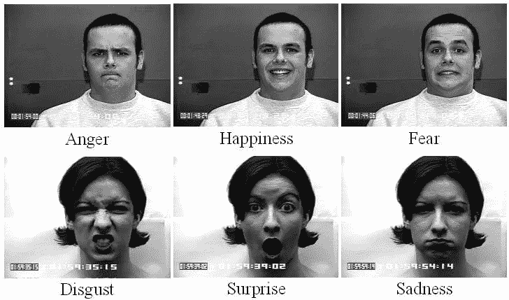

# 监督机器学习

> 原文：<https://medium.com/analytics-vidhya/supervised-machine-learning-a458b606078b?source=collection_archive---------16----------------------->

机器学习是一种不用为机器显式编程就能教会机器的方法。它从过去的经验中学习，并给我们想要的输出。

*学习的类型:*监督学习，无监督学习，半监督学习，强化学习。

**监督学习:**监督学习的概念依赖于被标记的数据。收集的数据被标记，以便我们知道什么输入需要映射到什么输出。带标签的数据集同时具有输入和输出参数。如果我们在答案或输出中犯了任何错误，它会帮助我们纠正算法。监督学习可以对新的未知数据做出新的预测。

数学上，监督学习可以表示为线性函数，即 *y=f(x)，*其中 x 为输入，y 为输出。

来源:谷歌

例 1:在上图中，我们可以看到一个人的不同表情，这些表情有愤怒、快乐、恐惧、厌恶、惊讶、悲伤等标签。监督学习可用于基于表达式对图像进行分类，并且一旦模型被训练，它可用于预测新数据集的输出。

例 2:监督学习可以帮助我们预测房价。如果我们买了一栋每平方英尺 2000 卢比的房子，你想预测 2021 年房子的价格(每平方英尺)。房地产价格上涨了 30 卢比。每年 1000。数据就在你身边，创建一个模型并在你的训练数据集上训练它。该数据集将包含价格和年份等数据，其标签将为“价格”和“年份”。模型知道房子的价格增加了卢比。每平方英尺 1000，从模式和训练数据集学习，它会预测房子的价格。

*监督学习的类型:*分类和回归

分类预测数据所属的类别。例如:垃圾邮件检测、性别、情感分析。

回归预测基于以前观察到的数据的数值。例子:房价预测，股价预测，身高体重预测。

*分类算法:*朴素贝叶斯分类、K 近邻、Logistic 回归、支持向量机、决策树、随机森林、神经网络。

*回归算法*:线性回归、多元回归、套索回归、岭回归

*监督学习的优势:*

1.  它用于从已知数据集中预测一个值。
2.  完全控制在我们的训练数据中选择我们想要的类的数量。
3.  经验有助于优化算法的性能。
4.  标记数据为我们提供了每个定义的类的清晰图像。
5.  结果更加准确。
6.  它使用引导学习作为一种学习方法。

*监督学习的缺点:*

1.  无法处理机器学习中的复杂任务。
2.  学习方法无法处理大量数据，机器必须从训练数据中学习。
3.  计算需要很多时间。
4.  如果输入不属于训练数据中的任何类，结果可能会有所不同，或者分类后可能会显示错误的类标注。
5.  当你训练分类器的时候，我们需要从每个类中选择很多好的例子。
6.  它不能创建自己的标签。这意味着它不能像无监督学习那样自行发现数据。

*监督学习的应用:*

1.  股票市场预测
2.  生物测定学
3.  语音识别
4.  搜索历史优化
5.  垃圾邮件检测
6.  欺诈检测
7.  图像分类