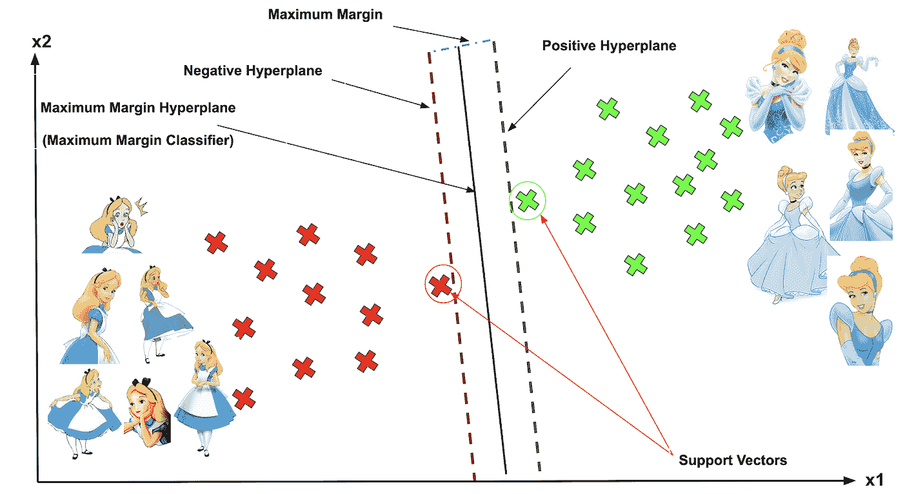
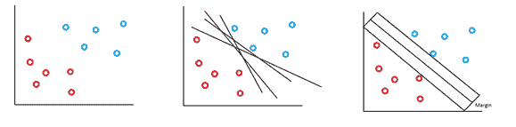
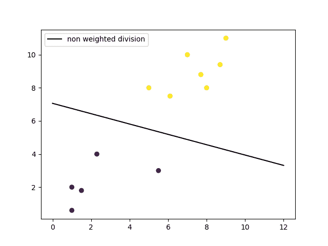
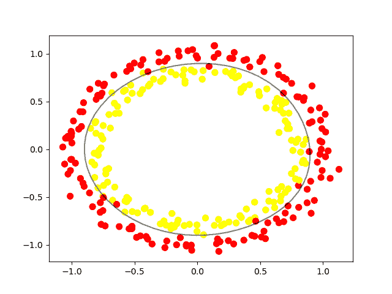
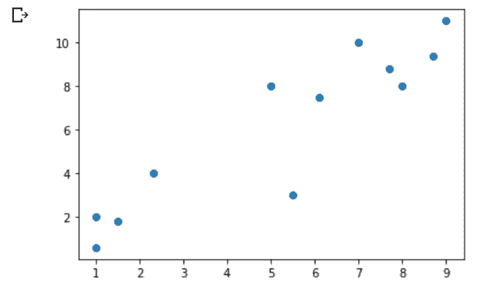
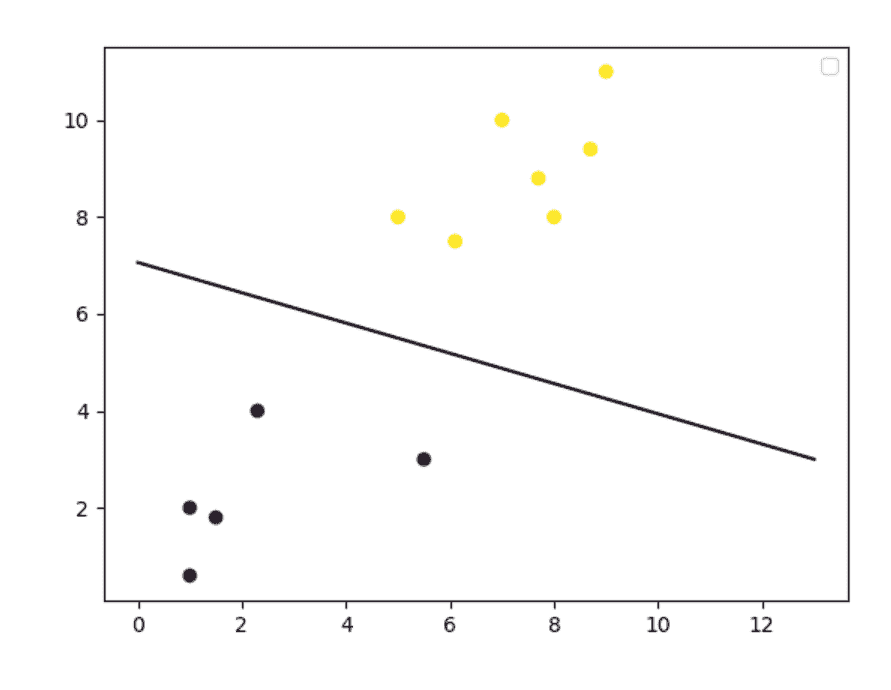

# 监督最大似然算法:支持向量机(SVM)

> 原文：<https://medium.com/analytics-vidhya/supervised-ml-algorithm-support-vector-machines-svm-fb674430ab74?source=collection_archive---------9----------------------->

## 对 SVM(一种用于分类、回归问题和异常值检测的 ML 算法)的介绍和详细解释。

图片由克莱尔·刘在 [kdnuggets](https://www.kdnuggets.com/2020/03/machine-learning-algorithm-svm-explained.html) 上提供

在监督学习算法中，标签被给予数据点(即，将数据点与其类别配对)。换句话说，模型是用类标签来监督的。而在无监督学习算法中，标签不被给予数据点，模型试图通过将一个数据点与其他数据点进行比较来找到类别标签，并将相似的数据点标记为相同的类别，等等。换句话说，模型没有被明确地监督。

支持向量机(SVM)是一种流行的监督机器学习算法，用于分类问题、回归问题和离群点检测。简而言之，当所有数据点都绘制在 n 维空间中时(维度是根据数据集中的特征数量决定的)，则存在许多可以分隔两个类别的超平面，因此在 SVM，具有最大间隔值来分隔这两个类别的超平面被用作决策边界线。

## **目录:**

1.  SVM 的解释——SVM 如何工作，潜在的假设，SVM 的类型
2.  优点和缺点
3.  应用—最佳和最差情况
4.  特征工程/特征转换
5.  时间和空间复杂性
6.  用 Python/sklearn 实现 SVM
7.  结论

# SVM 解释

## SVM 是如何运作的？

一个简单的线性 SVM 分类器的工作原理是在两个类之间画一条直线。这意味着线一侧的所有数据点将代表一个类别，线另一侧的数据点将放入不同的类别。这意味着可以有无限多的行可供选择。

线性 SVM 算法优于其他一些算法(如 k-最近邻算法)的地方在于，它会选择最佳的线来对数据点进行分类。它选择分隔数据的线，并且尽可能远离最近的数据点。

图片由 P. Lopez 在[quandare](https://quantdare.com/svm-versus-a-monkey/)上提供

您正在尝试将这些数据点按照它们应该属于的类别进行分类，但是您不希望有任何数据属于错误的类别。这意味着您试图找到两个最近点之间的线，该线将其他数据点分开。因此，两个最接近的数据点给你的支持向量，你将用来找到那条线。这条线被称为决策边界。

米莱西亚·麦格雷戈在 [FreeCodeCamp](https://www.freecodecamp.org/news/svm-machine-learning-tutorial-what-is-the-support-vector-machine-algorithm-explained-with-code-examples/) 上的图片

决策边界不一定是一条线。它也被称为超平面，因为您可以找到任意数量的特征的决策边界，而不仅仅是两个。(内核 SVM)

米莱西亚·麦格雷戈在[自由代码营](https://www.freecodecamp.org/news/svm-machine-learning-tutorial-what-is-the-support-vector-machine-algorithm-explained-with-code-examples/)上的图片

## 基本假设

在线性 SVM 中，假设数据是线性可分的(完全或几乎)。这可能会给不可线性分离的数据带来问题，因此使用了内核 SVM。

## 支持向量机类型

有两种不同类型的支持向量机，分别用于不同的用途:

*   **简单 SVM** :通常用于线性回归和分类问题。
*   **内核 SVM** :对非线性数据有更大的灵活性，因为你可以添加更多的特性来适应超平面，而不是二维空间。

# 优势

*   SVM 对具有多种特征的数据集有效，例如金融或医疗类型的数据集。
*   这在特征的数量大于数据点的数量的情况下是有效的。
*   它使用支持向量的概念(意味着它在决策函数中使用训练点的子集——支持向量),这使它的记忆效率更高。
*   不同的核可以用于决策函数，它可以被指定或定制。

# 不足之处

*   比数据点数量更多的特征会导致模型过度拟合。为了避免过拟合，在选择核函数和正则项的值时会有一个问题。
*   SVM 没有提供属于某一特定阶层的概率。因此，模型的可解释性是不可能的。为了计算概率，5 重交叉验证技术是昂贵的。
*   由于训练时间长，它最适用于小数据集。

# 应用程序

支持向量机用于手写识别、入侵检测、人脸检测、电子邮件分类、基因分类和网页等应用中。这也是我们在机器学习中使用支持向量机的原因之一。它可以处理线性和非线性数据的分类和回归。

我们使用支持向量机的另一个原因是，它们可以发现数据之间的复杂关系，而无需您自己进行大量转换。如前所述，当您处理具有数万到数十万个要素的较小数据集时，这是一个很好的选择。与其他算法相比，它们通常会找到更准确的结果，因为它们能够处理小型复杂的数据集。

这里，最好的情况可以通过选择正确的内核来实现，最坏的情况是当数据点的数量很大时，因为这将导致更多的训练时间，因此低延迟应用是不可能的。

# 特征工程/特征转换

它可以通过内核化的形式来实现。因为内核 SVM 可以很好地处理非线性数据。因此，选择正确的内核非常重要。

# 时间和空间复杂性

对于运行 SVM，空间和时间复杂度相对于支持向量的数量是线性的。

SVM 的训练可以任意长，这取决于几十个参数:

*   c 参数-错误分类惩罚越大，过程越慢
*   内核—内核越复杂，过程越慢(RBF 内核是预定义内核中最复杂的)
*   数据大小/维度—同样的规则

# 用 Python 实现 SVM(sk learn)

首先，导入所需的库并创建一个虚拟数据集；

作者代码

我们使用 NumPy 数组的原因是为了使矩阵运算更快，因为它们比 Python 列表使用更少的内存。您还可以利用键入数组内容的优势。现在让我们看看数据在图中的样子:

作者代码

作者图片

现在，

作者代码

现在我们可以使用线性核来创建 SVM 模型。

作者代码

这一行代码就创造了一个完整的机器学习模型。现在我们只需要用我们预处理过的数据来训练它。

作者代码

这就是你如何为任何机器学习项目建立模型。我们拥有的数据集可能很小，但如果你遇到一个可以用线性边界分类的真实世界数据集，这个模型仍然有效。

训练好模型后，您可以预测新数据点将如何分类，并绘制决策边界图。让我们画出决策边界。

作者代码

作者图片

对于非线性数据，将参数(内核)的值更改为“rbf”。

# 结论

Radhika Kunchhal 在 [Analytics Vidhya](https://www.analyticsvidhya.com/blog/2020/10/the-mathematics-behind-svm/) 上发布的图片

## 参考

*   [https://www . freecodecamp . org/news/SVM-machine-learning-tutorial-what-is-the-support-vector-machine-algorithm-explained-with-code-examples/](https://www.freecodecamp.org/news/svm-machine-learning-tutorial-what-is-the-support-vector-machine-algorithm-explained-with-code-examples/)
*   [https://www . analyticsvidhya . com/blog/2017/09/understanding-support-vector-machine-example-code/#:~:text = % E2 % 80% 9c support %20 vector % 20 machine % E2 % 80% 9D % 20(SVM，多为% 20used % 20in %分类% 20 问题。&text = The % 20 SVM % 20 分类器%20is%20a，hyper%2Dplane%2F%20line)](https://www.analyticsvidhya.com/blog/2017/09/understaing-support-vector-machine-example-code/#:~:text=%E2%80%9CSupport%20Vector%20Machine%E2%80%9D%20(SVM,mostly%20used%20in%20classification%20problems.&text=The%20SVM%20classifier%20is%20a,hyper%2Dplane%2F%20line)) 。
*   [https://www/applied ai course . com/lecture/11/applied-machine-learning-online-course/3047/geometric-intu tion/4/module-4-machine-learning-ii-supervised-learning-models](https://www.appliedaicourse.com/lecture/11/applied-machine-learning-online-course/3047/geometric-intution/4/module-4-machine-learning-ii-supervised-learning-models)

如果有任何更正和改进的范围，或者如果你有任何疑问，让我在 rajvishah2309@gmail.com 或在评论中知道。

想了解我:去 https://github.com/rajviishah 或 https://www.linkedin.com/in/rajviishah/看看[。](https://github.com/rajviishah)