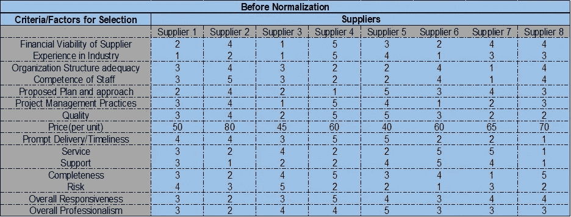
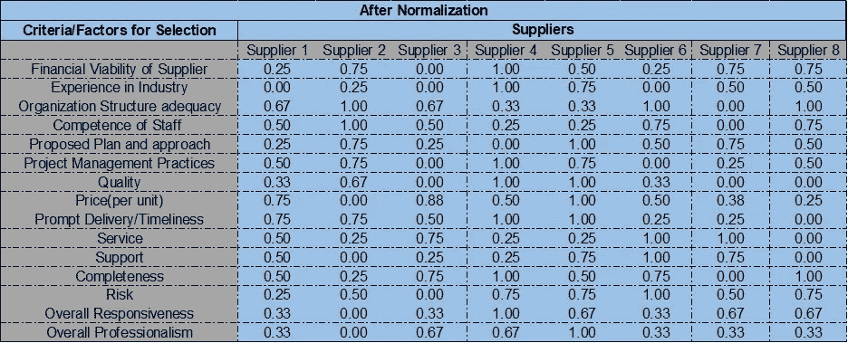
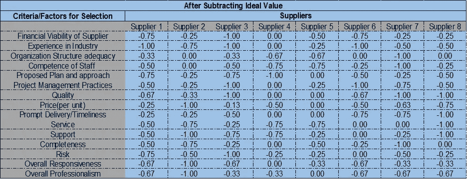
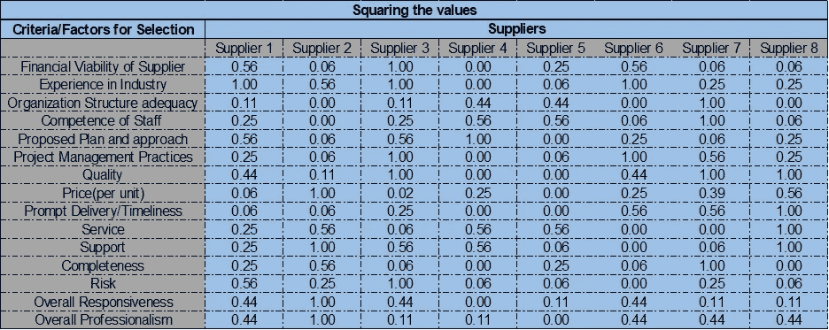
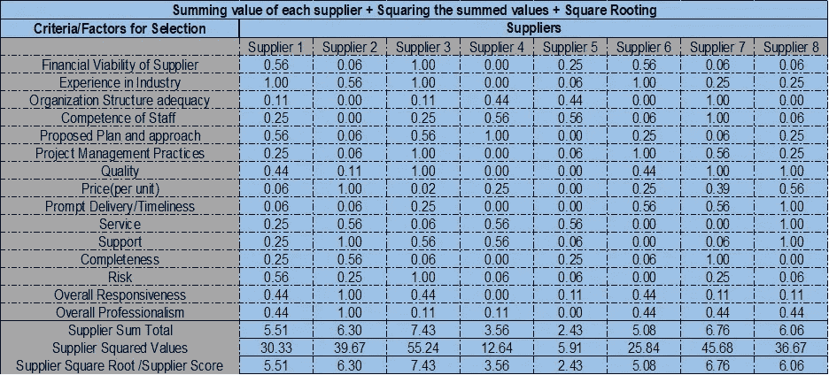
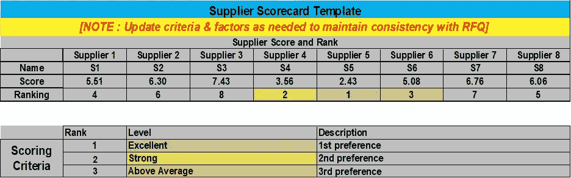

# 供应链——供应商选择和评分模型

> 原文：<https://medium.com/analytics-vidhya/supply-chain-supplier-selection-scoring-model-9809ada63de2?source=collection_archive---------11----------------------->

毫无疑问，供应链是从需求预测开始的，但是在预测之后，大多数组织面临的首要问题是供应，其中供应商就成了焦点。

下面我将详细介绍一种创建供应商记分卡的最简单方法，该方法基于优化技术(最小化方法或最大化方法)。

该方法评估您与理想点的距离(根据标准化输入值选择的随机数，在本例中为 1)，并选择最接近理想点的供应商。

接下来，我会向你解释整个过程。

首先，让我们考虑一下组织在对供应商评分时考虑的几个因素。

以下几点是指示性的，清单是详尽的。因此，您可以随时根据组织的需求对其进行定制。

因素

1.供应商的财务可行性

2.行业经验

3.组织结构

4.员工的能力

5.拟议的计划和方法

6.项目管理实践

7.质量

8.价格

9.迅速交货/及时性

10.服务

11.支持

12.完全

13.风险

14.整体响应度

15.整体专业性

这里让我们考虑总共 8 个供应商，哪个组织的目标是选择一个最佳供应商。

组织已经确定了 15 个以上的供应商入围标准。

第一步

供应商必须根据每项标准给自己打分。

每个因素必须按照 1 到 5 的等级来评定，1 是最不有利的，5 是最有利的，但价格除外，其中提到了每单位的实际报价。

供应商对所有因素给出的评级是基于 RFP 中对每个因素概述的条款和条件。

评级详述如下:

优秀— 5 分

强-4

高于平均水平— 3

平均值— 2

低于平均水平— 1

下表描述了给定的评级:

供应商矩阵—1 级

第二步

根据可遵循的最小化方法和最大化方法对这些因素进行分类。

价格和风险应遵循最小化方法。其余因素应遵循最大化方法。

第三步

价格不能用 1 到 5 来评分，而其他因素用 1 到 5 来评分。

与所有标准/因素相关的填充数据应标准化。

价格和风险将遵循最小化方法。其余人将遵循最大化方法。

下面是标准化的公式描述:

对于最小化:(Hj — Fij ) / ( Hj — Lj)

为了最大化:(Fij — Lj ) / ( Hj — Lj)

由于价格目标是最小化，因此，我们考虑:

对于最小化:(Hj — Fij ) / ( Hj — Lj)

其中 Hi —价格(单位)单元格中的最高值，即本例中的 80。

Lj —价格(单位)单元格中的最低值，即本例中的 40

(Hj — Lj)是范围。

Fij —价格(单位)单元格中的当前值(具体到我们所指的价格(单位)单元格)

《出埃及记》—范围=(Hj—Lj)= 80–40 = 40

对于第一价格(每单位)单元格，值为 50。因此，我们的计算变成:

(80–50)/(80–40) = 30/40 = 0.75

用标准化值填充所有单元格，我们得到下表:

供应商矩阵—第 2 级

第四步

将理想值视为 1，从每个单元格值中减去 1。

下表变成了:

供应商矩阵—第 3 级

第五步

对每个单元格中的值求平方。(这一切都是为了向欧几里德距离靠拢)

下表变成了:

供应商矩阵—第 4 级

第六步

对供应商的每一列求和，然后对求和值求平方。

取总和的平方根，得到单个供应商的分数。

根据得分从最小到最大对供应商进行排名。

得分最低的被认为是排名 1 的供应商。

平方根分数最小的供应商排名为 1，因为其目的是最小化与理想点 1 的距离。

供应商矩阵—第 5 级

带有平方根分数和供应商排名的最终表格如下所示。

供应商记分卡

您可以根据自己的需求定制。