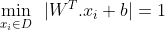
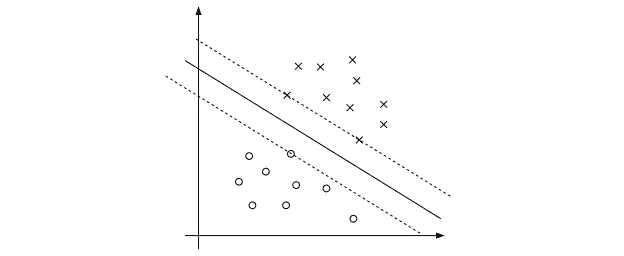

# 支持向量机——直觉的数学验证

> 原文：<https://medium.com/analytics-vidhya/support-vector-machine-intuition-validate-with-maths-e10fb8cc7f57?source=collection_archive---------6----------------------->

来源:[图片](https://cdn.jvejournals.com/articles/18120/xml/img2.jpg)

> *“丰富的数据普遍贬低算法的重要性”。但是我们并不总是拥有富足的生活。因此，我们需要很好地了解所有的工具，并对它们的适用性有一个直观的感觉。这篇文章旨在解释这样一个工具，**支持向量机**。*

支持向量机(SVM)是一套有监督的学习方法；用于回归、分类。不像其他学习方法；SVM 试图使用来自给定训练数据的一些数据样本来拟合最佳决策边界或超平面，这些数据样本被称为支持向量。超平面是指 p 维空间中 p-1 维的平坦仿射子空间；在机器学习术语中，p 是特征。

如果一个**数据集是线性可分的，那么就有无限多个可分的超平面。现在想到的问题是，什么是最佳分离超平面？其他监督学习方法试图用各自的方式解决；SVM 告诉我们，最好的超平面是最大化到两个类中最近的数据点的距离的超平面。我们说一个**超平面有一个最大的边。****

**利润率是多少？**

Margin 是从超平面到任一类中最近的数据点的距离。在 SVM，我们选择最大化这一利润。

**为什么最大余量最好？**

因此，背后的直观原因是，扩大边界宽度的模型在看不见的数据上更具普遍性。因为决策面附近的点表示非常不确定的分类决策；分类器几乎有 50%的机会做出选择。具有较大裕度的分类器做出的分类决策确定性不低。这给了你一个分类安全裕度:测量中的微小误差不会导致错误分类。

另一个通过构造激发 SVM 的直觉，SVM 分类器坚持在决策边界周围有一个大的余量。与决策超平面相比，如果您必须在类之间放置一个胖分隔符，那么您可以选择将它放在哪里。结果，模型的记忆容量减少了，因此我们期望它正确归纳测试数据的能力增加了。

寻找具有最大裕度的最优超平面；帮助找到它的一些训练数据点被称为支持向量。支持向量决定了超平面的形状。除了支持向量之外，对决定最优决策超平面不起任何作用。就是这样这是对 SVM 的直观解释。

让我们试着用数学来形式化它。定义为一组点的超平面方程，使得

**超平面方程**

来源:[杰瑞米·乔登](https://www.jeremyjordan.me/content/images/2017/06/Screen-Shot-2017-06-20-at-8.52.39-AM.png)

求点到超平面的边；我们将每个训练点投影到平面上，并从中找出最接近的数据点，以最大化余量。例如，如果我们取点 A(即 A 是由点表示的空间中的向量)并将其投影到超平面上的一个点上。现在矢量 A 和 B 之间的距离由矢量加法 的**定律给出为**

因为向量 b 位于平面上，所以它满足平面的方程。所以，

在上图中我们可以看到，γ ⃗is 平行于 w，所以γ变成了，

现在将向量 b 的值放入等式(2)中；那么等式(2)变成，

求解α，我们得到，

由于我们需要计算γ的值，我们可以使用欧几里德距离公式，因此γ的值为

简化上述等式后，我们得到:

我们可以写出一个更一般化的方程，

差额方程式

在 SVM，我们试图找到 W 和 b 的最大值，使得这个裕度(γ)值最小。

因为超平面是尺度不变的，所以为了方便起见，我们可以缩放 W 和 b，

那么，目标函数就变成了；

在第二个约束中进行一些操作后，我们可以最终确定目标函数**为:**

**SVM 目标函数**

我们可以将目标函数解释为最优超平面是这样的，即所有的输入都位于离正确侧的超平面至少一个单位处。那些在边缘平面上的叫做支持向量。

来源:[杰瑞米·乔登](https://www.jeremyjordan.me/content/images/2017/06/Screen-Shot-2017-06-20-at-2.18.24-PM.png)

我希望这篇博客有助于理解 SVM 分类器背后的工作。请在下面写下您的想法、反馈或建议。谢谢大家！

进一步探索的有用链接:

*   [基里安·温伯格的演讲](https://www.youtube.com/watch?v=xpHQ6UhMlx4&list=PLl8OlHZGYOQ7bkVbuRthEsaLr7bONzbXS&index=14&t=740s)
*   [学习:帕特里克·温斯顿的支持向量机](https://www.youtube.com/watch?v=_PwhiWxHK8o&t=409s&ab_channel=MITOpenCourseWare)
*   [sude shna Sarkar 的支持向量机简介](https://www.youtube.com/watch?v=gidJbK1gXmA&list=PLJ5C_6qdAvBGaabKHmVbtryZW9KpICiHC&index=24)