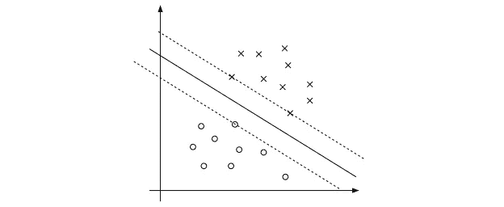
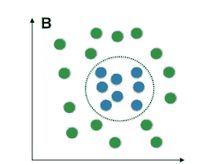
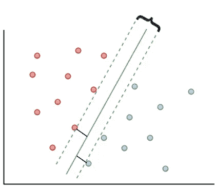

# 支持向量机深度直觉第一部分(基本直觉)

> 原文：<https://medium.com/analytics-vidhya/support-vector-machines-deep-intuition-part-i-basic-intuition-3b21d841210b?source=collection_archive---------7----------------------->

在深入研究支持向量机之前，你需要知道什么是分类和回归。为了认识他们，度过了这个[。](https://iamvishnu-varapally.medium.com/a-brief-introduction-to-machine-learning-learners-at-medium-level-4a3d91200b60?sk=f211c648bde50546928f078c90f82fb7)

这里，我们不讨论任何数学，我们将在这篇文章的第二部分和第三部分讨论它。不要停下来，如果你没有得到任何概念，读两遍理解，因为我解释了一切在一个简单的方式。

逻辑回归和支持向量机有很多相似之处。如果你不了解逻辑回归。先进行逻辑回归。

支持向量机用于解决分类和回归问题。

支持向量机也用于异常值检测。

注意，SVMs(支持向量机)对于处理复杂但小型和中型的训练数据集是很好的。

支持向量机被设计为只处理二进制数据。但是我们可以用 OneVsOne 和 oneVsRest 策略把它做成多类分类。

所以现在，在进入细节之前，你需要知道一些事情。

1.  **线性可分 Vs 线性不可分数据** :-线性可分数据是如图所示容易被分割的数据。

让我们考虑一下，你的训练数据由两列组成，输出变量有两类。在上面的图像中，x 轴代表一列，y 轴代表另一列，当我们在二维平面中绘制点时，+号数据点代表一个类，带圈的点代表数据标签中的另一个类。正如我们所看到的，数据可以用一条粗线分开(现在不用关心平行于粗线的虚线)。但是，真实世界的数据不会是这样的。让我给你看另一种数据。

通常，上述数据类似于实时数据。

在上图中，绿色和蓝色的球代表 2 个类别的类别标签。上述数据不是线性可分离数据，因为数据不能像线性可分离数据那样精确地用直线或曲线分离。

现在，我要说一些需要记住的东西，这些术语我们可以用更好的方式来表达。

让我给你看一张照片，

在上图中，粗直线称为超平面，平行线称为边缘线，接触边缘线的数据点(红色和蓝色球代表 2 类输出标签)称为支持向量，两条边缘线之间的距离称为边缘距离。

你可能会问知道这些有什么用，这些是我们现在要深入讨论的支持向量机的组成部分。我们会检查所有的东西，别担心。

上图中，如果超平面是在没有那些边缘线的情况下形成的，那么这就是简单的逻辑回归。如果没有边缘线，超平面将被选择为与逻辑回归中相同(接近所有点)。但是在这里，我们将有目的的边缘线，这使得支持向量机是独特的。

现在，让我们了解如何从许多超平面中选择超平面，以及如何绘制边缘线&其目的:-

假设我们拥有的数据是线性可分的数据。

1.  让我们假设你刚刚创建了一个超平面，没有考虑边距。
2.  然后，超平面将以这样的方式定向，即它接近我们训练数据集中的一些点，就像线性和逻辑回归中一样。
3.  然后，测试数据(或)新数据有可能位于超平面的错误一侧，即使新点接近正确类别的训练样本。
4.  但是，当我们以这样一种方式创建超平面时，数据点是远的，那么即使新数据比训练点更接近错误的类，它仍然会位于超平面的正确一侧(大约)。
5.  为了选择远离数据点的超平面，我们要做的是选择离超平面最近的点(这些点将变成支持向量)，然后我们将得到最近点(支持向量)在所有超平面上的投影，该超平面将给出离所有支持向量的距离(垂直距离)的最大和，该超平面将被选为最终超平面。
6.  现在，将通过支持向量并平行于所选超平面绘制边缘线。
7.  注意，有许多超平面将给出良好的精度，但是我们需要以这样的方式选择超平面，使得支持向量和超平面之间的距离最大。

现在，你有一些基本的知识，关于为什么我们有边缘线，超平面将如何被选择，以及如何画边缘线，什么是支持向量等等。

先说非线性数据。为了处理非线性数据，使用了 SVM 核。

简单来说，SVM 核将使我们从较低的维度到较高的维度来看待数据，以这种方式，数据看起来像线性可分的数据，我们可以得到一个超平面。

有不同类型的 SVM 核。,

1.  多项式核。
2.  RBF(径向基函数)核。
3.  sigmoid 内核。

和许多其他人…

这就是结局。

现在，你可以理直气壮地说“我对支持向量机有一个完整的基本直觉”。当然，这并不是支持向量机的终结，为了理解我们讨论的每个概念背后的数学，我们上面讨论的都是支持向量机的基础知识。

不要担心，如果你没有得到任何清晰的概念，在第 2 部分和第 3 部分，我将讨论完整的支持向量机数学，在那里你的概念变得非常清晰。

谢谢&快乐的 Learning✌.

如果少了什么，请从这里联系我。你可以在不同的平台关注我 [LinkedIn](https://www.linkedin.com/in/vishnu-vardhan-varapalli-b6b454150/) ， [Github](https://github.com/VishnuVardhanVarapalli) 和， [medium](https://iamvishnu-varapally.medium.com/) 。