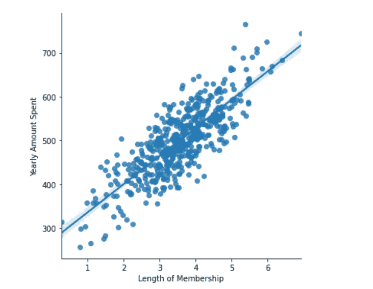
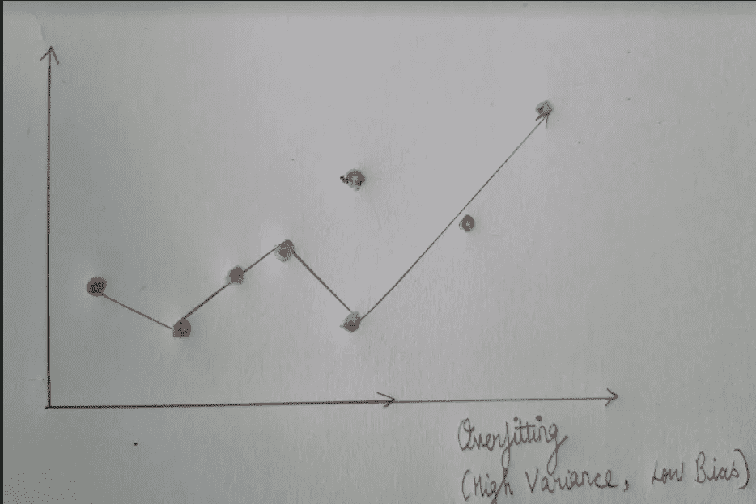
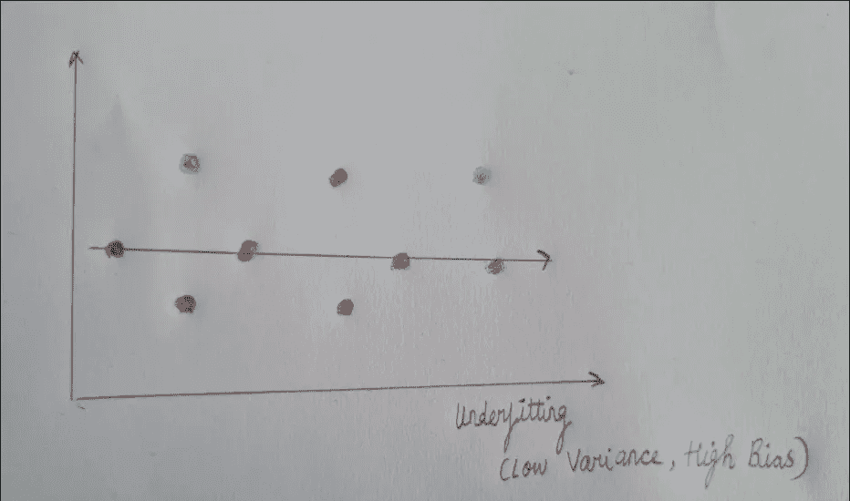
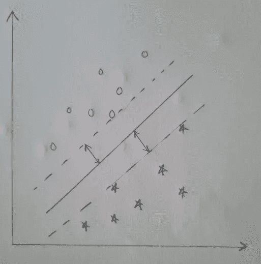
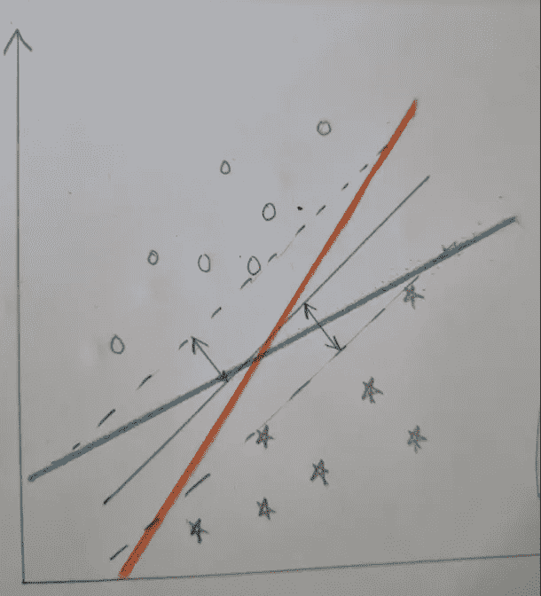
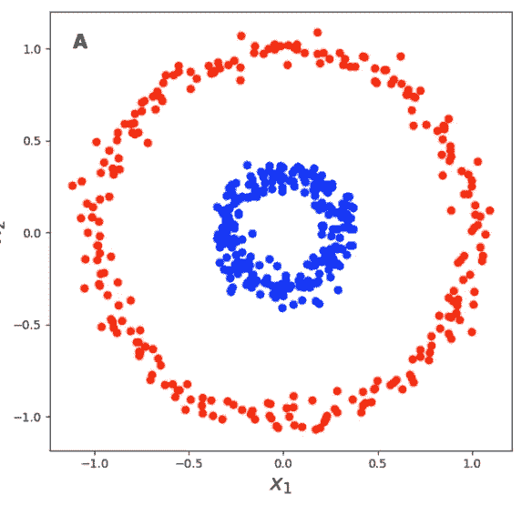
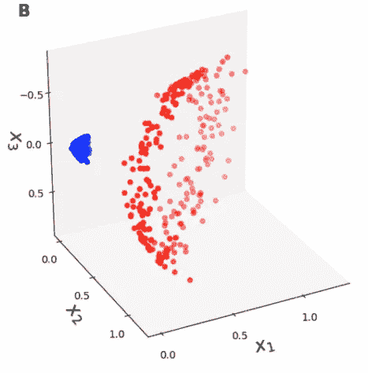
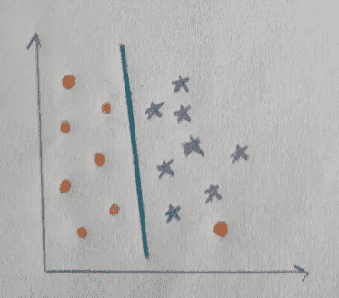
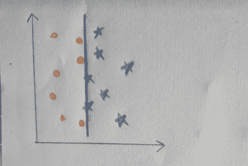

# 从零开始的支持向量机:一种非数学方法

> 原文：<https://medium.com/analytics-vidhya/support-vector-machines-from-scratch-a-non-mathematical-approach-f6527f4e917a?source=collection_archive---------5----------------------->

支持向量机可能是监督学习方法下最常用的训练模型的方法之一。它们可用于二元和多类分类。

虽然训练和拟合你的模型来用代码分类点可能不是一件非常困难的任务——毕竟 **ScikitLearn 的 SVC()** 分类器做得很好。然而，这只有在我们设置超参数 **C 和γ**的值以适应模型的情况下才会发生，这确实在很大程度上取决于你的训练数据是如何分布的。

那么这些超参数到底是什么呢？它们如何帮助获得期望的精度和 f1 分数？这些是我在这篇文章中要讨论的一些事情。这意味着即使是那些对机器学习领域相对较新的人，所以我们将从基础开始讨论一些事情。

涉及的一些主题有:

1.  什么是超参数？
2.  过度拟合与欠拟合的问题
3.  分类问题与回归问题
4.  从头开始支持向量机
5.  非线性可分离数据点
6.  C 和γ的重要性

**什么是超参数？**

让我们举一个简单的例子来理解这一点。假设我们有数据，我们需要训练一个模型来拟合数据并做出未来的预测。经过几次尝试后，我们发现线性回归最适合该模型，它可以很好地适合训练数据，并且还可以以可接受的精度和 f1 分数对测试数据进行预测。为简单起见，让我们假设由模型设计的拟合数据的线表示为

*y = mx+c*

看起来像这样:

一张从我的 Kaggle 笔记本上截取的图片。这些点表示训练数据，并且模型已经绘制了一条线，该线使点和线之间的距离最小化。

这里，参数 m(相关系数)和 c 是由模型基于提供给它的训练数据学习的参数。它们被称为**模型参数。**这些不能由我们事先决定，而是由模型学习，以最适合训练数据。

另一方面，模型超参数是那些我们可以调整的特征。它们是模型外部的那些配置，基于这些特征，模型*被训练*。

这方面的一个例子是支持向量机中的 C 和 gamma 值。当我们探讨这一部分时，您会明白为什么这些会被归类为超参数而不是参数。另一个例子是历元数(数据通过神经网络的次数)。

现在让我们看看经典的偏差方差权衡，有时也被称为过拟合与欠拟合的问题。

过度适应与不足适应:为什么这很重要？

大多数时候，我们的训练数据点并不像上图那样紧密分布。它们模糊地分散在空间中，很难画出一条线，它不仅能很好地拟合训练数据，还能对传入点(测试数据)做出准确的预测。输入偏差-方差权衡。让我用一个例子来说明这一点:

过度拟合的示例(高方差、低偏差)

想象一下，上面显示的这条线是一个经过训练的模型。红点代表训练数据，蓝点代表测试数据。这条线与训练数据拟合得很好，但是因为它的本性是尽可能覆盖最多的训练点(即*过度拟合*训练点)，它自然不会拟合所有的输入点。没有明确定义的线的奇异斜率，它在整个过程中不断变化(因此方差很大)。所以这条线非常适合训练点，代价是不能覆盖所有输入的测试数据。

数据填充不足的线条示例。

此图像给出了一个填充数据不足的线条示例。它会降低覆盖最大数据点的成本，因为特定点可能会落在单一斜率下。据说它具有高的*偏差*(因为它偏向一个方向)和低的*方差*(斜率变化不大)。

那么，你应该用偏差换取方差还是相反呢？答案是没有单一的方法来确定。它取决于数据点的分布以及模型与训练数据的拟合程度，并根据测试数据做出最大程度的正确预测。

**分类问题 vs 回归问题**

在讨论 SVM 的问题之前，区分分类问题和回归问题是很重要的。机器学习算法能够基于一组连续的特征来预测值。这将是一个回归问题。回归问题的一个经典例子是房子的价格，它可以由各种数字因素决定:面积平方。英尺，该地区房屋的平均价格，等等。基于这些特征，算法输出一个价格，它是一个数字。该数字将是一个符合回归线的连续值。

另一类机器学习算法旨在将一个数据点“分类”为两个或多个类别。当类别数为 2 时，称为二元分类问题。这方面的一个例子是根据所用配料的数量将食谱分为纸杯蛋糕或松饼。

支持向量机是主要用于分类数据的数学模型(但是它们也可以用于回归问题)。那么到底什么是 SVM 病呢？让我们看一看。

**从头开始支持向量机**

在这幅图中，我们得到了一组两类点。我们的目标是绘制一个能够最好地区分这两个类的分隔符，并在这两个类之间留出足够宽的**裕度**，这样测试数据点就可以很好地归入这两个类中的一个。

我们的目标是将进入的点分为两类:星形或圆形。

在上图中，虚线代表两个类的**边距**。该算法的目标是绘制一条线(实线),该线与每个类中距离该线最近的点之间的垂直距离最大。为什么最大化是必要的？这是因为，分隔符和最接近它的点之间的边距越大，算法就越容易将测试数据放入这两个类中的一个。

红线和蓝线都可以很好地分隔数据，但是在数据点和分隔符之间没有留下足够宽的空白。SVM 的目标是建立一个两者兼顾的模式。

因此，可能有许多行可以很好地分隔数据。然而，最佳的分隔符应该是不仅将数据点分成两类，而且在两类之间留有足够宽的边距的分隔符。

**非线性可分离数据点**

图片来源:gregorygunderson.com

这是一个两类点的例子，这两类点不能用二维的线性分隔符来分隔。根本不可能画出一条线来很好地区分这两类点。

因此，我们扩展了这种分离的思想来创建一个**超平面。**超平面是位于更高维度的平面，它很好地分离了数据。从下图中可以更容易地看到，如果这些点是用三维而不是二维来表示的，那么可以画出一个平面来将这些点分成两类。

想法是有一个本质上是线性的分离器。如果我们要绘制一个径向分隔符，如上图所示，它将是一个圆形，这将通过添加额外的参数来增加复杂性。

图片来源:gregorygundersen.com

很容易想象一个很好地分割数据点的平面。这种将点从二维空间转换到更高维空间的方法有时也被称为“**内核技巧**

**C 和γ的重要性。**

现在我们对超参数、支持向量机和内核技巧有了一个基本的概念，让我们继续讨论如何在编码时控制超参数 C 和 gamma。

参数 C 和 gamma 是在我们使用 SciKitLearn 的内置 SVC()模块来训练我们的模型时出现的参数。它们被称为超参数，因为我们可以预先设置它们的值，它们决定了如何训练模型。

对于线性可分的数据，超参数 C 起着重要的作用。据说是为了控制误差。让我们看看如何。

在这个图中，我们有一个较低的 C 值，这意味着它更容易出错。正如我们所看到的，模型错误地将其中一个点分类到了错误的类中，代价是增加了两个类之间的差值(高偏差)。

虽然在上图中，模型正确地对所有点进行了分类(不容易出错)，但这是以减少两个类别之间的差距为代价的，这将使测试数据难以分类。

现在来看参数 gamma:如上所述，我们的数据点几乎不总是线性可分的。大多数情况下，它们可以被一条曲线分开，甚至不一定是圆形。在这种情况下，我们将这些点转换到一个更高的维度，从而创建一个分离数据的超平面。

当数据不是线性可分时，参数 gamma 开始起作用。它试图在将数据转换到更高维度之前，将同一维度中的数据分开。它基本上类似于参数 C，并且当点不能被线分开时有效。

C 和γ的最佳值可以通过反复试验来确定，然而这将花费相当长的时间，尽管最常见的 C 值通常被限制在有限的域内。

好在 ScikitLearn 的 sklearn.model_selection。GridSearchCV 为您的数据集确定 C 和 gamma 的最佳值，因此您不必完成这项工作。根据数据集的大小，这可能是一个耗时的过程，但对于提高模型的准确性来说，这是值得的。

希望你能够通过这篇文章掌握一些关于支持向量机的概念。如果是这样，一定要让我知道！