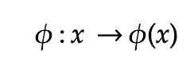

# SVM 如何构建边界？数学解释道。

> 原文：<https://medium.com/analytics-vidhya/support-vector-machines-math-explained-d48c4edb3d4e?source=collection_archive---------6----------------------->

SVM 如何在高维空间中分离数据点背后的数学概念

澳大利亚悉尼海港大桥——我们生活在一个美丽的三维世界里，时间是第四维

1992 年，Vladmir Vapnik 和他的同事在贝尔实验室首次推出了支持向量机。然而，许多人不知道支持向量机的基础知识早在 20 世纪 60 年代他在莫斯科大学的博士论文中就已经得到了发展。几十年来，SVM 一直是许多人的首选，因为它使用较少的计算资源，同时允许数据科学家实现显著的准确性。更不用说它同时解决了分类和回归问题。

## **1。基本概念**

SVM 可以解决线性和非线性问题，并能很好地解决许多实际的商业问题。SVM 的原则思想是直截了当的。学习模型绘制一条线，将数据点分成多个类。在二元问题中，该决策边界采用**最宽街道方法**，最大化到每个类的最近数据点的距离。

在向量演算中，**点积**测量一个向量沿着另一个向量“有多远”,并告诉你在位移方向或另一个向量方向上的力的大小。

例如，我们有未知向量 *u* 和垂直于决策边界的法向量 *w* 。 *w u* 的点积表示 *u* 在矢量 *w* 方向上的力的大小。在这方面，如果未知向量 *u* 位于边界的正侧，则可以用常数 *b* 描述如下。

SVM 基本法则

位于分类正样本的边界之上(+1)或分类负样本的边界之下(-1)的样本可以相应地表示。

## 2.决策规则—约束

确定决策边界后，正边界和负边界的绘制方式应使每组中最接近的样本的宽度最大化，因此这些样本被放置在每组的边界上。

该规则将成为寻找边界最大宽度的约束。鉴于 *y* 对于正样本为+1，对于负样本为-1，上述两个方程都可以通过方程两边的 *y* 相乘来表示正边界或负边界的槽上的样本 *x* 。它们也被称为*支持向量*。[见这里的数学解释。](https://www.mathcha.io/editor/XPgE9hqLS21T87r230UDzpE2xuJYBBk8InJowXV)

SVM 决策规则 1 —约束(边界上的样本)

## 3.决策规则—最大宽度

假设我们在正边界的檐槽上有向量**x*+**，在负边界的檐槽上有向量 *x-* 。*x+* 减去*x-* 代表从负矢量 *x-* 到正矢量 *x+* 的方向力。如果我们用垂直于决策边界的单位向量 *w* 对这个方向力进行点积，那么这就变成了正负边界之间的宽度。注意 *w* 是法向量|| *w* ||是 w 的大小[见这里解释的数学。](https://www.mathcha.io/editor/XPgE9hqLS21T87r230UDzpE2xuJYBBk8InJowXV)***

******

***我们基本上最大化了这个宽度，以区分正负数据点。这可以简化如下。最后一种形式是对 *w* 的幅度取平方，并为了数学上的方便将其除以 2。***

******

***SVM 决策规则 2—最大宽度***

## ***3.约束优化-通过约束找到最大宽度***

*****拉格朗日方程**可用于解决约束优化问题。如果约束改变一个单位，那么目标函数的最大值减少λ。该方程通常用于在给定约束的情况下寻找目标函数的最大值或最小值。***

*   ***L(x，λ) = f(x)- λ g(x)***
*   ****f(x):目标函数****
*   ****g(x):约束****
*   ****λ:拉格朗日****

***前面我们提到过，SVM 采用最宽街道法来寻找正负边界之间的最大宽度。这个问题可以用拉格朗日方程来描述，目标函数和约束条件定义如下。***

******

***目标函数:f(x) —最大宽度***

******

***约束函数:g(x) —边界上的样本***

***总之，拉格朗日函数最小化目标函数(最终最大化正负边界之间的宽度),给定样本是槽上的支持向量的约束。***

******

***用拉格朗日法求最大宽度***

***从上式中找到相对于 *w* 和 *b* 的导数后，可简化如下。由于 *y i* 和 *y j* 是标签或响应变量，因此可以通过**最大化矢量 *x i* 和*x j*的点积来简单地最小化方程。换句话说，宽度的最大化**完全取决于绘制边界线时对支持向量对**的点积求和。*****

******

***此外，根据支持向量 *x* 和 *u* 的点积来确定未知向量 *u* 是否位于决策边界的正侧。***

******

## ***4.内核技巧***

***在线性问题中，SVM 可以很容易地画出一个决策界限，将样本分成多个类别。然而，如果数据点不能用线性切片分离，那么可以在绘制决策边界之前转换数据点，这被称为核技巧。***

******

***在上面的例子中，非线性的 SVM 在用核技巧变换后变成了线性的 SVM 问题。内核基本上**通过使用称为内核的特殊函数进行非线性变换，将问题从输入空间映射到一个新的高维空间(称为特征空间) *(x)*** 。然后使用线性模型来分离特征空间中的数据点。特征空间中的线性模型对应于输入空间中的非线性模型。***

******

***将输入空间(非线性)映射到特征空间(线性)***

***在特征空间中，SVM 基本规则可以表达如下。下面的等式是当 *w* 的大小被替换为 *a，y* 和 *x.* [的线性和时，见这里解释的数学。](https://www.mathcha.io/editor/XPgE9hqLS21T87r230UDzpE2xuJYBBk8InJowXV)使用内核的美妙之处在于原始方程不会改变，因为内核变换是在 phi **𝜙** 中抽象的。***

******

***下面是内核函数的例子。通常，您可以从最简单的转换版本开始，逐步用越来越高级的内核函数建模，以避免过度拟合。***

******

***核函数的例子***

***既然我们已经介绍了 SVM 在绘制边界时如何解决分类问题，我们将在下一篇文章中使用样本数据集构建一个模型。***

****参考文献:****

*   ***[*科内尔讲座:SVM*](http://www.cs.cornell.edu/courses/cs4780/2018fa/lectures/lecturenote09.html)***
*   ***[*麻省理工学院公开课:SVM*](https://www.youtube.com/watch?v=_PwhiWxHK8o)***
*   ***[*SVM(数学):数据科学概念*](https://www.youtube.com/watch?v=bM4_AstaBZo)***
*   ***[*SVM 内核*](https://www.youtube.com/watch?v=tEx-iqUX9Z4)***