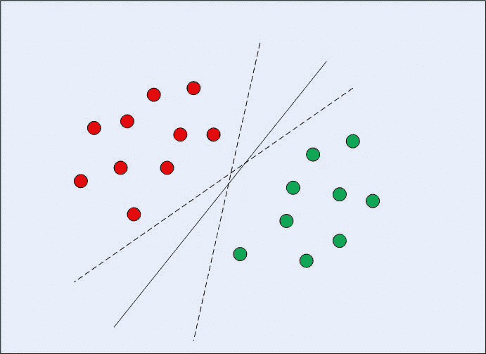
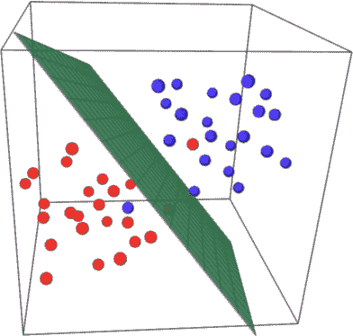
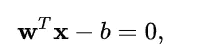
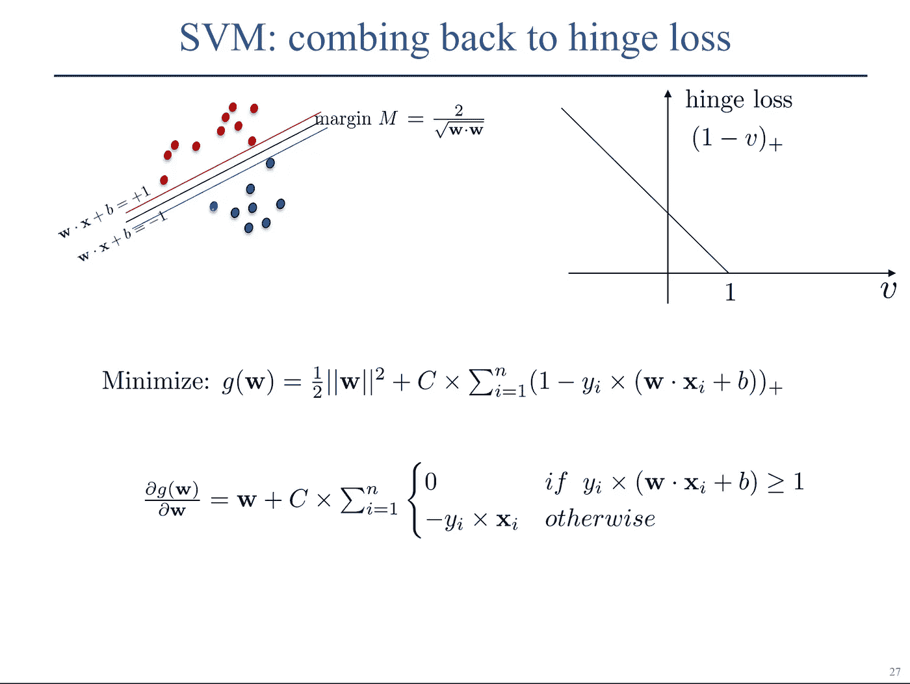
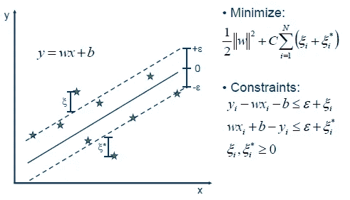

# 支持向量机:SVM

> 原文：<https://medium.com/analytics-vidhya/support-vector-machines-svm-87841ab63b8?source=collection_archive---------12----------------------->

从头开始的完整指南

如果你先了解线性回归和逻辑回归会更好。如果没有，请去探索它们(*你可以参考下面的帮助链接*)。

 [## 线性回归

### 单个和多个因变量

medium.com](/analytics-vidhya/linear-regression-c6625caf9e8e)  [## 逻辑回归:你想知道的一切

### 从头开始完成实施

medium.com](/analytics-vidhya/logistic-regression-all-you-wanna-know-e7938f402663) 

支持向量机是一个非常强大的分类器，可以处理线性和非线性可分数据。它可以用于回归以及分类问题，但主要用于分类问题。

> 支持向量机有许多优点:

*   在高维空间有效。
*   在维数大于样本数的情况下仍然有效。
*   在决策函数中使用训练点的子集(称为支持向量)，因此它也是内存高效的。
*   它是通用的，因为可以为决策函数指定不同的核函数。提供了通用内核，但是也可以指定定制内核。

> SVM 的主要目标是找到 n 个最佳超平面，它们最好地分隔我们的数据，使得空间中最近的点到它自身的距离(也称为余量)最大化。这些最近的点被称为**支持向量**

W 什么是超平面？

超平面是在 *n* 维特征空间中 *n-1* 维的平面，它将两个类分开。对于 2-D 特征空间，它将是一条线，而对于 3-D 特征空间，它将是平面，等等。

2D 空间

三维空间

S 支持向量是更接近超平面并影响超平面的位置和方向的数据点。使用这些支持向量，我们最大化分类器的余量。

# 最大边缘超平面

最佳超平面最好地分离我们的数据，使得空间中最近点(称为支持向量)到其自身的距离/余量最大化。

超平面能够分离类，如果对于所有点-

## w x + b > 0

(对于类别 1 中的数据点)

## w x + b < 0

(对于 0 类数据点)

假设超平面的方程是 w x + b = 0，其中 w 是向量，b 是截距。

我们还希望我们的预测是可信的，这意味着点与平面之间的距离越大，它就越可信，因为值的微小变化不会改变可信点的类别。

## 处理 SVM 的异常值

我们将允许我们的算法在训练样本上犯一些错误。对于每一个错误，都会涉及到一些成本，这些成本将被添加到我们的函数中。

# SVM 背后的数学

> 关键思想是最大限度地扩大差距，即最大限度地扩大最小距离点的距离。

超平面方程

正如我们所看到的，两个边距之间的距离是 2/| | w | |(w 的 L2 范数),必须最大化。因此||w||/2 必须最小化。为了便于计算，我们取范数的平方。

正如我们前面讨论的，这涉及到成本(损失)，称为铰链损失。

类似地，当 yi * (w.xi + b) <1 时，偏置项→ b = b -C X xi，而当该值≥1 时，b 不会更新。

使用这个损失，我们使用学习率和梯度下降得到我们的最终权重和偏差。

w = w-lr *损失

偏差=偏差-lr *损耗

您可以通过查看以下 GitHub 资源库中的代码来理解它。

 [## ads-22/ML-实践

### 在 GitHub 上创建一个帐户，为 ads-22/ML-Practice 开发做贡献。

github.com](https://github.com/ads-22/ML-Practice/blob/main/Task-12%20SVM/SVM.ipynb)