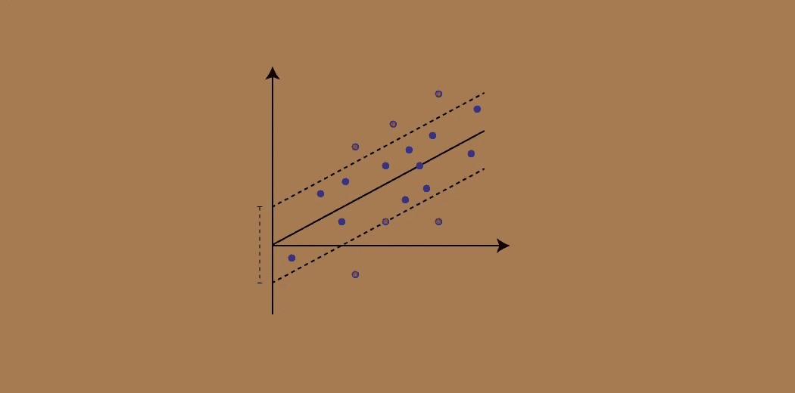

# 使用 Python 支持向量回归

> 原文：<https://medium.com/analytics-vidhya/support-vector-regression-using-python-fdf3ed48f282?source=collection_archive---------6----------------------->



通常，我们大多数人会混淆**支持向量机(SVM)** 和**支持向量回归机(SVR)** 。基本的区别是 SVM 用于分类，支持向量回归用于回归。

SVR 到底是什么？为了理解什么是 SVR，我们将把它与线性回归进行比较。

众所周知，在线性回归中，我们通过数据点绘制直线，然后将数据点垂直投影到回归线上，以找到最小距离。

> 我们将做类似的事情，但不是只画回归线，我们将画一个**管**(你可以看到上面图像中的虚线)。我们不必担心管内或虚线上的点。现在，管外的点，我们将把它们的垂直投影投影到虚线上，而不是管的主轴线上。这将减少我们的错误，我们将有最小的距离。

这种方法被称为**支持向量**，因为管外的点被称为**向量**。

> 我们可以使用不同类型的**核**对非线性数据点进行支持向量回归。

## 内核:

它是我们使用线性回归来解决非线性回归问题的方法。不同类型的内核，

1.  线性的
2.  多项式
3.  高斯径向基函数
4.  指数径向基函数，等等

**最后我会提供一个我的 Kaggle 笔记本的链接！！！**

## 数据:

我们将使用包含葡萄酒质量的红酒数据集。它有 13 列 1599 行。数据集中没有任何缺失值。

链接:[https://www.kaggle.com/piyushgoyal443/red-wine-dataset?select = winequilityreds . CSV](https://www.kaggle.com/piyushgoyal443/red-wine-dataset?select=wineQualityReds.csv)


红酒数据集

## 导入库和数据集:

我们将使用 Numpy、Pandas 和 Scikit-learn 库。导入数据集后，我们将删除数据集的第一列，因为它包含索引，所以我们不需要它。

现在，我们将把数据集分成独立(X)和非独立(y)变量。

```
#importing the libraries 
import numpy as np
import pandas as pd#importing the dataset
dataset = pd.read_csv('Name_of_the_dataset.csv')
# Removing the unnecessary column
dataset.drop(['Unnamed: 0'], axis = 1, inplace = True)# seprating the dataset
X = X = dataset.iloc[:, :-1].values
y = dataset.iloc[:, -1:].values
```

## 将数据集分成训练集和测试集:

我们将使用 scikit-learn 库来分割数据集。训练集包含大部分数据。

```
# Spliting the datdset
from sklearn.model_selection import train_test_split
X_train, X_test, y_train, y_test  = train_test_split(X, y, test_size=0.2, random_state=0)
```

## 特征缩放:

特征缩放指的是将值放在相同的范围或相同的比例中，以便没有一个变量受另一个变量支配。我们不会对测试数据集应用特征缩放。如果列包含虚拟变量(二进制值)，那么我们不会对它们应用特性缩放。

```
from sklearn.preprocessing import StandardScaler
X_sc = StandardScaler()
y_sc = StandardScaler()
X_train = X_sc.fit_transform(X_train)
y_train = y_sc.fit_transform(y_train)
```

## 训练数据集:

我们将使用训练集来训练具有 SVR 模型的数据集。你可以使用所有的内核，看看哪个给你最好的结果。

```
from sklearn.svm import SVR
regrassor = SVR(kernel = 'rbf')
regrassor.fit(X_train, y_train)
```

## 预测结果:

我们必须使用 StandardScaler 类中的 inverse_transform()方法来反转我们的值。

```
y_pred = regrassor.predict(X_sc.transform(X_test))
y_pred = y_sc.inverse_transform(y_pred)
```

## 将预测值和实际值可视化:

```
y_test = y_test.flatten()
df = pd.DataFrame({'Predicted value': y_pred, 'Real Value': y_test})
df
```

Kaggle 笔记本链接:[https://www . ka ggle . com/rahulkadam 0909/sup poer-vector-regression](https://www.kaggle.com/rahulkadam0909/suppoer-vector-regression)

> 编码快乐！！！
> 
> 继续努力吧！！！