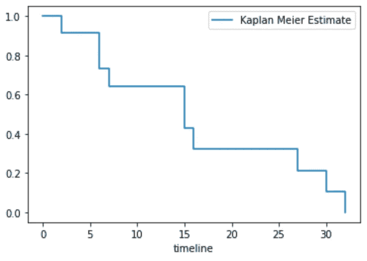

# 存活分析——估计受试者存活的概率

> 原文：<https://medium.com/analytics-vidhya/survival-analysis-probability-of-event-occurring-at-a-certain-time-b79da54abdb3?source=collection_archive---------14----------------------->

存活分析是一种统计技术，最初被开发出来是为了找出不同组群的病人的预期寿命，但近年来该技术允许我们回答一个问题，例如“在一个特定事件发生之前，还有多长时间？”。因此，它也被称为**事件时间分析**，因为它可以帮助我们估计某个事件发生的概率。

## 事件发生时间(T)

生存分析有三个组成部分，它们是:

*   *事件(如客户流失)*
*   *时间起点(如客户开始使用服务)*
*   *事件发生时间(例如，时间起点和事件发生之间的时间差)*

事件发生时间(T)是连续的随机变量，可以用概率密度函数(PDF)或累积分布函数(CDF)来描述。PDF 或 f(t)指定事件在时间 t 发生的概率(见下图)，CDF 或 F(t)是 PDF = 'f(a)到 t '的积分。换句话说，PDF 中面积的累积和达到 t。

概率密度和累积分布函数

## **生存分析**

**生存函数**发现事件在时间 t 之前没有发生的概率(即超过时间 t 的生存概率)，可以描述为:

*   生存函数:S(t) = 1 - F(t) = P(T≥t)

除了生存函数，我们还对事件发生的速率感兴趣，这就是**风险函数**。在 t 时刻幸存的人中，接下来几秒内这些人的死亡率是多少(假设现在还活着)？[见数学解释(1。存活率、风险与 pdf 的关系)。](https://www.mathcha.io/editor/5BwdZSYniVvh6VZzEZhGYNPGKFD2odmLiddOG18)

冒险函数

*   风险、存活率和 pdf 的关系:h(t)= f(t)/S(t)

某人暴露于某一因素，与另一因素相比，其事件发生的概率为**危险比**。这使我们能够比较每个群体暴露于不同因素或条件下的影响差异。

*   危险比(HR): H(t)= h(t|x=a)/h(t|x=b)

## 不同生存模型概述

有一些模型以它们自己的方式描述生存函数，它们是 Kaplan-Meier 模型、指数模型和 Cox 模型。

相同数据集下的 Kaplan-Meier &指数模型

*   **卡普兰-迈耶** **模型**解释简单，可以估计生存函数 S(t)。然而，它不能估计风险比(HR)来比较两个不同的队列，因为它是一个阶梯函数(见上述 K-M 图中的阶梯)。因素或事件变量应为分类类型(如死亡或存活)。
*   **指数模型**可以估计 S(t)和 HR，但假设风险函数 h(t)不变。
*   **Cox 模型**具有随时间波动的风险函数，这意味着它可以描述由于老化等原因导致的事件随时间发生的不同概率。它能估计 HR，但不能估计 S(t)。这有利于队列比较。

## 卡普兰-迈耶模型

K-M 模型也被称为阶梯函数，因为它将函数可视化为“楼梯”,并在统计上将生存函数描述为(Pi 符号将函数的所有结果相乘)

*   这里，ni 表示在时间 t 之前处于危险中的受试者的数量。di 表示在时间 t 感兴趣的事件的数量
*   S(t) = S(t-1)q(t) (q 为当前存活率)

假设你有以下生存数据。我们可以手动计算 t 时刻的生存函数，并使用 python 包*生命线*来可视化它，如下所示。重要的是，我们可以估计 t=15 的中位生存点

*   时间= [2，3，6，6，7，10，15，15，16，27，30，32]
*   死亡(事件)= [1，0，1，1，1，0，1，1，1，1，1，1，1，1]

卡普兰-迈耶模型

## 指数模型

根据[中所解释的数学关系(见第 4 点)](https://www.mathcha.io/editor/5BwdZSYniVvh6VZzEZhGYNPGKFD2odmLiddOG18)，生存函数可相应地描述如下。请注意，风险率在指数模型中是常数，为λ。

在图表“Kaplan-Meier &具有相同数据集的指数模型”的上述指数模型中，λ为 16.9，因此风险率变为 1/16.9=0.05912，这是常数。

## Cox 比例风险模型——比较不同预测因子的效果

cox 模型**通常用于比较协变量(预测因素)对生存曲线**(生存概率函数)的影响，如果我们知道相关的协变量值，这将有助于我们预测个体的生存概率。该模型背后的想法是**个体的对数风险是其静态协变量的线性函数**，是随时间变化的群体水平基线风险。

对数风险是 cox 模型中的线性回归

h0(t)是基线风险函数，它被定义为当所有其他协变量等于零时经历感兴趣事件的概率。b1、b2..是每个协变量或预测值的系数。它是模型中唯一依赖于时间的组件。在不知道回归中的截距 ln(h0(t))的情况下，该模型仍然可以估计斜率并比较群组。该模型允许风险函数随时间增加/减少，但风险比是成比例的(HR 是常数)。

*   HR = h(t | x =男性)/h(t | x =女性)=2(任何时间点的常数)

## **示例:客户流失**

在本节中，cox 模型使用 IBM 的客户流失数据集进行训练。在这种情况下，事件是客户流失，列任期被视为时间跨度。请注意，在下面的代码中，我将数据集中的分类值转换为二进制值。

## Cox 模型—绘制系数

使用上述拟合模型，查看系数及其范围的另一种方法是使用绘图法。在剧情中，这里发现了一些有趣的点。

*   性别在预测客户流失方面没有起到关键作用(几乎没有影响)
*   月费的β值看似微不足道，但实际上它的范围很广，因此相乘将产生巨大的差异

## 考克斯模型——绘制协变量变化的影响

拟合模型后，我们可以绘制出当其他因素不变时，单个协变量发生变化时的生存曲线。在给定模型的情况下，这有助于理解协变量的影响。为此，我们使用 plot _ partial _ effects _ on _ outcome()方法，并为其提供感兴趣的协变量以及要显示的值。

该图比较了客户是否拥有流媒体电视对流失的影响。您可以看到使用 StreamingTV (StreamingTV_Yes=1)的客户流失率较低。

## Cox 模型——预测样本的生存函数

拟合模型可以通过将预测值作为一行提供给模型来估计样本的生存函数。下图显示了客户 5 到 10 的流失率。

## 对数秩检验— **比较两个样本组**

该检验通常用于使用假设检验比较两个不同队列的存活分布。

*   目标—发现各组之间是否有显著差异
*   零假设——各组之间没有显著差异

在零假设的情况下，如果我们获得了足够的证据来显示组间的显著差异，那么我们必须拒绝零假设。通常，在计算事件的 p 值后，我们将该值与显著性水平进行比较，显著性水平通常为 0.05 (5%)。**如果 p 值低于显著性水平，那么我们认为该事件极少发生 1 型错误(假阳性)，甚至可以拒绝零假设**。

假设我们有如下的术前或术后接受化疗的生命表。

*   n:群体中风险的数量
*   o:观察到的事件数量
*   e:预期的团体项目数

请注意，当只有一个事件发生时，第 1 组中处于危险中的数字从 10 变为 8，因为有一个经审查的病例(即在观察时间内没有事件的情况下完成病例)。

为了计算检验统计量，我们需要在每个事件时间(例如时间月)观察到的和预期的事件数量。观察到的事件数(O)来自样本，预期的事件数(E)是在假设零假设为真的情况下计算的(即存活曲线是相同的)。

例如，在时间 14，如果组间没有差异(零假设)，则无论组如何，所有受试者发生事件的概率都是 1/17 (O/N)。给定该概率，将每组中处于危险中的人数相乘，得到预期的事件数，7(1/17)=0.444，10(1/17)=0.556。如果总共有 2 个事件发生，那么应该乘以 2/17。

在计算出所有预期事件数(E)后，我们可以计算检验统计量，并在卡方表中与临界值(x)进行比较(因为对数秩检验是卡方检验的一种)。

x =σ(O-E)/E =(6–2.62)/2.62+(3–6.38)/6.38 = 6.151

对数秩统计量的自由度(df)等于 k-1，其中 k 代表比较组的数量。在本例中，k=2，因此检验统计量有 1 个自由度。

鉴于此，我们可以发现临界值为 3.84，显著性水平为 0.05 (5%)。由于测试统计在 0.01 和 0.05 之间(< 5%), we can reject the null hypothesis and say that the observation shows statistical difference between Group 1 and 2.

Survival analysis is the great technique which allows us to find the curve of certain event not occurring over time and compare it with another curve. If the comparison shows statistically significant difference through testing then the cox model allows us to analyse cause of it by seeing performance of a covariate.

Thanks for reading!

*参考:*

*   *我自己讲解的生存方程、风险方程、指数方程、Cox 模型以及它们在* [*的数学关系 https://www . mathcha . io/editor/5 bwdzsynivvh 6 vzzezygynpgkfd 2d odmliddog 18*](https://www.mathcha.io/editor/5BwdZSYniVvh6VZzEZhGYNPGKFD2odmLiddOG18)
*   [*生存 Modelsdata.princeton.edu wws 509 笔记*](https://www.google.com/url?sa=t&rct=j&q=&esrc=s&source=web&cd=&cad=rja&uact=8&ved=2ahUKEwjzvfWlxJ3vAhWxkOYKHT6BBmsQFjABegQIARAD&url=https%3A%2F%2Fdata.princeton.edu%2Fwws509%2Fnotes%2Fc7.pdf&usg=AOvVaw1tCwnI01MR3wUJd8PvM-YW)
*   [*生存分析与 Python 教程*](https://pub.towardsai.net/survival-analysis-with-python-tutorial-how-what-when-and-why-19a5cfb3c312)
*   [*比较生存曲线*](https://sphweb.bumc.bu.edu/otlt/mph-modules/bs/bs704_survival/BS704_Survival5.html)