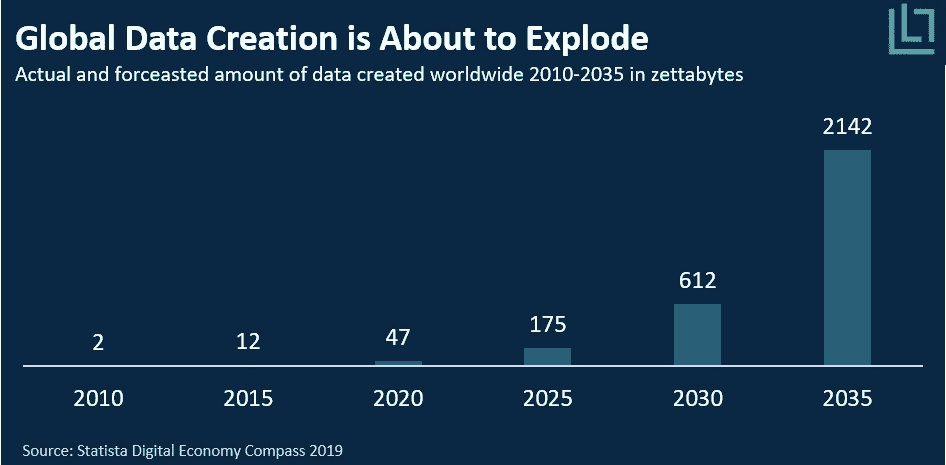
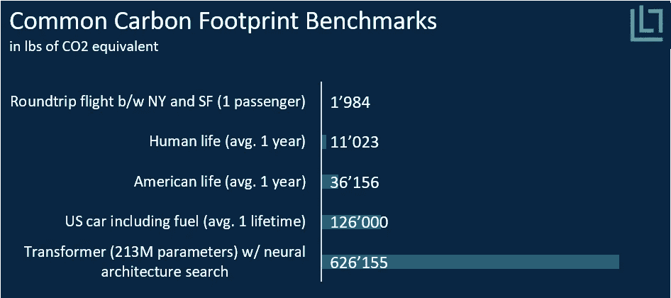
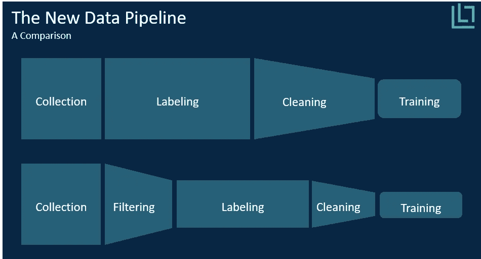
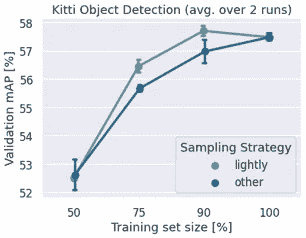

# 可持续人工智能和新的数据管道

> 原文：<https://medium.com/analytics-vidhya/sustainable-ai-and-the-new-data-pipeline-4e95ad44e97c?source=collection_archive---------20----------------------->

## *为什么非结构化数据的增长在当前的数据管道中是不可持续的*

数据，数据，更多的数据。你有问题吗？求数据解答。找不到答案？你只是需要更多的数据，是吗？

自从深度学习越来越受欢迎以来，企业和政府已经收集了尽可能多的数据。人们希望深度学习能够自动化任何事情，并预测其他任何事情，只要提供足够大数量的数据。这种模式带来了收集数据的指数级增长。事实上，正如*图 1* 所示，全球创建的数据量估计每五年增长 200%以上。然而，随着我们的发展，越来越大的数据量的前提条件可能会挑战深度学习的有效性和合法性。

图 1 —数据创建的增长(2010 年至 2035 年)

## 挑战深度学习和可持续人工智能

但是不要误解我的意思。深度学习有过多的[显著的](https://www.nature.com/articles/d41586-020-01128-8)，有时[令人不安的](https://www.theguardian.com/news/2020/oct/15/dangerous-rise-of-military-ai-drone-swarm-autonomous-weapons)应用。事实上，深度学习让自动驾驶、NLP、医疗保健和许多其他领域取得了巨大进步。然而，当前的最大似然算法的可解释性差，并且依赖于大量的数据。以至于[研究](https://arxiv.org/pdf/1906.02243.pdf)显示，由于所需的计算能力，训练模型会产生大量的二氧化碳。正如*图 2* 所示，训练一个相对较大的模型消耗的能量相当于四辆汽车平均寿命消耗的能量。因此，所需数据和计算能力的增长提出了人工智能是否可持续的问题。

图 2 —二氧化碳消耗的基准(自己的图像)

从计算能力开始，深度学习的另一个问题在于新数据的增长，这些数据主要由非结构化数据驱动。然而，经典的深度学习模型需要结构化和标记的数据来训练。然后，问题变成了从非结构化数据中获取结构化数据，这几乎总是需要人工。鉴于这种工作的重复性，大公司会委托发展中国家的廉价劳动力，这取决于劳动条件，可以被视为一种可疑的做法。

此外，假设非结构化数据和一般数据保持同样的增长，到 2030 年，对标签服务的需求将是现在的 13 倍。在其他条件不变的情况下，每个标签的价格会相应增加。换句话说，公司将不得不为越来越多的数据支付越来越高的价格。因此，非结构化数据的预计增长不能仅靠人类劳动来维持。许多公司正在开发新的、劳动强度更小的方法来标记数据，但将人从循环中移除似乎仍然遥不可及。相反，我们应该问问自己，公司是否真的需要所有这些数据。

## 新的数据管道

在当前的数据热潮中，收集高质量和无偏见的数据似乎不是目标。事实上，大多数数据科学家都非常清楚准备或“争论”数据的困难，这占用了他们 80%的时间。鉴于数据科学家的薪水并非微不足道，你可能会奇怪他们为什么花这么多时间在文书工作上。答案不是清理数据很有趣，而是很有必要。事实上，一个模型的表现——无论是准确性、可推广性还是假阴性——只能和它得到的数据一样好。因此，深度学习模型不仅需要大数据，还需要智能数据。相关的、公正的、多样的数据。

为了给他们的模型提供大数据和智能数据，公司首先收集尽可能多的数据，然后外包劳动密集型的标记过程，最后让他们的数据科学家清理数据。然而，目前的序列是非常低效的:事实上，标记发生在清理之前意味着公司要花费大量的金钱来标记他们最终没有使用的数据。然后，通过在贴标过程开始之前识别并去除有偏差、冗余和有噪声的数据，公司可以在整个数据管道中节省资金和时间。

图 3 —数据管道对比(自己的图片)

然而，在标记之前清理数据是困难的。问题是没有标签，人们不知道收集了什么数据。然而，一个相对较新且尚未探索的机器学习分支称为自我监督(或无监督)学习，专门解决这个问题。自监督模型可以从数据中学习模式，而不需要知道基本事实(即标签)。在自我监督学习的众多[优势](https://lightly.ai/post/the-advantage-of-self-supervised-learning)中，识别非结构化数据中的聚类、冗余和偏差是最重要的。事实上，自我监督学习的这一特性可以用来自动清理数据，或者更形象地说，过滤数据。

因此，通过直接处理非结构化数据，公司可以避免标记成本，并让他们的数据科学家更加专注于模型开发。因此，数据过滤对整个数据管道都有积极的影响，并减少了深度学习对环境的影响。

## 一个自我监督学习的案例

为了展示数据过滤的有效性，我们在 KITTI 数据集上应用了轻度 coreset 子采样方法(基于自监督学习), KITTI 数据集是一个众所周知的汽车类对象检测基准。我们将其与随机二次抽样进行比较，后者(令人惊讶地)是目前应用最广泛的方法之一

图 Kitti 数据集上的结果(自己的图像)

过滤非结构化数据的方法。正如在*图 4* 中绘制的结果所示，Lightly 的自我监督子采样方法击败了随机方法。但更有趣的是，我们只利用了 90%的数据集就能训练出一个更好的模型。

总之，非结构化数据的增长目前是不可持续的。从劳动力和计算能力的角度来看，深度学习在伦理上是有问题的，并且不环保。此外，如果不采取行动，这种情况只会恶化。因此，公司必须通过重新思考其当前的数据管道来解决这一问题，并为数据过滤部署自我监督的解决方案。

克里姆，
业务拓展[轻装上阵. ai](https://lightly.ai/)