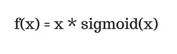
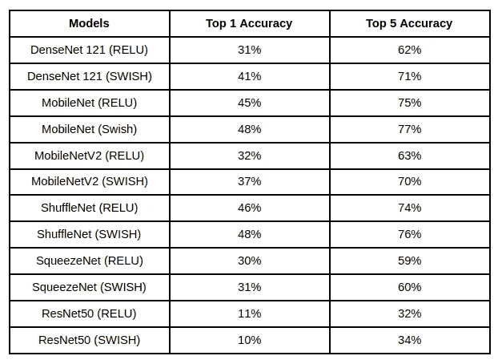
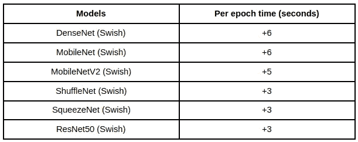

# 在 6 个模型上进行 Swish 功能实验

> 原文：<https://medium.com/analytics-vidhya/swish-function-experimentation-on-6-models-f188da2f9a19?source=collection_archive---------2----------------------->

最近我在我的一个项目中使用了 EfficientNet，它的预测精度比以前训练的模型好得多。我就知道会这样，因为 EfficientNet 是最新的，应该会更好。但是为什么会更好呢？这个问题引起了我很大的兴趣。

所以我对自己说——是时候看看下面了。瞧，在包含复合扩展等功能的新架构下，还有一个新功能——Swish function。

一个新的激活函数。它表示为 x*sigmoid(x)。

Swish 函数

更好的表示方法是——x * sigmoid(b * x ),其中 b 是一个可训练参数。新功能有什么好处？

*   连续函数，不像 RELU 是线性的。
*   避免消失梯度问题。
*   更好地调节梯度流量的可训练参数。
*   解决了垂死的 RELU 问题。

在 EfficientNet 的文章中看到 Swish 函数的使用，我的脑海中出现了一个想法。

# 如果 Relu 换成 Swish 会怎么样？

让实验开始吧。实验中没有使用化学药品，也没有动物受到伤害。

[Bermix 工作室](https://unsplash.com/@bermixstudio?utm_source=medium&utm_medium=referral)在 [Unsplash](https://unsplash.com?utm_source=medium&utm_medium=referral) 拍摄的照片

对于数据，我选择了加州理工学院-加州大学圣迭戈分校鸟类-200–2011。

*   类别数量:200
*   图像数量:11，788
*   分裂:70，20，10

至于型号，我选的是 DenseNet 121，MobileNet，MobileNetV2，ShuffleNet，SqueezeNet，ResNet50。

至于参数，它们保持不变。

*   优化器— Adam
*   批量:32

每个模型从头开始训练 25 个时期，即没有“图像网”权重。首先使用 ReLU，然后再次使用 Swish 替换所有激活功能。

结果是惊人的。改变一个简单的激活函数在准确性上有如此大的差异。(关于 ResNet 模型，在创建它时有一个轻微的卷积错误，因此它的准确性较低，但模型就是模型。)

对照表

## 如果它很好，那为什么不是每个人都在用它呢？

激活函数越大，计算成本越大。

处理时间比较

Swish 函数包含 sigmoid，sigmoid 包含指数函数。与简单的 RELU 函数相比，计算指数值需要时间。这在训练时间上体现的很明显。

纪元时间已经大大增加了。表中的值大约是所有时期的平均值。

深度学习模型都是关于试错。找到模型，微调它，添加更多的数据，重新训练。在所有这些情况下，时间成为一个重要的约束，因此根据用户情况和权衡，必须使用 swish 函数。

此外，上面提到的所有模型都有新的版本，以 Swish 的激活功能发布或为进一步改进而优化。