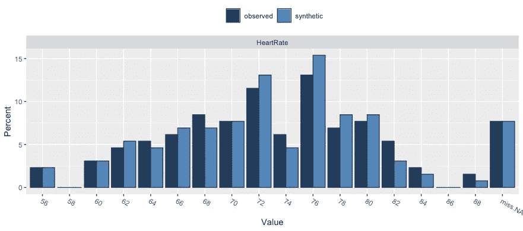
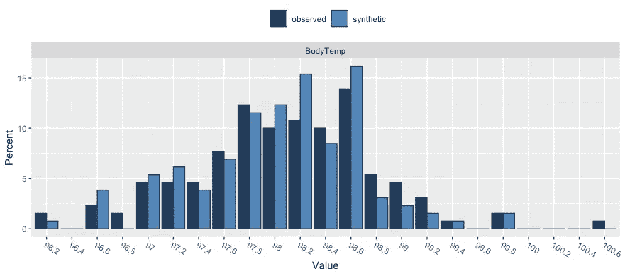
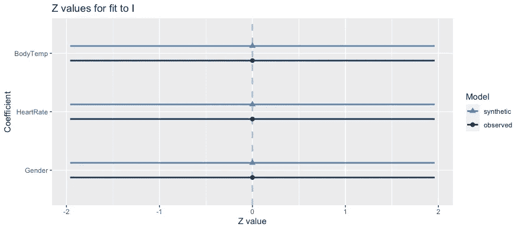

# 综合数据

> 原文：<https://medium.com/analytics-vidhya/synthetic-data-cac594ee268f?source=collection_archive---------17----------------------->

世界上最大的数据问题——安德鲁·迈克菲


# 介绍

每年世界产生的数据都比前一年多。据国际数据公司(International Data Corporation)称，2020 年，[预计将有 59z 字节的数据](https://www.idc.com/getdoc.jsp?containerId=prUS46286020)被“创建、捕获、复制和消费”。

虽然数据在迅速增长，但这并不意味着每个人都可以访问它。公司和组织关心他们的用户隐私。现在新冠肺炎撞击已经导致了研究实验室、组织等的关闭。在无法访问观察到的数据的情况下，很难训练机器学习模型或满足其他行业需求。输入合成数据:“不是通过直接测量获得的适用于给定情况的任何生产数据”——McGraw-Hill。

# 合成数据及其实时用例

## 什么是合成数据？

顾名思义，合成数据**是人为创造的，而不是由真实事件**产生的。它通常是在算法的帮助下制作的，用于广泛的活动，包括新产品和工具的测试数据，模型验证和人工智能模型训练。

合成信息的供应是负担得起的，并且可能支持 AI /深度学习模型开发、软件包测试。数据隐私(即由合成数据实现的信息隐私)是最重要的优势之一。用户信息通常包括可识别的个人数据(PII)和个人健康数据(PHI ),并允许公司在不将用户信息暴露给开发者或软件包工具的情况下创建软件。

## 实时用例

*   **亚马逊**利用合成数据训练 **Alexa 的语言系统**
*   **谷歌的 Waymo** 使用合成数据训练其**自动驾驶汽车**
*   **亚马逊**利用合成图像训练**亚马逊 Go** 视觉识别系统
*   **美国运通**利用合成财务数据**提高欺诈检测能力**
*   **罗氏**利用合成医学数据进行**临床研究**

# 用 R 语言生成合成数据

synthpop 软件包是统计软件 R 的附加软件包，可从综合 R 档案网(CRAN)免费获得。例如，可以通过以下方式从 R 会话内部下载和安装它

```
install.packages("synthpop")
```

一旦安装了 synthpop 包，就需要通过命令将它附加到当前的 R 会话

```
library(synthpop)
```

*为了生成和测试合成数据的效率，使用了实时数据集【1】。*

将数据加载到 R 空间

```
df_observed <- read.csv(file = "/Users/reputation/HeartRate.csv")
```

使用 *syn()，*生成合成数据，其中 m 指定合成数据集的数量。观察到的数据集包含体温、性别、心率作为标签。

```
df_synthetic <- syn(df_original, m = 10, method= "cart", cart.minbucket = 10)
```

compare()可以用来比较 df_observed 和 df_synthetic。这清楚地显示了观察数据和合成数据之间的差异。

```
compare(df_synthetic, df_observed, vars = "HeartRate")
```



图(a) —比较 cart 模式下心率的观察数据和合成数据

```
compare(df_synthetic, df_observed, vars = "BodyTemperature")
```



图(b) —比较推车模式下体温的观察数据和合成数据

通过改变模式，我们可以生成多种模式的合成数据。



图(c)-观察值和合成值之间的 Z 值比较

# 结论

在本文中，我介绍了合成数据的基本重要性以及名为“*synth pop”*的 R 包的功能，该包用于生成包含机密信息的微数据的合成版本。

# 参考

1.  [https://tuva labs . com/datasets/body _ temperature _ sex _ _ heart _ rate/activities](https://tuvalabs.com/datasets/body_temperature_sex__heart_rate/activities)
2.  1.M. S. Santos，R. C. Pereira，A. F. Costa，J. P. Soares，J. Santos 和 P. H.Abreu，“生成合成缺失数据:通过缺失机制进行审查”，载于 IEEE Access，第 7 卷，第 11651-11667 页，2019 年。

> 感谢阅读，祝你好运——Surya Nuchu