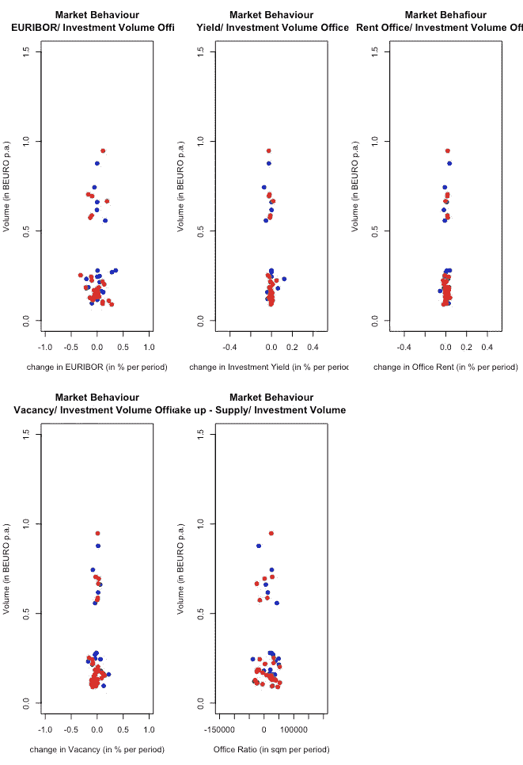

# 合成数据生成

> 原文：<https://medium.com/analytics-vidhya/synthetic-data-generation-43893f91325d?source=collection_archive---------1----------------------->

人工智能最有前途但仍被低估的领域之一是合成数据的创建。

谈到数据分析、数据驱动的决策或在商业、研究或医疗保健中嵌入高度先进的人工智能工具，充足数据可用性的**问题**是一个常见问题。

数据供应不足有不同的**原因**。有

*   可以理解的是**公司不想公开他们的商业数据**，
*   数据简单地有**没有**的**必要的频率或音量**，
*   依法强制执行的**数据保护规则**防止第三方访问私人或敏感数据。

另一个常见的原因是，数据集中感兴趣的变量严重不足。换句话说，没有足够的标签数据来训练模型。

但这些只是原始数据争夺战的部分原因。

与此同时，像神经网络/深度学习环境这样的人工智能工具需要大量数据才能正常工作。

这显然是利益冲突。至少在某种程度上，还有一条出路:合成数据的产生。

合成数据已经发挥重要作用的一些使用案例:

*   亚马逊使用合成数据训练 Alexa 的**语言系统**
*   美国运通使用合成财务数据改进**欺诈检测**
*   罗氏将综合医学数据用于**临床研究**
*   亚马逊再次使用合成图像来训练亚马逊 Go 视觉识别系统
*   谷歌的 Waymo 使用合成数据来训练其**自动驾驶汽车**

# 合成数据—基础知识

合成数据的创建不仅仅意味着对原始数据的复制、重组、匿名或聚合。这还不够。

这种方法的问题是，仍然有可能重新跟踪原始数据，从而再次暴露私人或敏感数据。

相比之下，从分析的角度来看，记录交换、抑制敏感值或添加随机噪声可能会有问题。这样做，数据中的重要信息(如依赖关系、模式等)可能会丢失，并导致错误的分析结果。

这里的**解决方案**是**不关注原始数据库存本身，而是**将注意力转移到最初导致原始数据创建的**过程。**

它是原始数据的**概率近似值**。合成数据的基本思想是通过从适当的分布中取样来代替部分或全部的观察值，从而保留原始数据的**本质统计特征**。

**生成的合成数据**因此**不包含任何原始的、可识别的信息，从这些信息中生成该数据**。同时，它**保留了真实数据**的有效统计属性。

**逆向工程或原始数据**(如医疗保健数据中的真实人物)泄露的风险被认为**不太可能**。

在以下章节中，将讨论生成合成数据的四种不同方法:

*   参数综合方法
*   非参数综合方法/ CART 方法
*   贝叶斯网络
*   生成对抗网络

使用哪种合成方法取决于几个因素，例如数据的数量/频率、原始数据的类型或需要数据的目的。

# **参数综合方法**

这里，想法是通过从适当的概率分布中进行**采样来替换部分或全部原始数据。更具体地说，它意味着获取原始数据的单个输入参数的观察值，并用概率分布对其进行近似。**

就像在这个例子中，在房地产市场中观察到的季度投资量的出现(图的左侧)在统计上由适当的分布(图的右侧)近似:

作者图片

然后，所有的“参数”分布必须相互关联。从技术上来说，这将通过共同分配来实现。

最后，通过模拟创建合成数据点。以下是基于房地产市场不同输入变量组合的一些示例(蓝色…观察数据，红色…模拟数据):

作者图片

这种方法在数据量很小或者观察数据频率很低的情况下特别有效。

# 非参数综合方法

机器学习技术是综合数据的参数方法的替代方法。更有前景的应用之一是基于树的模型。对于**分类和回归树(CART)——模型**来说尤其如此。

CART 方法是一种算法建模方法，可以应用于任何类型的数据。

CART 模型的基本工作原理是递归地将数据分成具有越来越同质的结果的组。通过关于预测值空间的是/否问题进行相应的分割。并且每个最终组中的值近似具有满足定义该组的标准的预测器的单元的预测变量的条件分布。

顺便提一下，这些模型中的相互依赖网格可能会变得太大，很快变得难以管理。为了避免这种情况，定义了联合分布，因此用一系列条件分布来近似表示。

CART 模型的真正优势是能够**自动捕捉** **数据**中的非线性关系和交互效应。

这里有一个简短的例子。

我们综合信用卡投资组合，并应用一个简单的信用评分模型，看看我们是否可以预测信用违约案例。然后，当分别对原始数据和合成数据进行训练时，检验模型的准确性。信用评分模型的基础是逻辑回归。

数据的一些选定参数及其在原始变量和合成变量之间的比较揭示了合成数据如何符合原始数据的分布:

作者图片

多做一点迭代表明，合成数据总是非常接近原始数据。下面是信用卡投资组合的一个输入参数的实例:

作者图片

但是，当我们替换原始数据并用生成的合成数据训练模型时，信用评分模型会保持其行为吗？

用原始数据训练时信用评分模型的性能指标:

按作者分类的表格

相比之下，用生成的合成数据训练的信用评分模型的性能指标:

按作者分类的表格

即使考虑到这是一个简单的模型，性能指标的结果也非常接近！

# 贝叶斯网络

贝叶斯网络是一个**概率图形模型**。它**使用有向无环图(DAG)** 对一组变量的**条件依赖关系进行编码**。

在贝叶斯网络中，每个节点代表数据集中的一个输入变量。并且，一组有向边连接形成网络结构的节点。与每个变量相关联的条件概率集形成了网络的参数集。

下面是一个改进的贝叶斯网络示例，它反映了两个房地产市场中的条件依赖性:

作者图片

换句话说，贝叶斯网络将数据表示为**一个概率图，并根据其结构模拟新的合成数据**。

通过首先从每个根节点(即所有边都从其开始的那些节点，如上图中的“reference_rate”或“yield_other ”)采样来模拟这个新数据。然后，采样由子节点跟随，但以它们的父节点为条件，直到所有节点的数据都被绘制。

同样，原始数据的**统计属性被重新生成，但是**没有**数据本身的复制**。这些网络的一大优势是它们也可以处理较小的数据集。不过，输入的原始数据越多，合成数据就越精确。

另一个问题是，人们必须对产生原始数据的结构有足够的了解。因此，关于所讨论主题的专业知识是不可或缺的。

这个例子简要介绍了贝叶斯网络在合成数据方面的工作(这个例子完全归功于丹尼尔·欧姆:见下面的参考文献)。

我们有一个小型医疗数据集，处理不同运动类型的不同血液值。网络结构:

作者图片

虽然原始数据集相对较小，只有 202 个观察值和 6 个变量，但合成数据集已经非常接近原始数据集。可以在下面的图表中看到一些单个输入参数(蓝色…原始数据，红色…合成数据):

作者图片

# 生成对抗网络

当面对具有高度复杂特征空间的**原始数据和大量观察数据**时，神经网络是处理这些数据的正确选择。音频和视频数据正好属于这一类。

在这种情况下，例如，生成对抗网络(GAN)适合于图像的合成生成。

简而言之， **GANs** 由**两个深度学习结构**，一个生成器和一个鉴别器组成。**发生器**的任务是建立合成图像。**鉴别器**最初使用原始真实图像进行训练。基于它所了解的，它将生成器传送的(假)图像分类为“假”或“真”。

生成器的目标是建立假图像，这些假图像处于某一水平，以便鉴别器将它们分类为“真实的”。鉴别器的目标是将“假”识别为“假”。发生器使用鉴别器给出的反馈来改善其假/合成图像。鉴别器使用原始图像以及由生成器建立的伪图像来改进它自己的分类模型。

请参见下图进行概述:

作者图片

要点是**生成器在那个过程中从来没有直接链接到原始数据**。它的合成过程最初是由一组与原始数据毫无关系的随机数据触发的(也称为白噪声)。在该过程的最后，创建合成图像，其具有与原始数据相同的统计属性，但是没有直接的联系。

因此，通过合成数据重新跟踪原始数据是不太可能的。

数据量和特征空间的复杂性**对模型基础设施**有额外的要求，以保持模型计算和模型速度可控。**基于 GPU 的**而不是基于 CPU 的**建模**和**集群计算**是一些前提条件。TensorFlow/ Keras(分别为 Torch)环境提供了实现这一点的必要设置。

# 结论

高度先进的机器学习和深度学习应用的使用引发了对数据的无处不在的追求，因为这些引擎非常渴望数据。

另一方面，数据的**可用性往往**受到道德和法律原因**以及**商业考虑**的限制。在其他情况下，为了能够准确地训练机器学习或深度学习模型，感兴趣的**变量根本不能被足够频繁地观察到**。**

由于上述原因，对数据民主化的呼吁分别试图汇集来自不同来源的原始数据，并使其对公众可用。

相比之下，**合成数据**是一个**快速准确的选项**为人工智能工具提供必要的数据流。

用于综合数据的现代工具包**关注原始数据是如何产生的过程**。结果，原始数据的**统计特性被保留**而不被复制。因此，通过合成数据对原始数据进行**重跟踪**是**不可能的**。

这一事实以及可能的**由统计披露控制(SDS)** 等额外的谨慎措施所做的准备，使得合成数据成为一种很好的选择！

# 参考

附上一些参考资料。不过，有很多非常好的内容，这只是涵盖该主题的一个小快照。

Surya_Nuchu 的综合数据发表在 Analytics vid hya/2021 年 4 月 26 日

synth pop:Beata Nowok、Gillian M Raab 和 Chris Dibben 在 R 中定制合成数据，首次发表于《统计软件杂志》/ 2016 年 10 月 28 日

Beata Nowok/ 2015 使用基于树的方法生成的合成微数据的效用

Beata Nowok、Gillian M Raab 和 Chris Dibben 利用 synthpop 软件包为英国纵向研究提供定制合成数据和其他敏感数据，发表在《IAOS 统计杂志》第 33 期(2017 年)第 785–796/2017 页

Debbie Rankin 等人在医疗保健中使用合成数据的监督机器学习的可靠性:保护数据共享隐私的模型，发表在 JMIR Med Inform/2020 年 7 月 20 日

Daniel Oehm 利用贝叶斯网络模拟数据，发表于 Rb loggers/2019 年 10 月 15 日

Daniel Oehm 在 Rb loggers/2018 年 9 月 30 日发表的 bnlearn 包的贝叶斯网络示例

bn struct:Francesco Sambo 和 Alberto Franzin 发表在 Rb loggers/2020 年 5 月 22 日的缺失数据贝叶斯网络结构学习的 R 包

dbnlearn:Robson Fernandes 在 LinkedIn/2020 年 7 月 30 日发表的动态贝叶斯结构学习、参数学习和预测的 R 包

由 Cody Nash 发表在《开发者/不适用》上的《利用生成性对抗网络从随机噪声中创建数据》

生成对抗网络(GAN)机器学习的基本思想:由 DKWC 在 R 中的 Torch 由 RStudio/ June 在 RPubs 中发表，2021 年

Sigrid Keydana 在人工智能博客/2018 年 8 月 26 日发表的用 Keras 和 TensorFlow 热切执行生成图像

R studio/2015–2020 年 R 的张量流

使用 Keras 的二值图像分类:使用 CT 扫描预测 Covid 患者，Olivier Gimenez 发表于 Rb loggers/2022 年 1 月 1 日