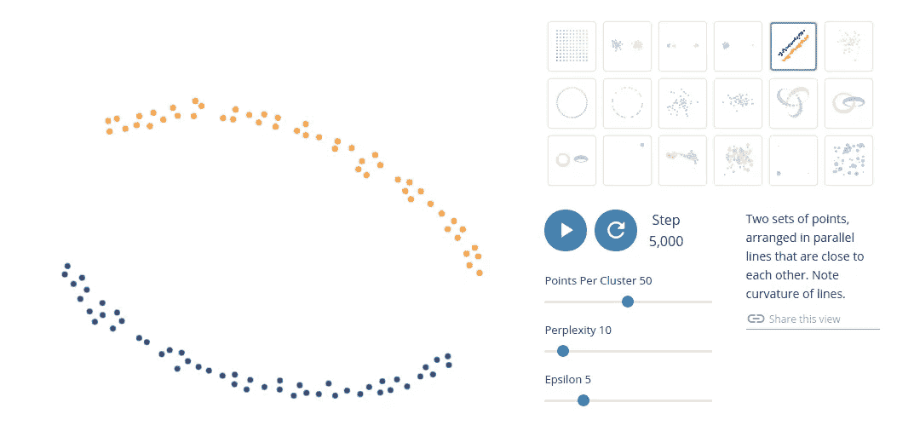
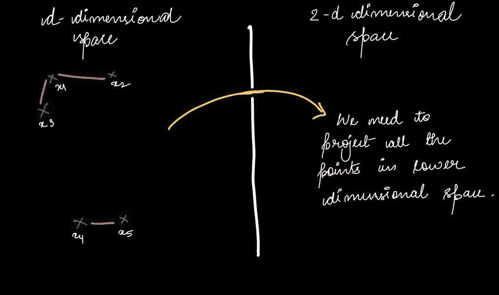
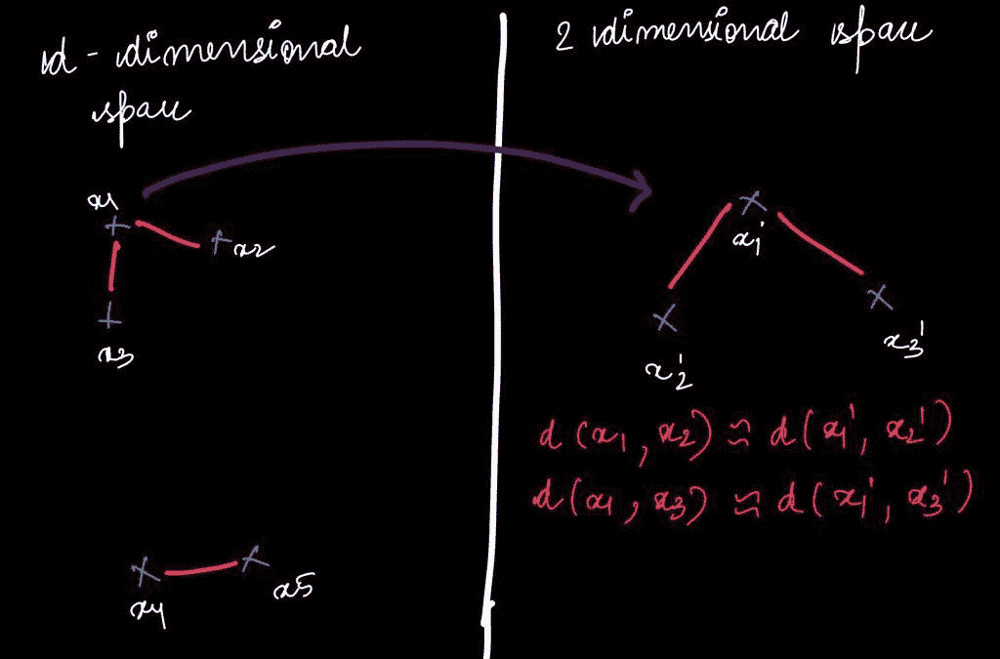
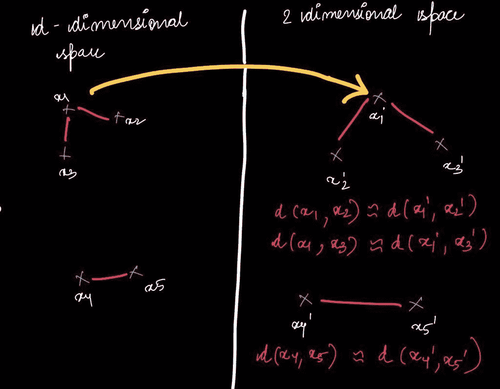

# SNE(几何直觉)

> 原文：<https://medium.com/analytics-vidhya/t-sne-geometric-intuition-5bc4a6d13c67?source=collection_archive---------4----------------------->

图像通过[提取](https://distill.pub/2016/misread-tsne/)

T-SNE 代表几何 T 分布随机邻域嵌入。这是降维的最新技术之一，尤其是对于数据的可视化。T-SNE 是最年轻的技术之一。劳伦斯和杰弗里·辛顿的非凡研究小组在 2008 年发表了论文。杰弗里·辛顿(Geoffrey Hinton)是现代深度学习的教父，也是一位杰出的研究者。

# **T-SNE 背后的几何直觉**

SNE 霸王龙从内部提取每一个点，并试图将它们嵌入低维空间，这样我们就可以保持距离。

作者图片

现在，假设我们有 d 维空间的数据，我们想把它嵌入到 2d 空间。

随着我们进一步移动，假设 x2 和 x3 在 x1 的邻域内。这意味着 **N(x1) ={x2，x3}** ，这意味着 x1 的邻域等于 d 维空间中的 x2 和 x3。

更准确地说，我们可以说 x1 和 x2、x1 和 x3 之间的距离很小，而 x4 和 x5 之间的距离稍大一些。但是在 x4 附近，我们会发现 x5。因此， **N(x4) = {x5}。**

作者图片

正如我们所知，T-SNE 试图从 d 维空间嵌入点到低维空间。我们将首先把 x1 '放在任何地方。基本上，我们试图保持邻域(x2，x3 ),这意味着我们要放置 x2 '和 x3 '，这样 x1 和 x2 之间的距离应该与 x1 '和 x2 '非常相似。

所以 d(x1，x2)~ d(x1’，x2’)我们可以这么说，因为 x1 和 x2 在彼此的邻域内。类似地，如果我们想保持 x1 '和 x3 '的距离，那么我们可以说 d(x1，x3)~d(x1 '，x3 ')。

所以基本上这里我们保持了邻域中点的距离。

作者图片

**问题:对于不在 x1 邻域内的点，我们该怎么办？**

所以我们可以简单地说，不在邻域内的点可以放在任何地方。对于更远的点，我们不做任何保证。

比方说对于 x4，不能说 d(x1，d4)~d(x1 '，dx4 ')。它们不必是相同的。但是在 x4 和 x5 之间，我们会尽量保持距离，因为它们在邻域内，这意味着我们可以说 d(x4，x5)~d(x4 '，x5 ')

作者图片

所以 SNE 霸王龙试图保持邻居的距离。简而言之，我们可以得出结论，T-SNE 是一个邻域保持嵌入，这就是为什么它试图保持邻域中的距离。

**参考-**[https://distill.pub/2016/misread-tsne/](https://distill.pub/2016/misread-tsne/)

“永远不要停止学习”