# 使用深度学习的表格提取

> 原文：<https://medium.com/analytics-vidhya/table-extraction-using-deep-learning-3c91790aa200?source=collection_archive---------0----------------------->

用 TensorFlow 构建深度学习模型，从图像中提取表格数据。

[法比奥在 Unsplash 上拍摄的照片](https://unsplash.com/photos/oyXis2kALVg)

表是一种有用的结构表示，它将数据组织成行和列，旨在捕捉数据中不同元素和属性之间的关系。

表格已经成为我们日常生活的一部分:从基本的交易到复杂的分析结果，它们已经成为每一份文件和文档的一部分，甚至是以简洁的方式反映信息的最小需求。

互联网时代的技术进步和将文档保存为硬拷贝的不便使得文档、事件、交易或任何真实世界的记录(包括图像和其他多媒体信息)的数字化成为必要。因此，非结构化数据大量涌入，在这个庞大的非结构化数据池中，跟踪具有结构化语义的表格信息在人力资源方面变得更加昂贵和耗时；处理这个问题的唯一方法是借助计算机来解决。

但是使用电脑有一个很大的缺点。主要问题是，当今世界有大量数字化的非结构化数据，在这个非结构化领域中，这些表没有其最初的本质来捕捉关系；他们只能在视觉上表现出来。就人类的理解而言，这些表的视觉表示和结构表示之间的差异可以忽略不计。另一方面，非结构化形式的表格对于计算机来说只不过是图像的一部分。

为了解决这个问题，我们的主要目标是通过将表格从非结构化格式中分离出来并使用计算机视觉恢复其原始形式来理解表格。

# (尤指为开车者设计的) 公路交通图

这一部分概述了博客的结构，并提供了本博客将涵盖的主要阶段的高层次视图。

*   **先决条件**
*   **问题理解**
*   **数据采集**
*   **分析和预处理**
*   **相关作品**
*   **发展**
*   **结论**
*   **讨论和未来工作**

那么，让我们开始吧…

# 1.先决条件

这里列出了构建类似的基于深度学习的项目所需的先决条件(或者说是有帮助的)。

*   **虚拟环境，python，pip，机器学习和深度学习概念。**
*   **TensorFlow** —访问[官方文档](https://www.tensorflow.org/tutorials)开始使用。
*   从 Youtube 上 JCharis 的这个[视频教程](https://youtu.be/_9WiB2PDO7k)中可以了解到 Streamlit

如果您的工具箱中没有先决条件，请不要担心，请浏览博客。一个人可以随时回来学习需要什么！

# 2.问题理解

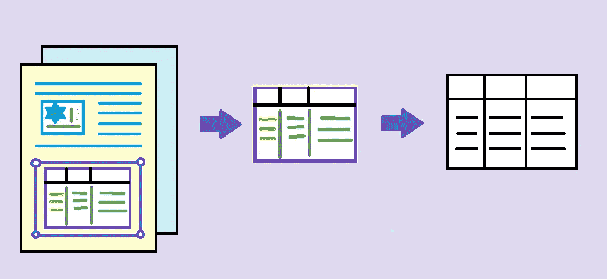

**2.1。概述**

研究的目标是开发一个系统，该系统将图像作为输入，并使用计算机视觉从输入图像(如果有)中的表格中提取信息。该任务可以被认为具有四个主要步骤:I)检测图像中表格的存在，ii)定位图像中的表格，iii)解码表格单元之间的结构关系，以及 iv)理解每个单元内的文本。

这个任务对于一个五岁的孩子来说可能是天真的，但是如果我们在我们的思想深渊中进行更深一步的跳跃，我们会意识到检测一张桌子，在一张纸上定位它并不遵循任何硬性的规则。它作为我们认知的一部分，由视觉皮层(从我们的意识理解中抽象出来)自动完成。

**2.2。深度学习的使用**

十多年来，计算机视觉已经认识到深度学习的潜力。与以前的技术相比，深度学习已经在需要一定认知量并且无法使用基于规则的方法解决的问题中展示了有希望的结果。

在这项研究中，我们将利用[卷积神经网络](https://ml4a.github.io/ml4a/convnets/)(一种基于参数共享的深度学习模型)来解决在给定图像中检测和定位表格的问题，并使用预定义的 [OCR](https://nanonets.com/blog/ocr-with-tesseract/) 算法从检测到的表格中提取文本。

桌子检测和定位可以被框定为一个[图像分割](https://ai.stanford.edu/~syyeung/cvweb/tutorial3.html)问题，其中系统必须通过预测桌子的屏蔽图像来将桌子区域与图片的其余部分分开。

**2.3。问题约束**

对于这个问题，必须管理的一些主要约束:

**i)低** **等待时间—** 由于该解决方案旨在应用于大块文档图像，因此提取模型应该不会花费很长时间。

**ii)** **数据变异—** 它是这个领域的关键约束之一。在这个互联网和物联网时代，模型应该接受来自各种来源的流数据，并应该处理各种类型的转换图像(剪切、旋转、噪声等。).

**iii)适中的空间需求—** 设计的模型应该具有较低的内存需求。对于访问模型的设备来说，应该直接通过应用程序(低内存约束)或通过 API(允许我们在一定程度上不受内存约束)来访问模型。

# 3.数据收集

深度学习是一种数据驱动的人工神经网络技术，需要大量高质量的训练数据才能有效。Table Bank、ICDAR 和 Marmot 是三个重要的研究成果，它们收集数据来研究和解释图片、pdf 和其他可移植格式的表格，并通过开源其数据集来加速表格理解方面的研究。

在这项研究中，我们将使用 Marmot 数据集来开发我们的模型。数据集包含 xml 格式的数据集的给定图像中的表的边界框的注释。

> 点击[此处](https://www.icst.pku.edu.cn/cpdp/docs/20190424190300041510.zip)下载数据集。
> 
> 注意，我们将使用由 TableNet 团队*注释的同一数据集的另一个版本。*这个[数据集](https://drive.google.com/drive/folders/1QZiv5RKe3xlOBdTzuTVuYRxixemVIODp)由原始 Marmot 数据的列级边界框注释组成。为了方便起见，在整个博客中，我们将原始数据集称为 ***marmot_v1*** ，而将后者称为***marmot _ extended****。*

# *4.分析和预处理*

*从给定的 [URL](https://www.icst.pku.edu.cn/cpdp/docs/20190424190300041510.zip) 下载数据集后，我们提取了数据集( **marmot_v1** )。现在我们来看看提取的目录，看看数据集是如何组织的。*

***4.1。实验观察***

*   *主文件夹包含一个文件夹数据，它实际上保存了数据以及一些描述数据集的文件。*

*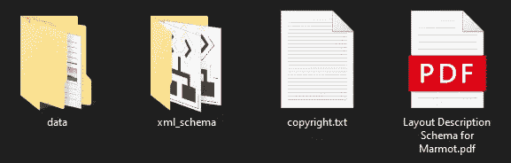*

*解压缩的 zip 文件组织*

*   *Marmot 数据集由中文和英文页面组成，分别保存在不同的文件夹中。*
*   *这两个文件夹(中文和英文)有相同的目录结构，都包括文件夹命名为积极和消极。*
*   *为了简单起见，我们将只考虑英文文件夹。有两个文件夹，即标签和原始，在积极和消极的目录。*

*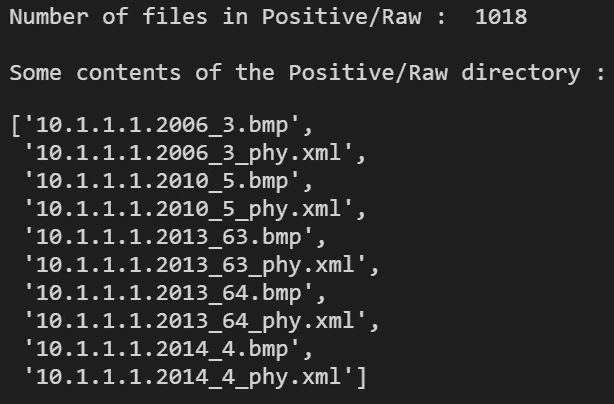*

*正/原始目录中的文件数量及其部分内容*

*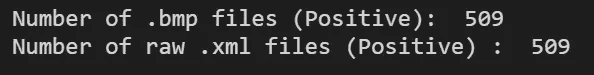*

*图像数据点的数量和 xml 注释的数量*

*   *现在，让我们来看看数据集中的一个样本数据点*

*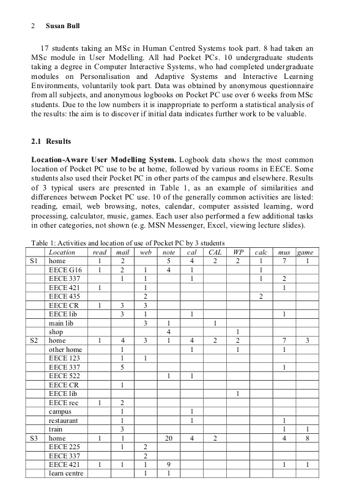*

*数据集的样本图像*

*   *下面给出了相应的注释文件*

*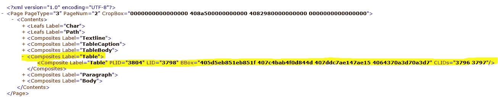*

*相应的 xml 注释*

*   *表格的边界框和表格本身由(突出显示的)**复合**标签定义。但是需要注意的一点是， **BBox** 属性被赋予了一个很长的十六进制序列，所以我们必须以某种方式将这个序列转换成有意义的符号。我们将在本节的下一部分(4.2)处理这个问题。*

*现在让我们来看看**土拨鼠 _ 扩展的**数据集*

*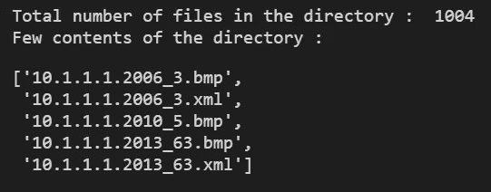*

*marmot 扩展目录的内容*

*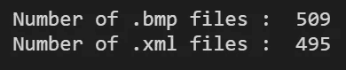*

*数据点和注释的数量*

*   *这些注释包含图像中表格每一列的边界框*
*   *该数据集仅包含原始数据集的 English/Positive 子文件夹中的图像。*
*   *注释文件的数量是 495，而位图图像有 509 个。因此，相应图像的 14 个 xml 文件不存在。*

*我们之前已经看到了数据集( **marmot_v1** )中的典型图像数据，让我们只检查来自 **marmot_extended** 的注释文件的布局*

*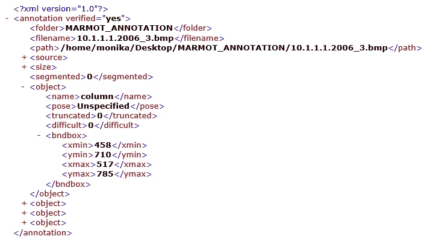*

*TableNet 团队注释的 marmot_extended 的 XML 注释*

*   *这些新注释只包含图像中每一列的边界框。xml 文件中的每个**对象**标签表示一列，每个对象下的 **bndbox** 标签保存该特定列的边界框的直角坐标*
*   *我们已经看到 **marmot_v1** 中的注释只包含表格注释*
*   *我们将使用这两种类型的注释(table from **marmot_v1** 和 column from**marmot _ extended**)并根据这些注释为数据集中出现的每个图像创建蒙版图像。*
*   *由于缺少 14 个数据点的列级注释，我们也将忽略 14 个表级注释。*

*在进入预处理阶段之前，我们将检查数据集中每个图像的宽度和高度分布。*

*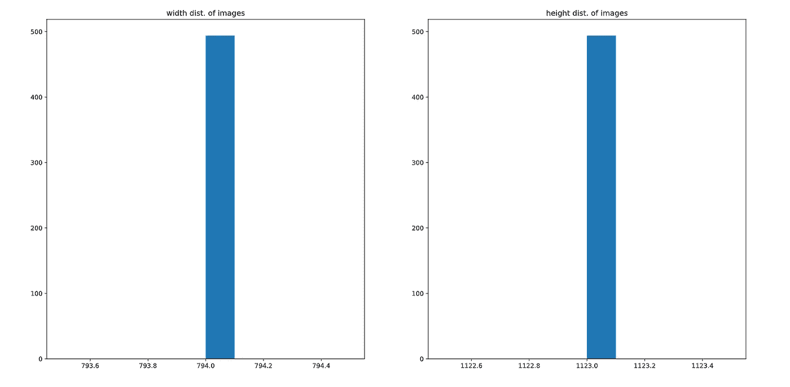*

*图像宽度和高度的分布*

*   *从上面的图中我们可以看到，数据集中所有图像的宽度和高度都是(816，1056)*

## *4.2.预处理*

*对于这个阶段，我们必须分析所提供的注释，并从中生成掩码图像(对于表和列)。下面简要列出了完成任务所遵循的预处理操作:*

*   *转换十六进制记数法并返回 **marmot_v1** 对应的浮点值。为此，我们定义了一个可以在移动中读取注释时调用的函数*
*   *从 **marmot_v1** 中读取表格的边界框数据。这是通过解析每个带注释的 xml 文件并定位所有的*复合*标签来完成的，其中*标签*属性被设置为‘Table’下面提供了为执行此任务而定义的 python 函数:*

*   *我们对 **marmot_extended** 注释做了同样的事情来获得列级注释。*
*   *将上述两个任务结合起来，为所有图像获得表格和列级注释(使用下面给出的函数)。*

*让我们想象一个这样的图像及其表和列掩码。*

*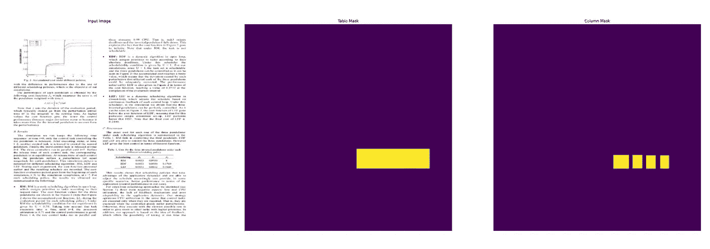*

*数据集及其处理过的掩膜的示例图像*

# *5.相关作品*

*现在让我们快速看一下这个问题的各种解决方案。这一部分不是开发过程的一部分，但是它通过探索在这个方向上采取的思想的类似实现提供了一个更广阔的视角；下面简要介绍其中一些:*

***5.1。文档图像中表格检测的近域微调优势***

*[ [安吉拉·卡萨多-加西亚等人 2019](https://arxiv.org/abs/1912.05846)*

*他们的研究主要集中在计算机视觉模型中迁移学习的性能如何提高，如果学习的参数在更多的相似任务中共享，而不是不相似的任务。研究中执行的任务分为两个阶段:*

*I)使用诸如 yolo、mask-rnn、retina-net 的 SOTA 对象检测模型进行实验，以在 Pascal POV 数据集(自然图像数据集)上学习对象检测，然后使用 ICDAR、Marmot 数据(桌子检测和识别数据)微调训练参数。*

*ii)使用相同的对象检测模型进行另一组实验，但是这次它们首先使用 TableNet 数据集(表检测和识别数据集)进行训练，然后在 ICDAR 和 Marmot 数据集的帮助下进行参数的微调。*

*对于两组实验，应用了迁移学习，首先从远处的域(自然图像)开始，然后从近处的域(桌子检测)开始。他们的实验结果表明，当将闭域迁移学习应用于文档图像中的表格检测时，有相当大的改进。*

*5 **.2。GFTE:基于图形的财务表格提取***

*[李艺仁等人 2020](https://arxiv.org/abs/2003.07560)*

*该小组所做工作的主要贡献可以简要概括为:*

*I)从几种类型的融资文件中汇编中国金融数据集 FinTab。该数据集由 1600 多张不同类型的表格图像及其结构注释组成。*

*ii)引入基于图的卷积神经网络模型，命名为 GFTE。下面讨论该模型的工作原理。*

*这种方法中的表被表示为一个图，其中每个单元被视为一个节点。这些节点通过关系相互连接:垂直的、水平的或不相关的。因此，他们的问题可以解释为:给定一组节点及其特征，预测一对节点之间的关系。*

*他们使用三种类型的信息以及每个节点作为输入:I)文本内容 ii)绝对位置和 iii)表的图像。这些绝对位置特征被转换为相对位置特征，文本特征被嵌入并通过 LSTM 层发送以获得语义信息，然后这些获得的特征被组合并馈送到两层图形卷积网络。之后使用相对位置特征和 GCN 的输出，计算节点特征。同时，对图像进行预处理，利用三层细胞神经网络提取特征。这些节点特征和图像特征然后被馈送到 MLP，以模拟细胞之间的垂直和水平关系。*

*5.3。TableNet:深度学习模型，用于从扫描的文档图像中进行端到端的表格检测和表格数据提取*

*[ [帕利瓦尔等人 2020 年](https://arxiv.org/abs/2001.01469)*

*在这项工作中，他们提出了一个端到端的深度学习模型，用于表格识别的 TableNet，并为旱獭数据提供了额外的注释。该方法结合了迁移学习，因为预训练的具有 ImageNet 权重的 VGG-19 被用作所提出的模型的编码器。VGG-19 网络末端的全连接层被具有 ReLU 激活和丢弃的 1x1 卷积层所取代。编码器之后是两个不同的卷积解码器分支，因为模型需要同时检测表和识别其结构语义。在这些解码器分支中使用了附加层来过滤有用的特征，然后对这些特征图中的每一个进行上采样以产生图像。单个输入图像分别为表和列生成两个不同的带标签的输出图像。一旦获得语义标记的图像，OCR 算法被应用于单词位置，并且使用基于规则的行提取技术将行提取为单词的集合。*

# *6.发展*

*我们现在正在使用我们在早期阶段收集和处理的数据来创建和训练深度学习模型。让我们开始我们的第一次切割策略。*

***6.1。在 TensorFlow 中实现 TableNet***

*为了解决这个问题，我们将使用迁移学习和设计架构，其灵感来自 TableNet 团队的[工作](https://arxiv.org/abs/2001.01469)。*

*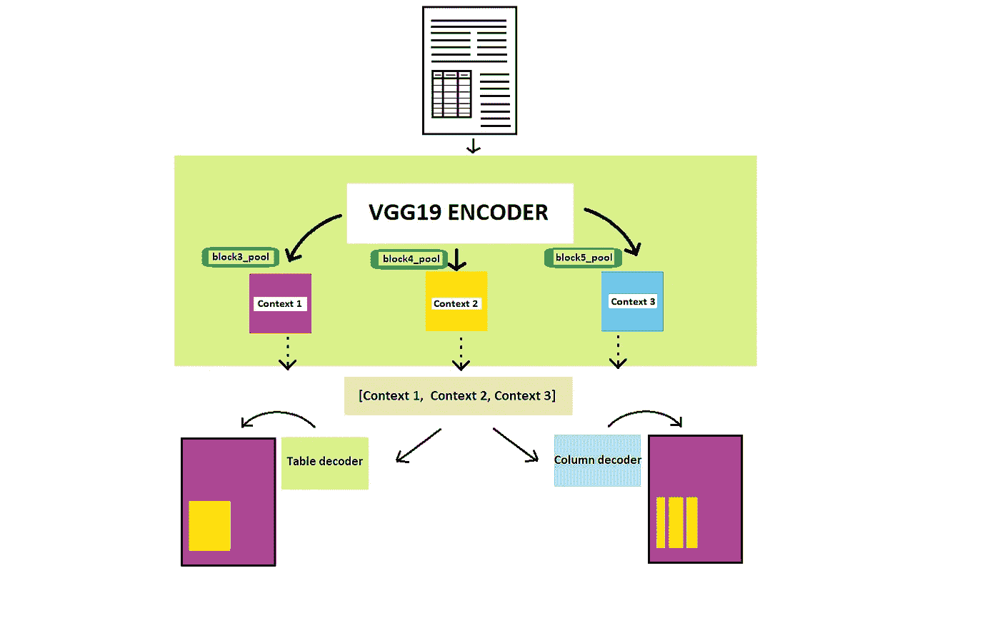*

*Paliwal 等人在 2020 年提出的 TableNet 架构。来自 VGG19 编码器的 block_3、block_4 和 block_5 池层的特征映射用于解码阶段的上下文聚合。*

***型号规格***

*   *与使用预训练 VGG19 作为基本编码器的原始 TableNet 架构(如上图所示)不同，我们的模型可以与各种类型的预训练视觉模型(如 VGG、雷斯网、DenseNet、EfficientNet、Xception)一起工作，作为基本编码器。*
*   *该模型采用允许编码器权重在整个训练中保持恒定的选项。换句话说，该选项可用于允许或限制模型的微调。*
*   *该模型还具有正则化参数，该参数将对编码器网络末端的卷积层和列解码器的卷积层采用*TF . keras . regulators**
*   *因为上述预训练模型的架构彼此不同。对于解码期间的上下文聚合，从其绘制特征映射的层因基本编码器而异*
*   *表和列解码器的架构保持不变。*

> ***注意:**要检查哪些层用于上下文聚合(来自其他编码器架构)，请参考下面给出的代码。*

***模型定义***

*下面提供了定义模型所需的 TensorFlow python 代码。*

***6.2。尝试各种编码器和设置***

*在上一节中，我们说明了我们的模型与许多类型的预训练编码器兼容，并且包含可以在训练期间强制正则化和微调的参数。在这一部分中，我们将使用编码器和设置的各种组合进行实验，记录训练和测试损失，以评估每个模型的性能。*

***概要:***

***讨论:***

*   *我们对 TableNet 架构进行了实验，调整了各种参数，如预训练编码器、辍学率和最终层的正则化。*
*   *在我们的一个测试中，我们还试图冻结 DenseNet 最初几个块的层，但这并没有帮助我们避免过度拟合。*
*   *如上表所示，TableNet model dense net encoder(dropout 为 0.6，没有正则化，没有层冻结)在验证集上具有最佳性能，并且该模型比其他模型显示出更少的过度拟合迹象。*

***6.3。使用 TensorFlow Lite 压缩获得的模型***

*现在，我们将导入最佳模型，并尝试使用一种称为训练后量化的技术来最小化空间需求。在这种方法中，通过优化模型权重的数据类型表示来压缩模型。这意味着通过保留尽可能多的信息，权重的数据类型从其原始数据类型更改为较低精度的表示形式(例如，从浮点 32 更改为浮点 16)。*

*然而，我们不需要为此创建算法；TensorFlow Lite 将代表我们轻松处理所有复杂问题。只需按照下面的说明使用 TF Lite 执行量化。*

*   *加载模型*

**

*量化前的模型大小*

*   *定义 TF Lite 转换器对象*
*   *设置所需的优化类型*
*   *转换模型*

*   *保存 TF Lite 模型*

*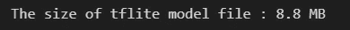*

*量化后的模型大小*

*太好了！与. h5 版本相比，该模型现在大约压缩了 75%。它是完整的，并准备好用于获得分段掩模。我们现在可以通过使用 OCR 技术提取所需的文本信息，比如对分段的表区域进行镶嵌。在下一部分，我们将看看整个过程，并定义最终的管道。*

*6.4。定义最终管道*

*现在，我们将利用在上一部分中获得的压缩 TF Lite 模型来构建我们的最终管道，即从接受一个图像(作为磁盘上的一个文件存在)获得一个包含提取的表格数据的 csv(也将作为一个文件保存在磁盘上)。下面提供了最终管道的算法和 python 实现。*

*   ***最终流水线的算法***

*   ***最终流水线的 python 代码***

*   ***使用最终函数进行推理***

*I)让我们尝试使用下面的图像作为输入*

*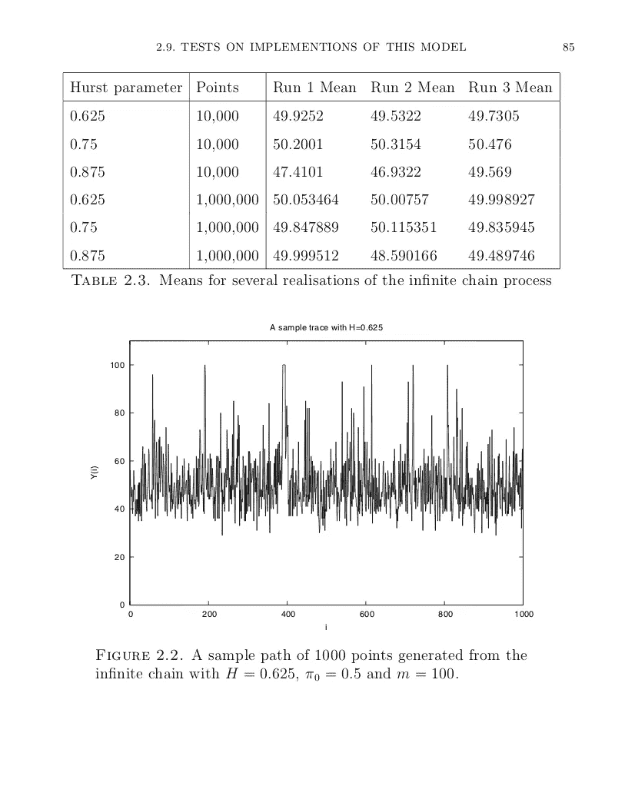*

*包含表格的文档的示例图像*

*ii)模型预测的分段表如下所示*

*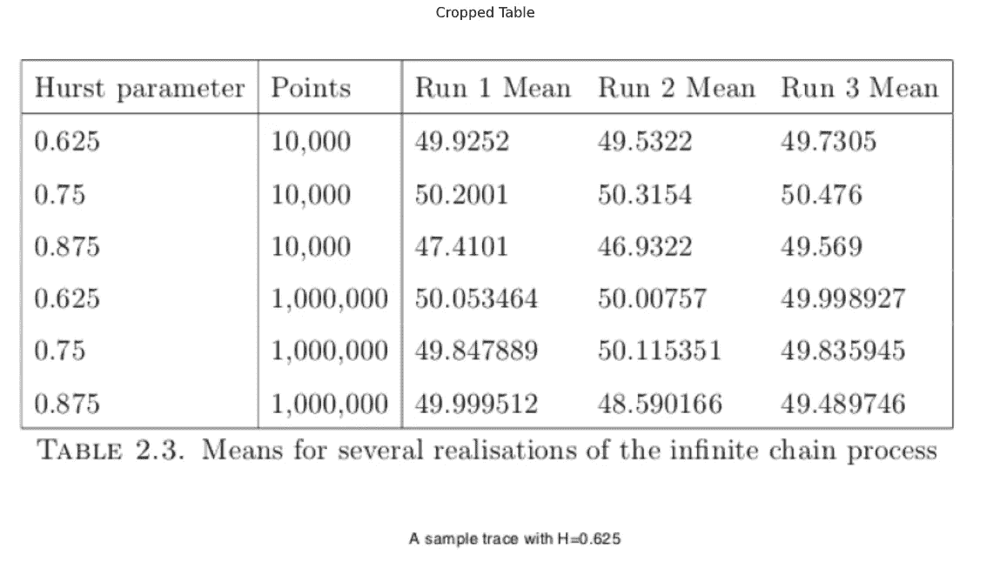*

*分段表格图像*

*iii)作为文本提取的表格*

*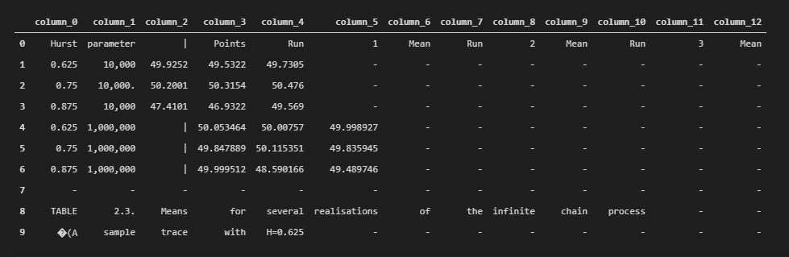*

*从 OCR 模块获取文本*

***6.5。使用 Streamlit 的基于网络的用户界面***

*在这一部分中，我们将使用 python 的 streamlit 包创建一个包装器，以便可以方便地测试模型。*

> ***注意:**本节未显示 streamlit 应用程序部署的 python 代码；然而，如果你需要它，你可以检查我的知识库。访问我的博客[根据地震行为预测火山爆发](/analytics-vidhya/predicting-volcanic-eruptions-from-seismic-behavior-3b8e6bbd7ffc)了解更多关于如何利用 Streamlit 创建 web 应用的信息。*

*所开发的系统包含一些将在下一节讨论的限制，由于这些限制，模型不能被部署(被其他用户使用)。因此，以下视频提供了 streamlit web-app(本地部署)的工作演示:*

*流媒体网络应用演示*

# *7.结论*

*因此，作为总结，让我们回顾一下本研究中到目前为止发生的事情，并探索系统可能遇到的一些现实问题(如果部署的话)。*

*   *首先，我们获得了 marmot data 提供的图像，并将两种类型的注释( **marmot_v1** 用于表格，而 **marmot_extended** 用于列)转换为实际的掩码图像，这些图像可以用作监督学习的标签。*
*   *然后，我们使用 python 的 TensorFlow 框架实现了 TableNet 架构。*
*   *我们修改了原始设计，使其能够与各种预训练的视觉模型一起运行，并提供了启用/禁用微调和正则化的选项。*
*   *之后，我们从实验中挑选出最佳模型，并使用 TF Lite 转换器对其进行压缩。*
*   *最后，我们利用 streamlit 将我们的模型封装在一个可以交互使用的 UI 中。*

***局限性:***

*虽然该模型能够很好地提取表格数据，但我们的实现面临一些严重的限制/挑战。*

*   *当图像有多个表格时，提取质量会降低，因为它试图只分割一个包含所有表格的矩形区域。*
*   *对分段的表格区域使用 OCR 时，文本检测较弱。如果它能够学习细胞级分割并将 OCR 应用于每个细胞，这将是有利的。*
*   *它无法区分包含行/列标题的单元格和包含实际数据的单元格。*

# *8.未来的工作*

*我们已经到了博客的末尾，这一部分的目的是为未来的改进提供一个方向。最初，我们可以尝试排除上一节中讨论的限制，因为:*

*   *收集和管理带有单元级注释的大型数据集可能会有所帮助。*
*   *然后，我们可以训练我们的模型来学习和预测细胞水平的分割，给定一个图像，其中有一个表格。*
*   *开发的模型一次只接受一个图像，我们可以开发一个实际的应用程序，并将其部署在 web 上，该应用程序将获取一组图像(比如，一个包含多个页面的 PDF 文件)，并给出这组图像中的所有表格(PDF)。*

# *9.参考*

*   *[申请课程](https://www.appliedaicourse.com/)*
*   *[文档图像中表格检测的近域微调优势](https://arxiv.org/abs/1912.05846)*
*   *[GFTE:基于图形的财务表格提取](https://arxiv.org/abs/2003.07560)*
*   *[TableNet:深度学习模型，用于从扫描的文档图像中进行端到端的表格检测和表格数据提取](https://arxiv.org/abs/2001.01469)*
*   *[AxCell:从机器学习论文中自动提取结果](https://arxiv.org/abs/2004.14356)*
*   *[TensorFlow 教程](https://www.tensorflow.org/tutorials)*
*   *[Git 和 GitHub 博客](https://product.hubspot.com/blog/git-and-github-tutorial-for-beginners)*

# *外部链接*

*   *[**GitHub 库**](https://github.com/cssoumyade/Table-Extraction)*
*   *[**在 LinkedIn 上联系我**](https://www.linkedin.com/in/cssoumyade/)*