# Tableau 101 —在 Tableau 中创建圆形条形图和条形中条形图表

> 原文：<https://medium.com/analytics-vidhya/tableau-101-create-a-rounded-bar-chart-and-a-bar-in-bar-chart-in-tableau-accc849ee1c0?source=collection_archive---------23----------------------->

# 目标

*   Tableau 是业内商业分析和数据可视化工具的黄金标准
*   了解如何在 Tableau 中制作圆形条形图和条形条形图

# 介绍

数据可视化是任何分析职业的一个关键方面。数据可视化以一种简单而又富有美感和影响力的方式传达数据故事。

没有比 Tableau 更好的工具来实现这一点！Tableau 是社区最信任的工具之一。它已连续 8 年被公认为 Gartner 分析和商业智能平台魔力象限的领导者。太不可思议了！

在这篇文章中，我们将了解如何在 Tableau 中制作圆形条形图和条形中条形图表

对于文章和任务，请确保您的系统中安装了 tableau。我用的是 [Tableau Public](https://public.tableau.com/en-us/s/) ，可以免费下载。我们将使用的数据是 Tableau 社区中广泛使用的美国样本超市数据集。这里是[下载](https://community.tableau.com/s/contentdocument/0694T000001GnpUQAS)超级商店数据集的链接(但数据集将在 Tableau 内部提供)。

让我们开始吧！

# 在 Tableau 中创建圆形条形图

条形图是表示数据的一种非常基本的方式。有时你想以一种吸引人的方式做不同的事情。圆形条形图通过添加更多的步骤使您的仪表板变得有趣。让我们看看我们如何能做它。

# 第一步

对于这个可视化，我们使用数量和子类别。在第一步中，通过从数据窗格中进行选择，删除列架中的数量和行架中的子类别。因此，您将得到如下图所示的水平条形图。

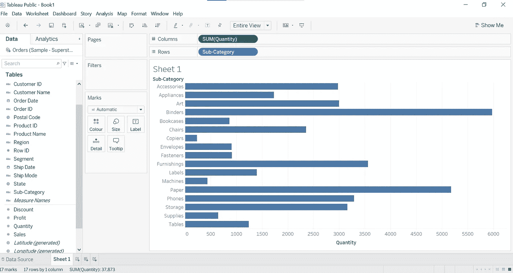

# 第二步

现在我们要取另一个零值的维度。有多种方法可以做到这一点，我正在做的是双击列架，写 Avg(0)，并按 enter 键。另一种方法是创建一个名为 zero 的计算字段，其值为 0。这个想法是得到一个带零的组合轴。

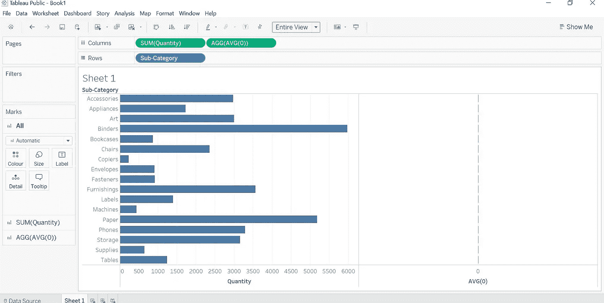

# 第三步

在下一步中，通过从列架中选择 AGG(AVG(0))并放到数量轴上来合并轴。在此之后，您将看到由添加到行工具架中的测量值和测量名称所替换的片状数量发生了一些变化，如下图所示。

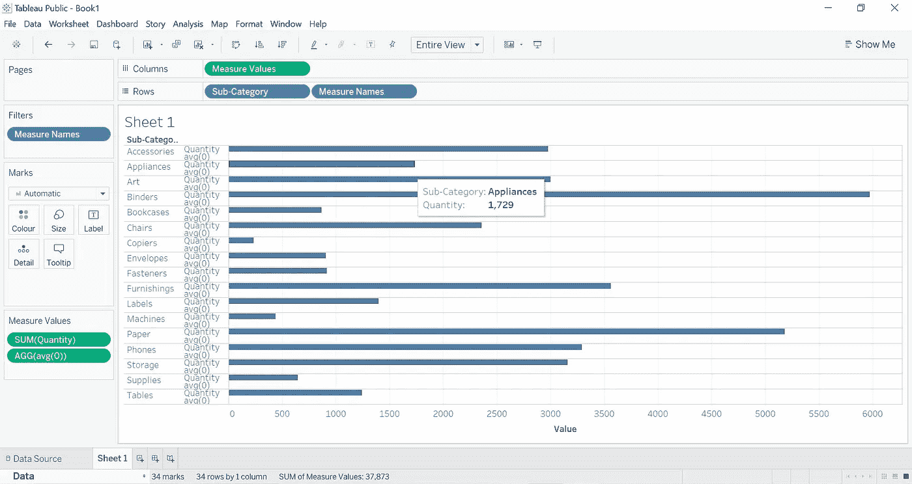

# 第四步

现在让我们继续，将标记卡从自动改为直线。现在你的工作表看起来会像这样。

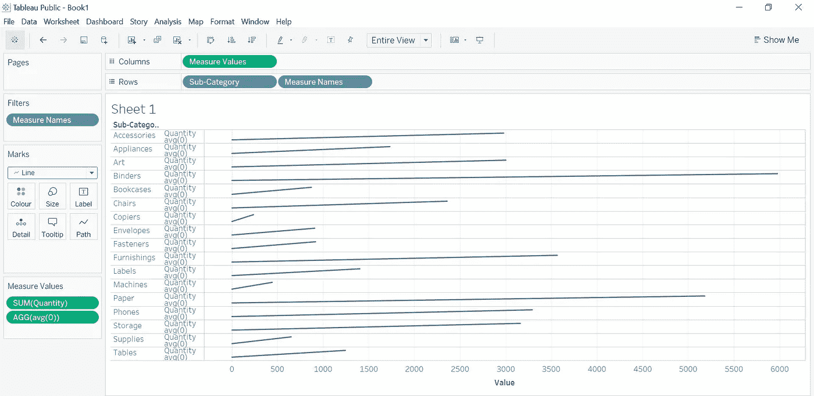

# 第五步

接下来，从“行”架中选择度量名称，并将其放在“标记”窗格中的可用路径上。完成这一步后，你将得到直线。

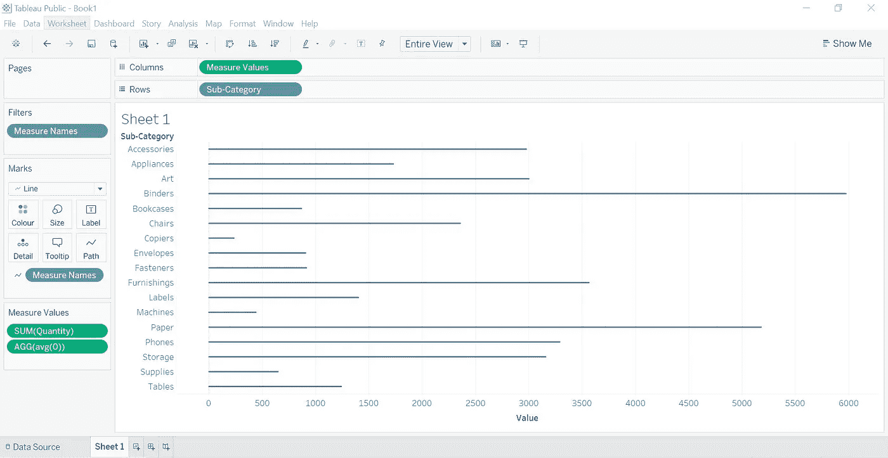

# 第六步

现在我们差不多了，在最后一步点击尺寸，根据你的要求增加线条的尺寸。正如你在下图中看到的，我们已经实现了我们的目标，我们有圆边条形图。

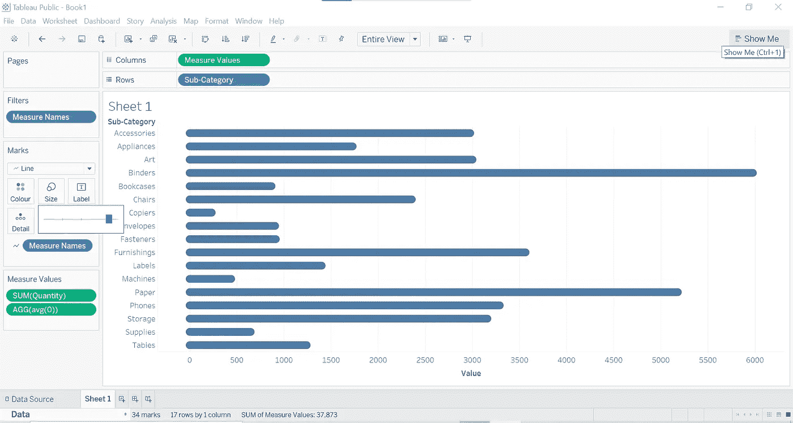

# 第七步

为了进一步格式化，我们可以根据需要对条形进行升序或降序排序。这里我们以递减的圆形条形图结束。

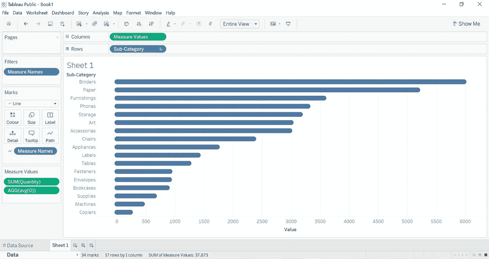

# 在 Tableau 中创建条形图

我们正在创建的下一个可视化是条形图中的条。这种可视化通常在您必须比较数据时使用。例如，在给定超市数据集的情况下，我们比较了 2013 年和 2014 年所有地区的销售额。

# 第一步

在给定的数据中，我们有销售字段，但对于我们的任务，我们需要两个不同的字段，即 2013 年和 2014 年的销售。因此，我们将创建两个计算字段。第一个是“2013_sales”，如下图所示。同样，将创建“2014_sales”。现在我们的数据准备完成了。

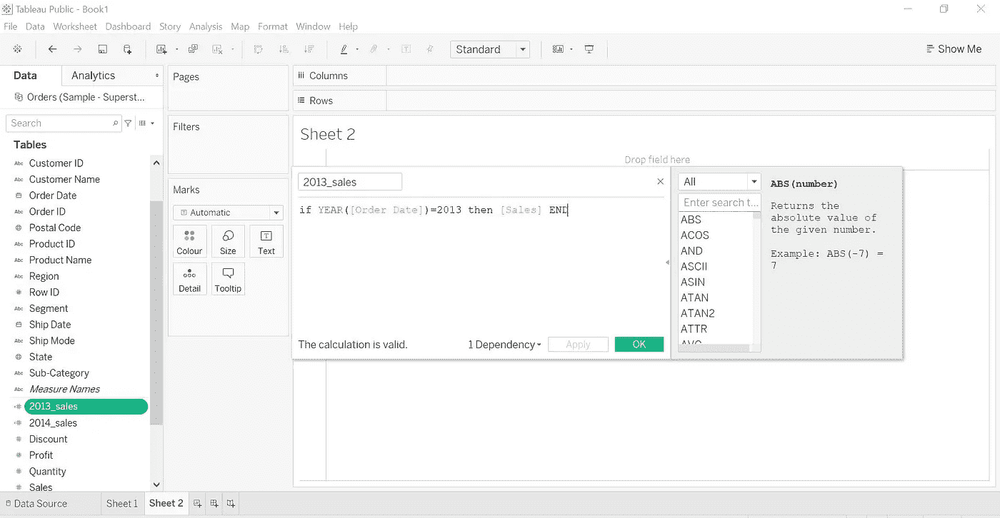

# 第二步

在下一步中，从数据窗格中取出该区域，并将其放在列架上。同样，选择 2014_sales 并将其放在 Rows 货架上。在这之后，你将得到一个普通的条形图，如下图所示。

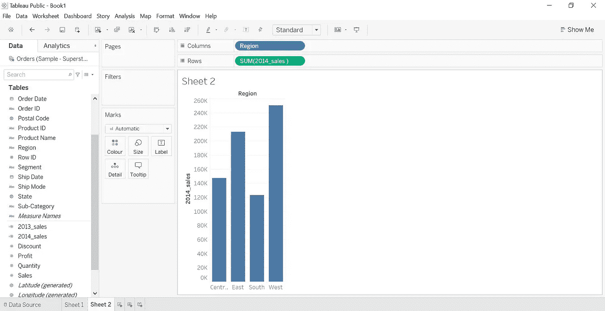

# 第三步

现在，从“数据”窗格中选择 2013_sales，并放在 2014_sales 的轴上，以获得与上一个图表类似的组合轴。

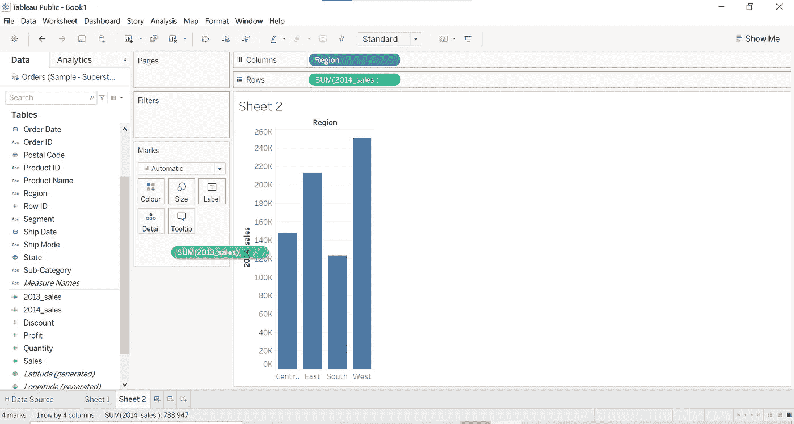

在此之后，您的工作表将类似于这样。以侧边栏的方式显示地区间每年的销售额。此外，您将在“列”工具架中添加度量名称，在“行”工具架中添加度量值。

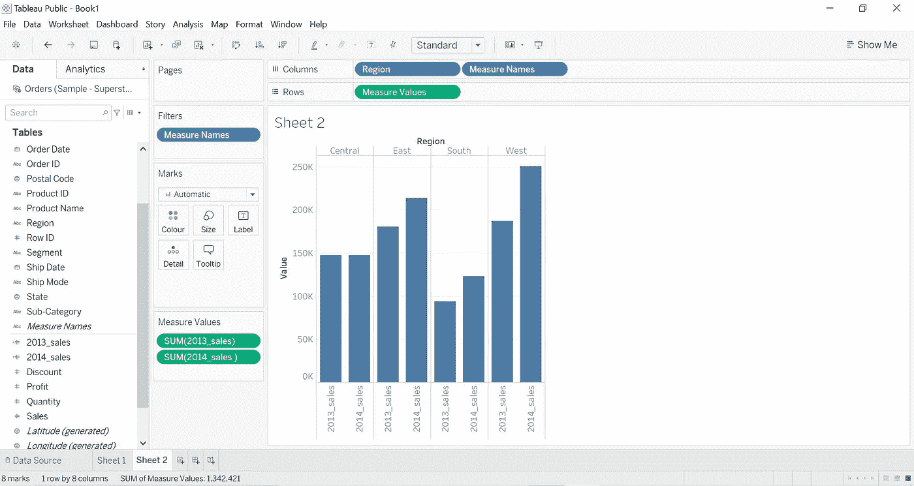

# 第四步

现在向前移动，从列架中选择测量名称，并将它们放在颜色卡上。你可以通过点击色卡，然后点击编辑颜色来选择你想要的颜色。如您所见，我们有堆叠的条形图，灰色的显示 2013 年的销售额，蓝色的显示 2014 年的销售额。

但是我们不想要堆叠的条形图，因此转到工具栏中的分析并关闭堆叠标记。现在我们有一个接一个的栅栏。

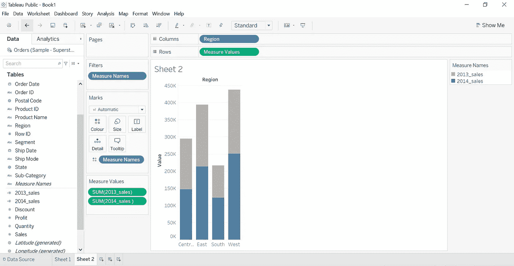

# 第五步

现在我们差不多到了，在最后一步，从数据面板中选择测量名称，并放到尺寸卡上。如下图所示，灰色宽条表示 2013 年的销售额，蓝色细条表示 2014 年的销售额。通过这种可视化，我们可以轻松比较 2013 年和 2014 年的区域销售情况。

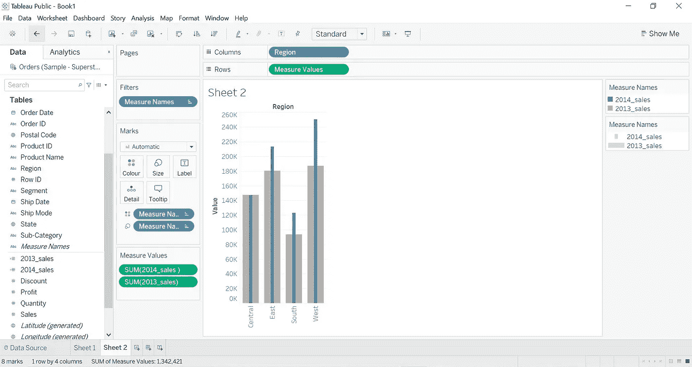

# 第六步

你可以自由地做进一步的格式化，因为我已经在我的条中添加了黑色边框，或者你也可以删除网格线或添加趋势线，使其更具信息性。

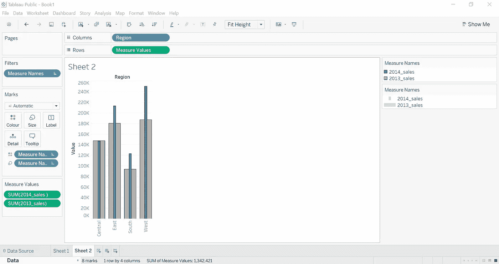

# 结束注释

Tableau 最大的好处是你有很多方法来完成任务。总结本文，我们学习了创建两种不同的可视化，它们比基本的条形图稍微高级一些。这些图表使我们的仪表板更加丰富和有效。