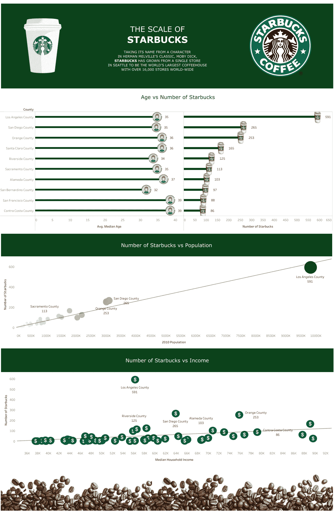

# Tableau —自定义调色板

> 原文：<https://medium.com/analytics-vidhya/tableau-custom-colour-palettes-544e8801c4da?source=collection_archive---------17----------------------->

## 将最容易识别的资产添加到仪表板的 3 个步骤

星巴克为什么选择绿色？可口可乐为什么选择红色？在 Tableau 中创建自定义调色板可以让您将自己独特的品牌颜色添加到可视化效果中。这里有两个取自[公共场景](https://public.tableau.com/en-us/gallery/?tab=viz-of-the-day&type=viz-of-the-day)的例子:

autho[Anomita Chandra](https://public.tableau.com/profile/anomita#!/)—[点击查看 Tableau 公共](https://public.tableau.com/views/Starbucks_16054825318500/Dashboard1?:language=en&:display_count=y&:toolbar=n&:origin=viz_share_link)