# 仪表板

> 原文：<https://medium.com/analytics-vidhya/tableau-dashboarding-190dceaa46eb?source=collection_archive---------19----------------------->

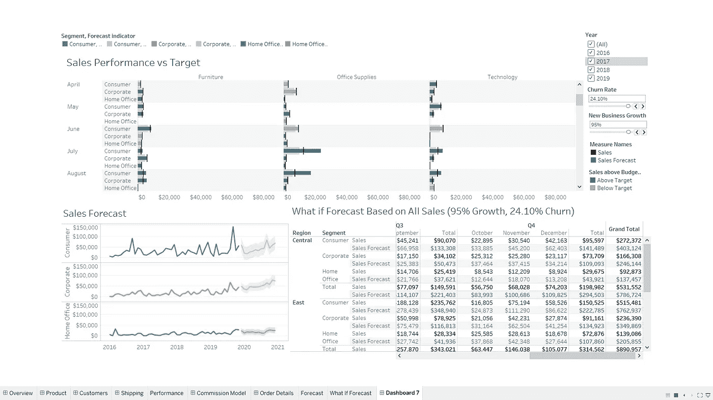

作者图片

在屏幕上看到这些惊人的视觉效果很兴奋吗？

让我们从学习如何在一个新的仪表板上导航开始，理解它的部分和窗格，然后继续学习制作完美的仪表板..！

## 仪表盘是什么意思？

正如 Klipfolio 所说，仪表板是一种工具，它可以直观地跟踪、分析和显示关键绩效指标(KPI)、衡量标准和关键数据点，以监控业务、部门或特定流程的健康状况。

根据维基百科:“分析是对数据中有意义模式的发现、解释和交流。在记录信息丰富的领域，分析尤其有价值，它依赖于同时应用统计学、计算机编程和运筹学来量化绩效。分析通常倾向于数据可视化来传达洞察力。”

**如何在 Tableau 中创建仪表板？**

**第一步:打开一个新的仪表板**

从菜单栏上的仪表板选项或底部栏上的仪表板图标打开仪表板窗口。

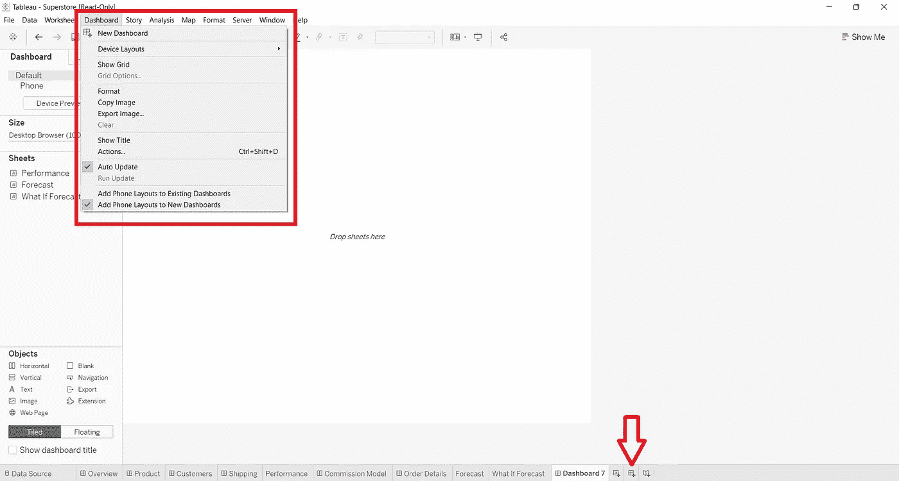

作者图片

**第二步:了解仪表板面板**

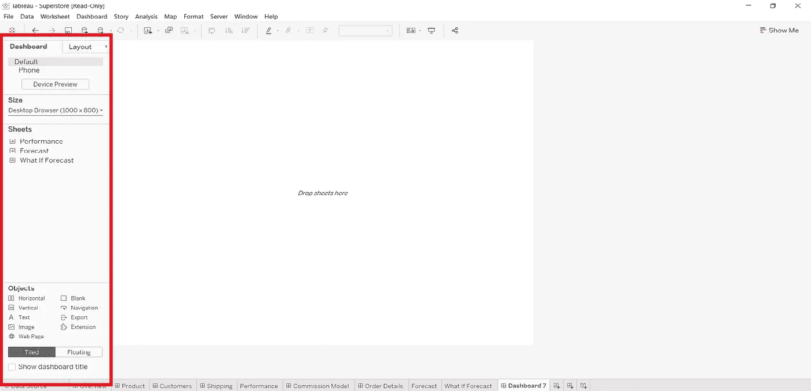

作者图片

上面的红框显示了仪表板窗格，可用于调整仪表板的大小或添加工作表和对象。

让我们学习如何调整仪表板的大小。有固定的选项可供您调整它的大小，或者您可以根据自己的需要定制它。

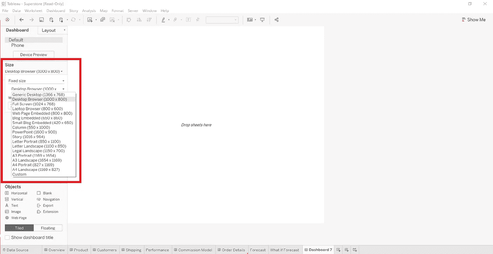

作者图片

**第三步:向仪表板添加工作表**

要添加工作表，请从“仪表板”选项卡中的“工作表”列拖放工作表。它将在我们的仪表板上显示我们在该表单上的所有可视化内容。

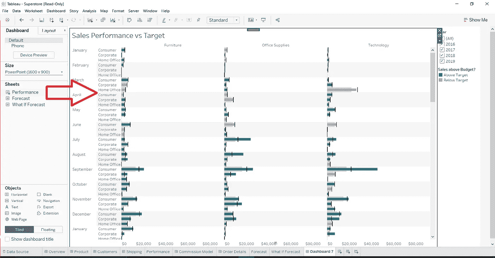

作者图片

要调整图表的大小和位置，请单击图表，然后单击右侧的向下小箭头。出现具有各种选项的下拉列表，选择**浮动**。这将允许你从一个位置移动你的图表，以便你可以调整它。

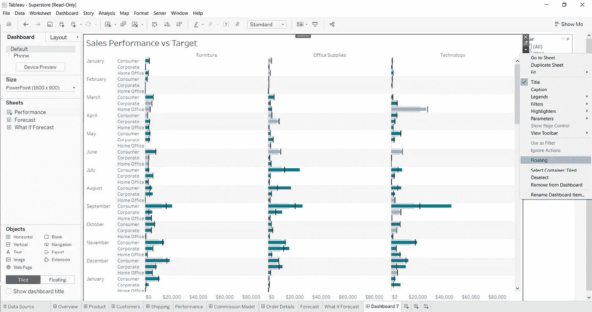

作者图片

这是您的仪表板在选择浮动选项后的外观。

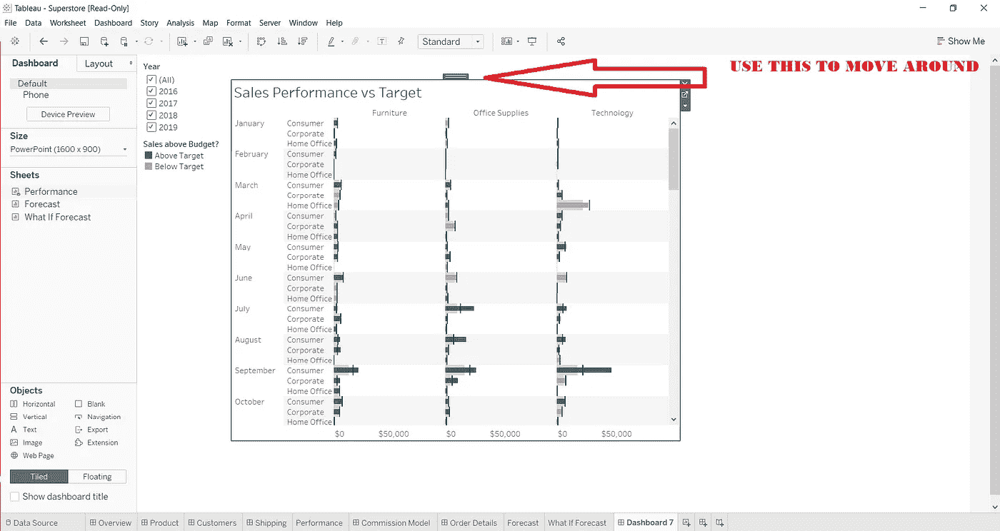

作者图片

向您的仪表板添加更多您需要进行分析和可视化的表格。

**快速提示**:始终在单个仪表板上添加具有相同过滤器的工作表。简而言之，如果您更改仪表板上的单个过滤器，它应该会更改仪表板上的所有图表。示例:在下图中，如果我在过滤器上更改或选择了一年，这将更改我的两个图表。

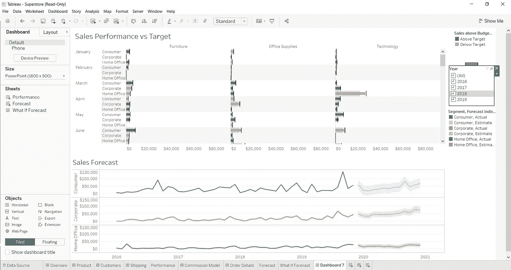

作者图片

**使用仪表板上的图表作为过滤器**

您可以在一个图形上应用过滤器，并将其视为仪表板上所有其他视觉效果的过滤器。要向 Tableau 中的仪表板添加过滤器，请选择**用作过滤器**选项，如下图所示。

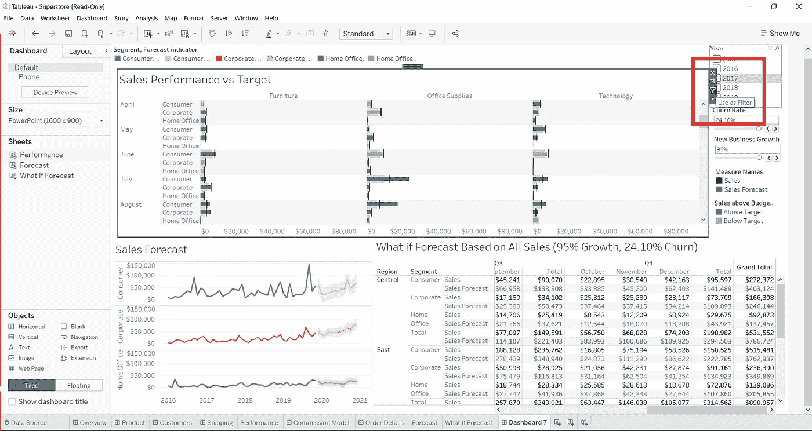

作者图片

选择此项后，您可以将该图表用作其他图表的过滤器。在下面的图片中，我使用了技术作为过滤器，你可以将这张图片与上面的图片进行比较，其他图表上的值也发生了变化。

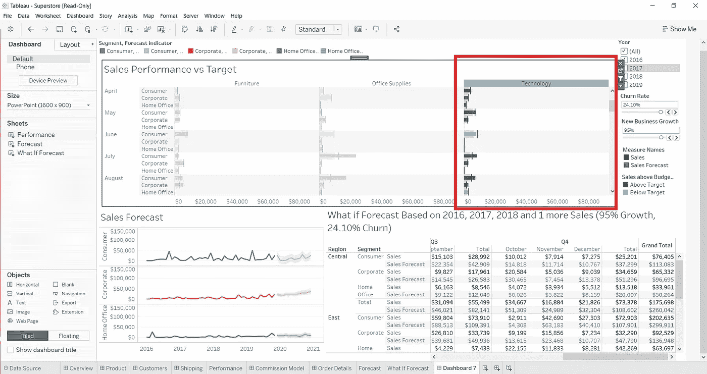

作者图片

以可用于更好理解和可视化的呈现模式结束，

要启用它，您可以按键盘上的 F7 键，也可以在 Windows 选项中选择演示模式。

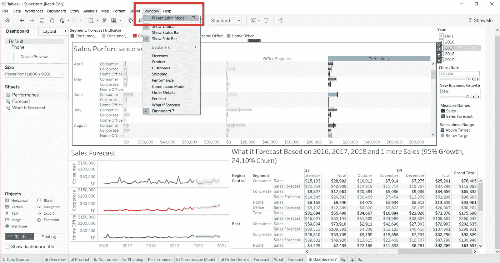

作者图片

这是您的仪表板在演示模式下的外观。

作者图片

参考资料:[www.klipfolio.com](http://www.klipfolio.com)，数据-天赋.训练

数据集:tableau 上可用的样本数据集