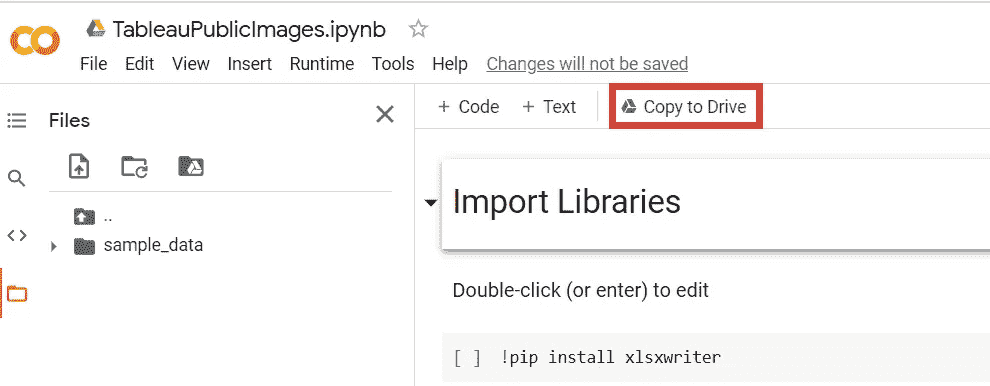
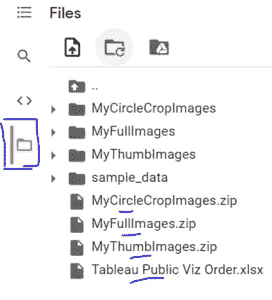
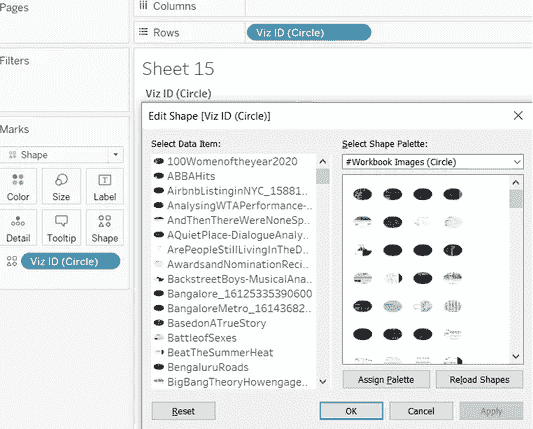

# Tableau:设计您的 Tableau 文件夹

> 原文：<https://medium.com/analytics-vidhya/tableau-design-your-tableau-portfolio-371932a3087a?source=collection_archive---------6----------------------->

最近在投资组合日，我目睹了一些来自#datafam 社区的惊人作品。就在那时，我有了一个在 Tableau 中建造这个的想法。

我一直在编写代码以获得 tableau 公共细节和图像，但当我看到 Ken Flerage 在 Tableau 公共服务上的博客时，我的工作已经完成了一半:)请查看他的博客以了解他是如何提取数据的。
[https://www.flerlagetwins.com/2021/03/stats-service.html](https://www.flerlagetwins.com/2021/03/stats-service.html)

所以下一步是获取 viz 的图像。这篇博客将介绍如何为你的 viz 下载图片，并在 Tableau 中创建你的 vizes 作品集。你可以把这个分享给你的家人和未来的雇主，一起展示你们的工作。

我已经使用 python 访问了 Tableau 公共 API 来获取 vizes 的图像。如果您对 python 不太熟悉，可以直接访问 python 代码，按照步骤下载文件，只需对 python 有一点了解。

# Python 代码

如果您只想下载图像，可以跳过这一部分。但是如果你对 python 有所了解，我会鼓励你去完成它。你可能会有一些自己的新想法。

第一步是导入所需的库。Google Colab 的好处是你已经安装了大部分。

所以计划是使用 tableau 公共 API 来获取细节。示例 URL —

[https://public.tableau.com/profile/api/{profile}/workbooks?count = { count }&index = { index }](https://public.tableau.com/profile/api/priyanka.dobhal0993/workbooks?count=232&index=0)

 [## 谷歌联合实验室

### 编辑描述

colab.research.google.com](https://colab.research.google.com/drive/1LKYlsiZeTIQTKyIER9NUFQ8tMww_oG1e?usp=sharing) 

# 下载图像

所以代码需要来自用户端的两个输入— (1)用户名；(2)振动次数

您可以从 URL 获取用户名

vizes 的数量会显示在您的 Tableau 公共个人资料中。

我用 Google Colab 来写我的代码，因为它很容易使用和分享。此外，大多数库都是预装的，因此节省了我们很多额外的工作。

如果你是新手，这里有一个视频可以帮助你开始—

您可以复制代码并自己运行。

运行代码→
1。进入菜单下的运行时间→运行全部
2。向下滚动直到你看到这个，它会提示你*输入你的用户名*，然后*输入 vizes 的数量*。

3.这将需要几分钟(2-5 分钟)的时间，取决于您的 viz 数。下载突出显示的文件。

瞧啊。这就是你获取图像所需要的一切。

# 在 Tableau 中使用图像

现在转到本活动的最后一部分——使用 Tableau 中的图片。

您会得到 3 个 zip 文件——my full images . zip、MyCircleCropImages.zip 和 MyThumbImages.zip

提取图像并把它们放在我的 Tableau Repository\Shapes
下的单独文件夹中为了我的方便(和糟糕的记忆问题:D)，我以这种方式命名它们。

目前为止还好吗？

让我们继续 Tableau。如果你正在使用 Ken Flerage 的[服务](https://www.flerlagetwins.com/2021/03/stats-service.html)，你就快成功了:)如果没有，我会请你尝试一下。公共统计数据每天都会更新，所以这将省去你很多麻烦。

统计数据来自 google sheet，Tableau Public Viz Order 通过 python 代码创建。它用于给 viz 编号，这样你就可以创建一个滚动视图。

你可以用我的[工作簿](https://public.tableau.com/profile/priyanka.dobhal0993#!/vizhome/MyPortfolioCompactView/FullView)作为样本来构建你的工作簿。您需要做的只是创建您的连接，然后用您的连接替换现有的(我的数据源)连接。

但是图像呢？好了，一旦你有了数据，让我们分配形状。我已经创建了 3 个计算字段(这是从谷歌表的 Viz ID 的副本)，将用于形状。

你可以按文件夹分配形状-
1。将完整图像分配给 Viz ID(完整图像)

2.将缩略图分配给 Viz ID(缩略图)

2.将圆形图像分配给 Viz ID(圆形)

确保你没有任何过滤器，因为它会影响图像的顺序。

完美！现在，如果你回到仪表板，图像和数据将是正确的。

我没用过圆形(eclipse？)形状在我的版本里。但是试一试你想如何探索你的数据。发挥你的创造力，让它成为你自己的:)

我一直向自己保证要长话短说，但现在我们又有了一个长长的:D

但我希望你喜欢这个，并希望看到一些来自#DataFam:)

如果你在整个过程中需要任何帮助，请随时在 [Twitter](https://twitter.com/priyankadobhal_) 上联系我，我很乐意帮忙。

你可以在我的 Tableau 公共页面上找到我的练习册—

[我的投资组合(长表格)](https://public.tableau.com/profile/priyanka.dobhal0993#!/vizhome/MyPortfolioLongForm/ExpandedViewLongForm)

[我的作品集(精简版)](https://public.tableau.com/profile/priyanka.dobhal0993#!/vizhome/MyPortfolioCompactView/FullView)

最后，我要感谢[肯·弗莱格](https://www.flerlagetwins.com/2021/03/stats-service.html)和[威尔·萨顿](https://www.flerlagetwins.com/2021/04/tableau-public-api.html#:~:text=Will%20Sutton%20is%20a%20Senior,TV%2C%20radio%20and%20online%20services.)在 Tableau 公共 API 上的详细博客。

感谢您的时间:)