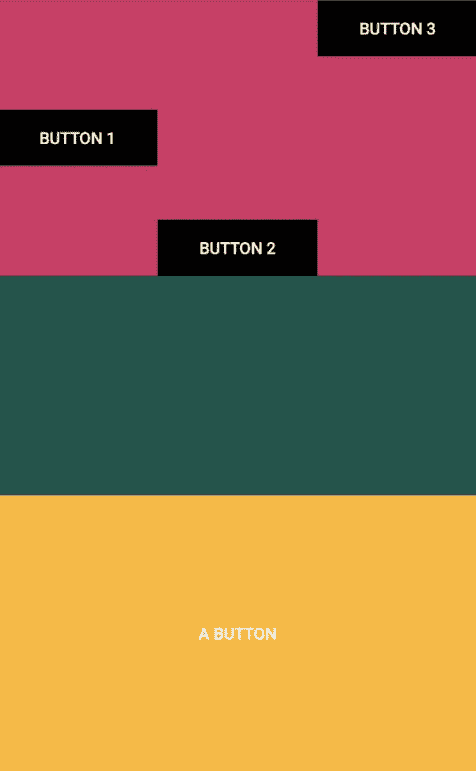
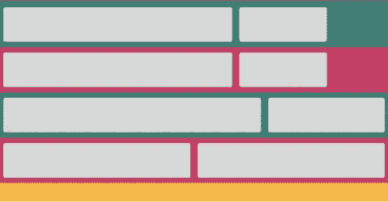
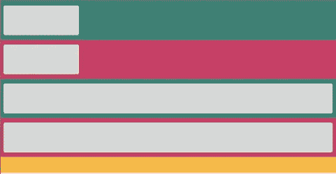
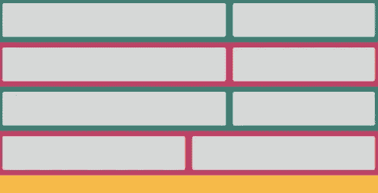
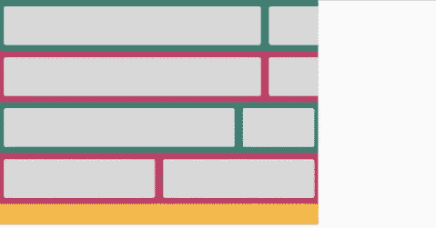
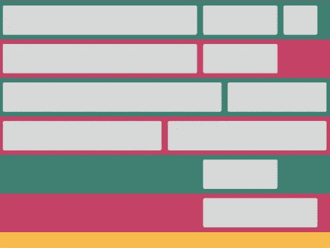

# android 中的表格布局教程

> 原文：<https://medium.com/analytics-vidhya/tablelayout-in-android-a-tutorial-7db89382f9a2?source=collection_archive---------8----------------------->

一个`TableLayout` ***首先是一个*** `LinearLayout`带有一个`vertical`方位，所以`LinearLayout`的属性，比如重量，适用于一个`TableLayout`。`layout_weight`就是剩余空闲空间的划分方式。

```
<?xml version="1.0" encoding="utf-8"?>

<TableLayout

    xmlns:android="http://schemas.android.com/apk/res/android"
    xmlns:tools="http://schemas.android.com/tools"
    android:layout_width="match_parent"
    android:layout_height="match_parent"
    tools:context=".MainActivity">

    <TableRow
        android:layout_weight="1"
        android:background="@color/colorAccent"/>

    <Button
        android:layout_weight="1"
        android:background="@color/colorPrimaryDark" />

    <TextView
        android:layout_weight="1"
        android:background="@android:color/holo_orange_light" />

</TableLayout>
```


一个`TableLayout` ***可以包含*** `0`或更多表格行，其中一行可以是`View`或`TableRow`。

***一个*** `***View***` ***比如*** 一个`ImageView`或者一个`Button`的宽度为`MATCH_PARENT`，默认高度为`WRAP_CONTENT`。`VIEW`高度可以改变。

***A***`***TableRow***`***是*** a 类，它扩展了`LinearLayout`，并且具有`horizontal`方向。一个`TableRow`的宽度总是被设置为匹配它的父对象，如在`MATCH_PARENT`中；它的高度总是被设置为换行，如在`WRAP_CONTENT`中。

一个`TableRow`是一个`LinearLayout`，重量的 ***概念*** 同样适用。剩余的自由空间是如何划分的。

```
<?xml version="1.0" encoding="utf-8"?>

<TableLayout

    xmlns:android="http://schemas.android.com/apk/res/android"
    xmlns:tools="http://schemas.android.com/tools"
    android:layout_width="match_parent"
    android:layout_height="match_parent"
    tools:context=".MainActivity">

    <TableRow android:layout_weight="1"
              android:background="@color/colorAccent">

        <Button
            android:layout_gravity="center_vertical"
            android:layout_width="0dp"
            android:layout_weight="1"
            android:layout_height="wrap_content"
            android:background="@android:color/black"
            android:text="Button 1"
            android:textColor="@android:color/white" />

        <Button
            android:layout_gravity="bottom"
            android:layout_width="0dp"
            android:layout_weight="1"
            android:layout_height="wrap_content"
            android:background="@android:color/black"
            android:text="Button 2"
            android:textColor="@android:color/white" />

        <Button
            android:layout_width="0dp"
            android:layout_weight="1"
            android:layout_height="wrap_content"
            android:background="@android:color/black"
            android:text="Button 3"
            android:textColor="@android:color/white" />
    </TableRow>

    <TableRow android:layout_weight="1"
              android:background="@color/colorPrimaryDark" />

    <Button
        android:layout_weight="1"
        android:text="A Button"
        android:textColor="@android:color/white"
        android:background="@android:color/holo_orange_light" />

</TableLayout>
```



***`Tablelayout`的一个新增功能*** 是单元格和列的概念。

***一个单元格只是*** 一行的子单元格。

***一列是由*** 垂直方向的单元格组成。列数是所有行的最大单元格数。列的宽度是其给定单元格的最大宽度，列中单元格的宽度将与列的宽度相匹配，除非使用了加权。

```
<!-- Example three -->

<?xml version="1.0" encoding="utf-8"?>

<TableLayout

    xmlns:android="http://schemas.android.com/apk/res/android"
    xmlns:tools="http://schemas.android.com/tools"
    android:layout_width="match_parent"
    android:layout_height="match_parent"
    tools:context=".MainActivity">

    <TableRow android:background="@color/colorPrimary">
        <Button
            android:layout_width="250dp" />
        <Button
            android:layout_width="100dp" />
    </TableRow>

    <TableRow android:background="@color/colorAccent">
        <Button
            android:layout_width="0dp" />
        <Button />
    </TableRow>

    <TableRow  android:background="@color/colorPrimary">
        <Button
            android:layout_width="1dp"
            android:layout_weight="1" />
        <Button
            android:layout_width="1dp"
            android:layout_weight="1" />
    </TableRow>

    <TableRow android:background="@color/colorAccent">
        <Button
            android:layout_width="0dp"
            android:layout_weight="1" />
        <Button
            android:layout_width="0dp"
            android:layout_weight="1" />
    </TableRow>

    <TextView android:background="@android:color/holo_orange_light" />

</TableLayout>
```



在`TableLayout`中，`android:collapseColumns`属性可用于控制一列或多列 ***是否可折叠*** ，从而隐藏。这是通过指定要折叠的列的索引来完成的，用逗号分隔，如`android:collapseColumns="0"`或`android:collapseColumns="0,3"`。

因此给定前面的 ***示例，如果将索引`0`处的*** 列设置为可折叠，如:

```
<?xml version="1.0" encoding="utf-8"?>

<TableLayout

    xmlns:android="http://schemas.android.com/apk/res/android"
    xmlns:tools="http://schemas.android.com/tools"
    android:layout_width="match_parent"
    android:layout_height="match_parent"
    tools:context=".MainActivity"

    android:collapseColumns="0">

    <TableRow android:background="@color/colorPrimary">
        <Button
            android:layout_width="250dp" />
        <Button
            android:layout_width="100dp" />
    </TableRow>

    <TableRow android:background="@color/colorAccent">
        <Button
            android:layout_width="0dp" />
        <Button />
    </TableRow>

    <TableRow  android:background="@color/colorPrimary">
        <Button
            android:layout_width="1dp"
            android:layout_weight="1" />
        <Button
            android:layout_width="1dp"
            android:layout_weight="1" />
    </TableRow>

    <TableRow android:background="@color/colorAccent">
        <Button
            android:layout_width="0dp"
            android:layout_weight="1" />
        <Button
            android:layout_width="0dp"
            android:layout_weight="1" />
    </TableRow>

    <TextView android:background="@android:color/holo_orange_light" />

</TableLayout>
```

然后将 ***的新结局与*** 的旧结局相比较，就是:



通过使用`TableLayout`属性`android:stretchColumns`，一个列也可以在其`TableLayout`中 ***设置为可拉伸*** 。可以指定一个或多个索引，例如，`android:stretchColumns="0"`或`android:stretchColumns="1,3"`。在这种情况下，指定的列将被拉伸以填充可用的空白空间。

因此，如果要重新考虑 ***示例三*** ，则将索引`1`处的列设置为可拉伸的，如下所示:

```
<?xml version="1.0" encoding="utf-8"?>

<TableLayout

    xmlns:android="http://schemas.android.com/apk/res/android"
    xmlns:tools="http://schemas.android.com/tools"
    android:layout_width="match_parent"
    android:layout_height="match_parent"
    tools:context=".MainActivity"

    android:stretchColumns="1" >

    <TableRow android:background="@color/colorPrimary">
        <Button
            android:layout_width="250dp" />
        <Button
            android:layout_width="100dp" />
    </TableRow>

    <TableRow android:background="@color/colorAccent">
        <Button
            android:layout_width="0dp" />
        <Button />
    </TableRow>

    <TableRow  android:background="@color/colorPrimary">
        <Button
            android:layout_width="1dp"
            android:layout_weight="1" />
        <Button
            android:layout_width="1dp"
            android:layout_weight="1" />
    </TableRow>

    <TableRow android:background="@color/colorAccent">
        <Button
            android:layout_width="0dp"
            android:layout_weight="1" />
        <Button
            android:layout_width="0dp"
            android:layout_weight="1" />
    </TableRow>

    <TextView android:background="@android:color/holo_orange_light" />

</TableLayout>
```

*将示例三结果*与当前结果进行比较，得出:



通过使用`TableLayout`属性`android:shrinkColumns`，也可以将 ***列设置为可收缩的*** ，其中可以指定`1`或更多列，用逗号分隔，如`android:shrinkColumns="1,4"`所示。在这种情况下，指定的列将收缩，以适应`TableLayout`宽度。

因此，如果 ***示例三被重新获取*** ，并且如果指定了`300dp`的宽度，并且设置了`android:shrinkColumns="1"`属性，如下所示:

```
<?xml version="1.0" encoding="utf-8"?>

<TableLayout

    xmlns:android="http://schemas.android.com/apk/res/android"
    xmlns:tools="http://schemas.android.com/tools"
    android:layout_width="300dp"
    android:layout_height="match_parent"
    tools:context=".MainActivity"

    android:shrinkColumns="1">

    <TableRow android:background="@color/colorPrimary">
        <Button
            android:layout_width="250dp" />
        <Button
            android:layout_width="100dp" />
    </TableRow>

    <TableRow android:background="@color/colorAccent">
        <Button
            android:layout_width="0dp" />
        <Button />
    </TableRow>

    <TableRow  android:background="@color/colorPrimary">
        <Button
            android:layout_width="1dp"
            android:layout_weight="1" />
        <Button
            android:layout_width="1dp"
            android:layout_weight="1" />
    </TableRow>

    <TableRow android:background="@color/colorAccent">
        <Button
            android:layout_width="0dp"
            android:layout_weight="1" />
        <Button
            android:layout_width="0dp"
            android:layout_weight="1" />
    </TableRow>

    <TextView android:background="@android:color/holo_orange_light" />

</TableLayout>
```

然后 ***对比未设置*** 的`shrinkColumns`属性，结果会是:



由于一行中的列数被指定为所有行的最大单元格数，如果需要的是一些具有较少单元格的行，或者换句话说跨越多列的 ***单元格*呢？**

这个问题的答案是使用`android:layout_span`属性，如在`android:layout_span="2"`中，指定一个单元格将跨越的列数，这意味着一个单元格将包含的列数。

一个单元格总是遵循自然的定位流程，它的 ***可以使用`layout_column`属性定位到特定列的*** ，就像在`android:layout_column="1"`中一样。所以在这个例子中，它将被放置在列`1`中。

***关于前面的`2`属性的一个例子*** 是:

```
<?xml version="1.0" encoding="utf-8"?>

<TableLayout

    xmlns:android="http://schemas.android.com/apk/res/android"
    xmlns:tools="http://schemas.android.com/tools"
    android:layout_width="match_parent"
    android:layout_height="match_parent"
    tools:context=".MainActivity">

    <TableRow android:background="@color/colorPrimary">
        <Button
            android:layout_width="250dp" />
        <Button
            android:layout_width="100dp" />
        <Button
            android:layout_width="50dp" />
    </TableRow>

    <TableRow android:background="@color/colorAccent">
        <Button
            android:layout_width="0dp" />
        <Button />
    </TableRow>

    <TableRow  android:background="@color/colorPrimary">
        <Button
            android:layout_width="1dp"
            android:layout_weight="1" />
        <Button
            android:layout_width="1dp"
            android:layout_weight="1" />
    </TableRow>

    <TableRow android:background="@color/colorAccent">
        <Button
            android:layout_width="0dp"
            android:layout_weight="1" />
        <Button
            android:layout_width="0dp"
            android:layout_weight="1" />
    </TableRow>

    <TableRow android:background="@color/colorPrimary">
        <Button
            android:layout_column="1" />
    </TableRow>

    <TableRow android:background="@color/colorAccent">
        <Button
            android:layout_column="1"
            android:layout_span="2"
            />
    </TableRow>

    <TextView android:background="@android:color/holo_orange_light" />

</TableLayout>
```

**前面的 xml 代码如下:**

****

***原载于 2021 年 3 月 13 日 https://difyel.com*[](https://difyel.com/android/tablelayout-a-tutorial)**。****