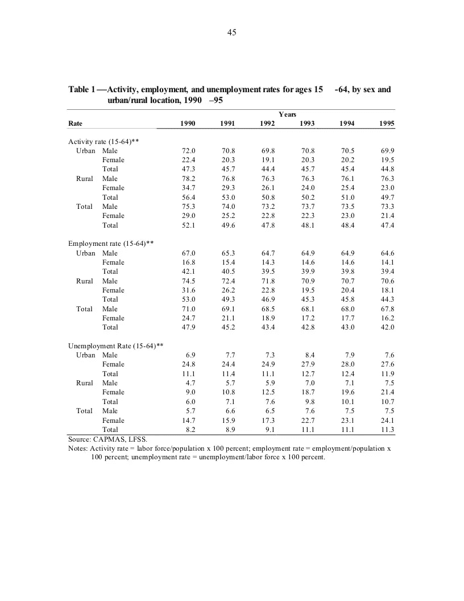
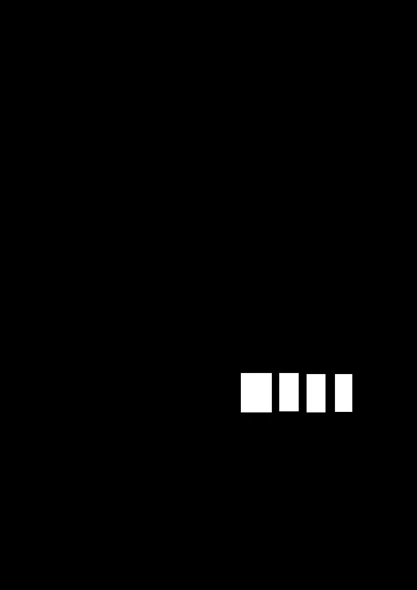
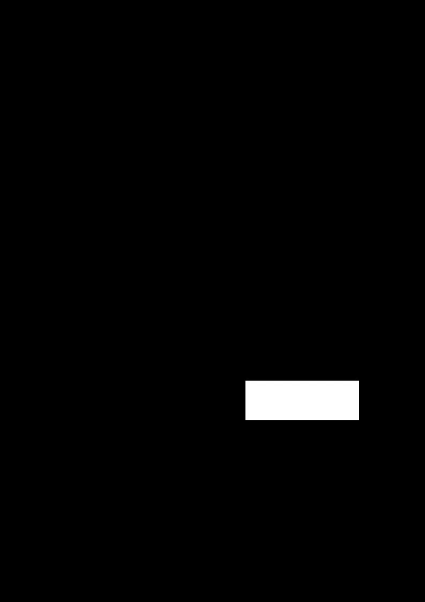
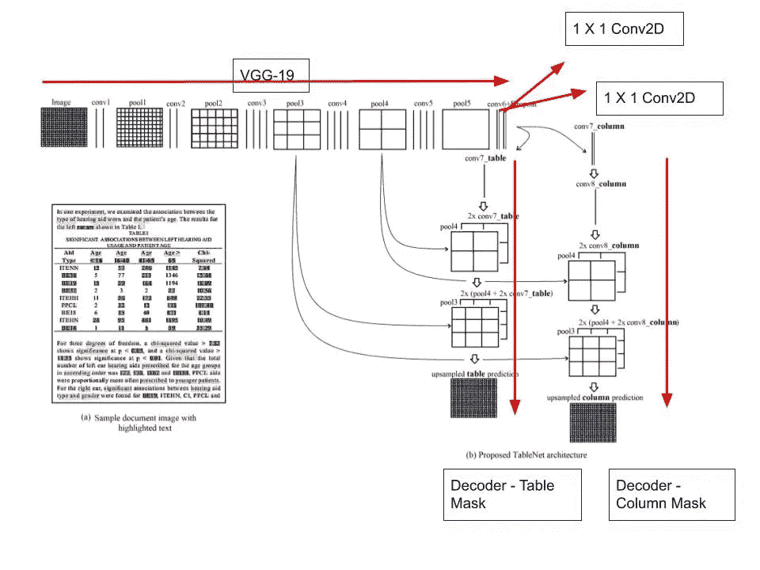
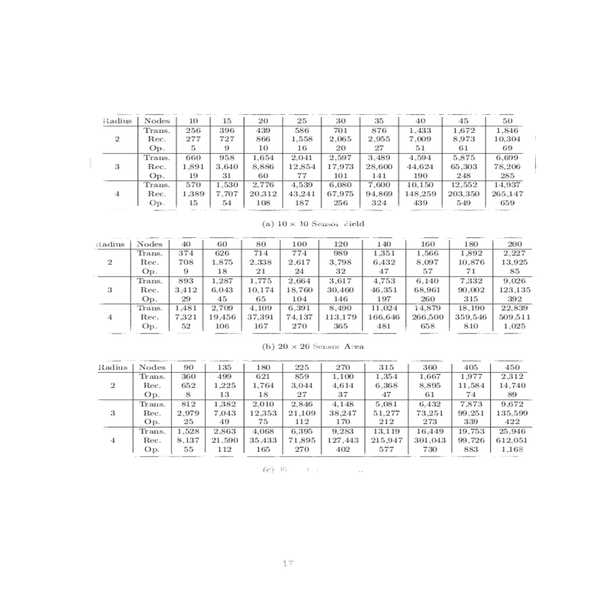
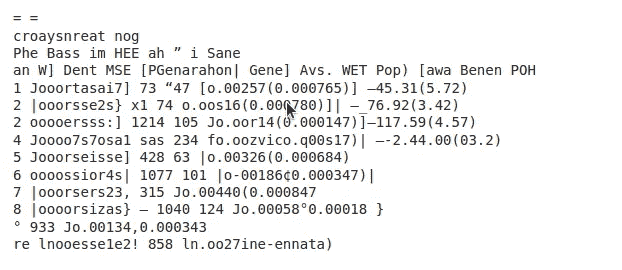

# TableNet:深度学习模型，用于从扫描的文档图像中进行端到端表格检测和表格数据提取

> 原文：<https://medium.com/analytics-vidhya/tablenet-deep-learning-model-for-end-to-end-table-detection-and-tabular-data-extraction-from-1961fb2f97e1?source=collection_archive---------1----------------------->

计算机视觉是计算机看到和识别物体的媒介。计算机视觉的目标是使计算机能够分析图像和视频中的对象，解决不同的视觉问题。对象分割为方便分析图像和视频中的对象铺平了道路，为不同领域做出了巨大贡献，如医学、自动驾驶汽车中的视觉以及图像和视频中的背景编辑。

在这篇博客中，我将讨论一篇**研究论文** **TableNet:** 一个深度学习模型，通过分割出表格和列区域，从文档图像中进行表格检测和结构识别。

# 目录

1.  介绍
2.  数据集源
3.  问题陈述
4.  映射到 ML/DL 问题
5.  数据集准备
6.  数据预处理
7.  模型开发
8.  表格数据提取
9.  部署
10.  未来的工作
11.  轮廓
12.  参考

# 1.介绍

随着越来越多的移动设备配备了摄像头，越来越多的客户通过这些设备上传文档，使得从这些图像中提取信息的需求更加迫切。目前，这些文档图像通常是手动处理的，导致劳动力成本高和数据处理时间效率低。

大多数现有的表格信息抽取方法将问题分成两个独立的子问题，即**表格检测**、**表格结构识别、**，试图独立解决每个子问题。

**TableNet** 获取单个输入图像，并为表和列生成两个不同的语义标记的输出图像。该模型通过使用预训练的 **VGG-19 作为基础网络**，然后通过使用从 VGG-19 提取的特征使用**两个解码器分支**来做到这一点。一个解码器分支负责对表区域进行**分割，另一个分支负责对列区域**进行**分割。检测到表格和列区域后，可以使用 **Tesseract OCR 提取表格数据。****

# **2。数据集来源**

TableNet 模型在 marmot 数据集上训练，该数据集包含扫描的文档图像及其对应的 XML 文件。XML 文件包含关于表格和列区域在各个扫描文档图像中的位置的信息。

 [## 土拨鼠 _ 数据-谷歌驱动

### 编辑描述

drive.google.com](https://drive.google.com/drive/folders/1410iMmQCXbA9GJP5CqLEMfjjv-hOWlac?usp=sharing) 

# 3.问题陈述

1.  如果存在任何表格状结构，则从图像中分割出表格区域。
2.  从表中提取数据。

# 4.映射到 ML/DL 问题

为了从给定的输入图像中提取表格信息，我们需要从输入图像中分割出表格和列区域。我们可以将**扫描图像视为输入**，将**表格掩码和列掩码视为输出**。因此，我们需要对每个像素进行分类，即像素是否属于表格。我们可以把这个问题解释为分类问题(**分割任务**)。

**绩效指标**—**F1-得分**。
F1 得分同等考虑**精度**和**召回**，即**假阴性**和**假阳性**案例将被同等扣分。

# 5.数据集准备

从给定的 marmot 数据集，我们在。BMP 格式和相应的 XML 文件。XML 文件包含图像中每一列的坐标。

样本输入图像

给定图像的示例 xml 文件

XML 文件包含许多元素，如文件名、路径、大小、对象。**文件名**定义了相应图像的名称。**尺寸**表示输入图像的尺寸。**对象**给出列坐标。每个对象元素都是输入图像中的一列。

我们可以看到，对于每一个 **<对象>** 我们都有**<>**元素，在 **< bndbox >** 内部我们有 **xmin** ， **ymin** ， **xmax** ， **ymax，**给出列(xmin，ymin) (xmax，ymax)的坐标。从给定的 XML 文件中，我们需要创建表掩码和列掩码图像。下面我给出了从 XML 文件中提取信息的代码，以创建表格和列掩码。从 XML 文件创建遮罩时，用像素值 255 填充带框区域，如果不是带框区域，则填充 0。

从 XML 文件创建掩码的示例代码

对于每个输入图像，我们需要生成表掩码和列掩码。我们将输入图像和 2 个蒙版保存为 JPEG 文件格式。**创建一个熊猫数据帧，有 3 列** - **原始 _ 图像 _ 路径**、**表格 _ 掩码 _ 路径**、**列 _ 掩码 _ 路径**。

样品柱掩模

样本表掩码

# **6。数据预处理**

研究论文建议将输入图像的尺寸调整为 1024*1024。图像只不过是矩阵。我们的输入图像是 RGB 图像，因此每个像素有 3 个值(红、绿、蓝)。为了训练出 TableNet 模型，我们需要将图像加载到内存，然后开始训练过程。但是由于内存的限制，所有的图像不能一次加载到内存中。因此，我们需要一个数据加载器，它将包含批量图像，并通过定义的图像批量模型进行训练。

数据集对象是从熊猫系列创建的。

在为训练和测试创建数据集对象之后，我们将读取每个图像、保存的表掩码、列掩码。文件图像的尺寸调整为 1024*1024*3，屏蔽图像的尺寸调整为 1024*1024*1，即灰度图像。文档图像中的每个像素值可以在 0 到 255 之间。每个图像通过除以 255.0 进行归一化，因此像素值将在 0-1 之间缩放。

数据集对象被给定一个批量大小，因此数据集对象将在给定批量图像中发出图像。

# 7.模型开发

**TableNet** 模型主要由 3 部分组成。
**i .编码器(VGG-19)**
**ii .**
**iii 解码器(表格掩码生成器)。解码器(列掩码生成器)**

TableNet 模型体系结构

TableNet 模型背后的直觉是使用预训练的 VGG-19 模型从输入图像中提取特征，然后通过 2 个解码器分支处理提取的特征，以生成屏蔽输出。编码器层将对图像进行下采样，解码器层将对图像进行上采样。

## 一.编码器

模型输入尺寸为 1024*1024*3。然后，输入图像在没有完全连接层的情况下通过预训练的 VGG-19 模型，从而产生特征向量，该特征向量将被传递到两个解码器分支。

然后，经过下采样的输入图像通过两个 1x1 conv2D 层进行处理。

使用(1x1)卷积背后的直觉是降低特征图(通道)的维度，该特征图用于像素的类别预测。

## 二。解码器(表格掩码)

经过两个 conv2D 层后的缩减采样图像，再次经过一个 1x1 conv2D 层处理。然后借助跳池技术，将解码器网络的低分辨率特征映射与编码器网络的高分辨率特征相结合。在向上采样之后，我们将得到形状(1024*1024*2)的输出表掩码。输出图像有 2 个通道，因为我们有 2 个类别标签(背景，蒙版区域)。为了预测像素值的输出值，我们需要选择预测概率高的类。

## 三。解码器(列掩码)

来自 1x1 conv2D 层的特征向量被传递到解码器(列掩码)，但与表解码器不同，输入特征向量通过两个 1*1 conv2D 层进行处理，然后在样本图像中使用跳池技术。列解码器的输出为 1024*1024*2。

# 8.表格数据提取

形状(1，1024，1024，3)的输入图像被传递给模型，模型预测形状(1，1024，1024，2)的 col_mask 和 table_mask。我们需要使用 argmax 提取最大概率类。然后图像以 PNG 格式保存。然后，我们从输出蒙版中提取阿尔法通道，这样我们就可以将该阿尔法通道添加到输入图像中，以遮盖原始图像。

掩蔽图像

之后，我们将通过 Tesseract OCR 进行处理，以提取表格数据。

# 9.部署

使用 Flask 在本地系统中部署模型。代码可以在[这里](https://github.com/green93/TableNet-model-deployment-using-Flask)找到。

# 10.未来的工作

a.模型的性能可以进一步提高，但由于缺乏计算能力，我们受到限制。

# 11.轮廓

在 [LinkedIn](https://www.linkedin.com/in/devi-prasad-69865b177/) 和我联系。[这个](https://github.com/green93/TableNet-Deep-Learning-model-for-Tabular-Data-Extraction-from-Scanned-Document-Image)是 github 全部代码的仓库。

# 12.参考

1.  [https://arxiv.org/pdf/2001.01469.pdf](https://arxiv.org/pdf/2001.01469.pdf)
2.  [https://www . Applied ai course . com/course/11/Applied-Machine-learning-course](https://www.appliedaicourse.com/course/11/Applied-Machine-learning-course)
3.  [https://www.tensorflow.org/tutorials/images/segmentation](https://www.tensorflow.org/tutorials/images/segmentation)