# TableNet:深度学习模型，用于从扫描的文档图像中进行端到端表格检测和表格数据提取

> 原文：<https://medium.com/analytics-vidhya/tablenet-deep-learning-model-for-end-to-end-table-detection-and-tabular-data-extraction-from-a26790097a50?source=collection_archive---------6----------------------->


[斯科特·格雷厄姆](https://unsplash.com/@homajob?utm_source=medium&utm_medium=referral)在 [Unsplash](https://unsplash.com?utm_source=medium&utm_medium=referral) 上拍照

在现代，智能手机和扫描仪被广泛用于拍摄和分享重要文件的图像。这些文档中的许多信息都存储在表格中。从表中提取文本信息的需求变得非常迫切。目前，这种信息提取是手动执行的，这需要大量的工作和相当多的时间。因此，拥有一个可以执行这项任务的深度学习模型将节省我们大量的精力和时间。

在这篇博客中，我将讨论一篇研究论文[**【TableNet】**](https://arxiv.org/abs/2001.01469)，发表于*2020 年 1 月*由[*Shubham Pali wal*](https://arxiv.org/search/cs?searchtype=author&query=Paliwal%2C+S)*，*[*Vishwanath D*](https://arxiv.org/search/cs?searchtype=author&query=D%2C+V)*，*[*Rohit Rahul**，*](https://arxiv.org/search/cs?searchtype=author&query=Rahul%2C+R)[](https://arxiv.org/search/cs?searchtype=author&query=Sharma%2C+M)

# *目录:*

1.  *介绍*
2.  *资料组*
3.  *问题陈述*
4.  *映射到 ML/DL 问题*
5.  *性能指标*
6.  *分析数据集并制作掩模图像。*
7.  *数据预处理*
8.  *模型架构和培训*
9.  *从图像中提取表格*
10.  *在 Streamlit 上部署*
11.  *丰富*
12.  *参考*
13.  *联系我*

# *介绍*

*从表中提取数据的任务带来了一系列新的挑战:*

> *I .表格区域的精确检测称为**表格检测。***
> 
> *二。从被检测表格的行和列中检测和提取信息称为**表格结构识别。***

*这个问题的现有技术解决方案已经通过使用专用于单独任务的两个独立模型解决了这些问题。然而，考虑到这两个任务的相互依赖性，用一个单一的模型来做是有益的。*

***TableNet** 就是这样一个深度学习模型，它只使用一个网络来同时解决这两个任务。它是一个端到端的模型，将文档的 1024x1024 分辨率的图像**作为输入，并产生两个语义标记的输出，*一个用于图像*中的表，*一个用于表*中的列，分别称为*表和列掩码**。*一旦生成这些蒙版，使用表格蒙版从图像中过滤出表格，并使用 **Tesseract OCR 模块**[**pytesse ract**](https://pypi.org/project/pytesseract/)**从表格中提取文本信息。*****

***至于模型的架构，它类似于*编码器-解码器模型*，编码器对图像中表格的位置和结构信息进行编码，解码器使用这些信息为表格和列生成掩码。对于编码器，使用在 ImageNet 数据集上预先训练的 *VGG-19 模型。随后是两个单独的解码器分支，分别用于表和列的分段。解码器分支彼此独立地被训练，而编码器可以使用来自两个解码器的梯度来微调。然而，在这篇博客中，我没有微调编码器，并将其设置为不可训练。****

## ***资料组***

***这里使用的数据集是 **Marmot 表识别数据集。**Marmot 表检测数据集是一个表检测数据集，但它不包含用于列检测的基础真值。因此，作者手动注释了数据集中所有图像的列，以了解列的基本情况。marmot 数据集总共包含 1016 张图像，其中 509 张是英文文档，其余是中文文档。对于培训，仅使用英文文档。数据集包含中的图像。bmp 格式和一个对应于每个图像的 XML 文件，该文件包含文档中每列边界框的坐标。***

***数据集可以从这里下载:***

***[](https://drive.google.com/drive/folders/1410iMmQCXbA9GJP5CqLEMfjjv-hOWlac) [## Marmot_data -谷歌驱动

### 编辑描述

drive.google.com](https://drive.google.com/drive/folders/1410iMmQCXbA9GJP5CqLEMfjjv-hOWlac) 

# 问题陈述

1.  如果图像中存在任何表，则对输入图像中的表的表掩码和列掩码进行分段。
2.  使用表格遮罩，从图像中过滤表格，并使用 OCR 提取表格的内容。

# 映射到 ML/DL 模型

为了从图像中提取表格，我们需要首先从图像中分割出表格和列，并为每个图像创建一个表格和列掩码。图像将是我们模型的输入，表和列掩码将是输出。因此，这个问题可以被认为是一个*图像分割*问题。

# 性能指标

我们将用于评估车型性能的性能指标是 **F1 得分。**这也是原文中使用的指标。使用 F1 分数作为衡量标准的原因是，我们希望模型完成的分割是纯 T4 和完整的。

> **纯:**由模型创建的遮罩不包含不在表格区域中的图像的任何部分。
> 
> **完成:**模型创建的遮罩不会遗漏图像中的任何表格区域。

蒙版的*纯度*可以认为是模型的*精度*，蒙版的*完整性*可以认为是模型的*召回*，因此 F1 评分是一个很好的评估选择。为了评估，计算每幅图像的 F1 分数，然后平均得到最终分数。

# 分析数据并制作掩模图像

首先，让我们看看数据中的一些图像，以了解我们正在处理哪种图像和表格:

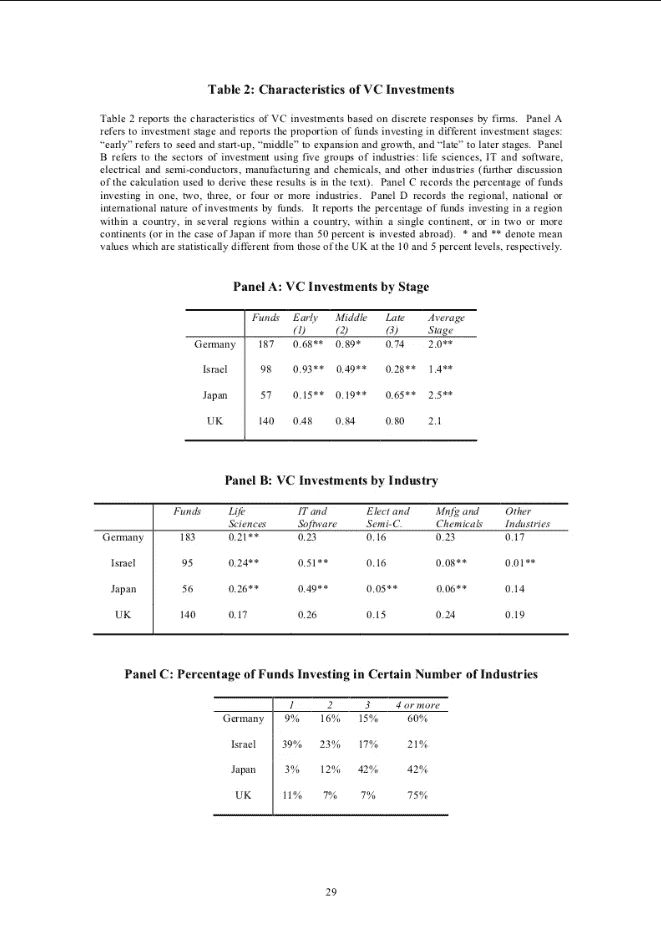

来自旱獭数据集的样本图像

查看数据集中的一些图像后，可以观察到以下情况:

> 表格出现在整个图像中。他们没有特定的位置。
> 
> 它们也没有固定的大小。一些图像中的表格非常小，而一些图像中的表格相当大。一些图像甚至可能只有一个表格。
> 
> 说到表结构，所有图像中的表都非常不同。有些表格在列、行之间有明确的边界，表格也被边界包围。而有些只有列或行之间的分隔。
> 
> 查看一个图像中的表的数量，我们可以看到这里也有相当多的多样性，有些图像只有一个表，有些有两个，有些有三个。

现在，让我们来看看其中一幅图像的 XML 文件:

XML 文件包含几个标签，如文件名、路径、大小、对象等。文件名标签包含 XML 文件所属图像的名称。*尺寸*标签表示图像的尺寸。*对象*标签包含列的边界框坐标。

对于每个 **<对象>，**我们有一个 **< bndbox >** 元素，它包含 **xmin，ymin，xmax** 和 **ymax** ，这些元素包含列边界框的相应点的坐标。因为 XML 文件只包含列边界框的坐标，所以表格边界框的坐标必须从这些坐标中导出。下面是从 XML 文件创建蒙版图像的代码:

用于创建遮罩的辅助函数

为每个图像创建遮罩。

对于每个图像，我们使用上面定义的函数创建一个**表格掩码** 和一个**列掩码** ，给定它的 **XML 文件**。然后，我们制作一个包含列的数据帧，这些列包含图像的路径、相应的表掩码和列掩码。

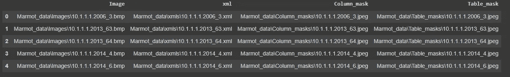

数据帧

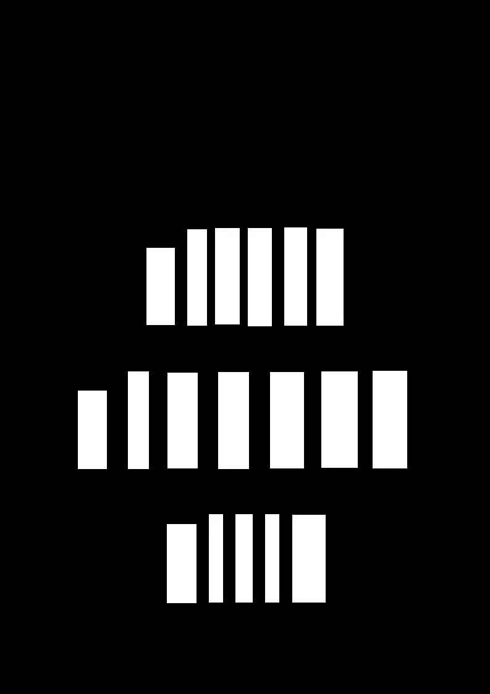

样品柱掩模


样本表掩码

# 数据预处理

在这一节中，我们将讨论如何构建一个定制的数据生成器/数据加载器，用于向模型提供数据以进行训练，以及我们将应用于图像的所有预处理。但在此之前，我们需要首先将数据集分成训练集和测试集。我们将对训练和测试数据分别使用 80–20%的比率。

列车测试分离

由于数据集中大约有 **495 张图像**并且*每张图像有几兆字节，*不可能在训练期间将它们全部加载到 RAM 中。因此，我们将不得不创建一个定制的输入管道，以便在训练过程中向模型提供数据。为此，我们将使用 [tf.data.dataset](https://www.tensorflow.org/tutorials/load_data/images) 创建一个定制的输入管道。

tf.data.dataset 对象

所有图像都是 RGB 图像，因此它们分别具有红色、蓝色和绿色的 3 个通道。然而，它们没有固定的分辨率，因此，我们必须将它们调整到固定的大小，本文建议将图像调整到 **1024x1024** 。因此，掩模图像也被调整到 **1024x1024x1** 。之后，我们将通过将每个像素值除以 **255 来归一化所有图像。**

上述函数从各自的路径加载图像及其各自的遮罩，并对其进行预处理。它最终返回一个元组 **(image，dictionary)** ，其中*字典包含表和列掩码*。在此之后，我们将[配置上述训练和测试数据集，以便在训练时获得更好的性能](https://www.tensorflow.org/tutorials/load_data/images#configure_dataset_for_performance)。我们需要这样做，因为在训练期间，我们希望数据是:

> 洗得很好
> 
> 成批的
> 
> 尽快提供批次

配置数据集以获得更好的性能

# 模型架构和培训

现在一切都准备好了，接下来就是我们做模型架构，最后训练的时候了。TableNet 体系结构类似于编码器-解码器模型，其中一个编码器将对图像中的表格信息进行编码，两个解码器将使用编码信息分别创建表和列掩码。

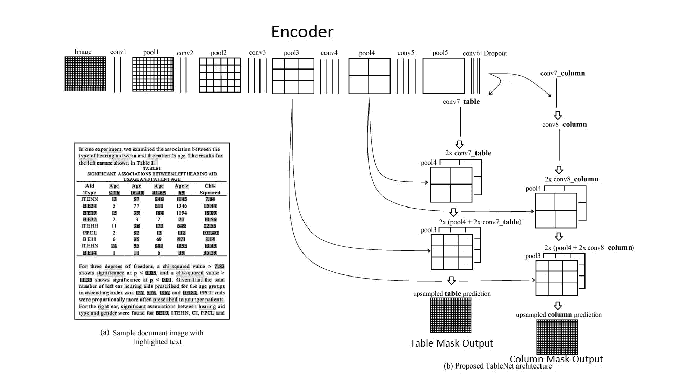

TableNet 架构

## A.编码器

研究论文使用的编码器是在 ImageNet 数据集上预先训练的 *VGG-19 模型。*VGG-19 型号的重量设置为不可训练，在训练期间不会改变。在 VGG-19 模型的最后一层之后，*使用两个 1x1 卷积层，后面是丢失率为 0.2 的丢失层*。这就完成了模型的编码器部分。

TableNet 架构

除了使用论文中提到的 VGG-19 编码器，我还决定使用不同的架构，看看这是否会导致模型性能的任何变化。我使用了以下编码器:

**一、VGG-19(默认)**

**二。ResNet-50**

**三。DenseNet-121**

对于最终模型，将选择三种模型中性能最佳的模型/编码器。

## B.表格解码器

表解码器是 TableNet 模型中的两个解码器之一。它负责从输入图像中分割表格。表解码器的架构如下:

> 张量= 1x1 卷积(编码器 _ 输出)
> 
> 张量=向上扩展(张量，2x) +池 4
> 
> 张量=向上扩展(张量，2x) +池 3
> 
> 张量=放大(张量，以匹配输入维度，即 1024x1024) ->这将是表解码器的最终输出。

表格解码器将被定义为[自定义张量流层](https://www.tensorflow.org/tutorials/customization/custom_layers)。

自定义表格解码器层

## B.列解码器

列解码器将是模型的第二个解码器。它将负责从图像中分割出列，并构建一个*列遮罩。*列解码器的架构如下:

> 张量= 1x1 卷积和 ReLU 激活(编码器 _ 输出)
> 
> 张量=下降(0.8，张量)
> 
> 张量= 1x1 卷积(张量)
> 
> 张量=向上扩展(张量，2x) +池 4
> 
> 张量=升级(高音，2x) +池 3
> 
> tensor = Upscaling(tensor，以匹配输入维度，即 1024x1024) ->这将是列解码器的最终输出

列解码器也将被定义为自定义张量流层。

列解码器的自定义层

## 培训详情

所有三个模型都被训练了 *20 个周期*。优化器是学习率=0.0001 和*ε= 1e-8 的*亚当。稀疏分类交叉熵*被选为两个输出的模型的损失函数，并且 *F1 分数*被用作两个输出的性能度量。*

模型编译以及损失和性能指标

## 每个型号的性能评审

以下是所有三种型号的性能曲线图和性能评论，曲线图将分别为*时期与型号损失、时期与列解码器的 F1 分数、时期与表解码器的 F1 分数。*

1.  **VGG-19 编码器型号:**

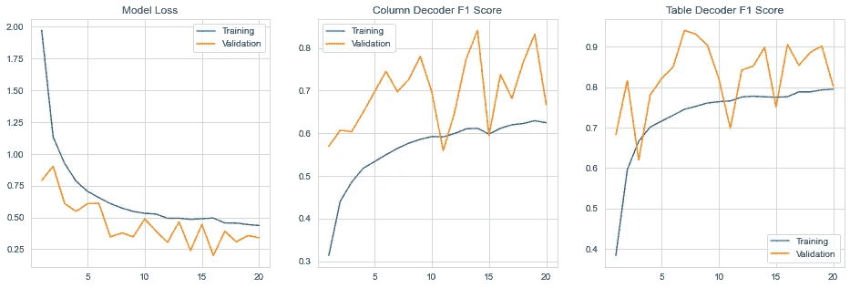

对于 VGG-19 编码器模型的性能图，每个图中的 x 轴是时期，第一个图的 y 轴是模型损耗，第二个图的列解码器的 F1 分数，第三个图的表解码器的 F1 分数。

> 注意:下面两个图是从 Tensorboard 中提取的，因此有不同的图例。这里的蓝线代表验证分数，而橙线代表训练分数。

**2。** **ResNet-50 编码器型号:**

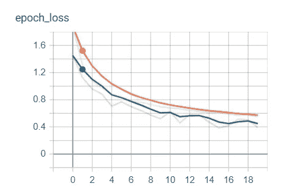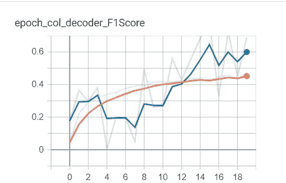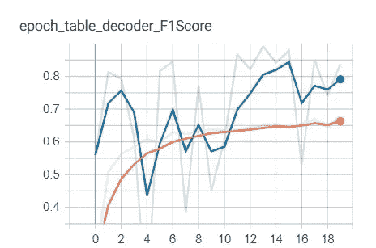

ResNet 50 编码器模型的性能图。每个图的 x 轴是时期，而第一个图的 y 轴是模型损失、第二个图的列解码器的 F1 分数和第三个图的表解码器的 F1 分数。

**3。DenseNet-121 编码器型号:**

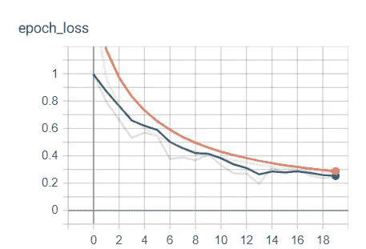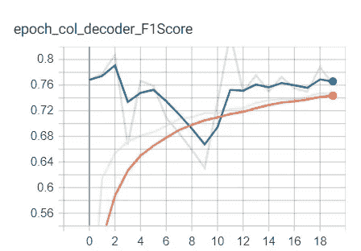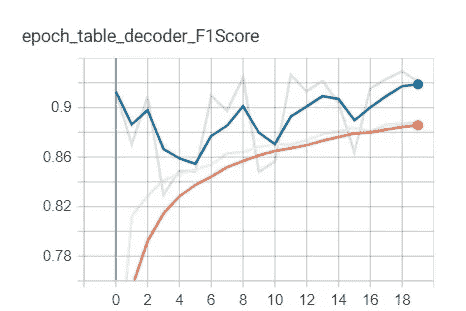

DenseNet 121 编码器模型的性能图。每个图的 x 轴是时期，而第一个图的 y 轴是模型损失、第二个图的列解码器的 F1 分数和第三个图的表解码器的 F1 分数。

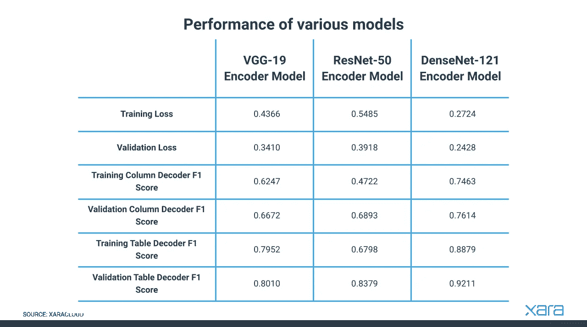

所有三种型号的性能指标。制表匠来源:[https://cloud.xara.com/](https://cloud.xara.com/)

从上面的表和图中，我们可以看到，在三种型号中，*采用 DenseNet-121 编码器的型号效果最佳。*因此，为了进一步的评估和部署，将使用该模型。

# 从图像中提取表格

为了从图像中提取表格，首先，输入图像需要作为形状为 **(1，1024，1024，3)** 的张量传递给模型，这将给出表格和列掩码作为形状为 **(1，1024，1024，2)** 的输出张量。然后我们将沿着深度执行 **argmax** 来得到最大概率得到表和列掩码的类。

然后，提取的表掩码将被用作过滤器来获取表。为此，我们将使用灰度格式的表格遮罩来改变输入图像中每个像素的 alpha 值。

从图像中提取表格并从表格中获取文本数据

上面的代码从测试数据中提取一个图像，对两个掩码进行预测，使用表掩码从图像中提取表，并显示所有 4 个图像，即原始图像、表掩码、列掩码和过滤后的表。它还从表格中提取文本并打印出来。为了从表格中提取文本，我们使用了[**pytesserac 模块**](https://pytesseract.readthedocs.io/en/latest/) **。**

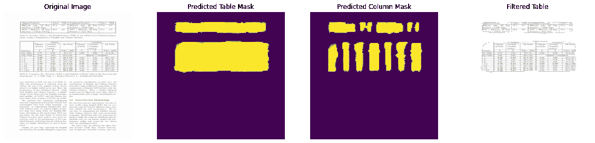

使用 TableNet 进行样本预测和表格提取。

对于上图，从表格中提取的文本如下所示:

```
Aligned Features %Ace_ SE J] Unaligned Feauwses Wrce. _%S.AIKLaws only, AN Eng. | 77.5 07 || HKLaws only, Al Eng. | 77.9 0.8
Features + CKIP Tags Features + CKIP Tags
WSJ + HKLaws, All Eng | 806 06 WSJ + HKLaws, Al Eng. | 762 0.6
eatmres + UPenn VA-Tac Features + Peri. Part.Angnea Unaligned
Change- | Creation 7] All Verbs [Change All Verbs
of-State | Transfor- of State
ation
Features F F Acc. (FE) F F Ace GFE.
Chi. Only 0.77 079° [78.1 (7) 0.82 0.80 S13 (6)
Sng. Only 0.63 0-63 62.5 (12) ‘Aligned — Unaligned
ea 0.80 0.82 81.3 (6) 0.63 0.68 62.5 2)
42 0.58 0.61 59.4 (13) 0.73 0.76 75.0 (8)
+3 0.52 0.55 53.1 (15) 0.80 0.82 81.3 (6)
+12 0.79 0.83 81.3 (6) 0.83 0.86 84-4 (5)
0.48 0.57 53.1 (15) 0.69 65.8 (10)
+13 0.79 0.83 81.3 (6) 0.67 62.5 (12)
+128 0.79 O.8F 81.3 (6) 0.62 0.74 68.8 (101
```

# 在 Streamlit 上部署

为了部署，使用 [Streamlit](https://streamlit.io/) 库制作了一个 webapp。此处的 [**代码可用**](https://github.com/AmanSavaria1402/TableNet/blob/main/app.py) 。

部署视频:

# 丰富

通过增加用于训练模型的数据量，可以提高模型的性能。

# 参考

1.  [TableNet 论文](https://arxiv.org/abs/2001.01469)
2.  [应用人工智能课程](https://www.appliedaicourse.com/)
3.  [https://medium . com/analytics-vid hya/tablenet-deep-learning-model-for-end-to-end-table-detection-and-table-data-extraction-from-1961 fb2f 97 e 1](/analytics-vidhya/tablenet-deep-learning-model-for-end-to-end-table-detection-and-tabular-data-extraction-from-1961fb2f97e1)

# 联系我

你可以在 [Linkedin](https://www.linkedin.com/in/amansavaria/) 上和我联系。整个项目的代码可以在我的 [GitHub](https://github.com/AmanSavaria1402/TableNet) 上找到。***