# 利用深度学习的表格数据扩充

> 原文：<https://medium.com/analytics-vidhya/tabular-data-augmentation-with-deep-learning-7270584e7ff?source=collection_archive---------2----------------------->

米卡·鲍梅斯特在 [Unsplash](https://unsplash.com?utm_source=medium&utm_medium=referral) 上的照片

说到深度学习，我们拥有的数据越多，获得优秀性能模型的机会就越大。在像图像识别这样的领域，研究人员已经想出了很多聪明的主意，如何利用现有的数据来创造更多的数据。这被称为数据扩充。

然而，当我们在表格数据上下文中查看深度学习时，仍然缺少许多概念。我想在这篇博文中展示的是一种增加表格数据的方法，我们可以使用它来在更多的表格数据上训练深度学习模型，或者可以用来创建代表性不足的类别的数据。

我想以图形方式展示这些新创建的数据是如何从底层数据的分布中采样的，以及这些数据如何帮助建立更好的深度学习模型。

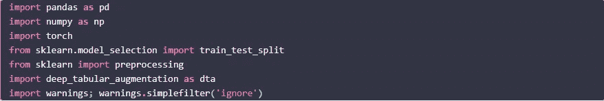

所以首先，我们需要得到一些数据。这里，我有一些关于臭名昭著的葡萄酒数据集的数据。

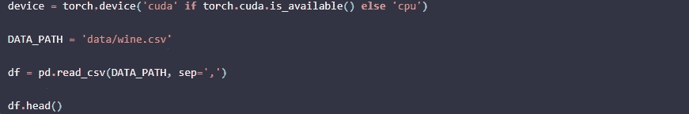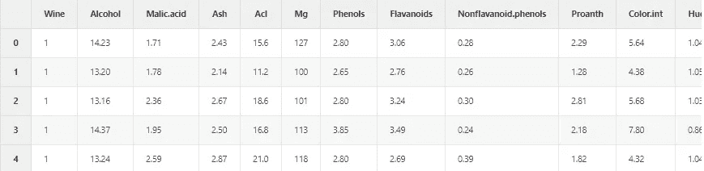

然后，我们构建一个数据加载器，在其中我们还标准化了我们的数据。我们将缩放器保存在数据集中，以便在以后反转缩放时使用。

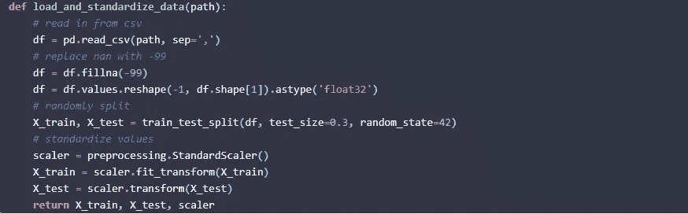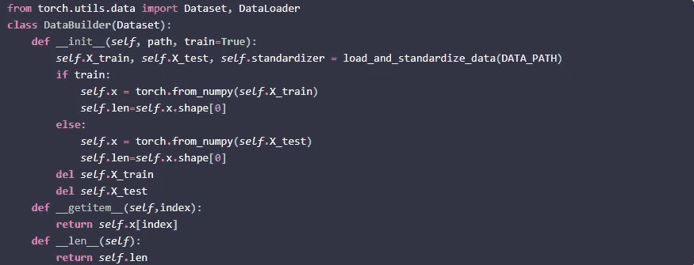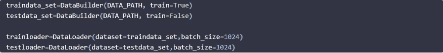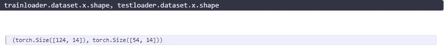

我们已经建立了我们的训练和测试数据集，在数据加载器的帮助下，我们还将它们转化为张量。所以，现在就用 deep_tabular_augmentation 吧。该类需要七个输入:trainloader、testloader、运行训练的设备、输入维度(在本例中为 14)以及第一个和第二个隐藏层应该有多少个节点。最后，我们还可以指定潜在因素的数量。这些潜在因素将包含所有浓缩的信息，这意味着我们可以使用这些潜在因素来重新创建原始的 14 个输入维度(例如，我们的数据)。

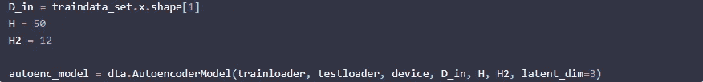

在我们成功地启动了我们的模型之后，让我们对它进行训练，并将训练好的模型称为“autoenc_model_fit”。

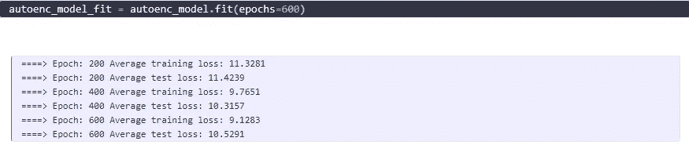

现在，我们只需要根据训练好的模型创建一些假数据。工作原理如下:我们知道潜在因素的均值和方差的学习参数。然后，我们使用具有每个潜在因素的平均值和方差的正态分布，对潜在因素 1、2 和 3 的值进行采样(因为在这种情况下我们有三个潜在因素)。这些为我们的潜在因素生成的起点然后被用于向 14 个真实输入变量膨胀。让我们看看它是如何做到的:

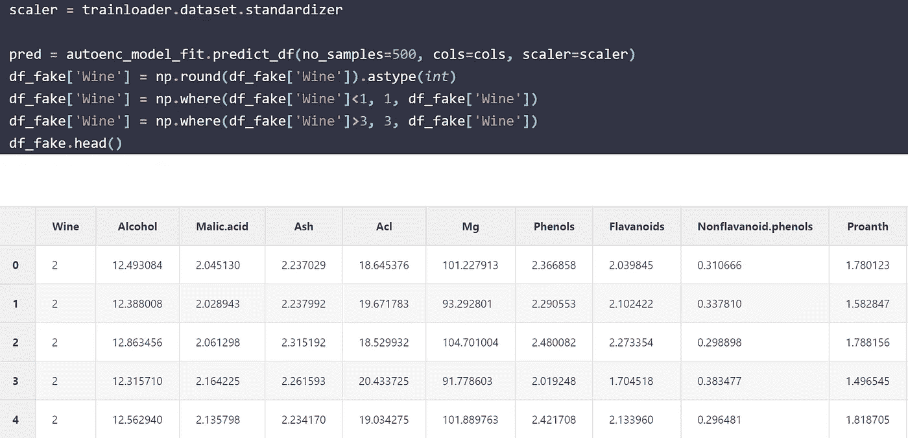

deep_tabular_augmentation 库还有另一个方法:predict_with_noise。它的作用如下，从正态分布中取样每个元素(独立于其他元素)将乘以 1 加上取样数。为什么要这样做？答案是，变分自动编码器的工作方式类似于 PCA，导致变量之间的关系更加明确。因此，变分自动编码器将平均值和标准偏差保持在变量内，然而，模型的训练参数已经找出变量之间的“隐藏”关系。当这些关系是线性时，变分自动编码器实际上执行 PCA。我们一会儿就来看看。

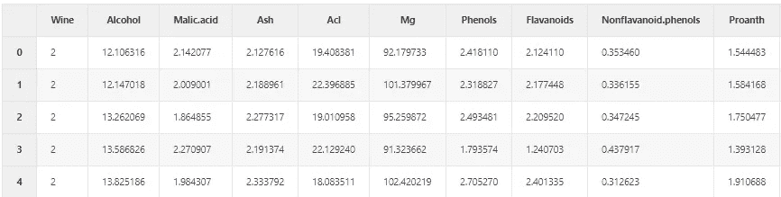

让我们来看一下描述词，尤其是意思。你能看出真实数据和虚假数据之间的区别吗？

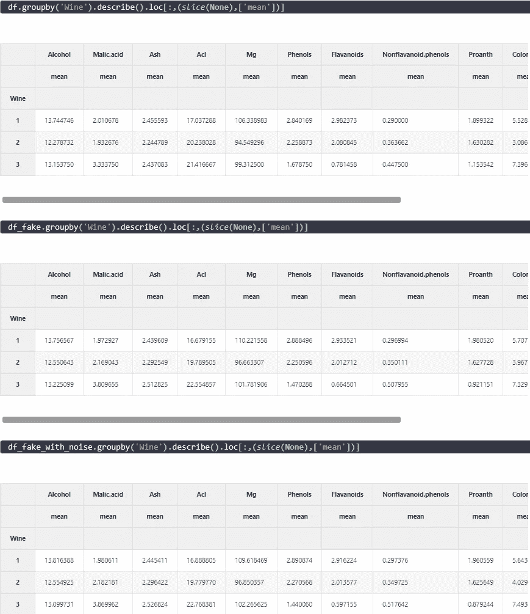

现在，让我们用图表来看看假数据与真实数据的对比。

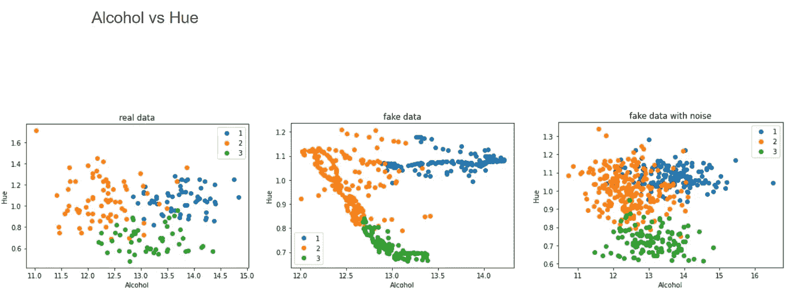

这就是我所说的“执行 PCA”的含义。人们可以清楚地看到变分自动编码器如何给出酒精和色调关系的结构。如果我们给它加上噪声，这种关系就消失了。但是，如果我们使用 3 个以上的潜在因素，会发生什么呢？这是 14 个(=输入变量)潜在因素的结果:

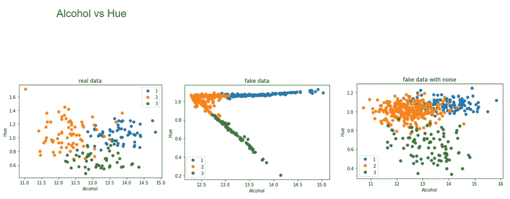

同样的模式出现了。然而，当对其应用随机噪声时，结果数据看起来非常像真实数据。

现在让我们来看看一些分布。第一个图像总是用 3 个潜在因素表示结果，第二个图像用 14 个潜在因素表示结果。

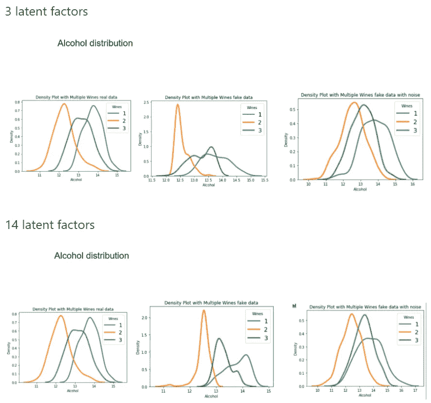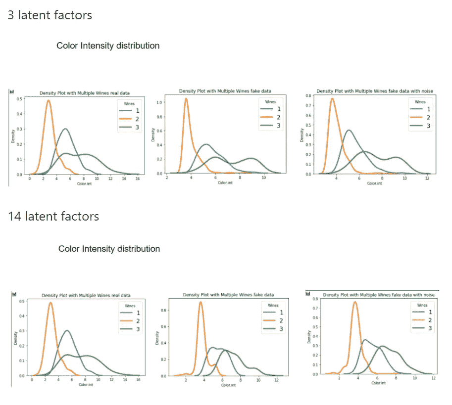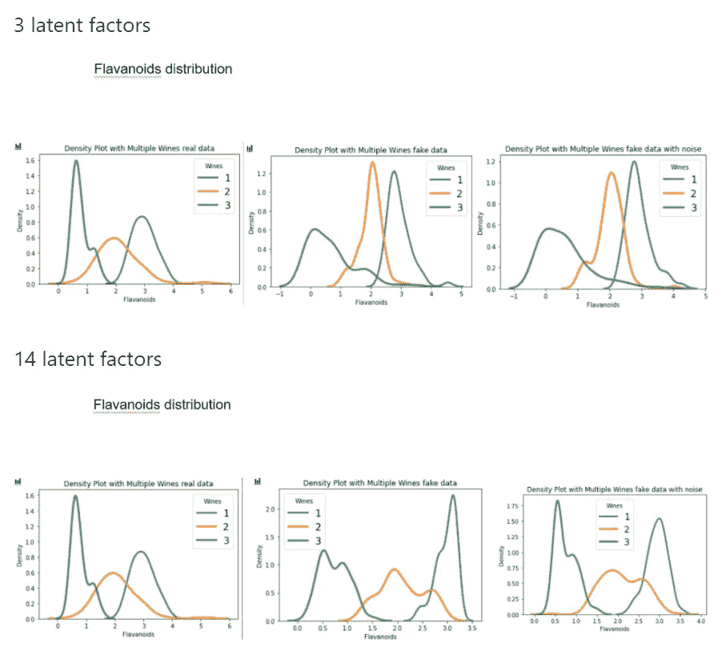

我们看到，当使用变分自动编码器对表格数据进行数据扩充时，它实际上已经找到了变量之间的关系。如果我们想消除这种影响，并在数据中加入随机噪声，得到的分布看起来就非常像原始的真实数据点。我们如何利用这些见解来改进机器学习/深度学习模型？我在[这篇博文](/analytics-vidhya/data-augmentation-for-tabular-data-f75c94398c3e)中提到的。

在那之前，敬请期待更多！

拉塞

*原载于 2021 年 4 月 10 日*[*https://lschmiddey . github . io*](https://lschmiddey.github.io/fastpages_/2021/04/10/DeepLearning_TabularDataAugmentation.html)*。*