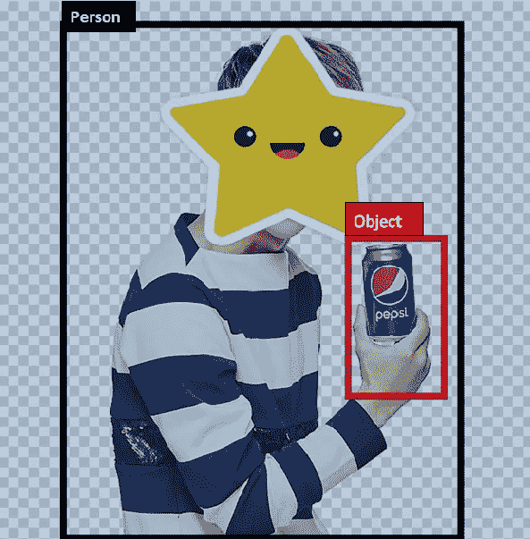
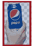
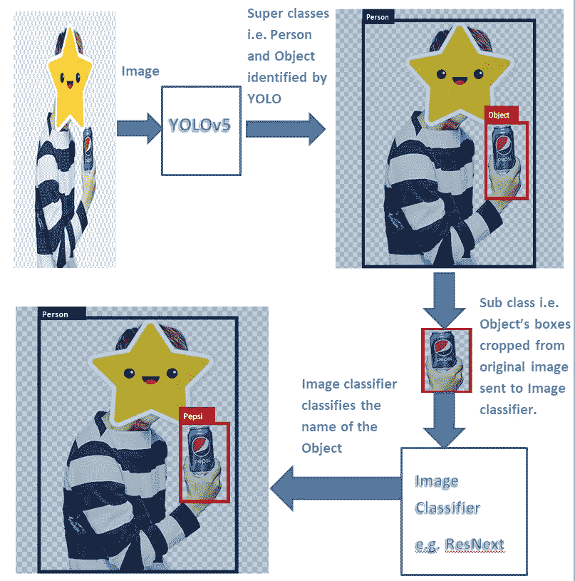

# 使用 YOLOv5 和 2 模型方法解决对象分类的类别不平衡

> 原文：<https://medium.com/analytics-vidhya/tackling-class-imbalance-for-object-classification-using-yolov5-with-a-2-model-approach-4b77f0ffe298?source=collection_archive---------3----------------------->

这是人工智能的时代，它由专门用于图像分类任务的深度学习来管理，在图像分类任务中，图像可以包含我们感兴趣的大量信息。为了提取和识别这些信息，使用了基于深度学习的技术。这些技术中的一些包括使用 RCNN 的分割或使用深度学习模型的 YOLO 系列的快速对象检测等。

这些模型在从图像中寻找粒度级信息并给出期望的结果方面做得非常好。然而，训练这些模型需要:

1.  许许多多不同的数据。
2.  维护我们在图像中要分类的不同数据类别之间的类别平衡。
3.  出色的硬件，即用于训练数据的高性能 GPU
4.  最后但同样重要的是，训练深度学习模型可能需要几天时间。

因此，在这些步骤之后，如果您想要向数据中添加另一个类，那么这可能意味着更改模型最后一层的输出以适应新的类，并且只重新训练最后几层，或者在更糟糕的情况下，也用新类的所有数据重新训练模型。对每个你想添加到以前训练过的模型中的新的类做同样的事情，这将是非常忙碌的。

为了补救这一点，在本文中，我建议使用 YOLOv5 的两个对象分类模型。第一个模型将是 YOLO，他的责任将只是识别超级类。第二个模型将是一个图像分类器，将采取我们想要的超类，并进一步将其分类为子类。

# 程序:

可以遵循以下简单步骤:

1.  仅使用您预期要预测的超类的图像来训练 YOLO 模型。因此，训练数据图像将仅用超类来注释。YOLO 会告诉我们超级班级在哪里。例如，如果我们要标识人员和产品，那么超类可以是人员类和对象类，如下所示:

2.现在，对象就是我们要分类的东西，不管它是百事可乐还是可口可乐或者其他什么。因此，从 YOLO 模型的输出中，我们将得到图像中标记为“对象”的所有对象，并将它们发送到图像分类器以获得该对象的名称。

3.为此，选择一个图像分类器(Resnext 等。)并用你想要预测的子类的图像来训练它。例如，如果我们想要识别百事可乐，那么我们可以用百事可乐的图像来训练图像分类器，等等..和我们预期看到的一样多的产品。

4.最后，YOLO 会告诉我们图像中的超类是什么，图像分类器会告诉我们子类实际上是什么。

下面是工作流的本质:

**优点:**

1.  这种方法让我们可以自由地收集数据，甚至从分类的 Google Images 中收集数据，因为我们不必在固定的环境中收集所需产品的样本，也不必处理分类不平衡的问题。我们可以简单地从谷歌获取子类的图片，并对其进行扩充。例如，如果在零售环境中，我们的目标是对正在销售的产品进行分类，那么如果我们只使用 YOLO，那么我们将不得不拥有一个特定产品的数百次样本，以便模型可以学习它，并对所有产品采用相同的过程。因此，单一模型方法将变得不切实际，因为我们的目标是观察更多的产品。
2.  如果 YOLO 模型在超类上做得很好，没有必要持续几天重新训练它。
3.  子类中的任何加法将仅需要图像分类器的训练，这不像重新训练 YOLO 模型那样广泛。

**链接到代码:**

我使用了 Ultralytics 中的默认 YOLOv5 代码，这是 Glenn Jocher 先生的一项了不起的工作，并将存储库转换为对 ResNext 模型的两阶段检测支持。目前，代码适用于两种情况，即相同的超类和子类以及一个超类和子类，但可以编辑以提供更多的超类支持。

这里是我的 Github 代码的链接，你可以用它将一个默认的 YOLOv5 转换成我上面解释过的 2 阶段检测器。

 [## necla-ml/yolov5

### 这个库代表了 Ultralytics 对未来对象检测方法的开源研究，并结合了…

github.com](https://github.com/necla-ml/yolov5) 

**结论:**

深度学习模型对于对象检测来说是惊人的，但是，伴随着资源的广泛性，并且需要大量时间的训练。但是使用智能技术可以减少训练时间。如果技术和代码有所帮助，那么请提及我的名字和个人资料。

**特别感谢:**

我要感谢信任我完成这项任务的人们，感谢 Glenn Jocher 和 YOLOv5 背后的开发人员。