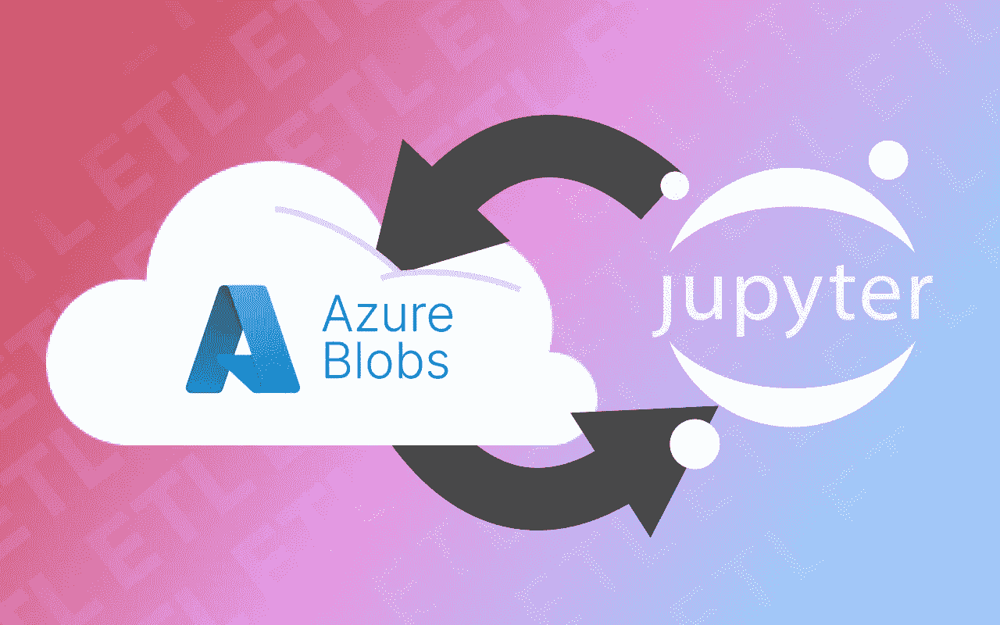

# 使用 azure blobs 将您的 ETL 笔记本提升到新的水平

> 原文：<https://medium.com/analytics-vidhya/take-your-etl-notebooks-to-the-next-level-with-azure-blobs-1bb063163591?source=collection_archive---------2----------------------->

[作者的插图](http://www.alessiovaccaro.com)

# ✨ 0.介绍

数据科学家、数据分析师和任何处理数据的人现在几乎可以使用舒适的 Jupyter 笔记本做任何事情:ML/DL 模型开发、微型 Web 应用程序测试、数据清理等等。

其中，最流行和当前的应用之一是 ***开发****和 ***测试*ETL 管道*** …