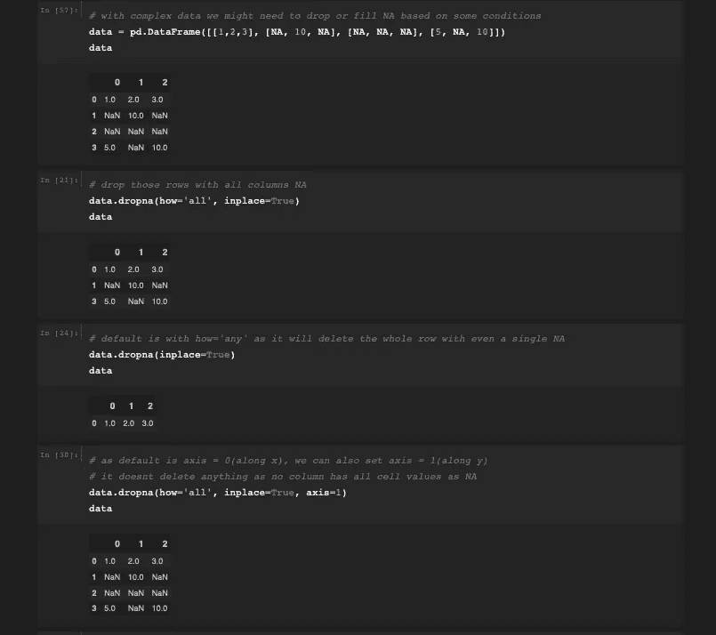
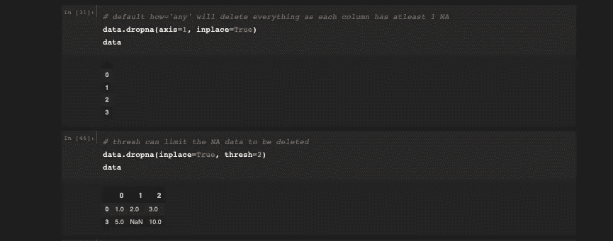
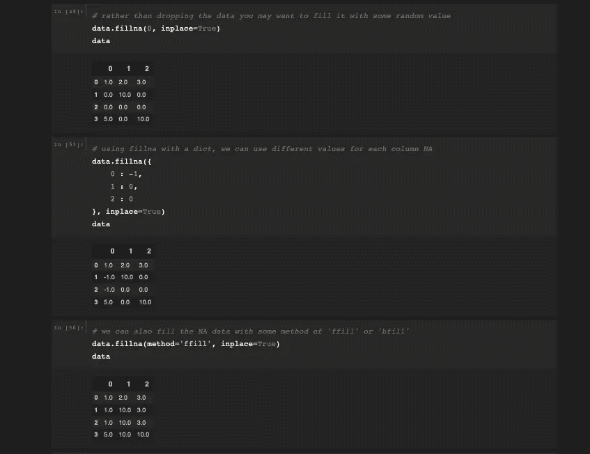

# 丢失数据的故事

> 原文：<https://medium.com/analytics-vidhya/tale-of-missing-data-5297f04cae25?source=collection_archive---------30----------------------->

## 处理数据时处理缺失的信息

W 在进行数据分析时，你的大部分时间*(大约 80%)* 都花在加载、清理、转换、重新排列数据，以及做各种各样的事情来使数据处于“正确的格式”状态。

最常见的是需要处理丢失的数据。

在熊猫中，我们将缺失数据定义为 **NA** (不可用)。我们也可以使用 None 值，因为它也以同样的方式处理。


显示 Nan 无的图像

让我们试着用一个例子来理解它:

```
# import all the required libraries on your jupyter notebook
import pandas as pd
import numpy as np
from numpy import nan as NA
```

我考虑列出我最喜欢的食物，并把它放在一个系列里

```
series1 = pd.Series(["pizza", "icecream", "burgers", NA, "fries"])
series1
```

**输出:**

```
0       pizza
1    icecream
2     burgers
3         NaN
4       fries
dtype: object
```

我们可以通过执行 **series1.isnull()来检查 NaN 是否真的表示 null。在遍历和检查每个索引后，它将产生真/假:**

```
0    False
1    False
2    False
3     True
4    False
dtype: bool
```

现在来了 **dropna** 和 **fillna** 功能救场。

> 简单来说:
> 
> dropna 将根据我们提供的条件删除包含 na 的行/列。
> 
> fillna 将根据我们提供的条件用一些值填充包含 na 的行/列。

***就是这样！就这么简单。你现在可以走了。***

注意:尝试按下 **Shift + Tab** 查看内置文档。

dropna 和 fillna 都有 **inplace** 属性(默认值:False ),可以将该属性设为 True 以避免将我的系列 1 再次赋值给系列 1 或其他值。

```
# we can filter missing data using dropna or fillna
series1.dropna(inplace=True)
series1
```

**输出:**

```
0      pizza
2    burgers
4      fries
dtype: object
```

现在试着用 ***fillna*** 做一件类似的事情:

```
series1.fillna(value="unavailable", inplace=True)
series1
```

**输出:**

```
0          pizza
1    unavailable
2        burgers
3    unavailable
4          fries
dtype: object
```

现在让我们尝试处理一些复杂的数据:



处理复杂的数据框架并在其上应用 dropna



理解 dropna 中的“轴”和“阈值”属性



与菲尔娜一起工作

**PS:** 如果你也想拥有这款暗黑主题笔记本，参考这篇文章:

[](https://kapoorrahul.medium.com/first-thing-after-installing-jupyter-notebook-f01391808ef0) [## 安装 Jupyter 笔记本后的第一件事

### 改变它的主题

kapoorrahul.medium.com](https://kapoorrahul.medium.com/first-thing-after-installing-jupyter-notebook-f01391808ef0) 

如果你仍然面临任何困难，请随意在谷歌上搜索，然后在评论区联系我。