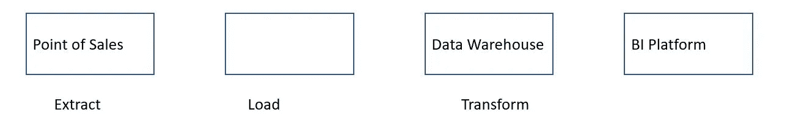
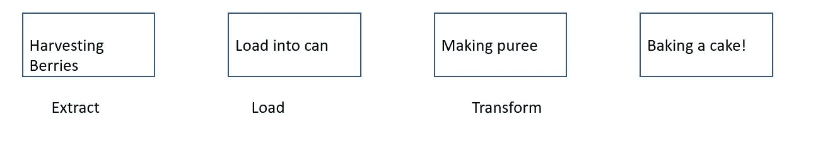

# 和我奶奶谈论 ETL/ELT

> 原文：<https://medium.com/analytics-vidhya/talking-to-my-nana-about-etl-elt-34c54d6d606b?source=collection_archive---------33----------------------->

关于 ETL/ELT 的简明解释

照片由[巴累·j·理查德](https://unsplash.com/@prics)通过 [Unsplash](https://unsplash.com/photos/F20_xtNvis4) 拍摄

# **什么是 ETL/ELT？**

ETL(提取、转换、加载)或 ELT(提取、加载、转换)都是处理步骤，用于从源(可以是结构化 SQL 或非结构化 NoSQL)获得干净和严格的数据，然后可能发送到商业智能平台以获得更丰富的数据。

这篇文章帮助你理解主要概念，以及如何与你的奶奶分享这个想法。

# **ETL/ELT 的元素**

ETL 或 ELT 包括如下三个步骤:

*   提取:提取是指从原始数据库中提取数据源
*   加载:加载是指将数据放入临时暂存或数据湖中
*   转换:转换是指通过组合、删除或分组来更改或改变数据

# **让我们想象一下**

ETL —可视化

简单来说，想象你在经营一家零售店。在左侧，从销售点(PoS)/收银机获取的数据，在推入暂存区之前，所有交易都记录在这些机器中。在进入数据仓库之前，暂存区是所有神奇过程发生的地方——切片、组合、清理、聚合。数据仓库存储所有将在商业智能平台中可视化的干净数据。

ELT —可视化

现在，您的商店变得比以往任何时候都大，营业额达数百万美元。几秒钟内记录了数千笔交易，你无法跟上它的步伐。您需要能够处理低延迟的东西，那么 ELT 就是答案。与 ETL 不同，从 PoS 中提取的原始数据将完全加载到数据仓库中，而不需要像 BigQuery 一样进行任何预先更改。接下来，在商业智能平台中可视化之前，您可以随意转换任何内容。

# **还好娜娜，**

现在向你亲爱的奶奶解释。

ETL——可视化 II

不要去零售店，把 ETL 想象成制作果酱的旅程。这一切都始于农民收获成熟的浆果，那里的颜色将是明亮的，有光泽的，有甜蜜的芳香气味。之后，转化为果酱的浓度与糖和水的飞溅。然后，装入干净卫生的广口瓶中保存更长时间。现在果酱已经准备好了，可以搭配烤饼和下午茶时你最喜欢的茶了。

ELT —可视化 II

不像 ETL 看起来像做果酱，感觉更像罐头水果之旅。是的，和开始收获浆果时一样。然后，这些浆果不经任何“加工”就被装进罐头，准备运往全国各地杂货店。浆果的“转变”将在稍后开始，一旦你用罐装浆果做了果泥。浓汤已经变成了柔软的奶油状，随时可以使用。

# **结论**

ETL/ELT 在开始时似乎令人困惑和害怕。简化概念后，就像和娜娜说话一样简单。谁会认为是对的呢？