# 使用 OpenCV 和 PyTesseract 对文档进行目标 OCR

> 原文：<https://medium.com/analytics-vidhya/targeted-ocr-on-documents-with-opencv-and-pytesseract-edc10b5ecb62?source=collection_archive---------1----------------------->

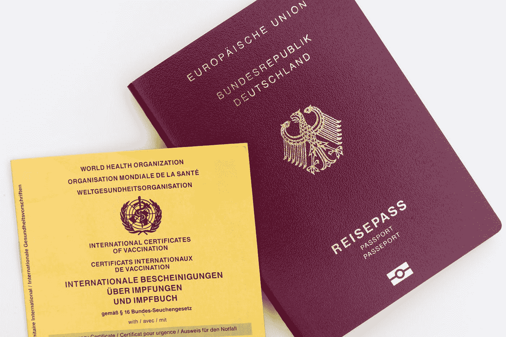

马库斯·温克勒在 [Unsplash](https://unsplash.com?utm_source=medium&utm_medium=referral) 上的照片

由于各地的组织都希望将他们的运营数字化，将物理文档转换为数字格式是一个常见的唾手可得的事情。这通常是通过光学字符识别(OCR)完成的，其中文本图像(扫描的物理文档)通过几种成熟的文本识别算法之一被转换成机器文本。在清晰的背景下处理打印文本时，文档 OCR 表现最佳，段落和字体大小一致。

实际上，这种情况远非常态。发票、表格甚至身份证件都有分散在整个文档空间的信息，这使得以数字方式提取相关数据的任务变得更加复杂。

在本文中，我们将探索一种使用 Python 来定义文档图像中用于 OCR 的区域的简单方法。我们将使用一个信息分散在整个文档空间的文档示例—护照。下面的护照样本放在白色背景中，模拟护照复印件。

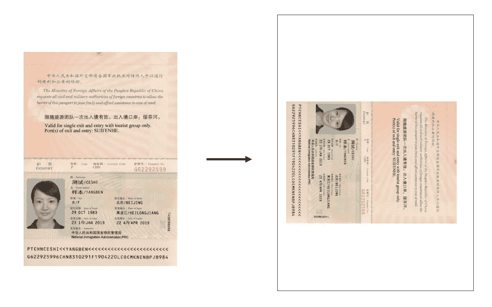

公共领域的护照图片样本:[维基媒体](https://commons.wikimedia.org/wiki/File:People%27s_Republic_of_China_Passport_(97-2_version_for_Single_Exit_and_Entry).png) & [国家移民局](https://www.nia.gov.cn/n741445/n741629/c763428/content.html)

从这个 passport 映像中，我们希望获得以下字段:

*   名/名
*   姓氏
*   中文脚本中的名/名
*   中文书写的姓氏
*   护照号码

首先，我们将导入所有必需的包。最重要的包是用于计算机视觉操作的 [OpenCV](https://docs.opencv.org/master/d6/d00/tutorial_py_root.html) 和用于强大的 Tesseract OCR 引擎的 python 包装器 [PyTesseract](https://pypi.org/project/pytesseract/) 。各个文档页面提供了安装和配置这些库的详细说明。

```
from cv2 import cv2
import pytesseract
import pandas as pd
import numpy as np
import math
from matplotlib import pyplot as plt
```

接下来，我们将使用 cv2.imread 读取我们的护照图像。我们的第一个任务是从这个伪扫描页面中提取实际的护照文档区域。我们将通过检测护照的边缘并将其从图像中裁剪出来来实现这一点。

```
img = cv2.imread('images\Passport.png',0)img_copy = img.copy()
img_canny = cv2.Canny(img_copy, 50, 100, apertureSize = 3)
```

OpenCV 库中包含的 [Canny 算法](https://docs.opencv.org/master/da/d22/tutorial_py_canny.html)使用多阶段过程来检测我们图像中的边缘。最后使用的三个参数是较低阈值和较高阈值(分别为 minVal 和 maxVal)以及内核大小。

运行 Canny 算法会产生以下输出。注意，由于选择了低阈值，保留了最小的边缘。

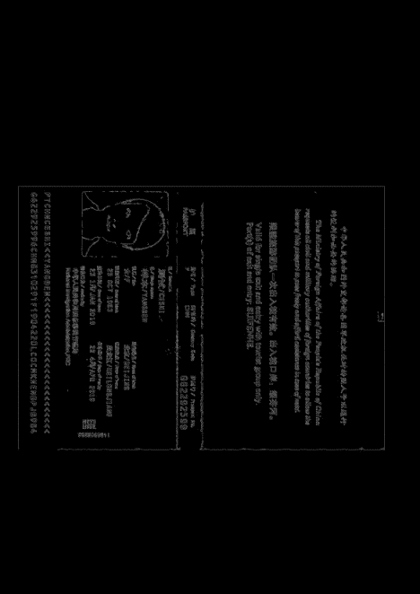

应用 Canny 算法操作后的图像

```
img_hough = cv2.HoughLinesP(img_canny, 1, math.pi / 180, 100, minLineLength = 100, maxLineGap = 10)
```

接下来，我们在边缘检测图像上使用另一种叫做[霍夫变换](https://docs.opencv.org/3.4/d6/d10/tutorial_py_houghlines.html)的算法，通过检测线绘制出护照区域的形状。minLineLength 参数定义了一个形状必须包含多少像素才能被认为是一条“线”，maxLineGap 参数表示被认为是同一形状的像素序列中的最大允许间隙。

```
(x, y, w, h) = (np.amin(img_hough, axis = 0)[0,0], np.amin(img_hough, axis = 0)[0,1], np.amax(img_hough, axis = 0)[0,0] - np.amin(img_hough, axis = 0)[0,0], np.amax(img_hough, axis = 0)[0,1] - np.amin(img_hough, axis = 0)[0,1])img_roi = img_copy[y:y+h,x:x+w]
```

我们的护照在所有的边上都有直线——文件的边缘。因此，有了我们的线信息，我们可以选择通过检测到的线的外边缘来裁剪我们的护照区域:

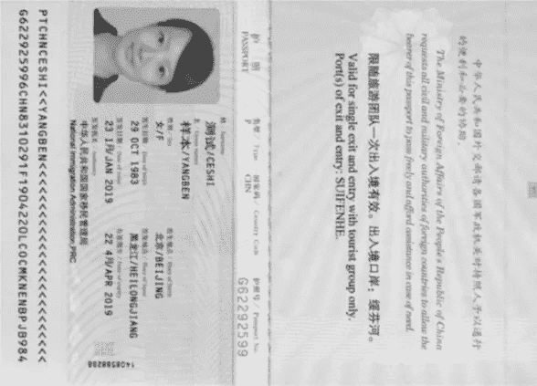

使用检测到的线性边缘裁剪图像

最后，我们可以做一些好的 ol' OCR！

将护照垂直旋转后，我们开始在图像中选择想要捕捉数据的区域。几乎所有的国际护照都符合国际民航组织的标准，该标准概述了护照页面的设计和布局规范。这些规格之一是机器可读区(MRZ)，即你的护照文件底部有趣的两行。文件目视检查区(VIZ)中的大部分关键信息也包含在 MRZ 中，可由机器读取。在我们的练习中，这台机器是我们信赖的宇宙魔方引擎。

```
img_roi = cv2.rotate(img_roi, cv2.ROTATE_90_COUNTERCLOCKWISE)(height, width) = img_roi.shape
img_roi_copy = img_roi.copy()dim_mrz = (x, y, w, h) = (1, round(height*0.9), width-3, round(height-(height*0.9))-2)img_roi_copy = cv2.rectangle(img_roi_copy, (x, y), (x + w ,y + h),(0,0,0),2)
```

让我们使用四个维度来定义护照图像中的 MRZ 区域:水平偏移(从左侧)、垂直偏移(从顶部)、宽度和高度。对于 MRZ，我们将假设它包含在我们护照底部的 10%中。因此，使用 OpenCV 的矩形函数，我们可以在区域周围画一个方框来验证我们的维度选择。

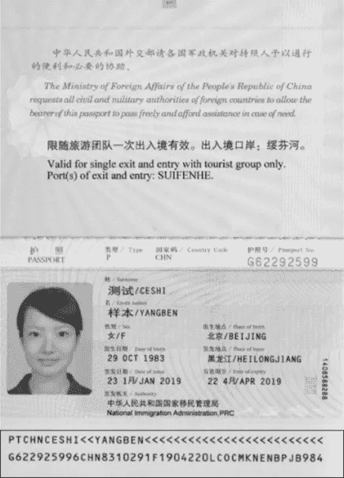

选择区域周围有矩形框的图像

```
img_mrz = img_roi[y:y+h, x:x+w]img_mrz =cv2.GaussianBlur(img_mrz, (3,3), 0)
ret, img_mrz = cv2.threshold(img_mrz,127,255,cv2.THRESH_TOZERO)
```

在新图像中裁剪出所选区域。我们将对裁剪后的图像执行一些基本的图像预处理，以便于更好地读出— [高斯模糊](https://docs.opencv.org/master/d4/d13/tutorial_py_filtering.html)和[简单阈值处理](https://docs.opencv.org/master/d7/d4d/tutorial_py_thresholding.html)。

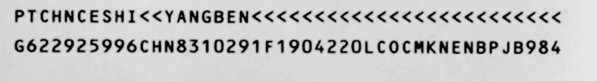

提取的 MRZ 区域

```
mrz = pytesseract.image_to_string(img_mrz, config = '--psm 12')
```

我们现在准备应用 OCR 处理。在我们的 image_to_string 属性中，我们配置了一个“带有方向和脚本检测(OSD)的稀疏文本”的页面分割方法。这旨在捕获图像中所有可用的文本。

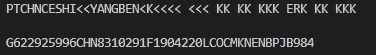

将 Pytesseract 输出与我们的原始 passport 图像进行比较，我们可以观察到在读取特殊字符时的一些错误。为了获得更准确的读数，可以使用 Pytesseract 的白名单配置进行优化；然而，就我们的目的而言，电流读数的精度已经足够。

```
mrz = [line for line in mrz.split('\n') if len(line)>10]if mrz[0][0:2] == 'P<':
  lastname = mrz[0].split('<')[1][3:]
else:
  lastname = mrz[0].split('<')[0][5:]firstname = [i for i in mrz[0].split('<') if (i).isspace() == 0 and len(i) > 0][1]pp_no = mrz[1][:9]
```

根据 ICAO 关于 MRZ 代码结构的指南应用一些字符串操作，我们可以提取护照持有人的姓、名和护照号:

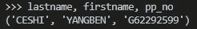

非英语的文本怎么办？没问题 Tesseract 引擎已经为超过 100 种语言的[训练了模型](https://github.com/tesseract-ocr/langdata)(尽管 OCR 性能的健壮性因每种支持的语言而异)。

```
img_roi_copy = img_roi.copy()dim_lastname_chi = (x, y, w, h) = (455, 1210, 120, 70)
img_lastname_chi = img_roi[y:y+h, x:x+w]
img_lastname_chi = cv2.GaussianBlur(img_lastname_chi, (3,3), 0)
ret, img_lastname_chi = cv2.threshold(img_lastname_chi,127,255,cv2.THRESH_TOZERO)dim_firstname_chi = (x, y, w, h) = (455, 1300, 120, 70)
img_firstname_chi = img_roi[y:y+h, x:x+w]
img_firstname_chi = cv2.GaussianBlur(img_firstname_chi, (3,3), 0)
ret, img_firstname_chi = cv2.threshold(img_firstname_chi,127,255,cv2.THRESH_TOZERO)
```

使用相同的区域选择方法，我们再次为我们的目标数据场定义维度(x，y，w，h ),并对裁剪的图像提取应用模糊和阈值处理。

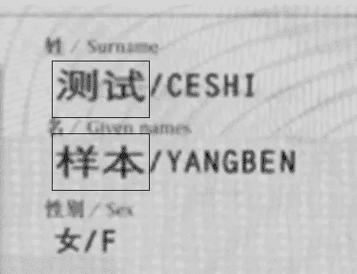

```
lastname_chi = pytesseract.image_to_string(img_lastname_chi, lang = 'chi_sim', config = '--psm 7')firstname_chi = pytesseract.image_to_string(img_firstname_chi, lang = 'chi_sim', config = '--psm 7')
```

现在，在我们的 image_to_string 参数中，我们将添加输入文本的语言脚本，简体中文。

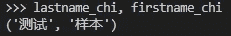

为了完成练习，将所有收集到的字段传递给字典，并输出到表格中以供实际使用。

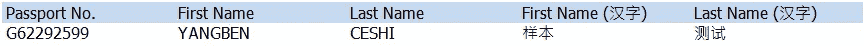

OCR 感兴趣区域的显式定义只是在 OCR 中获取所需数据的众多方法之一。根据您的使用情况，使用轮廓分析或对象检测等其他方法可能是最有效的。

如我们的护照练习所示，在应用 OCR 之前对图像进行适当的预处理是关键。当处理不同(有时有问题)图像质量的真实文档时，尝试不同的预处理技术以找到最适合您的文档类型的组合是值得的。玩得开心！

*这个用例可以在 GitHub 资源库* [*这里*](https://github.com/jasonlimcp/document_ocr) *找到。*