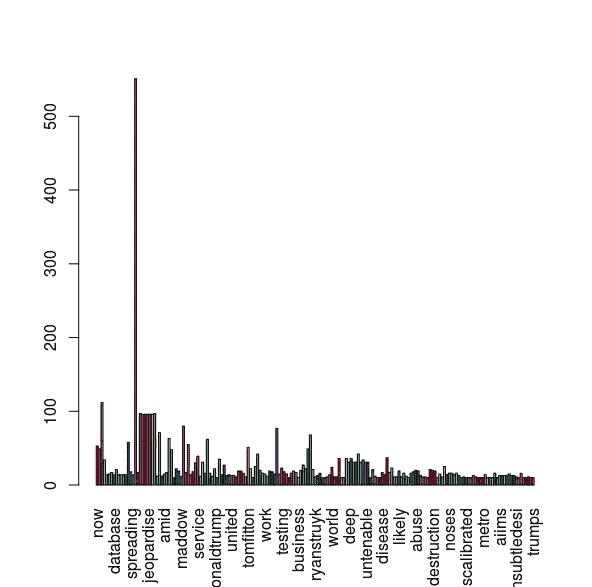
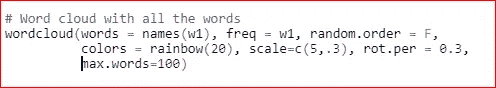
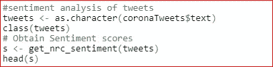

# TDM(术语文档矩阵)和 DTM(文档术语矩阵)

> 原文：<https://medium.com/analytics-vidhya/tdm-term-document-matrix-and-dtm-document-term-matrix-8b07c58957e2?source=collection_archive---------0----------------------->

杰瑞米·泽罗在 [Unsplash](https://unsplash.com?utm_source=medium&utm_medium=referral) 上的照片

文本挖掘或文本分析是从文本中获取有用见解的过程。个人和组织每天都会产生大量数据。数据可能以各种形式出现——结构化、非结构化和半结构化。据统计， [80%的可用数据是非结构化的](https://www.datamation.com/big-data/structured-vs-unstructured-data.html)数据。在业务环境中，非结构化数据可以包括书籍、财务和其他业务报告、新闻文章、博客帖子、电子邮件、图像、视频、调查、社交媒体帖子等。提取后，非结构化数据需要转换为结构化形式，以便机器学习算法进一步分析。有两种方法可以将非结构化数据转换成结构化形式。

1.词汇袋模型

2.向量空间模型

**1。单词袋型号**

在单词袋模型中，文本文档由单词袋表示。该模型可以表示为包含单词频率和单词本身的表格。例如，考虑包含以下句子的文本文档-

“拉姆喜欢打板球”。

"罗汉也喜欢板球。"

"拉姆喜欢足球。"

文本文档的单词包是-

**2。向量空间模型**

向量空间模型是单词袋模型的推广。在向量空间模型中，语料库中的每个文档都被表示为一个多维向量。语料库中的每个唯一术语代表向量空间的一个维度。术语可以是一个单词或一系列单词。语料库中唯一术语的数量决定了向量空间的维度。

**术语文档矩阵**

在 VSM，语料库以术语文档矩阵的形式表示。术语文档矩阵表示矩阵形式的文档向量，其中行对应于文档中的术语，列对应于语料库中的文档，单元对应于术语的权重。

DTM(文档术语矩阵)是通过对 TDM 进行转置而获得的。在 DTM，行对应于语料库中的文档，列对应于文档中的术语，单元格对应于术语的权重。

**计算术语的权重**

有各种方法来确定术语的权重。简单而常用的方法包括

1.二进制权重

2.术语频率(TF)

3.反向文档频率(IDF)

4.术语频率-逆文档频率(TF-IDF)

**1。二进制权重**

在二进制权重的情况下，权重取值为- 0 或 1，其中 1 表示该术语在特定文档中存在，0 表示该术语不存在。

举个例子，

D1:文本挖掘就是从文本中找到有用的信息。

D2:从文本中挖掘有用的信息。

D3:天黑了。

**2。词频**

在术语频率的情况下，权重表示术语在特定文档中的频率。潜在的假设是，术语在文档中出现的频率越高，它对该文档就越重要。

TF(t)= c(t，d)

c(t，d)-术语 t 在文档 d 中出现的次数。

TF(text)=c(text，d)=3

**3。逆文档频率**

在 IDF 的情况下，基本思想是给不常见的术语，即在语料库中不常见的术语分配较高的权重。IDF 是在语料库级别计算的，因此描述了作为一个整体的语料库，而不是单个文档。其计算方法如下:

IDF(t)=1+log(N/df(t))

N-语料库中的文档数量

Df(t)-带有术语 t 的文档数

例如，假设语料库中有 100 个文档，其中 10 个文档包含术语 text。

那么，IDF(文本)=1+log(100/10)=1+1=2

**4。TF-IDF**

在 TF-IDF 的情况下，基本思想是重视那些在语料库中不太常见的术语(相对高的 IDF)，但是仍然具有某种合理的频率水平(相对高的 TF)。这是向量空间模型中计算术语权重最常用的指标。

计算 TF-IDF 的通用公式:

TF-IDF(t)=TF(t)*IDF(t)

这个公式的一个流行的“实例化”:

TF-IDF(t)= tf(t)*log(N/df(t))

**2。TDM 实用演示**

在这个例子中，我们对从 Twitter 中提取的数据执行文本挖掘。

**安装并加载所需的软件包**

首先，打开 R Studio，然后将所需的包安装并加载到 R Studio 中。

**提取推文**

数据是通过 Twitter API 从 Twitter 中提取的。要从 Twitter 中提取数据，请使用以下步骤

创建一个 Twitter 用户帐户

登录进入[https://apps.Twitter.com/](https://apps.twitter.com/)

点击[developer.twitter.com](https://developer.twitter.com/)

你将到达 Twitter 的开发者页面。接下来，在您的“名称”选项卡下，搜索“**应用程序**”选项，然后单击该选项

点击**创建一个应用**

填写表格，同意条款并点击“创建”

转到下一页，点击“密钥和访问令牌”选项卡，复制您的 **API 密钥**和 **API 秘密密钥**。向下滚动，点击创建**访问令牌&访问令牌密码**，复制您的访问令牌和访问令牌密码。

在这里，我们从 Twitter 中提取了 1000 条与冠状病毒相关的英文推文。

**将数据载入语料库**

在这里，推文被加载到语料库中。输出显示了从 Twitter 中提取的前五条 tweets。

**数据预处理**

在创建 TDM 矩阵之前，需要对语料库中的文档进行预处理。预处理包括:-

使文本规范化

移除给定语料库中出现频率非常低/高的术语

删除停用词

通过词干化或词汇化将单词还原为其词根形式

这里，在对数据应用文本挖掘技术之前，对数据进行预处理(清理)。首先，整个文本(推文)被转换成小写，然后数字，标点符号，停用词，标签，提及，控制和特殊字符，省略号从数据中删除。你也可以从数据中删除你认为无用的词。额外的空白也会从数据中删除。执行文本词干分析以将单词转换成它们的词根。输出显示了前五条干净的 tweets。

**建立术语文档矩阵**

在应用任何文本挖掘技术之前，都需要将非结构化数据转换为结构化格式。术语文档矩阵用于相同的目的。

输出显示前五个单词出现频率很高。

**柱状图**

这里，我们绘制了术语的条形图。

在这里，我们从推文中删除了一些无用的词。额外的空白也被从 tweet 中移除，并且清理后的 tweet 的术语-文档矩阵被创建。

这里，我们绘制了单词的单词云。

这里，我们对推文进行了情感分析。情感分析是发现人们对特定话题的看法的过程。在这个例子中，我们发现了人们对冠状病毒的看法。

输出显示了推文的情感分数。

在这里，我们绘制了科罗纳推文的情绪得分柱状图。

