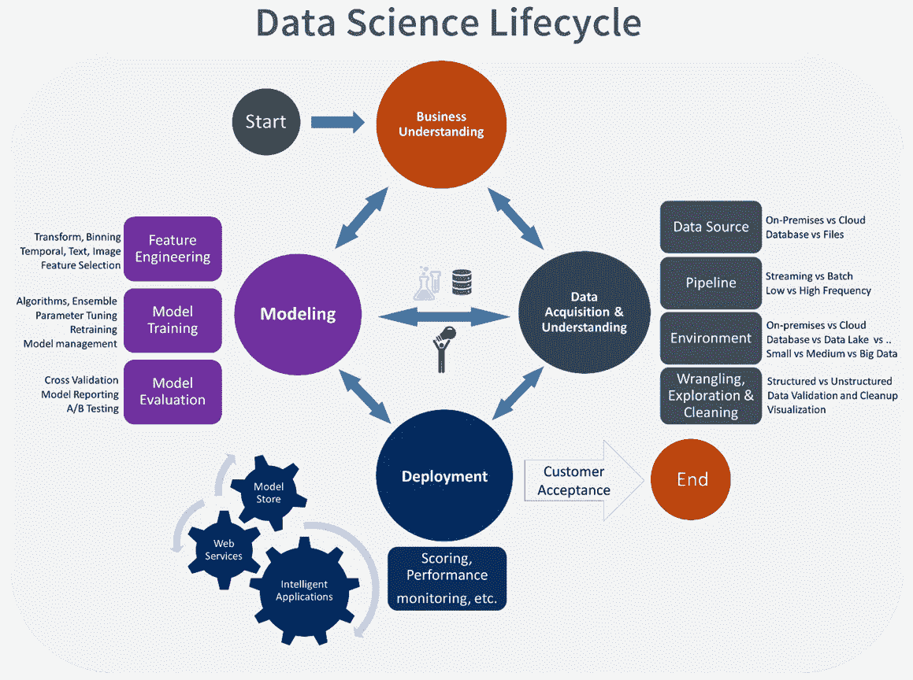

# 人工智能/数据科学项目的 TDSP 数据科学生命周期

> 原文：<https://medium.com/analytics-vidhya/tdsp-data-science-lifecycle-for-artificial-intelligence-data-science-projects-4ac6e5b82db4?source=collection_archive---------1----------------------->

对于我的人工智能/数据科学项目，我发现 [*TDSP 数据科学生命周期*](https://docs.microsoft.com/en-us/azure/architecture/data-science-process/overview) *是最有帮助和详细的。*

图一。TDSP 数据科学生命周期(来源:[微软](https://docs.microsoft.com/en-us/azure/architecture/data-science-process/overview))

这里有许多数据科学生命周期，人们可以用来完成人工智能/数据科学项目。这种生命周期的例子包括克里斯普-DM，KDD 和 TDSP。在高层次上，他们有很多共同点。然而，我发现微软的团队数据科学过程(TDSP)数据科学生命周期在我的项目中最为详细和有用。

TDSP 是一种敏捷的迭代方法，用于构建和部署预测分析解决方案。有助于提高团队合作。TDSP 涵盖了项目的许多阶段，并允许灵活地迭代执行。

TDSP 提供数据科学生命周期来完成人工智能/数据科学项目的开发。这个生命周期主要有助于部署机器学习或人工智能模型进行预测分析的智能应用程序。此外，人们可以将该生命周期的某些部分应用于探索性数据科学项目或即兴分析。

TDSP 生命周期包括人工智能/数据科学项目的以下四个主要阶段(图 1)

**业务理解**

这个阶段包括建立对业务问题、涉众需求和用例的理解。这可能需要通读知识库和项目文档，并与利益相关者会面/面谈。

**数据采集和理解**

这个阶段包括理解和获取数据源、管道、频率、环境和数据结构。它还包括数据探索。它还可能包括数据清理、争论和转换。

**建模**

在数据获取和理解阶段之后是数据建模阶段。此阶段包括特征工程步骤，如数据转换和特征选择。接下来就是模特训练了。它包括训练模型和调整其超参数。这个阶段的最后一步是模型评估。这可以通过多种方法实现，如交叉验证等。

**部署**

模型部署包括部署和服务模型。例如，它可能涉及在云上部署或者将模型集成为应用程序的一部分。它还包括监测模型的性能。

在监控阶段，如果产生了任何缺陷或问题报告，团队可能不得不重复生命周期中的一些或所有上述阶段和步骤。

**客户接受度**

一旦缺陷被修复，并且模型按照客户满意度被部署，项目就结束了。在某些情况下，模型会不断改进。在这种情况下，在第一次部署之后，团队将连续迭代上述生命周期，或者直到所有项目阶段完成。

有关 TDSP 流程及其在您的特定项目中的实施的更多信息，请参见此链接:[团队数据科学流程](https://docs.microsoft.com/en-us/azure/architecture/data-science-process/overview)

参考资料:

 [## 团队数据科学流程是什么？-蔚蓝建筑中心

### 团队数据科学流程(TDSP)是一种敏捷、迭代的数据科学方法，用于提供预测分析…

docs.microsoft.com](https://docs.microsoft.com/en-us/azure/architecture/data-science-process/overview)  [## 数据挖掘的跨行业标准流程-维基百科

### 数据挖掘的跨行业标准过程，称为 CRISP-DM，是一个开放的标准过程模型，它描述了…

en.wikipedia.org](https://en.wikipedia.org/wiki/Cross-industry_standard_process_for_data_mining) 

【https://en.wikipedia.org/wiki/Data_mining 