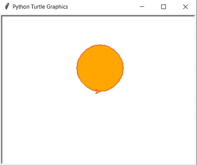

# 教孩子们如何用 Python Turtle 编程

> 原文：<https://medium.com/analytics-vidhya/teaching-kids-how-to-code-with-python-turtle-26c6fb4b2697?source=collection_archive---------1----------------------->

从小教授如何编码已经变得越来越平常。这样做有很好的理由，因为编码能力被视为未来几年最重要的能力之一，而且可能更重要的是，因为学习编码为孩子们提供了一种发展和训练一系列不同技能的方法，这些技能在日常生活和其他学校科目中被认为是有用的，如创造力、解决问题的能力、毅力甚至协作能力。

尽管学习如何编码既困难又可怕，但是有一些方法可以减轻这些困难。首先，我们应该——很明显——考虑孩子的年龄，但也要记住学习应该是有趣的。

> 大脑只有在有情绪的情况下才会学习
> 
> 弗朗西斯科·莫拉，神经教育专家

我开始编程的时候大约 15 或 16 岁，我用的是 **BASIC** ( **B** eginner 的**A**ll-purpose**S**ymbolic**I**construction**C**ode)。但是有可能你们中的一些阅读这篇文章的人第一次学习了编程——或者至少熟悉了——标志语言，特别是如果你比我大一点的话。


来源:[维基共享资源](https://en.wikipedia.org/wiki/File:Turtle-animation.gif)

Logo 因其*海龟图形*而闻名，海龟图形是一个小海龟形状的光标在屏幕上移动产生的矢量图形/图像，服从一系列编程指令。它需要一些几何知识，特别是角度和角度测量。这意味着——理论上——8-10 岁左右的孩子应该能够理解将要进行的练习的机制。

学习 Logo 的缺点是在现实世界中几乎没有实际用途。它被认为只是教授编程概念，是一种有点死气沉沉的语言。

幸运的是， **Python** 有一个 [**turtle**](https://docs.python.org/3/library/turtle.html) 模块，可以用来学习编码，就像你学习 Logo 一样，尽管——很明显——使用了不同的语法。

Python 是全球使用最广泛的编程语言，也是近年来发展最快的语言。原因很容易解释。它很容易阅读和学习；它的用途非常广泛，从 web 开发到数据科学和人工智能，不要忘记它易于编写简单的脚本，可以自动化许多日常任务；它的库系统也是高度可扩展的。Python 不仅被程序员使用，还被许多研究人员、学生和业余程序员使用，这有助于解释它的增长和作为市场领导者的地位。

# 蟒蛇龟怎么用？

所以，这个想法是命令光标四处移动，从 x-y 笛卡尔平面的(0，0)位置开始。一旦导入， [**海龟**](https://docs.python.org/3/library/turtle.html) 模块就有移动光标的指令，像*向前(20)* —向它面对的方向移动 20 个像素——或者*向右(90)* —顺时针旋转 90 度。仅使用这些简单的命令，光标就可以按照您想要的方式绘制形状和图片。

很简单，对吧？

下面的代码指导绘制一个正方形。

```
import turtleturtle.forward(20)
turtle.left(90)
turtle.forward(20)
turtle.left(90)
turtle.forward(20)
turtle.left(90)
turtle.forward(20)turtle.done()
```


你可能注意到了，光标的默认形状不是 Logo 上的乌龟，而是一个箭头。但这可以用指令 **turtle.shape('turtle')** 来改变。

上面的代码使用了面向对象的编程范例。虽然用简单的方式(只是一个*乌龟*对象，有三个方法:*前进*、*离开*和*完成*)，但对于刚开始编程的人来说，这仍然是一个很难解释的概念。如果我们想简化，我们可以使用另一种技术导入 [**海龟**](https://docs.python.org/3/library/turtle.html) 包来解决这个最终问题。

```
from turtle import *forward(20)
left(90)
forward(20)
left(90)
forward(20)
left(90)
forward(20)done()
```

虽然在真正的编程中不推荐这种做法，但在这种情况下，它使代码更容易阅读，并有助于将重点放在重要的事情上，而不需要在早期阶段解释对象和面向对象语言的概念。

# 用蟒蛇龟可以画什么？

嗯，基本上所有的事情，如果你有技能的话。但我们应该从基础开始，在教学时更是如此。

## 画一个圆

从一个圆开始怎么样？因为这个模块包含了一个画圆的特殊方法，我们将通过改变线条颜色来增加一点趣味。下面的代码绘制了一个半径为 50 像素的圆。好吧，如果严格来说，其实就是一个圆周。

```
# import module
from turtle import *# set line color to red
color('red')# draw a circle with radius of 50 pixels
circle(50)# end the drawing
done()
```


要填充圆周内的区域，我们只需再添加三条指令。

```
# import module
from turtle import *# set line color to red and fill color to orange
color('red')
fillcolor('orange')begin_fill()
# draw a circle with radius of 50 pixels
circle(50)
end_fill()# end the drawing
done()
```



## 绘制多边形

我们先画一个六边形。

```
from turtle import *for i in range(6):
  forward(100)
  left(60)done()
```


现在是时候向学生介绍*循环*，尤其是循环的*。由于 Python 方法 *range(n)* 创建了一个 n 个数字的序列(范围从 0 到 n-1)，range(6)* 中 I 的行*将指示 Python 执行循环*的*内的代码 6 次。这意味着光标将向前移动 100 个像素，然后向左转 60°，重复这两步，总共 6 次。*

为什么是 60？嗯，因为是 360 除以 6(多边形的边数)的结果。

如你所见，学习这种方式不仅仅是学习编码；它还帮助学生更好地理解几何和训练地理空间理解技能。

概括上面的代码，我们可以重新定义它来创建任何多边形，给定所需的边数。

下图显示的是一个五边形——五边形。

```
from turtle import *number_of_sides = 5for i in range(number_of_sides):
  forward(100)
  left(360 / number_of_sides)done()
```


主要区别在于使用了一个变量来保存所需的边数。很可能，在前面提到的年龄范围内的孩子(8-10 岁)还不熟悉变量的数学概念。但是向他们解释这一点并不困难，因为它只代表了一种存储可以改变的值的方法。

## 一切都是可能的

了解了基础知识并获得了软件包的完整参考，有许多活动和挑战可以设计并付诸实践。

下面我留下一些例子。

首先，一个**彩虹苯**有六种不同的颜色。

```
from turtle import *colours = ['red', 'green', 'blue', 'orange', 'pink', 'purple']speed(10)for x in range(360):
  pencolor(colours[x % 6])
  width(x / 100 + 1)
  forward(x)
  left(59)
```


1 度的差异(相对于用于绘制六边形的 60 度)会使图形略微倾斜，从而产生这种视觉效果。

所用的 59°转角意味着增加了六边形的微小变化系数。使用的新方法应该容易理解。*速度*方法允许改变绘图速度。 *pencolor* 方法改变笔的颜色。

现在，一棵绿色分枝的分形树。

```
import turtlet = turtle.Turtle()
t.color('green')def draw_tree(t, branch_length, branch_shortening_factor, angle):
  if branch_length > 5:
    t.forward(branch_length)
    new_branch_length = branch_length - branch_shortening_factort.left(angle)
    draw_tree(t, new_branch_length, branch_shortening_factor, angle)t.right(angle * 2)
    draw_tree(t, new_branch_length, branch_shortening_factor, angle)t.left(angle)
    t.backward(branch_length)draw_tree(t, 50, 5, 30)turtle.mainloop()
```


该树以分形的方式递归绘制。

最后，是一片科赫雪花。

```
import turtlet = turtle.Turtle()
wn = turtle.Screen()
wn.bgcolor('black')
t.color("white")
t.speed(0)def koch(cursor, iterations, length, shortening_factor, angle):
    if iterations == 0:
        cursor.forward(length)
    else:
        iterations = iterations - 1
        length = length / shortening_factor

        koch(cursor, iterations, length, shortening_factor, angle)
        cursor.left(angle)
        koch(cursor, iterations, length, shortening_factor, angle)
        cursor.right(angle * 2)
        koch(cursor, iterations, length, shortening_factor, angle)
        cursor.left(angle)
        koch(cursor, iterations, length, shortening_factor, angle)for i in range(3):
    koch(t, 4, 200, 3, 60)
    t.right(120)

turtle.mainloop()
```


科赫雪花是瑞典数学家赫尔格·冯·科赫提出的一种分形曲线。

显然，上面两个图形的结构太复杂，8-10 岁的孩子无法理解。但这是向高年级学生解释递归等概念的好方法。

关于 Python 的*海龟*模块的完整参考可以在这里找到:[https://docs.python.org/3/library/turtle.html](https://docs.python.org/3/library/turtle.html)。