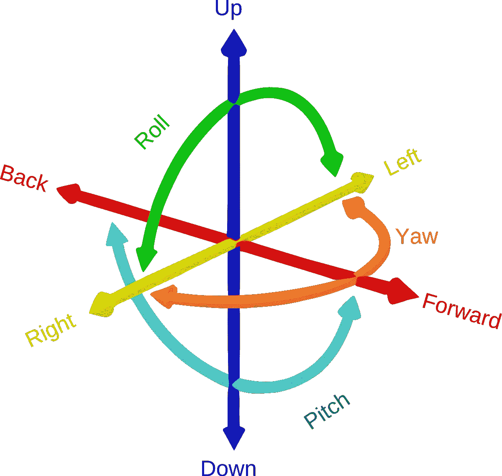
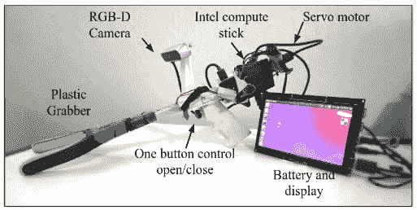
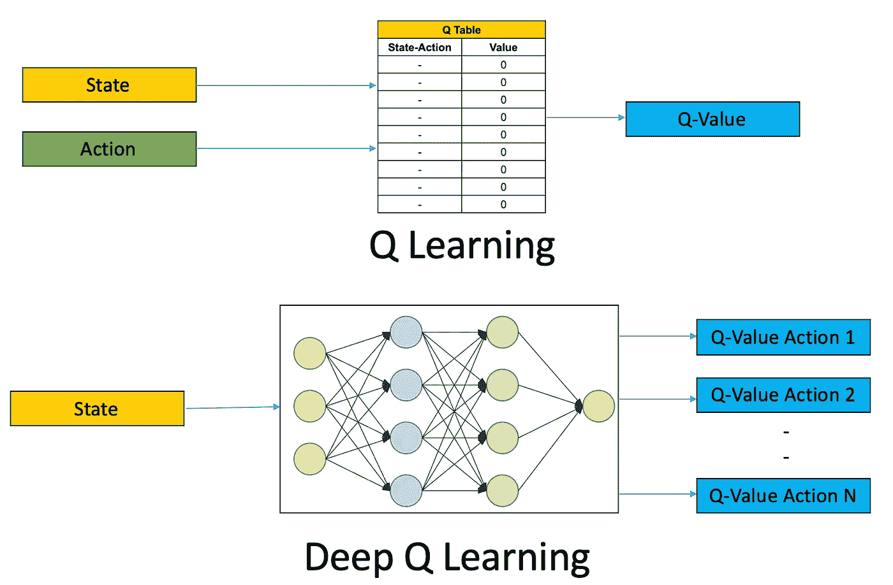

# 教学机器人闭环 6 自由度抓取的人类演示

> 原文：<https://medium.com/analytics-vidhya/teaching-robots-closed-loop-6-dof-grasping-from-human-demonstrations-6ca335dd4636?source=collection_archive---------19----------------------->

本文是对宋等人的研究论文“**野外抓取:从低成本演示中学习六自由度闭环抓取**”的分析。哇哦。真拗口！别担心，我们会一个一个来！我已经试着一步一步地介绍所有的术语，所以如果你不明白，请告诉我。此外，如果这些链接激发了你的兴趣，你也可以自己点击链接进行研究，以便更深入地理解所讨论的话题。

# 介绍

所以，我们试图解决的问题是，使用末端带有二元抓取器(它可以是完全闭合的，也可以是完全打开的，因此是二元的)的机械臂抓取物体这一看似简单的任务。你可以想象，对于机器人来说，与物体互动是一项非常重要的任务，无论是在工业环境中还是在家庭中。

然而，大多数算法要么使用低**自由度，要么使用**开环控制。自由度是完全定义系统状态所需的变量数量。所有刚性物体都需要 6 个变量来完全定义它们的位置和方向:x，y，z 坐标和 3 个角度来表示方向。



4 **自由度**(简称 DOF)控制意味着**末端执行器**(与物体相互作用的机械臂部分，连接到机械臂末端)的 3D 位置和其中一个方向是可控的。最简单的抓取算法使用 4 个自由度。它们从上到下接近物体，并且可以改变末端效应器的偏转。可以想象，这对于现实生活中的场景来说是非常有限的。

**开环控制**意味着算法不使用反馈来修正手臂的轨迹。作为人类，我们自然会使用视觉和触觉反馈来正确定位我们的手，并操纵它们。这是**闭环控制**的一个例子，意味着我们在不断使用反馈来纠正我们行动中的错误。然而，最简单的抓取算法将使用开环控制，这意味着它将根据对象的位置生成一个轨迹，并沿着该轨迹移动手臂。它不会在跟踪这个轨迹时检查对象。

很明显，这两个(闭环和 6 自由度)对于抓取都很重要。我们需要 6DOF 来抓取侧面的物体或某些角度被阻挡的物体，我们需要闭环控制来跟随移动的物体，并对环境中的动态变化做出反应。

实现这两者的挑战是缺乏训练数据。该论文提出了一种极好的以人类演示的形式收集训练数据的方法。通过使用这种人类演示数据并在模拟中使用强化学习，特别是一种称为 **Q-learning** 的算法，来生成控制方案。

# 数据收集

使用以下设备收集人体演示数据:



按下按钮时，抓取器关闭。有一个 **RGB-D** (红、绿、蓝、深度通道)摄像头。摄像机的镜头和按钮信号被记录下来用于训练。人类志愿者被要求通过将它连接到他们的手上来完成日常的抓取任务。该装置的设计与原机器人相似，具有**易转移**、**便宜、**和**易使用**(无需培训志愿者)。这三个因素被发现是当前机器人抓取任务的数据获取方法所缺乏的主要因素。

# 数据处理

数据被处理以找到末端执行器(抓取器)的轨迹。这些是步骤

1.  使用 [**SIFT**](https://en.wikipedia.org/wiki/Scale-invariant_feature_transform) (移位不变特征变换)来检测图像中某些有趣的、独特的特征，如物体的角、标志的某个部分等。找到这些点的“描述”,这有助于在同一场景的其他图像中识别它们。基本上，我们可以从不同位置和角度拍摄的不同图像中检测和跟踪场景中的相同点。
2.  因为我们可以跟踪这些点，所以找到这些点的位置变化，并使用称为[](https://en.wikipedia.org/wiki/Random_sample_consensus#:~:text=Random%20sample%20consensus%20(RANSAC)%20is,the%20values%20of%20the%20estimates.)****(随机样本一致性)的算法来估计相机的运动。该算法去除异常值或错误和有噪声的检测。该算法所做的是随机采样，并使用一种称为 [**SVD**](http://graphics.stanford.edu/~smr/ICP/comparison/eggert_comparison_mva97.pdf) (奇异值分解)的线性代数方法来估计相机的运动。这个运动用一个叫做刚体变换的矩阵来表示。该运动用于使用刚体变换来预测场景中不同点的位置变化。该预测和位置的实际变化被用于检测内点(与预测位置变化的偏差低于某个阈值的点)的数量。选择具有最大数量内联体的集合。****
3.  ****[**ICP**](https://en.wikipedia.org/wiki/Iterative_closest_point#:~:text=Iterative%20closest%20point%20(ICP)%20is,between%20two%20clouds%20of%20points.) (迭代最近点)算法用于细化摄像机的运动****
4.  ****由于相机的姿态相对于末端效应器是固定的，所以末端效应器的姿态(位置和方向)可以通过使用刚体变换非常容易地生成。(存储摄像机和末端效应器之间位置和方向差异的矩阵)****

****视频被分成几个短片。按钮信号用于将轨迹分成预抓取和后抓取轨迹。****

# ****q 学习****

****首先，我们来看看 **Q 学习**，一种**强化学习**算法是如何工作的。然后，我们可以看到它是如何在这个应用程序中使用的。强化学习是系统学习如何根据对其状态的观察采取行动的过程。与环境交互的实体被称为**代理**。用来决定采取何种行动的过程被称为**策略**。强化学习的目标是通过系统地分析当前状态的观察结果和所采取的行动之间的关系，使政策随着时间的推移而改进。这类似于正常的人类学习过程。我们采取行动，并将这些行动的效果作为反馈，以改进我们以后的行动。该反馈在强化学习场景中使用**奖励**功能提供。代理人试图使其收到的奖励总数最大化。除了算法之外，适当地设计奖励是强化学习中的一大挑战。它类似于训练神经网络的成本函数，因为它提供了要优化的值。然而，不能将代理与神经网络混淆，因为它还涉及学习算法，即使策略可能使用神经网络来实现。代理在某种程度上比神经网络处于更高的抽象层次。强化学习就是用来制造那些玩**象棋、围棋、dota** 的神奇机器人的东西。****

********

****这里，使用一种称为 **Q 学习**的强化学习算法。在一个简单的 Q 学习算法中，该策略将环境视为一个**马尔可夫过程**。代理有一些状态，可以在下一次迭代中采取改变其状态的动作。这样的过程，其中下一个状态仅取决于当前状态和当前动作(或输入)，被称为**马尔可夫过程**。目标是找到一个最佳策略，考虑到当前状态，该策略可以选择可以采取的最佳行动。在 Q 学习中，我们使用一个名为 **Q 值**的值对当前状态的所有可能行为进行排序(这就是它的名字)。运行模型时，我们选择具有最高 **Q 值**的动作。Q 值取决于当前状态和相关动作。同样的行为显然可能是好的或坏的，这取决于具体情况。****

****最简单的 Q 学习算法使用一个表来存储所有可能的状态和动作对的质量。制作这样一个表格并不总是可能的(例如，当使用图像数据作为状态时，就像我们将要使用的)，所以有一个更好更现实的方法，但是我们将在这之后讨论它。q 学习更新此表中的值。****

****现在，让我们看看训练是如何进行的。为了定义什么是可取的，什么是不可取的行为，我们定义了**奖励**。这几乎就像教一只狗用糖果玩把戏，当它行为不端时使用“负面奖励”(这是邪恶的，不要这样做，除非它是一台没有知觉的计算机！).我们的目标是让 Q 值代表要采取的最佳行动。遵循当前状态下具有最佳 Q 值的行动必须优化总回报。这被称为**贪婪算法**，因为它做它认为是局部最优的事情。但是，它是如何形成任何一种长期战略的，比如一系列要遵循的步骤！？这是通过让 Q 值也部分地表示采取该行动的国家可能导致的回报来实现的。最好的行动不一定会立即带来回报，它可能会导致一种状态，这种状态的行动可能会带来回报。也就是说，Q 值还必须反映代理人采取行动的长期利益。为此，我们将 Q 值作为直接回报和采取行动后最高 Q 值的组合。我们首先预测一个动作可能导致的下一个状态。为此，我们需要为我们的环境建立一个数学模型。然后，找到新状态下所有动作的最大 Q 值。我们的目标是****

```
**Q[state, action] = reward + lambda * max(Q[next_state, :])**
```

****λ是一个参数(< 1) that can be tweaked. It is similar to an exponentially decayed reward, propagated backward. Higher lambda means the rewards are propagated back farther and long-term benefits are preferred. The difference between the actual Q value and the desired Q value shown above is decremented from the actual Q value, like weight updation in neural networks.****

****Now we have another problem: since the updation rule depends on the next state Q values, how do they get defined? It's kind of a chicken or the egg first situation. For this, we need to randomly choose actions and **探索**环境。在学习期间，代理在**探索**和**利用**之间随机选择。在探索中，它选择一个随机动作。这就是它知道直接回报在哪里的方式。在开发中，它选择具有最佳 Q 值的动作。这就是它学习哪些行为会带来长期回报的方式。因此，探索的机会最初很高，然后逐渐减少。****

****另一种可用于学习的机制是使用演示。代理遵循建议的路径，但是通过与之前相同的算法计算出策略。演示只是一个给代理人提示的向导，而不是让它浪费时间随机搜索奖励。你可以看到这个过程与我们学习的方式非常相似！****

# ******深度 Q 学习******

****在深度 Q 学习中，我们使用神经网络而不是表格来近似 Q 函数。这样做是因为在大多数实际情况下，由于状态的大量可能值，不可能创建一个无遗漏的表。因此，我们使用神经网络来逼近 Q 函数。深度 Q 网络输出所有可能采取的行动的 Q 值。然后我们可以选择具有最大 Q 值的动作。现在我们如何训练网络？！令人惊讶的是，它与有监督的深度学习颇为相似！目标值是****

```
**Qdesired(state, action) = reward + lambda * max(Qpredicted(next_state, :))**
```

****不打算说谎，那是相当混乱的！期望值实际上取决于下一个时间步的预测 Q 值，所以这里有一个反馈循环，因为预测 Q 值是由我们正在训练的同一个网络确定的！！对于同一状态，在迭代之间，期望值可能会有很大变化。正因为如此，网络可以疯狂，可以发散。我们解决这个问题的方法是，每 C 次迭代就冻结网络，这是可以调整的，这样网络就可以从自己的旧版本中获取预测值，这样所需的 Q 值就可以在这 C 次迭代中保持稳定，从而提高稳定性。****

****现在，一旦我们得到所需的值，我们当然可以使用某种形式的梯度下降来优化网络。剩下的工作就是探索环境，学习好的政策。****

********

****在我们的例子中，我们使用从设备捕获的演示，而不是随机探索。由于 6 个自由度，随机探索在这里真的很昂贵，这使得用随机很难得到的奖励来训练一个复杂的网络变得相当困难。这样的情况据说有**稀疏奖励**。设计合适的奖励函数是强化学习的主要任务之一。****

****现在，你可能明白强化学习有多难了！这绝对不是一根可以解决任何问题的魔杖，在结果出来之前，我们需要照看它一段时间。在某种程度上，所有的神经网络都是在监督下学习的！改变的只是需要多少和什么样的人工监督。****

# ****基于视图的渲染****

****一种称为基于视图的渲染的技术被用于创建周围环境的三维地图，并从各个角度创建场景的图像。这里，我们的状态由来自 RGB-D 摄像机的视图表示，动作是到下一个手臂位置的 3d 刚体变换。基于视图的渲染用于在给定要采取的动作的情况下，从下一个位置预测视图。这是至关重要的，因为下一个预测的状态被用于找到期望的 Q 值，该 Q 值被用于训练。****

****这里使用的网络与之前提到的图不同。基于视图渲染的输出图像也作为输入提供给网络选择，使它的工作更容易！手臂可以采取 35 种可能的步骤。它可以沿 x 轴移动+d/-d，沿 y 轴移动+d/-d，或沿 z 轴移动+d。同时，它可以沿着三个轴中的任何一个轴向任何一个方向旋转或保持静止。生成所有 35 个图像的预测视图，并将当前图像和预测图像馈送到动作选择网络。输出也不一样！它不是每个动作的单个 q 值，而是每个候选动作的图像！然后，只选择对应于所需未来姿态的像素值。这样做是因为作者发现强制单一 Q 值会对不同的渲染视图产生相似的值。他们的假设是，提供最佳轨迹信息的局部视觉特征很容易在多次最大池化操作中丢失，这些操作是为了获得网络的一维值。因此，他们选择生成一幅图像作为输出，并且只使用运行时选择最佳轨迹以及训练时选择误差所需的特定像素。****

********

# ****从演示数据中引导****

****将强化学习用于 6 自由度机械手控制的主要问题之一是有许多状态和动作可供选择。这使得随机遇到奖励非常罕见，使得学习过程在探索阶段计算量非常大。为了避免这一点，我们使用人类演示来引导模型。****

****在这里，这个过程更类似于监督学习。我们浏览志愿者记录的图像，并要求网络尝试复制同样的行为。对于一个特定的图像，我们将变换到下一个记录的图像，并使用基于视图的渲染为附近的位置生成视图。原始视图被视为正面视图，最接近的 4 个视图被忽略，其余的被视为负面视图。积极行动应该有一个λ^(m-t).的 q 值其中λ<1 is the discounting factor, t is the current timestep and m is the timestep where grasping occurs. It is basically a λ-discounted reward of 1, propagated backward, from when grasping occurs. That is the only reward here! The ones with negative views have the desired Q value of 0\. Except for the 4 other views close to the original view, the rest is used to train the Q network using gradient descent. (Desired Q value and predicted Q value difference is used for training)****

# ****Learning from random trial-and-error****

****As mentioned before, we use exploration and exploitation as the major mechanisms by which an entity learns by reinforcement learning. When we learn something, we have 2 ways to learn it. We can either take completely random steps to do something, or we can use past experience to choose what to do next. Either way, we learn from the results. In the first method, we are more adventurous. We can discover new strategies for doing things, but we might be less efficient. In the second method, we can improve on our current experience and strategy, but we won't be able to come up with radically new solutions. Intuitively, we would choose the former when beginning to learn, and start shifting to more of the latter when we start building experience. The former is called exploration and the latter, exploitation. Such a strategy for reinforcement learning is called the ϵ-greedy approach.****

****After learning some stuff from the demonstrations, we let the robot free, to explore the environment, and exploit the knowledge from the demonstrations. In the beginning, it has a 10% chance at any time-step to explore rather than exploit. Then, this is reduced further.****

# ****Conclusion****

****We have looked at how we can use a combination of reinforcement and supervised learning for teaching a policy for closed-loop control for mobile manipulation in 6 degrees of freedom. We have seen how reinforcement learning, specifically deep Q learning works, and how we can bootstrap the network using demonstration data. The design of a device used for generating the demonstration data was also reviewed.****

****Check out my GitHub link for my preliminary analysis of this paper at [https://github . com/Ashwin-Rajesh/Research _ papers/blob/main/GraspingInTheWild/readme . MD](https://github.com/Ashwin-Rajesh/Research_papers/blob/main/GraspingInTheWild/readme.md)****

****觉得我可以在某个地方有所改进，或者增加一些东西？用一些稳定的负反馈来结束这个循环！(或者正反馈，就是不要造成饱和！)在 aswinrajesh1@gmail.com 和我联系****