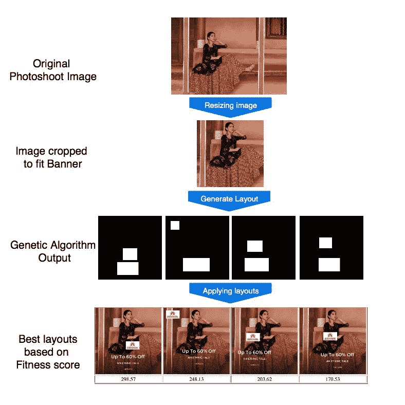

# 旗帜创作的技术艺术

> 原文：<https://medium.com/analytics-vidhya/tech-art-of-banner-creation-2afdde861415?source=collection_archive---------7----------------------->

你有没有想过像亚马逊、Myntra、Flipkart 等电商网站是怎么做到的？实现超个性化，这些网站如何根据你的搜索历史向你展示产品和广告，你最有可能如何点击/购买它们？好吧，这归功于人工智能(准确地说是深度学习和机器学习)。它在客户细分、有针对性的活动、优化定价、欺诈保护、推荐系统等方面都有应用。
DL/ML 对于通过在线销售产品或服务做生意的人来说变得特别有帮助。它可以让零售商进入顾客的大脑，了解是什么让他们心动，他们需要什么，以及他们对你的产品和服务的看法。
尽管 ML/DL 在电子商务中有各种各样的含义，但我们特别要深入研究**自动化广告/创意/横幅广告生成**。

# 关注的焦点

搜索对于电子商务的成功至关重要。如果产品没有出现在潜在客户面前，他们怎么知道这个特定产品的存在呢？此外，网站/应用程序必须展示这些产品的创意和横幅，这是引人注目的，吸引客户的注意。

客户与应用程序/网站的第一个接触点是主页。用户的吸引力主要被主页横幅/图像/创意所吸引。

目前，正在不断努力创造令人愉快和吸引人的横幅图像。这种手工过程既费时又费力，只能生产少量的横幅，从而降低了个性化程度。

# 获取解决方案

我们现在来看一种在尽可能短的时间内大规模自动生成创意的方法。我们将通过使用 DL 来自动化设计者遵循的过程。生成的各种横幅实现了高度的个性化。

# 概观

我们提出了一种使用设计元素库生成横幅图像的方法。设计元素的例子包括背景内容图像，文字短语，标志等。

任何图像/横幅都有一个潜在的主题、品牌标志、背景图像、附属文本和附加元素作为其组成部分。我们的目标是优化这些成分的结构，从而产生理想的最终产品(创意)。

创造性生成遵循以下步骤:

*   所有可用图像的大规模**自动注释**并用相关数据标记每个图像；
*   将注释数据馈送到**布局生成**模块，并进一步馈送到**创建**模块；
*   **使用基于历史数据的模型对生成的横幅广告进行重新排序**。

# **自动标注**

在这个步骤中提取图像的元数据。摄影图像通过一组检测器，每个检测器检测一个特定的属性。一旦注释完成，这个新获得的信息被作为输入提供给布局生成模块，并进一步提供给创建模块。提取感兴趣的区域，并根据布局规范将不同的元素缝合在一起。

*   **物体和人的检测**

输入图像通过**掩模 RCNN 物体检测器**。掩模 RCNN 执行**实例分割**的任务，并描绘不同的感兴趣对象。因此，图像被标记了在场人的边界框和附加信息，如总人数、主要人物等。预训练的检测器用于人/对象注释。

*   **时尚类别检测**

时尚检测器建立在 **mask RCNN 架构**之上，并针对鞋子、手表等时尚类别进行训练。该检测器的训练数据包含手动标记的边界框和时尚类别的类别标签。该检测器提供了该类别及其类型的边界框。

*   **性别和面部检测**

除了整个人的身体，检测面部会有更多的用处。这是因为在某些情况下，在一个人的身体上重叠其他元素是可以的，但设计元素不应该出现在脸上。基于 **CNN 的性别检测模型**在 IMDB-Wiki 数据集上训练用于此目的。

# 布局生成

布局被定义为每个设计元素的一组位置/布局，如“品牌标志”、“文本标注”等。在由人和/或物体以及它们的边界框组成的给定内容图像上。布局 L 可以定义为{θ1，θ1。。。θn }其中θi 表示第 I 个设计元素的边界框的坐标。我们的目标是找到形成具有最高美学价值的布局的坐标θi。

一个**遗传算法**被用于此目的。遗传算法模拟进化的自然过程，并使用以下技术来达到最佳可能/最合适的解决方案:

**a)选择**:从种群中选择最好的亲本来产生下一代

**b)交叉:**结合两个双亲创造新个体。在我们的例子中，这包括在各种设计元素之间交换坐标，比如文本框/徽标。

**c)变异:**随机改变个体上的基因/点来创造新的个体。这有助于评估新的坐标点。

**d)适应度函数:**使用一个适应度分数来评估群体。具有较高适应值的个体被选择作为下一个父母。

照片图像中的人和物体的边界框被认为是固定的。这些坐标是模型的输入。该算法在徽标和文本坐标上执行一系列选择、交叉和变异，以基于适应度函数和所提供的约束提出最佳解决方案。

适应度函数通过汇总每个设计方面的分数来整合图形设计的基础，例如:

*   *对齐*
*   *重叠:*我们计算所有元素对的重叠百分比，并在适合度得分中对它们进行惩罚。

*   *元素之间的距离:*即使在零重叠的情况下，设计元素也可以彼此靠近放置，从而降低创意的美学价值。

*   *对称性:计算图像布局中所有元素的不对称性，并将其作为惩罚项添加到适应度得分中。*

布局的最终适合度/能量分数 E(X，θ)是各个分数的加权和 Ei (X，θ)。通过对历史横幅的 CTR 上的这些分数进行回归，获得了个体适应性分数的权重。

# **创意一代**

将所有东西结合在一起，创意生成包括对给定的带有注释、品牌标志、文本标注的照片图像库执行以下步骤。

1.使用自动标签过滤给定品牌或类别的相关照片图像。品牌名称已经作为标签提供给图像。

2.自动裁剪选定的摄影图像，使用注释找到感兴趣的区域。

3.为给定的裁剪图像、徽标和文本标注生成最佳布局。

4.按照布局规范覆盖不同的设计元素。

# 创意排名

在所有产生的创意中，我们希望只有优秀的才能播出。已经设计了挑选所需横幅的排名方法。该方法基于历史上的实时数据集，该数据集将图像及其 CTR(点击率)作为标签。

我们使用了神经图像评估(NIMA 分数),它计算代表图像美学的分数。这是通过在包含图像以及人类审美判断的数据集上训练深度 CNN 而获得的。

诸如逻辑回归、决策树、随机森林分类器的机器学习模型适合于所提取的特征。

这些提取的特征是区域、性别、类别类型、位置特定特征、环境类型、重叠对象、文本象限。

该模型对创意进行排名，并选择最优秀的创意。

# **结论**

介绍一种自动生成广告创意的新方法，根据实验:

*   导致 CTR 显著增加(增加 72%)；
*   包括根据人类判断评估生成的横幅的排名模型。

这有助于减少设计师目前花费的大量精力和人工时间，也有助于产生更多可供选择的选项。更宽范围的横幅将有助于迎合更广范围的用户，而不是向所有用户显示共同的横幅。

## **参考**

1.  [新颖的人工智能营销方法&广告](https://www.topbots.com/ai-marketing-research-papers-2020/)
2.  [实现超级个性化:时尚电子商务的自动化广告创意生成和排名](https://arxiv.org/pdf/1908.10139.pdf)
3.  [机器学习如何让你的电子商务公司受益](https://www.loop54.com/how-machine-learning-can-benefit-your-e-commerce-company)